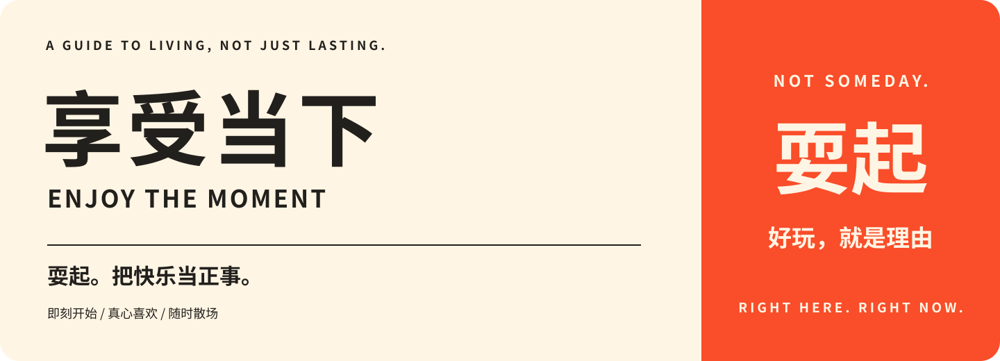

<div align="center">



# 享受当下 · Enjoy The Moment

**耍起。把快乐当正事，把今天过到自己手里。**

一本以「耍起」为核心表达的开源生活指南：即时满足、感官快乐、新鲜感和非功利玩乐。<br>
不是等生活安排好了再耍，是生活里面本来就该有耍。

[耍起，是什么意思](SHUAQI.md) · [核心长文](#读深一点) · [在线阅读](https://solomon-8.github.io/EnjoyTheMoment/) · [配套行动](#现在就选一件) · [English](README.en.md)

</div>

---

## “耍起”，是我们的核心，不只是封面上的梗

**耍是正事，不是奖励；好耍就够，不必变现；想耍就给今天留位置，不好耍了随时散场。**

这是本仓库的独立主张，不冒充艺人原话，也不代表川渝文化的唯一解释。我们借这个表达把“享受当下”从抽象观念变成一句行动邀请；不把它等同于借钱硬耍、无节制消费或地域优劣。

读[完整主张](SHUAQI.md)，或看[有日期的文化语境与来源](docs/culture-shuaqi.md)。

**从你在意的问题开始：**

- **先看主张**：[核心长文](#读深一点)讨论工作、快乐、消费与关系。你不必先认同我们，反对意见也在正文里。
- **先看真实矛盾**：[谁替自由兜底](book/09-constrained.md)、[省下来的时间归谁](book/21-free-time.md)、[旅行要不要改变人生](book/23-travel.md)。
- **先进入一种乐趣**：[听音乐](book/11-music.md)、[玩游戏](book/19-games.md)、[读文学](book/22-reading.md)、[看画](book/25-looking-at-art.md)。[恐怖与悬念](book/31-recreational-fear.md)、[解谜](book/32-puzzles.md)、[夜空](book/29-night-sky.md)也从具体差异讲起。其他领域见[完整目录](#目录)，不只给活动名称，也展开具体内容。
- **想试一个不同的晚上**：[配套行动](#现在就选一件)按时间、预算筛选；不想试，也不影响参与讨论。
- **让 AI 协助阅读或选择**：[AI 阅读协议](docs/ai.md)、[Skill](skills/enjoy-the-moment/SKILL.md) 或 `llms.txt`。先理解你在问什么，不把所有问题都变成活动推荐。

## 我们站在哪一边

如果你总是说：

- 等瘦了再穿喜欢的衣服。
- 等有钱了再好好过周末。
- 等工作稳定了再学那个没用的东西。
- 等足够优秀了，再奖励自己。

这本指南想提一个不太听话的建议：**别等资格了，先拿回一小块今天。**

我们不把“活得最长、攒得最多、看起来最自律”当人生的默认总目标。快乐本身就是目的，不必再附带提高效率、延长寿命、积累人脉或变现的证明。

**同样负担得起时，我们愿意为更喜欢的味道多花一点，为一场期待已久的演出牺牲一些便利，为纯粹好玩留下一段没有产出的时间。** 即使它不是最省钱、最高效、最利于长寿的选项，也不自动算错。

但我们也不把“越危险越真实”“越贵越快乐”“越停不下来越尽兴”当答案。底线是：**自己愿意，他人同意，代价看得见，过程退得出。** 这里的反转是价值排序，不是把安全建议逐条倒过来。

> 今天不是明天的耗材。明天也不是今天的垃圾桶。

## 读深一点

**工作不是生活的唯一审批人，快乐不是等待未来报销的支出。** 这些文章从具体矛盾出发，陈述主张，也认真处理反对意见。卡片与玩法是配套，不替代论证。

| 长文 | 核心取舍 |
| --- | --- |
| [E07 · 休息不是为了明天更好地上班](essays/07-rest-is-not-work.md) | 快乐是否必须由未来产出证明；也正面讨论责任、拖延与喜欢工作的人 |
| [E10 · 我们要及时享乐，不是及时被收割](essays/10-pleasure-not-retention.md) | 点击、停留与购买不自动代表满意；认真区分推荐、说服、隐瞒与退出障碍 |
| [E11 · 如果快乐可以一键生成，我们还要真实生活吗？](essays/11-pleasure-and-reality.md) | 快乐值得是否等于只有快乐值得？用体验机器、虚构与真实参与、品味等级检验“耍起”的立场 |
| [E01 · 快乐不是一种需要报销的支出](essays/01-pleasure-is-an-end.md) | 价值选择、研究结论和个人适用条件如何分开 |
| [E02 · 想要更刺激，不等于想把自己弄坏](essays/02-excitement-without-escalation.md) | 强度、新鲜、参与和自主不是同一件事 |
| [E03 · “等以后再享受”，到底有没有一个明确的以后？](essays/03-now-or-later.md) | 主动期待与无限延期；也纳入挑战“越快越好”的证据 |
| [E04 · 为什么买工作设备叫投资，买快乐就叫浪费？](essays/04-buying-pleasure.md) | 物品、体验、少一点麻烦，不设统一赢家 |
| [E05 · 有些爱好，玩得很菜也值得一直玩](essays/05-play-is-not-performance.md) | 记录、练习、展示与被迫打卡的区别 |
| [E06 · 有责任的人，不需要另一份“会生活”的作业](essays/06-real-life-constraints.md) | 钱、照料、时间与可及性约束，不靠心态消除 |
| [E08 · 你要的是快乐，还是看起来很精彩的人生？](essays/08-life-without-an-audience.md) | 经历、表达与被回应；不把拍照羞辱成虚荣，也不让观众取消生活 |
| [E09 · 朋友不是人脉，一起没干什么也算相处](essays/09-friends-not-assets.md) | 非功利相处不等于无边界付出；认真讨论预算、分工与拒绝 |

另有[16 篇背景研究台账](docs/research.md)：十二篇期刊全文、一篇带期刊排版的 arXiv 稿、一篇提前在线发表稿、一篇公开研究手稿、一篇作者托管页校样；统计、科普、教学、实践框架、文学文本、访客指导与监管报告等另外记录，均写明来源能支持到哪里。**这些材料不直接验证 60 张行动卡。**

**把主张放进具体生活：**

- [吃到喜欢的那一口，不必先原谅自己](book/02-senses.md)：口味不是品德，舒服也不必等待审美资格；一场享受背后的准备与收拾由谁承担？
- [新鲜感，不是生活不及格后的补考](book/03-novelty.md)：无聊一定需要远行吗？重复算不算白活？想看完与“来都来了”有什么区别？
- [玩得很认真，不等于你又开始内卷了](book/04-play.md)：想赢、教学局、难度、剧透、粉丝与创作，怎样让投入仍然属于自己？
- [一起耍，不是把几个人捏成一个欲望](book/05-connection.md)：策划劳动、临时加人、倾诉、沉默、约会与同住生活，怎样保留共同时间里的差异？
- [没有买到最多，不等于没有买对](book/06-spending.md)：套餐、纪念品、服务、失望的购买与朋友间的消费档次，分别该怎样判断？
- [休闲不是一种需要主动认罪的行为](book/08-permission.md)：真实责任与无限待办有什么区别？怎样理解休闲内疚，又不把问题都归咎于个人观念？

想把主张放进一个具体晚上，可选读[完整玩法](guides/README.md)：文字游戏、客厅影展、附近观察和小聚会。它们是配套，不是必须完成的清单。

## 先看见代价，再允许自己快乐

我们愿意接受：一次没产出的晚上、一点计划内的小钱、一次水平很差但玩得很开心的尝试。

我们不替你合理化：伤害别人、无视拒绝、挪用共同生活的钱、靠危险证明勇敢，或者明明想停却被迫继续。

这不是“零代价生活”。是把代价说清楚后，**不再默认快乐必须让路**。

## 现在就选一件

选你有一点想做的，不必选“最有意义”的。

| 你现在的状态 | 今天的入口 |
| --- | --- |
| 只有五分钟，想立刻有点感觉 | [听一首歌，别顺手做别的事](book/01-start-now.md#j001) |
| 就是想吃点喜欢的 | [点真正想吃的那一份](book/02-senses.md#j007) |
| 想更刺激一点，不想再刷屏 | [找一个有明确结束时间的游戏局](book/04-play.md#j019) |
| 想出门，但讨厌复杂攻略 | [给日常路线开一条支线](book/03-novelty.md#j013) |
| 想见人，但不想尬聊 | [发一张具体的邀请](book/05-connection.md#j025) |
| 想花钱奖励自己，又怕后悔 | [先决定总价，再挑享受](book/06-spending.md#j031) |
| 一个人，也想过得像回事 | [不用等客人来，也把自己招待好](book/07-solo.md#j037) |
| 又把休息当成“偷懒”了 | [留一段不需要补偿的空白](book/08-permission.md#j043) |
| 下班只剩十分钟、十块钱 | [给今天留一个小句号](book/09-constrained.md#j049) |
| 已经不好玩了，只是舍不得停 | [快乐变味时，允许散场](book/10-aftertaste.md#j055) |

这些不是商品推荐，不需要购买指定品牌。卡片中的人民币和分钟数是**试做预算上限**，不是实时市场报价，也不是“花到这里才算享受”。

## 这不是换个名字的自律手册

| 常见的人生优化提问 | 本仓库更在意的问题 |
| --- | --- |
| 这对十年后的我有什么用？ | 现在的我真的喜欢吗？ |
| 怎么把休息变成更高的生产力？ | 可不可以休息就是休息？ |
| 如何用最少的钱换最多的收益？ | 我愿不愿意为这个具体体验付出这份代价？ |
| 这个爱好能练到什么水平？ | 即使一直很菜，我还想不想玩？ |
| 这是不是最优选？ | 它是不是我愿意亲自过的生活？ |

我们不是说长期计划没价值。我们反对的是：**所有现在的愿望，都只能排在一个永远往后挪的未来后面。**

## 目录

<!-- catalog-count: 60 -->
**33 个章节，60 张原创行动卡。** 前十章配有行动卡；其余二十三章独立展开体验领域与生活取舍，不为凑齐卡片而拆散正文。不打卡、不排名，做零张也不欠本仓库作业。

| 章节 | 核心问题 | 卡片 |
| --- | --- | --- |
| [01 · 今天，不是未来的试用版](book/01-start-now.md) | 想要一整个晚上，为什么总被劝成五分钟？ | J001–J006 |
| [02 · 身体不是只用来工作的](book/02-senses.md) | 味道、声音、触感，可不可以直接算价值？ | J007–J012 |
| [03 · 给日常制造一点意外](book/03-novelty.md) | 想要新鲜，不一定要买一张远方的机票 | J013–J018 |
| [04 · 痛快地玩，不必玩出名堂](book/04-play.md) | 怎么认真享受刺激，而不是认真积累装备？ | J019–J024 |
| [05 · 关系不是人脉](book/05-connection.md) | 想见就约，喜欢就表达，拒绝就尊重 | J025–J030 |
| [06 · 钱可以换快乐，不必换身份](book/06-spending.md) | 怎么花一笔自己真正愿意花的钱？ | J031–J036 |
| [07 · 一个人也值得开席](book/07-solo.md) | 独处可以轻松，也可以想念别人；不必考独立资格 | J037–J042 |
| [08 · 从“有用”里请一天假](book/08-permission.md) | 休息能不能不是完成任务后的奖品？ | J043–J048 |
| [09 · 没钱没空，也不等于没有今天](book/09-constrained.md) | 如果你的说走就走，需要另一个人不能走呢？ | J049–J054 |
| [10 · 散场也是享乐的一部分](book/10-aftertaste.md) | “那一刻很好”与“下次不这样选”，能同时成立吗？ | J055–J060 |
| [11 · 耳朵不是用来证明品位的](book/11-music.md) | 从两个谱例看：刺激只能来自更快、更响吗？ | 独立正文 |
| [12 · 电影不是看完就能毕业的清单](book/12-film.md) | 从《火车大劫案》看：不切镜头，怎样把等待变成内容？ | 独立正文 |
| [13 · 去现场，不是去完成一次到场证明](book/13-live-events.md) | 为临场感到场，而不是给自己的期待交作业 | 独立正文 |
| [14 · 好吃，不必先换算成别的好处](book/14-flavor.md) | 从一勺冰淇淋看结构、甜度与空气：知识能否帮助喜欢，而不接管口味？ | 独立正文 |
| [15 · 街道不是景点之间的加载页面](book/15-neighborhood.md) | 一座城市，能不能也欢迎暂时不想消费的人？ | 独立正文 |
| [16 · 衣服是拿来穿的，不是拿来等一个更好的自己](book/16-dress.md) | 色块、斜裁与西装语言：好看为什么不只有修正身体这一条路？ | 独立正文 |
| [17 · 亲手做点东西，不是给自己再找一份工作](book/17-making.md) | 织物的交叉与色区、一张纸的翻页次序：制作的乐趣不只在成品 | 独立正文 |
| [18 · 庆祝不是给值得的人颁奖](book/18-celebration.md) | 没有重大成就，也可以把一天圈出来吗？ | 独立正文 |
| [19 · 游戏不是工时表，通关也不是赎罪券](book/19-games.md) | 机制、难度与购买，怎样回应你真正想玩的部分？ | 独立正文 |
| [20 · 照片可以留下今天，不必替今天交作业](book/20-photography.md) | 举起相机是在离开当下，还是看得更仔细？ | 独立正文 |
| [21 · 省下来的时间，不自动属于下一件事](book/21-free-time.md) | 计划是在占满空闲，还是让自由不只属于随时能走的人？ | 独立正文 |
| [22 · 读书可以把一个晚上花掉，不必把一个人升级](book/22-reading.md) | 一段对话、几个字，怎样让人愿意留在书里？ | 独立正文 |
| [23 · 旅行不必改变人生，也值得专门出发](book/23-travel.md) | 一趟旅行可以只因经历本身成立，而不提供人生回报率吗？ | 独立正文 |
| [24 · 好笑是一种本事，不是别人必须配合的义务](book/24-humor.md) | 笑点怎样形成，又为什么不能凭笑声替所有人决定？ | 独立正文 |
| [25 · 看展不是品位考试](book/25-looking-at-art.md) | 三张具体的画，怎样让颜色、空间与笔触变得可谈？ | 独立正文 |
| [26 · 收藏不必集齐](book/26-collecting.md) | 版数说明什么，谁来决定一组物品的完成线？ | 独立正文 |
| [27 · 跳舞，不必先把身体交给观众](book/27-dance.md) | 不加难度，也能让动作、停顿和彼此回应更有意思吗？ | 独立正文 |
| [28 · 比分没有变化，比赛也可能正在变](book/28-watching-sport.md) | 无球跑动、两只钟与未进的好选择，怎样让过程不只剩比分？ | 独立正文 |
| [29 · 星空不负责出片](book/29-night-sky.md) | 月相、明暗界线和地照有什么值得看？照片和具体目标落空，怎样与当晚体验分开？ | 独立正文 |
| [30 · 不稀有的鸟，就不值得看吗？](book/30-birdwatching.md) | 从头顶与颊斑到行为顺序：名字、稀有程度和清单以外，还有哪些具体内容？ | 独立正文 |
| [31 · 我花钱，就是想好好害怕一回](book/31-recreational-fear.md) | 从鬼屋研究与《猴爪》看：紧张、悬念、享受和失去选择权有什么区别？ | 独立正文 |
| [32 · 答案越快，未必越好玩](book/32-puzzles.md) | 从一题多层提示与错误顿悟看：什么时候“还不知道”正是想要的体验？ | 独立正文 |
| [33 · 麦克风不是资格证](book/33-singing.md) | 移调、音色、句读和轮唱，怎样把参与一首歌与接受考核分开？ | 独立正文 |

## 怎么读一张卡

每张卡写清楚六件事：

1. **现在做**：一个能开始的动作，不是一项人生改造工程。
2. **想得到**：希望体验到什么，不承诺每个人都有效。
3. **付出**：钱、时间、准备和可能的麻烦。
4. **换小份**：没钱、没空、不方便时的缩小版本。
5. **散场线**：什么时候可以停，什么时候不该硬上。
6. **性质**：这是价值选择、作者设计的试做，还是有来源的事实。

**这些行动卡全部属于原创试做，不是经实验验证的快乐处方。** 没有“幸福提高 37%”、没有多巴胺分数，也没有拿论文替你决定人生目的。方法和来源边界见[编辑标准](docs/editorial-policy.md)。

## 不知道选哪张？让电脑替你缩小范围

有 Python 3.9 或以上版本即可。**不联网、不上传记录、不安装第三方依赖**，从本地 Markdown 读取卡片：

```bash
python3 tools/pick.py --minutes 20 --budget 0 --company solo
python3 tools/pick.py --minutes 120 --budget 100 --energy high
python3 tools/pick.py --minutes 30 --budget 30 --list
python3 tools/pick.py --query 游戏 --minutes 60 --budget 0 --json --limit 3
python3 tools/pick.py --id J019 --json
```

筛选取的是卡片**主方案的预留上限**；想缩小动作，直接读“换小份”。抽到不想做的可以换，**随机结果不是命令**。

阅读页是同一份 Markdown 生成的单文件 `index.html`，下载整个仓库后可直接双击，离线也能搜索与读长文；外部出处链接需要网络。没有统计脚本、账号或浏览记录上传。生成与校验命令见[贡献指南](CONTRIBUTING.md)。

## 先试一口，再决定信不信

- [七天试吃](docs/seven-days.md)：七个任选场景，不是七天挑战。
- [自己的快乐菜单](templates/my-menu.md)：不需要交给任何人。
- [我不同意：九个常见反对意见](docs/faq.md)：包括“这是不是消费主义”和“有负担的人怎么办”。
- [贡献一张行动卡](CONTRIBUTING.md)：欢迎失败经历、零元版本和具体反例，不只收集成功故事。
- [一次试做反馈](templates/experience-note.md)：可匿名、可只留自己，不把自述当实验。

如果这里也让你产生了“我怎么还没快乐起来”的压力，先关掉它。**享受当下包括不表演快乐的自由。**

## 与参考仓库的关系

受 [HowToLiveBetter](https://github.com/eternity4719/HowToLiveBetter) 的开源生活指南形式启发。参考仓库实际覆盖寿命、金钱、时间精力和人身自由，不只是长寿。

我们借鉴问题索引、分章卡片、明确代价和开放纠错的组织方式；不搬运正文，不继承其数据或健康结论，不代表原作者，也不把它塑造成“反对享受”的靶子。新仓库的不同在于：**把当下亲自感受到的快乐放在目标位置，而不是必须向未来收益解释的成本位置。**

参考版本、阅读范围和借鉴边界见[来源与致谢](docs/sources.md)。

## 许可与参与

原创文本、脚本和视觉文件使用 [MIT License](LICENSE)。转载请保留许可要求的版权和许可声明；外链内容仍归各自权利人。

欢迎带着一个具体场景来 [Issues](https://github.com/solomon-8/EnjoyTheMoment/issues) 或 [Discussions](https://github.com/solomon-8/EnjoyTheMoment/discussions)。不需要假装认同，也不需要提交自己的隐私。

**愿你今天有一件事，只是因为喜欢。**
