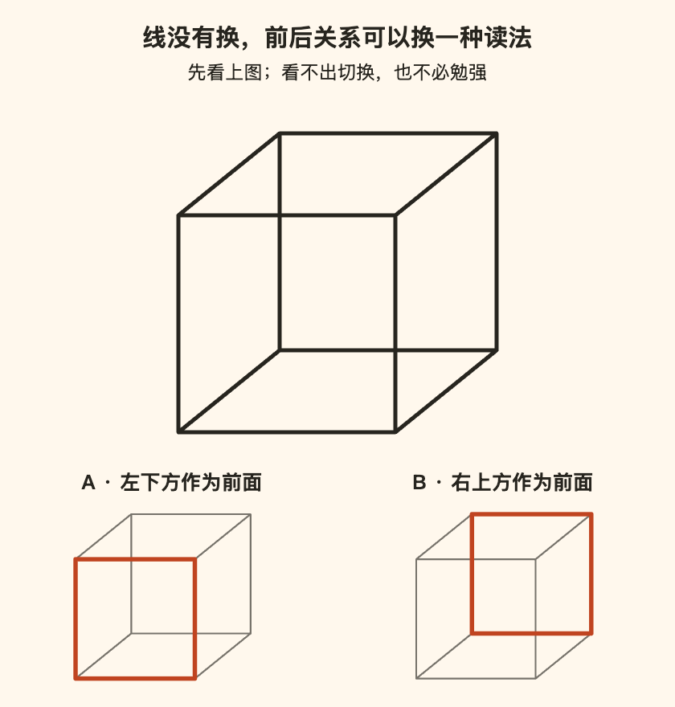

[← 回总目录](../README.md)

# 03 · 给日常制造一点意外

**新鲜感不一定来自下一件东西，也可能来自同一件东西突然显出的另一面。**

但“换个角度”不能被拿来堵住一个实在的愿望。你想远行，不一定是在逃避日常；你喜欢熟悉，也不一定是缺少勇气。本章要谈的不是怎样给平凡生活强行加滤镜，而是：什么变化值得亲自经历，什么未知使人兴奋，以及为什么重复不总是新鲜的敌人。

从问题进入：[同一组线的另一面](#novelty-cube) · [不确定与看不懂](#novelty-uncertainty) · [从陌生到尝出区别](#novelty-learning) · [重来的乐趣](#novelty-repeat) · [真的想要更强烈](#novelty-intensity)。

## 新鲜感，不是生活不及格后的补考

想换个地方坐，想看一部没看过的电影，想让周末出现一点没预料到的东西，可以只是愿望，不必先把原来的生活说成一潭死水。

反过来，一直吃同一家店、反复听同一张唱片、假期哪里也不去，也不说明人生失败。我们拒绝的是两种互相追赶的命令：“稳定一点，别折腾”和“年轻就要体验，别白活”。它们都可能把你真正的偏好挤到最后。

本章主张的是**给新鲜留位置，而不是把不重复设为人生考核**。你可以主动要一点不确定，也可以坦然保留熟悉。重要的不是你体验了多少种，而是这些经历里有没有你想亲自经过的东西。

## 一个空周末，为什么最后又变成一场任务？

看一个虚构情境：小满说想过一个不一样的周末。朋友发来三种安排：去邻近城市、看一整天展览、参加两人都没试过的活动。她看完反而更不想出门。

如果这时只回答“别想太多，行动起来”，可能漏掉了原愿望。小满说的不一样，也许是这次不由她查路线、确认时间、订位置和收尾。新地点没有解决旧分工。

换一个安排：朋友提出两个已经核实条件的选项，由小满决定喜欢哪个；也明确说都不喜欢就算了。这仍不保证她会开心，但确实改变了本次体验的组织关系，而不仅是地图上的坐标。

再换一个版本：小满真正惦记的就是那座城市，即使需要自己准备也愿意。此时劝她“附近随便走走也一样”，就可能把一个具体愿望压成了旁人方便提供的安慰。

所以同一句“不一样”，至少要听完它后面的宾语：不一样的地方、不一样的相处，还是不一样的分工？这里没有替人挑选目的地，也没有保证哪种周末更好。本章要守住的是：**改变安排以前，别先把愿望换掉。**

## 新鲜可以来自换关系，不只是换背景

同样听一首歌，有人第一次听，有人第一次唱，有人第一次在朋友面前介绍它。物件没变，参与方式变了。这里的区别来自活动安排本身，不需要用“激活大脑”之类的话来装饰。

本章提供四个观察角度：

- **材料**：换了内容、地方、物品或题材。
- **角色**：从看别人做，到自己做；从主持，到被招待。
- **关系**：独自经历，或和一个不同的人一起经历。
- **规则**：原来追求准确，这次允许胡编；原来只听结果，这次一起完成。

它们不是保证有效的配方，也没有推荐频次。用途是让你看到：如果不想付一趟远行的代价，还可以改变什么；如果那些变化都不合口味，也允许说它们不是自己想要的。

尤其不要把“身边就有风景”说成禁止远行的理由。本地散步可以有价值，却不等于某座你真想看的城市；同样，跨城也不自动比楼下更值得。**替代方案能提供选择，不应冒充替你满足了原愿望。**

## 线没有换，为什么前后关系能换一种读法？

看下面上方那组线。可以把左下的正方形理解成靠近自己的面，也可以把右上的正方形理解成靠近自己的面。下方 A、B 只是在提示两种理解，不是两张不同照片。

这种可作不同空间解释的线框通常称为**内克尔立方体**。The Illusions Index 的条目说明，它既可以出现两种前后取向，也可以只被看作平面线条；切换未必能随意控制。我们依据这一通用结构独立绘制了上图，没有复制来源配图。来源与原创建图范围见 [F49](../docs/evidence/F49-novelty-and-perception.md)。

如果你只看到一种，或只看到线条，不需要一直盯到成功。这里不是测观察力，也不打算把某种视觉体验当成阅读本章的入场券。

对这个例子，至少要分清三件事：

1. **图上画了什么**：线条和位置没有随着观看而更换，上图是一张静态图片。
2. **怎样理解前后**：哪一个正方形像靠近自己，可以有不同解释；下方的加粗只是帮助指认。
3. **自己喜不喜欢**：理解了结构，并不保证觉得有趣，更不保证心情变好。

来源还讨论，切换应如何解释为视觉体验或后续判断的变化；这些问题并没有被一句“意识决定世界”解决。本章无需替哲学争论裁决，也不会由此推出所有现实困境都能靠换想法消失。

我们从这个例子取出的，是一个有限但有用的区别：**新东西与新读法，不是同一回事。** 前者要求对象变化，后者未必。有时想要的正是买到另一样东西、到达另一个地方；有时你已经身在其中，只是还没发现另一种进入它的方式。

这能帮助理解为什么一个概念、一段背景或别人的提问，可能使旧作品重新有内容可看。不过，从线框延伸到音乐、故事与日常，是本书的类比，不是同一种视觉机制得到普遍验证。看懂一张图，也不意味着从此不会厌倦生活。

### 另一面出现了，不等于快乐就增加了

这点也受到现有研究材料的提醒。Oishi 与 Westgate 的文章区分幸福、意义和心理丰富性；本书实际核读的是作者网站的页校样，而非已经核对过的最终发表版。

校样概述了两项图底材料实验：样本量为 299 与 343。参与者看的是有两种图像读法的材料或相应对照，丰富性评分出现差别，积极情绪却没有相应差别。**这些不是本书这张立方体图的实验**，也不是证明看错觉图就更会生活。原始实验报告在所读校样的参考文献里还标为审稿中，本书没有把这层转引当作已经独立核读原始报告。

所以“这让我重新理解了它”和“这让我更开心了”需要分开说。一次经历可以使人困惑、震动、改变看法，却没有提供此刻想要的愉快。不能在它不好玩时，立刻改口“但它很丰富，所以你还是赚了”。

这不是反对复杂体验。它要求我们诚实地承认自己在追求什么：有时愿意为了陌生和震动放弃一点舒适，有时只想痛快地笑。两种愿望不必通过同一张评分表。研究的版本、设计和限制见 [B03](../docs/evidence/B03-richness.md)。

## “不知道接下来怎样”，与“根本不知道发生了什么”

设想两个游戏，都是本书编的例子：

- 甲局开场说明：轮流在空格落子，先连成一线的人赢。你还不知道谁会赢，但每落一子，都能理解局面改变了什么。
- 乙局每隔一会儿公布一个分数，却始终不说分数怎么算、动作起什么作用、何时结束。你同样不知道谁会赢，却也不知道自己在等待什么。

两局都有未知，未知的结构却不一样。甲保留结果的不确定；乙把理解过程所需的规则也拿走了。乙当然可能被某个人当作荒诞表演来欣赏，但不能仅凭“更难预测”，就认定它更好玩。

一场比赛也能有类似差别。不知道比分怎样变化，可以使人紧张；连谁攻谁守、刚才为什么欢呼都不知道，则可能使人进不去。此时需要的未必是更激烈的比赛，可能只是一点刚好够用的解释。知道规则，没有替比赛提前给出结果。

本书因此区分几种“未知”，而不把它们混成一项刺激强度：

| 未知藏在哪里 | 可能带来的趣味 | 它不应冒充什么 |
| --- | --- | --- |
| 结果 | 等待、悬念、猜测 | 不保证结局合自己心意 |
| 过程与表达 | 看某个人怎样完成、怎样变化 | 不等于完全看不懂 |
| 自己的反应 | 原来我会喜欢、会在意这个 | 不需要事前保证喜欢 |
| 费用与参与条件 | 通常是做决定所缺的信息 | 不能仅用“惊喜”要求接受 |

这是分析安排的工具，不是实验得到的四类心理模型。它的用途，是让“我想要点意外”具体起来：也许想保留结局，却希望知道基本规则；也许不关心结果，而是想看到某个人临场怎么接住一个变化。

**尽兴未必需要毫无准备。有时，准备拿走的是困惑，留下的才是悬念。**

## 从陌生到尝出区别，中间还有一段乐趣

“试点新的”有一个容易被省略的代价：第一次接触时，我们可能还没有办法辨认自己会喜欢其中什么。不能把“第一次没有立即喜欢”直接判成“不适合”，也不能反过来认定只要坚持就必然喜欢。

设想第一次听一段陌生音乐，只觉得声音很多。下一次有人提醒你留意低音什么时候回来，你终于听见上面那条旋律怎样绕着它走；再下一次，你也许开始期待那个回来的时刻。这是假想的欣赏过程，不是保证有效的学习阶段。它要说明的是：**有些乐趣来自差异逐渐变得可辨，而不只来自第一次被惊到。**

看比赛时逐渐辨出跑位，做饭时分清某种香味在哪一步出现，读一位作者时认出他怎样藏住一句反话，都可以用类似问题来想：我是在被重复消耗，还是还有想辨认的细节？相关内容分别见[观赛](28-watching-sport.md)、[味道](14-flavor.md)与[阅读](22-reading.md)。

这也解释了为什么“到过、吃过、玩过”不总是足够准确的经历记录。相同的勾选，可能指门口拍照、匆匆尝一口，也可能指投入一个晚上；它们未必有高低，但不是同一种经验。数量清单擅长记录边界，不擅长替我们说明里面发生了什么。

不过，理解的承诺也会被滥用。“等你真正懂了就会喜欢”可以变成永远不能反驳的话：喜欢，说明懂了；不喜欢，说明还不够懂。我们不接受这种考核。一个人可以理解作品为什么这样安排，仍然不喜欢它；也可以喜欢，却不愿为喜欢取得专业解释资格。

愿意为某个爱好投入时间、上课、练习，都可以是当下享乐的一部分，不必伪装成职业投资。值得警惕的不是认真，而是原本为了乐趣投入，后来只剩证明钱没白花、自己没有半途而废。

## 重来一次，可以不是退回原地

如果新鲜必须等于从没经历过，喜欢一首歌的最好时刻就只能有一次。但我们可以问一个更细的问题：第二次，自己在等什么？

第一次看故事，可能追着“接下来怎样”；知道结局后再看，注意的可能是“原来这里已经放了线索”。第一次在现场听歌，可能忙着确认它是不是想听的版本；再次听到熟悉段落，期待的可能正是大家一起接上的那一下。这里的未知减少了，别的内容却未必随之消失。

这些是本书的体验分析，不是“重看一定更快乐”的研究结论。它也不意味着每个熟悉对象都值得再给机会。你可能确实看够了、听烦了；那就换，不必为了反对追新而坚持重复。

### 同样的快乐，为什么一到第二次就像贬值了？

设想两种拒绝：“这部电影我已经不想看了”和“这部电影我已经看过了”。它们可能指向同一个选择，却不是同一个理由。前者说的是此刻的愿望，后者说的是履历。把后者直接当成前者，我们就省略了一个值得问的问题：**经历过，是否等于已经没有什么想再经历？**

研究能帮我们检查其中一个事实判断，但不能替我们决定该不该重看。O’Brien在2019年发表的一项研究中，让参与者第一晚选一部没看过、预计会喜欢的电影。首看之后，一组预测如果明晚重看会多享受，另一组第二晚真的重看。完成程序的120人分为58名预测者和62名实际重看者。下面是论文报告的组均值，量尺为1—7，越高表示越享受：

| 两组不同的人 | 第一晚实际观看 | 第二晚的预测或实际观看 |
| --- | --- | --- |
| 58名预测者 | 5.29 | 预测重看：3.47 |
| 62名实际重看者 | 5.40 | 实际重看：4.52 |

实际重看确实比首看低，**但下降没有预测得那么陡**；论文对两组变化差异的检验也支持这一点。这不是“越看越好看”，更不是每个人第二次都比预期开心：预测与实际来自不同组，不能拿一位预测者的分数替另一位观看者计算个人误差。它也没有比较所有影片、所有重看间隔或连续看许多遍。[研究B37](../docs/research.md#b37)与[详细核读N37](../docs/evidence/B37-repeat-experiences.md)保留了设计、量尺和报告疑点。

由此值得带回生活的，不是“今晚必须重看”，而是两个问题不应混为一谈：**它会不会不如第一次？它还值不值得我把这一晚给它？** 第一次可能有解开悬念的快乐，第二次可能有等待喜欢的场面出现的快乐；后一种不需要胜过前一种才有资格存在。反过来，今晚确实想知道一个新故事，也完全是实在的理由。

### 愿意为新鲜付钱，和真的买到了更多快乐

同一论文的研究6把问题往消费方向推了一步：先看一段可以自行转动视角的360度城市视频，再预测或实际经历“重看”与“看另一段”。803人的四组实验中，预测组对新视频的整体享受评分较高；实际观看的两组评分则很接近。但评分针对的是**整个观看过程**，不是单独第二段；未检出两组差异也不等于证明两者完全一样。短视频里的结果不能替现实旅行定价。

另一次招募的201人还被要求选择和报价。他们被告知，为保证看新视频，报价可能从2美元报酬里扣除。最容易被写成标题的结果是：在自报想最大化享受、又选择新视频的163人中，平均愿付0.25美元。可是，公开材料明确写着，**最后没有安排第二轮观看，所有人拿到全额2美元，并未实际扣款**。

所以这里观察到的是以为会影响报酬时的报价，不是163个人真的花钱买了新视频，更不是每人实际损失了多少快乐。另一批人的平均评分，也不足以宣判这批报价者中谁买错了。把研究压成“科学证明追新就是交智商税”，看起来有冲击力，恰好丢掉了最重要的区别。

这仍然留下一个有用的消费问题：我在为**什么新的内容**付代价？可能是新故事、新口味、新地方，也可能只是“不重复”这个标签。标签本身可以有吸引力，却不能替代对具体内容的期待。“新的”告诉我们它与过去不一样，还没有告诉我们会喜欢哪里。

### 最强的反对意见：可有些新的，错过就真的没有了

重看电影的实验没有解决机会的期限。某个人只在这个周末有空，一场演出不会原样重来，一次共同经历后来也许再凑不齐。这时去新的地方，不一定是高估了新鲜，而可能是在珍惜一个确实会消失的组合。用“熟悉的也很好”劝退，是拿可重复的对象替不可重复的关系作答。

同样，选择新体验也不一定只为下一小时更愉快。想知道自己没见过的东西，想把某个想象变成亲历，甚至愿意承受部分无聊以满足好奇，都可以属于享受当下。上面的量尺不能替这些价值结账。我们可以质疑一个消费理由是否说清楚了，不能要求每个愿望先在实验室里证明净收益为正。

还有共同选择的冲突：你重看的片子，是朋友第一次看；你想尝的新菜，是另一人今晚并不想承担的不确定。不存在一个简单的“多尝试”或“别浪费”就能替所有人作决定。讨论时至少应保留各自想要的内容，而不是用体验数量、花钱多少或谁更会生活来压倒谁。

因此，这一节不把熟悉排在新鲜前面。它反对的是**不问还想要什么，只凭“已经经历过”就宣布价值归零**；也反对反过来把“还能从旧东西里找到快乐”变成不得争取新生活的命令。

更重要的是，重复本身也不必靠产生新发现来辩护。一道熟悉的菜仍然好吃，一句熟悉的笑话仍然让你笑，就已经有继续的理由。若每次重来都必须发现新意义，我们只是把体验清单改成了理解清单。

因此，“耍起”不需要在两种命令里选边：一边是永远买新的、到新的地方；另一边是永远从现有生活里学会知足。**我们要的是仍有选择，不是永远更新，也不是永远忍住。**

## 如果我就是想要大一点、猛一点、远一点呢？

那也不必先把愿望改写成容易安排的小事。一个人可能就是想站在大型演出的现场，想认真学会一段很带劲的舞，想去一个与惯常生活差别很大的地方。上面的线框没有替代这些经验，更没有证明十分钟的小发现等于一次期待已久的远行。

“不必更贵、更猛”应该表示不是每次都得升级，不能偷偷变成“最好永远别选更贵、更猛”。本书愿意为真正想要的体验承认不便、花费与投入；否则及时享乐只剩一份乖巧的节省指南，就偏离了主张。

但把几个词说得更具体，会比单说“刺激一点”更接近愿望：想要的是人群一起响应的规模、表演无法暂停的紧张、动作终于接上的畅快，还是确实想尝一种更鲜明的味道？这些细节有助于区分自己要的体验，与别人替“精彩人生”设计的外观。

有时答案就是愿意付出更多。那不需要被小份方案纠正；同样，也不能让兴奋替别人同意。外出、现场与身体活动的实际要求需要另核实，本书不提供强度处方。更深入的区别见 [E02：刺激不只一条强度轴](../essays/02-excitement-without-escalation.md)。

## 惊喜不等于不告诉你要付出什么

继续用虚构情境。朋友说“周六带你去个地方，别问，到时候就知道了”。你可以喜欢这个邀请，也可以需要一些信息才能答应。

问总费用、几点结束、是否需要体力、能否坐下、是否会公开拍摄，不必然破坏惊喜。对方仍可以保留表演内容、礼物样子或某个转折。未知可以有边界，不必整包出售。

与其只问“你信不信我”，不如说：“费用在我们约定的范围内，九点前结束，不需要上台；内容想先保密，你愿意吗？”这些是假设条件，不是任何真实活动的保证，但它们说明了一种不同的邀请方式。

同意惊喜，也不是同意现场新增任何条件。到了才知道必须被拍、需要额外付费或结束时间完全不同，重新决定并不叫输不起。**秘密可以是礼物的一部分，失去选择权不该是。**

有人则喜欢更充分的了解，提前看节目单、故事梗概或场地照片。不要宣布这种看法“把快乐都剧透完了”。未知与熟悉，各自都可以是本人想要的观看方式。

## 体验清单可以帮你记住愿望，也可以开始替你过日子

一张“有机会想做的事”清单很有用：它能保存一个尚未排上日程的念头。但当“想去”变成“必须去过”，清单的用途就变了。

例如，你终于获得一个空周末。清单上有三个展览，自己最想做的却是和老朋友吃饭。此时不能只因为吃饭不增加一个新勾选，就把它排成较差的人生投资。

还可以问一个更尖锐的问题：**如果今天不把这件事做完，它仍然是愿望，还是只剩未完成的压力？** 真想要的愿望可以暂缓；已经不想要的愿望可以删除。不需要先体验一次，才取得不喜欢的资格。

限时也要拆开。某位朋友只在本地停留一天，和一个页面不断倒数的优惠，不是同一种机会。前者的时间限制可能来自真实相处条件，后者是否值得相信、是否值得为之改变计划，需要另行核实。不能把所有截止时间当骗局，也不能把有截止时间当成必须抓住的理由。

## 有些好东西，不在第一次里

读一本小说的开头，和读到人物关系展开，是不同经历；刚进一场表演，和看到它如何收束，也不同。不断换项目，可能让你一直停留在入场和准备；但要求每次都坚持到底，同样可能让不喜欢变成义务。

我们提出的区分是：**留下，是因为还期待某个具体部分，还是因为已经开始就不许停止？**

“前面有点慢，但我想知道这个人物最后怎么选择”，是一个具体理由。“已经花了半小时，不继续就浪费了”，则没有说明接下来还想得到什么。

也有人享受的就是探索开头：试看几部片子、翻几本书、逛逛唱片。这本身可以是完整活动，不必被解释成注意力失败。只要你知道自己在做的是探索，而不是反复责备自己没有完成。

因此，熟悉和新鲜并不是两个互斥阵营。重看也能是主动选择，换新也能只是惯性。活动的新旧，不能独自替你回答是否合意。

## 别把一个普通周末，逼成必须留名的故事

设想两个人都有一段可自由安排的时间。一个人去看现场，另一个人重玩旧游戏。他们都可能尽兴，也都可能失望。从照片里事件的大小，推不出当事人的感受。

想留下一个值得讲的故事，并没有错。表达也是体验的一部分。但如果为了以后能讲而不断改变此刻不想要的安排，就值得问：这个故事有没有把主角落下？

尤其当同行者不愿意拍、不想换下一站、已经想结束时，“难得出来”不能变成取消对方意见的口令。一起经历，不等于所有人必须贡献同样的兴奋。

而如果这个周末真的很普通，也无需强行找一个“原来幸福就在身边”的结论。没有特别感觉，就是一种可以保留的结果。**耍起不是每天都得有故事，而是故事不必永远由工作替你写。**

继续读：[新鲜、刺激与心理丰富不是同一件事](../essays/02-excitement-without-escalation.md) · [等待还是现在](../essays/03-now-or-later.md) · [生活是否需要观众](../essays/08-life-without-an-audience.md) · [熟悉街道与公共空间](15-neighborhood.md)

### J013 · 给日常路线开一条支线
<!-- pick: {"id":"J013","minutes":20,"budget":0,"company":"either","energy":"medium"} -->
- **现在做**：在熟悉且适合通行的范围里，给散步或下班路线加一条小支线，看看没留意过的店面、树或建筑。
- **想得到**：不是远行，也有一点探索的感觉。
- **付出**：额外预留 20 分钟，0 元；可能只是发现另一条普通街道。
- **换小份**：不改路线，只找今天以前没注意过的三个细节。
- **散场线**：天气、交通、身体状态或周边环境不合适就原路返回。
- **性质**：原创试做，不是具体目的地推荐。

### J014 · 到家附近做一次“游客”
<!-- pick: {"id":"J014","minutes":60,"budget":0,"company":"either","energy":"medium"} -->
- **现在做**：选一个确认免费开放、自己容易到达的公共空间，带着“我第一次来”的眼光待一会儿。
- **想得到**：暂时放下办事心态，在日常半径内闲逛。
- **付出**：预留 60 分钟；主方案只选无需新增交通费的地方。
- **换小份**：在家看老地图或旧照片，找一个以后有机会再去的位置。
- **散场线**：开放、交通、无障碍条件不符就取消，别让“附近也值得逛”变成硬走一小时。
- **性质**：原创试做；不保证任何特定场所免费或开放。

### J015 · 去听一场你原本不会点开的现场
<!-- pick: {"id":"J015","minutes":120,"budget":100,"company":"either","energy":"high"} -->
- **现在做**：查一场自己感兴趣、明确标价的演出或公开活动；只有门票、交通和其他必需费用合计在预算内才决定去。
- **想得到**：一点不可暂停、和在屏幕前不同的临场感。
- **付出**：预留 120 分钟、至多 100 元；这是筛选上限，不意味着附近一定有合适活动。
- **换小份**：用现有设备看一段可合法观看的免费现场录像。
- **散场线**：不适应音量、人群或现场安排就离开；事先查清退改条件，不靠黄牛或临时加价完成本卡。
- **性质**：原创试做，不是活动背书或实时票价信息。

### J016 · 用十分钟当一个初学者
<!-- pick: {"id":"J016","minutes":10,"budget":0,"company":"solo","energy":"medium"} -->
- **现在做**：用家里已有材料折一件纸物、画一张乱七八糟的小画，或尝试一段简单节奏。
- **想得到**：第一次摸索的笨拙和惊喜，不是新的长期课程。
- **付出**：预留 10 分钟，0 元；作品可能不好看。
- **换小份**：照着一个免费示例只试第一步。
- **散场线**：不舒服、工具不适合或兴趣没出现就停；不因为开始了就立刻报班。
- **性质**：原创试做，不承诺学会技能。

### J017 · 让一道熟悉的菜偏离一次剧本
<!-- pick: {"id":"J017","minutes":30,"budget":20,"company":"either","energy":"medium"} -->
- **现在做**：在自己已经会处理、适合食用的食材和调味里，为熟悉的一餐换一个小搭配。
- **想得到**：做饭也能有一点试探，不必每次追求标准答案。
- **付出**：预留 30 分钟，额外配料至多 20 元；可能并不好吃。
- **换小份**：用现有调料给自己的一小份试味，不改整锅。
- **散场线**：不使用来历不明的食材，不把他人的正餐当未经同意的实验。
- **性质**：原创试做，不提供食品安全技术指导。

### J018 · 安排一次“小到不用请假”的出走
<!-- pick: {"id":"J018","minutes":90,"budget":30,"company":"either","energy":"medium"} -->
- **现在做**：给自己一个 90 分钟内能往返的附近去处，只设一个愿望：坐坐、看看，或者吃点什么。
- **想得到**：从日常任务里短暂出走，而不是完成打卡路线。
- **付出**：含往返预留 90 分钟、总花费至多 30 元；当地条件不满足就换小份。
- **换小份**：换个平时不坐的位置，读十分钟非工作内容。
- **散场线**：回程、天气、照料责任安排不妥就不出发；临时变卦不算失败。
- **性质**：原创试做，不是旅行规划或交通保证。
