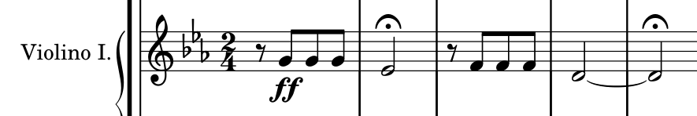
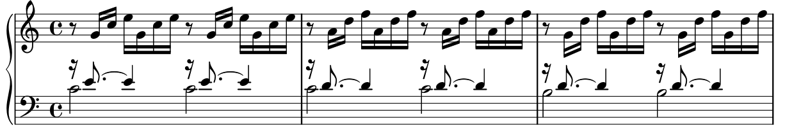

[← 回总目录](../README.md) · [身体与感官](02-senses.md) · [去现场](13-live-events.md)

# 11 · 耳朵不是用来证明品位的

**一首歌让你想再听一遍，比它能不能证明你懂音乐重要。**

你说喜欢一首歌，对方问是哪年的版本、有没有听过早期现场、知不知道它借鉴了谁。交流可以从这里变得有趣，也可以突然变成入场审查：原来只是喜欢，还不够。

我们站在另一边。知道背景可以增加入口，不该用来注销刚刚发生的感受。你可以只喜欢某一句旋律、某一下鼓点、某种声音，也可以想弄清楚它为什么打动自己。后者不是补考，而是自愿多开一扇门。

这一章提供几把具体的钥匙。不是教你用“高级”替换“好听”，而是让“好听”之后，还有话可说、还有地方可听。

## “有感觉”，可以从哪里开始说？

先不用找风格标签。下表是听觉入口，不是给所有音乐套上的固定配方。

| 你注意到的东西 | 可以试着听什么 | 容易混淆的地方 |
| --- | --- | --- |
| 身体想跟着动 | 反复出现的脉冲，以及声音落在它前后什么位置 | 整体快慢与节奏的疏密，不是同一件事 |
| 一小段总在脑中回来 | 一串音怎样上行、下行、停住或重复 | 旋律不只由主唱承担，器乐也可以有 |
| 听起来更厚、像有个底 | 低音线与其他声部怎样配合 | 低音线不等于每一次最响的鼓声 |
| 某处像换了一种颜色 | 同时出现的音、乐器或声部发生了什么变化 | 不是所有变化都来自音量变大 |
| 前面在等，后面终于来了 | 某个段落何时进入、什么材料回来了 | “进入副歌”不是所有音乐共同的结构 |

其中，拍、速度、旋律、低音线、和弦及段落结构的基础概念，可对照 Ableton 的官方教学项目 *Learning Music*。来源与读取边界见 [F02](../docs/evidence/F02-listening-language.md)。表里的提问是本书原创，不是教学材料验证过的享受方法。

你不必每次把五项都听一遍。喜欢人声就先听人声；只想让音乐陪着做饭，也没有义务把背景音升级成分析任务。

## 快，不等于密；响，不等于有劲

入门教材中的速度，指基础脉冲进行的快慢，常以每分钟拍数 BPM 表示。节奏则涉及声音在时间里怎样排列。可以在较慢的基础脉冲上放很多短音，也可以在较快的脉冲中留出空白。

因此，面对“我想听更带劲的”，不必马上只找更快或更响。你想要的可能是更明显的重音、突然停止后的重新进入，或几种节奏互相牵扯。这里是在提供描述问题的办法，不承诺某种编排必然令人兴奋。

虚构例子：同一个反复的鼓点，第一次上面只有人声，第二次多了一条低音，第三次其他声音忽然退开。速度完全可以不变，但三次的感觉未必一样。你喜欢的可能是“退开后又回来”，而不是数字更高。

把偏好说得具体，还能避免买错东西。若想要的是一首歌里某段进入的方式，更昂贵的播放设备并不自动替你找到这种音乐。设备可能有自己的价值，但要先知道这次缺的是什么。

**刺激可以来自关系与变化，不必永远来自把同一个旋钮拧大。**

## 四个音已经很出名，为什么还值得听它怎么出现？

贝多芬《第五交响曲》第一乐章的开头，很容易被压成一句“短短短长”。但认出了这个标志，还没有用完这个开头。

先看第一小提琴的前五小节。不识谱也没关系，下面会把图中与讨论有关的关系说出来。这是 Mutopia 排印谱的局部，不是手稿或某次演出的声波；版本与核读范围见 [F15](../docs/evidence/F15-musical-scores.md)。

**第一件事：最前面不是一个音，而是一个短休止。** 谱面为二四拍，八分休止后才出现三个短音，然后到较长的音。若把口头的“短短短长”机械地从第一拍起填进去，就改掉了声音进入的位置。一个材料的身份，不仅是有哪些音，也包括它在时间的什么地方露面。

**第二件事：两次“长”没有被写成同样长。** 第一组是 G—G—G—降 E；第二组降到 F—F—F—D。第一组的长音占一个小节，第二组通过连线跨两个小节，两个句尾都有延长记号。延长记号又不等于固定增加几秒。因此，知道旋律，也不等于已经知道演奏者会让你在句尾等多久。

**第三件事：强，不等于全体乐器一起响。** 这份总谱开头发声的是单簧管与弦乐声部，其他若干管乐及定音鼓在休止。随后，弱奏的短音材料在弦乐声部间错开进入，原先集中的陈述变成了接续。这里的辨别不是“乐器越多越有力量”，而是哪些声音一起说，哪些声音轮流说。

我们可以把这个开头理解为“抛出、悬住、再抛出”，也可以更关注音高下移、齐奏后的分散。前一种说法是本书的解释，不是作曲家附在谱上的剧情说明。本章不靠“命运敲门”的名人故事替声音预先指定唯一意义。

如果你手边正好有这首作品的录音，可以比较：让你想继续听的是三个短音的冲出、长音的悬停，还是后面声音散开又接上的过程？答案也可以是“都不是”。识别关系不是按答案欣赏。

这正是一个熟悉片段仍能有内容的地方：**认出一个标志，只用了音乐的一小部分；它怎样发生，才是这一刻正在经历的东西。**

## 几乎一直重复的动作，为什么不等于原地踏步？

再看巴赫《平均律键盘曲集》第一卷的第一首前奏曲，BWV 846。它提供另一种对照：不靠开头那样强烈的停顿，而让相近的分解和弦动作继续向前。

图中是所用排印谱第一页的前三小节。这里只比较最初四小节的局部，不拿它概括整部《平均律》；这份数字谱没有注明所据底本，不能冒充校勘定本。[F15](../docs/evidence/F15-musical-scores.md)

不必先给和弦命名。把开头听作一串从低处铺向高处的音，会更容易看见两个层次：**动作反复，材料移动。**

| 位置 | 保留下来的东西 | 改变的东西 |
| --- | --- | --- |
| 第一小节 | 一组分解音型在小节内出现两遍 | 建立最初的音高组合 |
| 第二小节 | 音符出现的节奏排列延续 | 低处的 C 保留，上面的组合换了 |
| 第三小节 | 同一种铺开的动作仍在 | 低处移到 B，其他音的关系也改变 |
| 第四小节，未包含在上图中 | 分解音型继续 | 回到开头的音高配置 |

这里并不是“一条旋律在同一伴奏上重复四遍”。按时间逐个出现的音，同时也在展开一组纵向关系；你可以留意连续的小音符，也可以听它们合起来形成的颜色怎样变。前景与底部不必由两个互不相干的角色承担。

这给“听着都差不多”提供了一条分岔。你说的可能是节奏动作差不多，而不是音高关系、去向和返回也完全一样。当然，你也可能已经听见差别，却仍然觉得无聊；分析不应把“不喜欢”强行改判成“没听懂”。

与贝多芬的开头并置，不是让两位作曲家比赛谁更会制造快乐，而是展示两种可辨认的组织：一边把进入和悬停凸显出来，一边在连续动作里改变关系。**刺激不只存在于突变；当你在意某种关系时，变化可以很小，却并不空。** 这是我们的审美主张，不是已经测出的普遍心理效果。

选择这两个局部，是因为谱面可以被展示和核对，不是因为古典音乐比别的音乐更值得认真。人声中一个字的拖延、电子音乐里一条声音的退出、熟悉歌曲换一种进入方式，同样可以成为问题；不能反过来要求所有音乐符合这两种写法。

## 作品、演奏和播放，不是同一个旋钮

一首曲子让你没感觉，可能是你不喜欢材料，也可能是你对眼前这个呈现方式没有兴趣。先分清在讨论哪一层，比立刻给自己或作品下结论更准确。

| 层次 | 可以比较什么 | 别混成什么 |
| --- | --- | --- |
| 谱面或创作材料 | 音高、节奏、声部、段落关系；没有谱的音乐也可以讨论材料 | 谱面本身不等于一次实际演奏 |
| 演奏与录音呈现 | 进入是否整齐，句尾怎样收，声部怎样突出，停顿怎样处理 | 一个版本的处理不自动代表所有版本 |
| 播放条件 | 是否听得清，是否不断被打断，当前环境是否合适 | 听不清不等于作品没内容；更贵也不自动更喜欢 |

本章实际核读的是谱面，没有对某张唱片作听感评测，也没有做版本盲听。因此不写“某指挥一定更震撼”或“这套设备还原了作者意图”。

若自己想比较两个已有合法播放权限的版本，先核对作品与乐章，再找同一个音乐位置，不要只对齐播放器的秒数。停顿与速度不同，同一个秒数未必落在同一句。只比较一次进入或一句收尾，也足以让意见具体起来；不必为比较购买设备或搜集全部版本。

你最后说“我更喜欢这次停得久一点”，已经比“这个版本绝对更高级”更清楚，也给另一个偏好不同的人留下了交谈空间。

## 不认识乐器，也能把喜欢说清楚

你可以说“人声后面那个一下下落下来的声音”，不必先猜它究竟是什么。描述错了乐器，不会让喜欢失效；愿意查证，再去看官方制作信息或可靠的作品说明。

比起“这歌很高级”，以下句子更容易让交流继续：

- “我喜欢第一段快结束时，声音突然少下来的地方。”
- “不是旋律本身，是他唱到那里时那种松一点的感觉。”
- “这版低处的线条更明显，我想再听它怎么走。”
- “我想找同样有留白的歌，不一定要同一位歌手。”

这些都是虚构的表达示例，不对应某首真实作品。它们保留不确定性，也比抢着给整首歌定级更接近自己的体验。

当然，准确词汇有用。知道了“低音线”“声部”或者“结构”，可能更容易提问和找资料。我们反对的是把词汇量当成喜欢的许可证，不是反对学习本身。

## 找新歌，先问想保留什么，再问想换什么

“推荐一些好听的歌”范围很大。若已经有一首喜欢的，可以把它当作参照，而不只是让系统继续推荐同一个标签。

比如，想保留缓慢的速度，换一种人声；想保留明亮的旋律，换更稀疏的伴奏；想保留熟悉的歌，换一个正式发布的版本。一次只换一个维度，是一种探索办法，不是经验研究给出的最优算法。

这样做有个实际好处：不喜欢时，至少能说清这次改变了什么。不是一下跨进完全陌生的声音之后，只能得出“新东西都不适合我”。

另一个方向是从真实贡献者出发。官方发布信息若列出作曲、演奏、制作等人员，可以选一个感兴趣的线索继续听；别把平台搜索结果里的同名当成已经确认是同一人。没有可靠名单就不猜，也不把所有功劳自动归给封面上最大的一行名字。

探索可以很认真，也可以很随意。没有必要每周认识一个新流派，才配说自己喜欢音乐。

## 推荐系统能给下一首，不能替你决定这一次要什么

自动播放适合不想费心选择的时候。它的方便是真实的，不必为了证明自主每首都亲手找。

但如果听了很久，却并不想继续当前的气氛，可以先从内容之外换一个问题：“这一段是想被陪着、想跟着动、想专心听，还是想安静？”

这里不推断某个平台具体如何排序，也不把所有自动推荐一概称为操控。我们讨论的是使用方式：下一首已经排好，不代表这一小时已经由你决定好。

同样，切歌不一定是注意力差，完整听完也不一定更高级。有的作品需要时间展开，你可以愿意给它这个时间；也可以发现今天不想听。对于自己原本就想深入的作品，先留一次完整聆听再评价，是一个选择，不是对所有人的要求。

## 重听不是没见识，新歌也不是进修任务

知道下一句怎么来，有时正是你想要的东西。熟悉的版本可以用来跟唱，也可以与某段记忆相连；它的价值不必通过“我又听出一个新细节”来证明。

如果确实想换个入口，可以这次跟一条声音走：先不管歌词，听低处怎样移动；或比较同一首歌两个正式发布版本，在进入、停顿、速度和段落上有什么不同。版本名称和来源要核实，别把随意加速或来源不明的上传自动当成作者另一个创作版本。

但不要把不同版本排成一条普遍的升级路线。你偏爱一个粗糙录音里的声音，并不必须改投更新、更清楚的版本；另一个人喜欢制作精细，也不因此失去真诚。

本章没有证据声称重复一定比新鲜更快乐。我们的主张更窄：**不必因为听过，就在价值上自动打折；也不必因为没听过，就预支它会更好。**

## 一起听歌，不是让别人坐下来接受你的品位

你选出一首最爱，朋友没有明显反应，这不一定是敷衍。对方可能正在聊天，可能没有听清你指的那部分，也可能确实不喜欢。

可以先说想分享什么：“这首后半段的进入我特别喜欢，要不要一起听？”对方同意之后，再给那一段留点空间。若只是背景播放，就别突然要求全桌人汇报感受。

轮流选歌时，可以约定不必所有人一致喜欢，但都不拿别人的选择开人格玩笑。有人想跳过某些内容，不需要先进行关于艺术开放程度的辩论。共同空间的音量同样需要协商。

分享之后可以问：“哪一段留在你脑子里？”也可以不问。不要把“你没听到我听到的东西”，直接升级成“你不懂我”。

音乐能成为联系的媒介，但没有义务为一段关系证明默契。

## 最强的反对意见：不提高品位，会不会永远只喜欢最熟悉的东西？

如果“喜欢就好”变成拒绝接触、拒绝理解的挡箭牌，这个批评有道理。学习背景、给陌生作品一点时间，确实是可选择的探索方式；知识与训练本身也可以有乐趣。

但有两个目的不该混淆：为了获得更多能喜欢的东西而探索，和为了摆脱“我的喜欢不够体面”而不断自我纠正。

前者允许出现惊喜，也允许尝试后仍然不喜欢；后者容易把每次没被打动都判成自己水平不够。我们支持前者，不要求后者。

如果你真想系统学习，可以认真去学。只是学完之后，仍然可以爱一首简单的歌。复杂性可以值得研究，不自动成为享受的等级。

## 想听得投入，不必把听得更响当作证明

WHO 的聆听问答提醒，声音水平、持续时间及反复暴露共同影响听力风险；建议控制音量、在嘈杂场所正确使用听力防护，并远离扬声器等声源。它也明确指出，一次极强声音暴露就可能损伤听力。具体来源及边界见 [F04](../docs/evidence/F04-safe-listening.md)。

因此，本书不会用“再大一点才有感觉”作为投入程度的考核。若环境让你不断调高耳机音量，可以换更适合听的环境或使用合适的聆听方式，而不是一直与噪声比赛。降噪耳机的用途说明、使用条件要看具体产品；本章不为任何产品做防护认证。

出现持续耳鸣或听清声音的困难，应向合适的医疗或听力专业人员求助，不用靠本书判断是否只是“玩得太尽兴”。这些一般建议不能替代个人评估。

**耳朵不是用来证明品位，也不是用来证明勇敢的。它首先属于正在听的人。**

本文的基础概念见教学来源，两个作品局部见谱面与版本记录；对组织方式的解释、偏好问题及探索路径为原创提议，不承诺提高审美或情绪。想安排一次共同聆听，可选[三首歌电台](../guides/05-three-song-radio.md)；只想听自己喜欢的一首，也已经完整。
