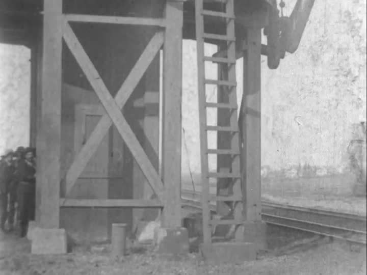
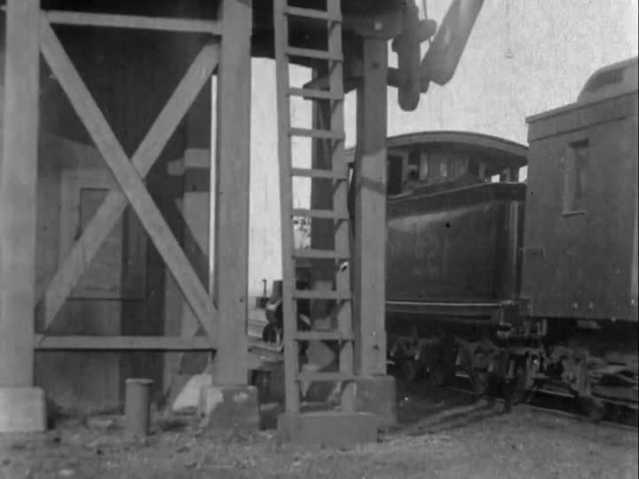
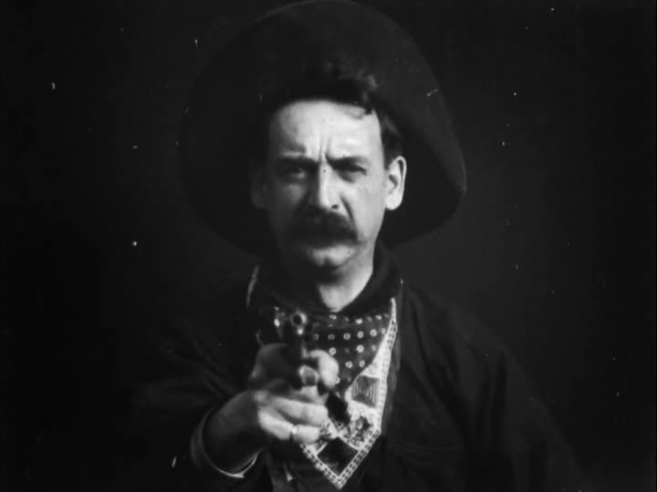

[← 回总目录](../README.md) · [一个人看](07-solo.md) · [一起看](../guides/04-living-room-cinema.md)

# 12 · 我知道电影在煽情，我仍然可以喜欢

**知道电影在煽情，不必赶紧证明自己没上当；已经被打动，也不必替作品免除批评。**

一句“被拿捏了”，可能混着几种判断：我确实产生了感受，这种表达究竟好不好，画面让我相信的事情是不是真的。它们不是同一道题。你可以看出设计仍然愿意投入，也可以已经哭了，仍觉得那场戏写得不好。

本章先争论[感动与判断能否同时保留](#film-judgments)，再用[具体镜头与声音](#film-expression)看表达怎样组织经历，接着问[研究究竟测了哪一种改变](#film-measured-effects)。[选片、版本和共同观看](#film-viewing-choices)放在最后：它们服务于你想经历的这一晚，不是影迷资格考试。

## 一、愿意被打动，不等于放弃判断

### 知道感动是被设计出来的，它就不真了吗？

“配乐一响，你就哭，导演当然知道怎么拿捏你。”这句话有时在指出具体的表达问题，有时却只是把观众的投入说成失守。

本书要反对的是后一个跳跃。**一段感受有制作过程，不等于感受是伪造的。** 你知道故事经过选择，知道镜头会切，知道演员不是真的经历这场告别，仍可以愿意把这一段时间交给它。这不必被看成知识不足，仿佛越聪明的人就越应该永远站在电影外面。

但“我被打动了”也不要求你撤回批评。真正有内容的批评可以问：这份感动依靠什么？前面的相处有没有让这次告别值得在意？一段突然加入的悲伤身世，是扩展了人物，还是只在关键时刻借来一笔分量？配乐有没有给画面留下含混，还是在你尚未形成判断前就不断重申一个答案？这些都是作品内部可以讨论的区别。

用一个原创场景来说明：影片花了许多场戏表现两个人总是错开吃饭，终于有一次，两人一起坐下，谁都没说和解。若末尾留住这顿饭，我们的理解可以接上前面的错过。另一种拍法没有建立两人的关系，却突然用慢镜头、眼泪和音乐要求告别拥有极大重量。两种都经过设计，但“都有设计”没有取消它们的表达差别。

这也不是一条禁止公式、煽情或浓烈风格的规则。有人恰好喜欢直给，愿意在熟悉的类型里等待那个大开大合的时刻；别人觉得用力过头，也有具体理由。批评可以落在铺垫、节奏与表达之间，不必把喜欢的人顺手判成容易被骗。

**我知道它在煽情，我仍可以喜欢；我已经哭了，我仍可以觉得它拍得不好。** 当下感受、事后判断、是否愿意再看，不需要永远投同一票。若把“不被影响”当作影迷毕业证，我们最后保护的可能只是一种随时证明自己没上当的姿态，而不是更丰富的观看。

这里的立场是本书的论证，不是实验结论。[第三部分](#film-measured-effects)的两项研究没有测试“懂得剪辑的人更容易享受”，也没有证明辨认手法会使所有人失去或获得感动。知识可以成为观看的一部分，不必预先被当成解药或障碍。

### 允许电影带走我，不等于允许画面替事实作证

最有力的反对意见是：如果我们赞成主动进入情绪，会不会也替误导开了门？

这里必须区分作品请你相信的是什么。虚构故事邀请你暂时在它建立的世界里理解人物；一段作为事实证据传播的视频，则可能声称现实里某个人确实看见、说过或做过一件事。都能剪辑，不等于承担同样的证明任务。

设想把某人微笑的镜头放在事故消息之后。观看时，这种连接可能让人觉得他在幸灾乐祸。但仅凭先后相接，不能确认微笑拍摄于何时、对象是什么、当事人是否知道事故。情绪读法是理解的一种产物，不是补齐缺失时间和因果的证据。这个例子是本书构造的判断问题，不对应任何真实人物或事件。

反过来，有剪辑也不自动说明造假。一段采访为了篇幅删去停顿，和把一句话拆成相反意思，需要根据具体材料判断，不能靠“所有视频都有剪辑”把区别抹平。

因此，欣赏时不必始终警戒到无法投入；核实时也不能用投入替代追问。你可以说“这个连接拍得很有力量”，同时问“这份现实断言的原始材料在哪里”。**被打动，既不是丢失判断力的证据，也不是事实已经成立的证据。** 电影能邀请我们经历一种关系，而不必获得替现实免检的权力。

## 二、不只看发生了什么，还看怎样让你经历

不需要把所有电影都当成需要破解的谜题。但知道一点电影怎样表达，也能让“剧情很普通”之外，出现更多观察入口。下面先看信息怎样被安排，再看一段持续的空间如何使等待有了内容。

### 先别问“什么意思”，试着看“它怎么让我知道”

电影可以通过选择给谁镜头、让什么留在画外、在什么时候切走来组织信息。观众知道得比角色多，和观众与角色一起不知道，可能形成不同的观看经历。

虚构一个场面：两个人谈一件重要的事。镜头没有一直对着说话者，而是留在听者脸上；门外传来脚步声，画面却没有马上给出是谁。

这时可以观察三个问题：

1. **我正在看谁？** 说话的人，还是听到这句话的人？
2. **我比角色多知道还是少知道？** 画外的声音有没有改变这种关系？
3. **它让我等多久才给答案？** 是立即切到门口，还是继续留在脸上？

同一段台词不变，组织信息的方式仍然可以不同。这里的场面由本书虚构，不是对某部电影或所有观众反应的断言。

这种观察不需要暂停记笔记。看完后记住某一处“为什么让我等在这里”，已经是一种具体的观看。

### 不切镜头，也能把“等着”变成内容

拿一部具体作品看：Edwin S. Porter 的《火车大劫案》（*The Great Train Robbery*，1903）。不是因为它够老就要求你尊敬它，而是一个水塔旁的场面，足够把“电影不只是剧情”讲清楚。

以下分析基于所选数字副本的抽帧核看，以及爱迪生公司当年的影片宣传目录，不是原始放映现场的体验报告。版本与实际读取范围见 [F16](../docs/evidence/F16-train-robbery.md)。影片包含虚构抢劫、枪击和死亡；下面折叠部分涉及后段与结尾。

画面让水塔的支架占了很大的位置，轨道从旁边经过。劫匪先在这里藏身，火车随后进入并停靠。镜头没有靠不断切近景，逐个指认“这个人”“那根管道”“这里有危险”；人物、遮挡和铁轨被放在同一个可持续观察的空间里。

**第一层关系是遮挡。** 我们已经看见有人藏到那里，所以暂时看不清，不等于从来不知道。支架既能挡住人物，也能保留人物还在附近的可能。这与突然切出一个从未出现过的袭击者，是两种不同的信息组织。

**第二层关系是等待。** 轨道还空着，不等于画面什么都没做。因为前面已经给了藏身动作，空轨道变成了一个有方向的空缺：将有什么进入？我们等待的不是导演赶快换画面，而是已有画面发生变化。

**第三层关系是尺度。** 机车进入后，人物在大体量车身和支架之间行动。若把这一段压缩成“劫匪上了火车”，事件没有说错，却删掉了身体怎样等待、躲藏和靠近庞然大物的过程。

因此，本书把这一段读作由空间关系组织的期待，而不是“剪得越快越紧张”的证明。你完全可以觉得它缓慢；但缓慢与没有组织，不是一回事。喜欢紧张感的人，未必只是在寻找更多单位时间内的剪切。

这也解释了为什么一句剧情简介不能替代整个片段：简介告诉你发生了什么，画面还在决定**你站在哪个距离、带着多少已知、经过多久才看到它发生**。

展开后段与结尾分析：回到电报室，以及对着镜头的枪手

### 切回一个旧地方，时间一定就是“同时”吗？

所选副本在劫匪逃离、穿过林地之后，切回前面出现过的电报室。被制服的电报员仍在那里，随后有人进来帮助他；叙述再把消息与追捕接起来。

“先看到逃走，再看到救助”，首先说的是**影片的呈现顺序**。它不自动证明故事里的救助恰好发生在逃走之后，也不证明切换的瞬间是两地同步。若每次换地点都立刻贴上“与此同时”，就替画面补了一只它没有明确给出的钟。

这不妨碍我们理解因果：开头被压下去的求助能力，现在重新进入故事，后面的追赶因而获得一个可理解的来源。片段之间的联系，既可以来自时间，也可以来自未解决的事情重新被接起。

本书在这里不争“它发明了哪一种剪辑”。一种作品是不是历史第一，需要另外的史料比较；看见这个副本怎样组织信息，并不足以证明优先权。

对普通观看更有意思的问题是：它切回来的那一刻，你还记不记得这个人？前面留下的事，是被你忘了，还是一直悬着？后一种感受属于具体观众，不能从剪辑表直接算出来。

### 故事已经收束，为什么还要一个人对着镜头？

所选副本把这个近距离枪手镜头放在末尾。前面我们常在一定距离外观看许多人和环境，此处一个人突然占据画面，举枪朝向镜头。改变的不仅是“又开了一枪”，还有观看的位置：刚才像在旁边看一场行动，现在画面正面朝向观看者。

这是一种可能的直接招呼，不必被硬解释成故事中某个角色的主观视点。我们可以讨论“像是从看别人冒险，转为被画面指向”，但不能由此断言每位观众都害怕，或者当年的观众真的逃跑。

更有意思的证据在当时的销售材料里。爱迪生公司的第 201 号目录，在第十四场的说明中允许放映者把这个镜头放在**开头或结尾**。同一镜头并非只能承担一种固定的叙事位置。[F16](../docs/evidence/F16-train-robbery.md)

放在开头，可以被理解为先给一个迎面而来的刺激，再展开故事；放在末尾，可以被理解为故事结束后仍有一击。这两种用途是本书据位置作出的解释，不是已经比较过两组观众的实验结果。

目录还声称它能引起很大兴奋。但目录在卖电影，不是在发表观众研究。**宣传怎样承诺刺激，与刺激是否真的发生，是两份不同的证据。** 想让作品吸引人，不等于可以拿宣传语充当效果。

这个例子也提醒我们别把今天点开的副本当成无版本差别的唯一作品：顺序、片头、速度和配乐等条件，需要按实际文件确认。这里使用的文件没有音轨；这并不能证明 1903 年某场放映现场也完全无声。

### “看过”与“喜欢”之间，还能多说什么？

从水塔、切回电报室、近距离枪手这三个局部，我们可以得到三种不同的讨论，而不是同一个“电影好不好”的投票：

| 讨论的对象 | 可以提出的判断 | 还需要什么约束 |
| --- | --- | --- |
| 画面里的空间 | 遮挡保留了已知人物，空轨道使进入变得值得等待 | 指出具体可见安排，不只说“氛围绝了” |
| 场面之间的连接 | 回到电报室接续了前面未解决的事 | 别把呈现顺序强行换算成精确故事时间 |
| 画面对观众的位置 | 近距离正面枪手可能形成直接招呼 | 区分画面安排、个人感受和历史宣传 |

你不需要同时喜欢这三种处理。可以觉得水塔场面有趣，却不喜欢末尾直白的刺激；也可以刚好相反。把分歧落实到具体地方，讨论就不必在“经典不能质疑”和“老片都没意思”之间选边。

本文也没有要求你逐帧看电影。细看是当你想多要一点时可进入的深度，不是每次休闲必须缴的理解税。电影之所以不必靠“看完多少部”来证明价值，也因为一部作品内部就有许多不同的相遇。

### 六个够用的概念，不必一次全记

以下概念可在耶鲁托管的 *Film Analysis* 教学站点中继续查阅；本章使用它们理解表达，不用来给电影打自动分。来源范围见 [F03](../docs/evidence/F03-film-language.md)。

| 概念 | 先用日常语言理解 | 可以留意的问题 |
| --- | --- | --- |
| 景别 | 人和物在画面中显得多大，周围留了多少环境 | 为什么此刻靠近脸，而不是让我们继续看整个房间？ |
| 焦点变化 | 原来清楚的地方变模糊，另一处清楚起来 | 我的注意力被交给了谁或什么？ |
| 长镜头 | 一段相对较长、没有切换到下一镜头的连续镜头 | 时间持续着时，人物、空间或等待发生了什么？ |
| 交叉剪辑 | 在不同动作线之间来回切换 | 两处事情怎样被放到一起比较或牵连？ |
| 声桥 | 一个场面的声音延续到下一个，或下个场面的声音提前进入 | 画面已变，情绪或信息怎样仍然连着？ |
| 画外声音 | 声源被理解为在场景空间内，但暂时不在画面里 | 画面之外，还有什么正在发生？ |

这些词不构成“用了就更好”的清单。长镜头不自动更真实，剪辑多不自动更刺激，焦点变化也不必每次都有唯一的象征答案。

尤其要分清：长镜头说的是镜头持续，远景说的是画面里的距离与尺度。一个持续很久的面部近景，可以是长镜头；一个转瞬即逝的广阔景观，也可以是远景。

### 没有情节反转，也可能有事情正在发生

两个人坐着吃饭，故事层面似乎没推进。可镜头保持多远，谁先把目光移开，一句回答之后留了多久，餐具声有没有突然显得突出，都可以构成这段观看的内容。

耶鲁教学材料在讨论节奏时，不只看剪辑，还纳入镜头持续、运动、声音与场面调度。本书据此提供一个入口：当你说“慢”，可以再问具体是什么慢。

是事件很少，信息给得缓慢，镜头持续较长，还是自己一直没找到关心的对象？这些情况不一定同时出现，也不必得到相同评价。

“慢”不是缺点的别名，也不是深刻的证明。若你喜欢等待中的细小变化，可以留下；若这一晚想要另一种节奏，也可以换。理解表达的可能性，与必须喜欢表达的结果，不是一回事。

### 电影的声音，不只负责把台词放清楚

声音可以来自故事世界里的物体和人物，也可以来自故事世界之外、主要给观众听的配乐。教学材料常用“叙事内／叙事外声音”区分；这不等于“现实录下来的／后期做出来的”。

例如，虚构场景里收音机正在播放一首歌。即使这段声音是在后期加入，只要影片把它呈现为来自故事里的收音机，就仍是叙事内声音。相反，角色不知道、由观众听到的背景配乐，不因为使用了真实乐器就变成叙事内声音。

这个区别能帮助观察：音乐何时让你比角色多知道一点，声音什么时候先把一个空间带进来，安静又在哪一刻使动作更突出。

但不必每次准确归类。有些作品就是让声音来源保持不确定。描述“我一开始以为它来自隔壁，后来才发现不是”，比抢答一个术语更贴近那次体验。

## 三、研究测到的改变，能不能回答你的问题

电影可以邀请我们形成理解，但“被影响”究竟指什么，不能只靠一句形容。下面把对角色的判断拆开，再回到观看者自己的感受。

### 脸没有多演一点，故事能不能多出一点？

设想一组由本书虚构的镜头：一个人站在门前，表情平静；切到屋内，一张桌子已经摆好，却只坐着一个等他的人；再切回门前那张脸。现在，把中间的镜头换成一群藏在沙发后的朋友，手里拿着还没点亮的生日蜡烛。

前后两张脸可以完全不改，观众仍可能给它们不同的解释。第一种也许像犹豫，第二种也许像还没察觉惊喜。但这不是只有两种答案的心理测试：有人会把第一种看成冷淡，把第二种看成早已知情。这些都只是可能的读法，不是本书做过的观众实验。

值得拆开的，是画面让你跨过了哪几步。你先看见一个人在门前，再看见屋里的人，然后把两处理解成同一场相遇；接着，你可能把屋里的情况当成门外那个人的处境。**剪在一起提供了联系的邀请，却没有自动交代他究竟知道多少。** 他看见桌子了吗？生日会对他真是秘密吗？如果影片没有给，这些就是待定的信息，不该被一个表情术语替它补齐。

因此，电影里的一张脸不只是独立展示的面部肌肉。它也被放在一个“正在看什么、刚刚知道什么、还不能回答什么”的位置上。我们不是必须在“演员演技”和“剪辑作用”之间二选一；表演、镜头连接和观众补出的联系，可以共同参与一次理解。

把这个道理压成“同一张脸，导演想让你读出什么就能读出什么”，反而抹掉了最有意思的部分：不同安排究竟改变了哪一种判断，改变到什么程度，又在哪里没有改变？

### “觉得他更愉快”和“他更激动”，不是同一项发现

2024年，Cao等人发表了一项使用自制电影片段的研究。它让我们离开著名效应的传说，看看实际测量。[B32研究台账](../docs/research.md#b32) · [N32详细核读](../docs/evidence/B32-film-context.md)

实验一有59名参与者。每个序列先放两秒中性面孔，再放四秒恐惧、中性或愉快场景，最后重复序列开头的两秒面孔。片段转成灰度并去掉声音，脸后的背景还经过合成处理，使其与场景接近。随后，参与者给面孔的情绪正负方向和情绪强度评分。

这里有一个很容易被流行讲解省略的条件：**同一段脸在一个序列内重复，不等于同一张脸在三种情境里都被测试。** 研究把30张脸分配到三组，各组用不同的脸和场景；预先评级是控制材料的一种办法，但不能把这个设计改写成每张脸逐一更换全部背景。

在−1到1的正负评价量尺上，恐惧、中性、愉快条件下的平均评分分别约为−0.45、0.07、0.27，条件差异显著。但是，另一项“这个演员的情绪有多强”的评分，未检出条件主效应，p = .879。

通俗地说，这次研究支持的是：在这些材料与任务中，脸被评价得更偏负面或正面；它没有同时发现演员被看成情绪更强。**方向和力度不是同一只旋钮。** 而“我更喜欢这段电影”，根本不是该实验在这里测的问题。

研究另有31人的扫描实验，得到情绪正负评分差异及相关脑活动结果。两次实验的量尺、呈现安排也不完全相同，不能把它们拼成102个人做同一项任务——102还包括12位材料评级者。脑区活动也不是给“导演控制人心”盖章，更不是一份影片好看程度的测量。

### 偏向一点正面，不等于从“中性”变成“快乐”

2026年，Szaszkó与Loebus的另一项研究，专门把两类问题分开：一张脸给人的印象有多正面，以及它究竟在表达哪类情绪。[B33研究台账](../docs/research.md#b33) · [N33详细核读](../docs/evidence/B33-context-and-categorization.md)

32名维也纳大学心理学学生先看静态情境图片，并为图片评分；接着看正面朝向自己的中性面孔视频，再进行面孔正负评价与情绪分类。没有“看向某物—某物—返回那张脸”的连续结构，而且中间插入了评级任务。作者因此把它称为边界检验，而不是完整复刻电影场景。

在1到7的面孔正负量尺上，正面、中性、负面情境对应的模型估计均值约为3.98、3.93、3.87。条件效应显著，但幅度小；把“显著”读成强烈转变，就会把不到一个刻度的差别讲成换了一张脸。对于明确选出情绪类别的任务，未检出情境的显著作用，p = .293。

这既不是证明“剪辑没有用”，也不是证明“只要恢复连续剪辑，分类一定改变”。研究没有在同一实验里随机比较有、无连续性的全部安排，不能替这个机制定案。材料不同、操作不同、提问不同，都可能影响结果；未显著也不证明效果精确等于零。

两项研究不适合排成“哪一篇赢了”。更好的读法，是不再让“情绪被影响”一句话兼任所有结论：

| 你想知道什么 | 可以对应怎样的回答 | 不能直接替代什么 |
| --- | --- | --- |
| 这张脸更偏正面还是负面？ | 正负量尺的评分 | 指认出某一种情绪 |
| 你认为他是在害怕、快乐还是中性？ | 情绪类别的选择 | 情绪的强弱程度 |
| 你觉得他的情绪有多强？ | 强度评分 | 观众自己有多紧张 |
| 你喜欢这段观看吗？ | 观众对经历的评价 | 以上三项的自动推论 |

最后一行不是前两篇研究已经给出的答案。一个人可以把角色看成更悲伤，却更喜欢这段表达；也可以准确看懂影片意图，但觉得它不动人。喜欢不是识别情绪后的必然奖励。

## 四、怎样看，服务于你想经历的这一晚

**看了一百部好电影，不必比认真喜欢一部电影更会生活。**

片单可以帮人发现作品，也可以悄悄改变目的：原来是想看，现在是想把“没看过”清掉。看完后记得排名、奖项和完成数量，却很少有一句属于自己的感受。

本章不反对看得多，也不反对影迷钻研。它要保留一个更基本的方向：看片不是为了赶上别人对你的预期，而是为了亲自经历某种影像、声音、故事或相处。

### 选片先选这一晚，不是先选人生代表作

你可能想要悬念，想大笑，想看漂亮的动作，也可能只是想重回熟悉的人物。不同目标，对应的选择条件不同。

| 这一晚真正想要什么 | 选片前值得看的信息 | 不必自动优先的东西 |
| --- | --- | --- |
| 不知道接下来会怎样 | 是否想保留剧情未知、介绍是否含关键情节 | 讲完整个故事的长解说 |
| 一段视听体验 | 正式版本、语言、可用字幕或其他辅助方式 | “大多数人都说好” |
| 跟朋友共同度过 | 大家能接受的题材、时长、聊天或安静观看的安排 | 自己一个人的最高评分 |
| 与熟悉作品重逢 | 自己想重看的部分、是否愿意看完整部 | 必须第一次看的新鲜感 |

这些是偏好问题，不是心理测验。可以直接说“今天不想看太沉重的”，不必为此证明那类作品没有价值。

内容提示、语言和辅助服务应查具体版本的说明。别假定同名作品的不同发行版、播放页或场次必然相同；也别用自己的承受程度替同行人回答。

### 黑边不一定是故障，铺满也不一定是完整

画幅比例是图像宽与高的比值。作品与屏幕比例不同时，要在保留完整画面、裁切或其他显示方式之间处理；把画面硬铺满，可能改变原本的构图。

这里不提供任何设备的通用设置教程。能否调整、选项叫什么，需要看具体播放器；但有一个值得确认的区别：你是在等比例显示完整画面，还是通过裁切或拉伸填满屏幕？

不必为了追求所谓专业，购买某种屏幕。用已有设备也可以先避免自己并不想要的裁切。若由于视觉需求需要放大，具体使用方式可以由本人选择，没必要为了“正确观看”否认实际需要。

类似地，字幕、配音、音频描述和其他辅助方式，是参与条件，不是影迷资格测试。它们是否提供、对应哪个版本，要查实际说明。不能把“不使用字幕”写成更纯粹的观影标准。

### 解说、评论和原片，满足的未必是同一个愿望

解说可以帮助了解梗概，评论可以提供别人怎样理解作品的路径。这些用途不低级，也不必一律排斥。

但如果这次想亲自经历悬念、停顿和信息逐渐显露的过程，提前知道全部情节，就改变了这次选择的条件。不是“被剧透一定不快乐”，而是你愿不愿意以已经知道的方式看。

同理，先读评论可以帮助进入，也可能让你一路只找评论者说过的东西。这是一种可能的观看路径，不是本书已验证的普遍心理效果。

可以把“帮我选片”和“帮我解释看完的片”分开。如果问别人推荐，可以明确说不想知道关键情节；如果自己分享，也先问对方是否想知道。

保留未知是一种愿望，了解全貌也是一种愿望。不要拿一种偏好替另一种判错。

### 两个人一起看，不必随时同步反应

一个人笑出声，另一个人没笑；一个人想停下来讨论，另一个人想连续看完。先把观看方式说清楚，比拿反应测试关系更有用。

在家看可以约定哪些情况暂停、是否边聊边看、谁不适合某种内容。现场观影则需遵守场所规则，不把自己习惯的评论方式强加给周围人。

片后交流也不必从“到底好不好”开始。可以问：“哪一段最想再看？”“哪一处你和我的理解不一样？”“有没有一刻你不想继续了？”都允许答案不同。

不要把另一个人没被打动解释成没有感受力，也别要求喜欢的人当场写出完整辩护。共同经历的价值，可以包括彼此看到了不同的东西。

### 最强的反对意见：这不还是把娱乐变成学习了吗？

如果每次看片都必须识别镜头、解释隐喻、写出心得，确实又变成了作业。本章不要求这些。

概念的用途是：当你已经好奇某个片段为什么这样拍时，有个地方可以继续走；不是在原本满意的一次观看上，额外检查有没有收获知识。

也别走到另一个极端：为了保持“纯享受”，禁止自己分析。有人最快乐的部分就是逐镜头讨论、查历史版本或读理论。非功利不等于拒绝认真；认真也不必自动变成竞争。

**电影不是你要完成的任务，也不必只有一种正确的爱法。** 有时你想看懂更多，有时你只想被一个故事带走。两种愿望都不欠一张证明。

本文的技术概念为教学材料的有限转述；虚构场面、作品解释、判断问题和价值主张为原创。三张《火车大劫案》静帧来自另列来源与权利状态的数字副本，未复制耶鲁站点的例片或分析。作品细读与历史宣传都不证明某种看法能提高理解力或快乐。
