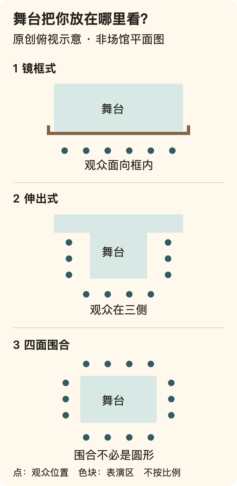

[← 回总目录](../README.md) · [音乐](11-music.md) · [散场之后](10-aftertaste.md)

# 13 · 在家听得更清楚，为什么还要去现场？

**有些钱买的不是更完美的内容，而是自己愿意在场的那段时间。**

在家可以坐得更舒服，听不清的地方可以重放，散场也不用赶末班车。那为什么还愿意请假、约人、买票、出发？

回答“为了气氛”不算错，却还没说明你到底喜欢什么。是亲自听到某个声音，是与别人一起等待，是看见一段动作没有被镜头切开，还是熟悉的东西终于在眼前发生？这些愿望不必合并成一种标准答案。

**现场不是录音录像的低清替代品，也不是喜欢一个人的资格认证。** 你不能把它拖到明天再同时经历，台上也不能按每个人的偏好各演一遍。这种不可单独支配，既可能使人兴奋，也可能使人疲倦。

**先从分歧进入：**[现场与屏幕差在哪](#live-medium) · [观看必须变成互动吗](#live-participation) · [观众的选择改变了什么](#live-choice) · [可我就想改变这一场](#live-control-objection)。

**再看它怎样成立：**[舞台怎样安排观看](#live-space) · [看戏时，为什么盯着看戏的人](#live-mousetrap) · [京剧的舞台约定](#live-convention) · [已知剧情里的期待](#live-anticipation) · [懂一点是否会变成作业](#live-understanding)。不是为了证明每个人都应该多买票，而是把“值得去”讲得比“气氛好”更清楚。

## 我们买的是作品、一次呈现，还是自己的在场？

先承认一个不丢人的答案：有时确实不必去。你要反复听某段和声，要随时暂停，要照顾身边的人，或就是更喜欢家里的环境，录音录像可以直接满足这些要求。没有必要把方便说成懒惰，把反复播放说成不够真诚。

但“声音更清楚”并不能独自判定两种体验谁更值得。我们可能在乎三种不同的东西：

- **作品**：这首歌、这段戏写了什么，结构如何。
- **这一次实现**：此刻的声音、动作、停顿与配合怎样把作品呈现出来。
- **自己的在场关系**：我在哪里看，与谁一起，周围的回应怎样进入这一晚。

这是本书用于讨论的分法，不是对所有表演的完整分类。一场没有固定剧本的演出、一段录像艺术或带实时传输的作品，都可能让边界更复杂。分开的意义是：别拿一项优点包办全部价值。

录像可以保存一次实现，但镜头已经替后来的观看者选过景别与时刻。现场也不是毫无限制的自由视野：座位、灯光、布景和其他观众仍在筛选你能看到什么。两者的区别，不是一个“真实”、一个“虚假”，而是谁在什么时候替你作了哪些选择。

比如一个原创假想场面：一个角色正在说话，另一个角色在远处把手里的东西放下。录像若切成说话者的近景，你未必同时看见那个动作；现场若座位被遮挡，也一样可能错过。看见不同内容并不自动意味着谁更高贵，只说明“同一出戏”不能抹去观看位置的差别。

**我想亲自在这里看它发生，已经是一个完整理由。** 不需要接着补“还能提升审美”“以后谈事情用得上”。但它也不是无需考虑票钱与路程的免责条款：理由完整，不等于代价消失。

## 四种“想去”，不一定需要同一张票

| 想要的主要部分 | 选场次或位置时优先确认什么 | 不应自动替你决定的标签 |
| --- | --- | --- |
| 看清表演细节 | 视线、舞台形式、座位或站位的实际条件 | 离入口最近、票名最贵 |
| 听到完整演出 | 声音环境、演出安排、自己能否停留 | “最前排才算来过” |
| 与同伴共同经历 | 双方期待、行动条件和集合方式 | 谁更资深就听谁的 |
| 感受人群与临场变化 | 自己是否真愿意参与相应氛围，能否调整参与程度 | “不跟着喊就是不投入” |

表格不是座位攻略，也不承诺某处声音或视线最好。具体场地、舞台、设备和当晚安排都可能不同，不能从“前排／后排”“内场／看台”几个字推出统一答案。

一个人可能同时想要几项，但仍需取舍。愿意离舞台远一点换一个能坐的位置，并不必然算降级；想为近距离观看付出可承担的费用，也不需要被批评为不理性。

价格是交易条件，不是这次体验对你的意义排名。

## 买票来看，不等于报名出演

“你不是旁观者，你也是演出的一部分。”这句话听起来热烈，却还没有说清观众到底答应了什么。是坐在这里看，是可以接一句话，还是必须被叫到台上完成一段任务？

**在场，不等于答应被点名；收到回应，也不等于拥有决定权。** 这不是把互动赶出现场，而是避免用同一个好听的词，盖住不同的关系。

下面设想一场只有两名表演者、两封信的小演出。所有情节和安排都是本书原创假想，不对应实际作品，也不是观众研究：

| 假想中的安排 | 观众实际参与了什么 | 不能由此认领什么 |
| --- | --- | --- |
| 按既定顺序读完红信、蓝信，观众知道内容已经排好 | 观看这次呈现，与别人共同经历它 | 自己决定了两封信的顺序 |
| 表演者听见观众笑声，等笑声减弱后才接下一句 | 当场回应进入了表演的衔接 | 观众可以要求任意改词、加戏 |
| 先说明由观众投票决定哪封信先读，按公布的结果执行 | 一项有边界的共同决定 | 每个人喜欢的顺序都能实现 |
| 先说明内容不变，邀请愿意的人上台代读一封信 | 被选中的人承担一次呈现，其他人仍观看 | 上台的人可以改结局；没上台的人没参与 |

四行没有从低到高排列。你今晚可能只想看两位演员怎样读信，完全不想临时朗读；也可能最期待自己上台。后一种愿望介入了呈现的制作，前一种却没有因此变成“不够投入”。

从观众转成表演者，还会改变这个晚上的负担：原本只需理解眼前发生的事，现在要考虑怎样回应、是否会被其他人注视。有人喜欢这种突然进入中心的感觉，有人专门买票来暂时不必做中心。我们不把任何一种反应写成性格诊断，也不拿“大家开心”替个人答应。

对一场明说互动、参与方式也清楚的演出，可以认真决定自己是否想加入；对原先没有说清的点名，则不能仅凭人已到场就推定愿意。这里讨论的是应怎样尊重约定和选择，不是某种票务法律规则。“可以拒绝”也应有实际含义：不把拒绝接成惩罚、嘲弄或反复劝说，才不是换一种办法继续点名。

共同观看的乐趣，见[相处章](05-connection.md#connection-shared-attention)；希望被看见的愿望，见[E08](../essays/08-life-without-an-audience.md#audience-three-requests)。这里增加的区别是：**观众不是必须升级成演员的初级身份。**

## 最后都读到了两封信，投票还有用吗？

回到第三种安排。假定只有五位观众投票，红信三票、蓝信两票；规则是票多的先读，没有其他条件。于是红信先、蓝信后。如果票数相反，顺序就相反。这是一个完全写明规则的例子，不是对真实演出后台的猜测。

两种结果最后都读到了两封信，不能据此说投票无用。它改变的是顺序，不是内容有没有出现。再假定红信是辩解、蓝信是指责：先听辩解再听指责，与先听指责再听辩解，为观众提供信息的次序不同；具体产生什么感受仍取决于作品与观众，本例没有测出某种必然效果。

**有限的选择可以是真选择；真选择也可以不是你想要的那一种。** 如果你特别想决定人物最终和不和好，仅能决定先读哪封信可能不够。失望值得说清，但不能把“没有提供我更想要的影响”直接写成“什么都没改变”。

反过来，若宣布投票决定顺序，却无论票数如何都先读红信，邀请就没有按所说的方式进入结果。问题不在选项少，而在说好了会改变什么，实际却不让它改变。即使演出很好看，也不能拿好看来证明这项约定已经兑现。关于感受与承诺的区别，见[E11](../essays/11-pleasure-and-reality.md#pleasure-promises)。

集体决定还有一层：投了蓝信的人没有看到自己希望的顺序，不等于他的票没算；投了红信的人也不是独自决定了整场。判断有没有按约定处理意见，要看计入和执行的规则，不能只看自己赢没赢。这不替任何现实投票制度作背书，也不声称多数决定能满足所有人。

所以，听见“观众将改变故事”时，值得追问的不是有多少按钮、被叫了几次，而是：哪一部分会随回应改变，哪一部分已经固定，谁按什么方式作最后决定。共同创作中的意图与结果，另见[角色故事章](34-shared-stories.md#story-choice)；本节不把那里的游戏规则搬来要求所有剧场。

## 可我就是想让这一场因为我而不同

那是一个具体愿望，不必被劝成“安静欣赏也一样”。你可能想听见表演者回应自己的问题，想把一个建议送进即兴段落，或者就是期待站到灯光里。只收到一场完成度很高的既定表演，未必满足这份期待。

但“希望因为我而不同”，至少还要补一个范围。五个人分别指定五首不同的歌，都要求自己的那首最后唱，就不能靠更强调“每个人都是主角”消除冲突。可以约定轮流、抽选、集体选择，也可以干脆不提供点歌；这些安排会给人不同机会，没有一种保证每人的愿望同时实现。这里不是活动方案或概率承诺，而是在承认同一场演出不能被每个人单独支配。

我们不要求你喜欢这个限制。若最在意的就是一对一回应，可以把它当作选择演出的关键条件，不必为现场这个标签降低要求。若明确约定了回应却没有发生，也可以指出缺口；若约定本来就是有限机会，没轮到自己的失落仍然真实，却不是别人自动欠下一场补演。

另一方面，也有人愿意把接下来怎样展开交给台上。他不是因为没有主见才坐着，而是想看另一些人的判断、节奏与完成。**我愿意把这一段交给别人，不等于把自己的生活交出去。** 主动选择可以包括观看一种不由自己主导的呈现，不必永远争取更多操作权。

“耍起”因而不只有“让我加入”，也可以是“让我好好看”。我们要争取的是自己真正想要的关系，而不是把所有娱乐都推向更多互动、更多被看见、更多决定权。共同时间为什么不总能换到明天，再读[庆祝章](18-celebration.md#celebration-same-night)；那是另一个问题，不能用是否有互动替它作答。

## 舞台不是一个点，观众也不只有“前排”和“后排”

说“想离演员近一点”之前，还可以问：演员主要朝哪里，观众围在哪里，动作从哪些方向展开？

Theatres Trust 的剧场教学页区分了镜框式舞台、伸出式舞台和观众四面围合的形式，也说明黑匣子是可灵活布置的空间，而不是一种固定座位排列。[F40](../docs/evidence/F40-theatre-space.md)保留术语与读取范围。下面将其中三种关系画成简化俯视图：

图中的点只表示观看方向，没有座位等级、比例、声场、通道或出口信息。四面围合不必是圆形，伸出部分也不必是方形；镜框式舞台有时还会向观众方向延出。图示故意简化，不能据此选定某场演出的“最佳座位”。

| 空间关系 | 它让什么问题变得值得看 | 不能只凭名称得出什么 |
| --- | --- | --- |
| 镜框式：通过框架面向舞台 | 人物怎样进入或离开框内；布景、灯光如何组织同一幅画面 | 前排一定能看全；所有动作只朝正前方 |
| 伸出式：观众在三侧 | 演员转向另一侧时，身体与人物关系怎样变化 | 三侧都同样清楚；距离近就一定亲密 |
| 四面围合：观众在四周 | 对面观众可能进入自己的视野；一个动作如何向不同方向展开 | 每个人看到同一细节；名称保证没有遮挡 |

后两种空间里，演员有时背对某一侧，并不等于那一侧遇到了“错误的正面”。当然，也不能反过来把任何长期遮挡都美化成艺术：具体演出怎么调度、卖票时怎样说明，仍然要具体看。

空间甚至可能参与叙事。一个角色从你这一侧离开，却在远处另一侧出现，人物之间的距离不只是台词里的“很远”，也是你眼前要转移注意力的距离。这是观看上的推导，不是对任何指定演出的实测。

另外两个词也别混在一起：**特定场域演出**看重地点与作品的关系；**行进式演出**涉及观众随演出移动。两者可以重叠，但一个仓库里的演出不一定需要走动，需要走动也不自动代表观众可以自由进出任何区域。相应术语来源仍见 F40。

这不是要求记住建筑分类，而是多一个提问方向：**我去看的不只是“台上有什么”，也包括“它把我放在哪里看”。**

## 看戏时，为什么反而盯着看戏的人？

空间决定了哪些人可能进入视野，作品还可以让“别人怎样看”成为我们想看的内容。《哈姆雷特》第三幕第二场把这件事写得很具体：有人表演，有人观看，还有人在观察那位观众。

以下采用Folger Shakespeare Library刊出的英文剧本，中文为本书概述，不是一场演出的观看实录。[F94](../docs/evidence/F94-hamlet-and-spectators.md)保留具体行号、版本标记和解释范围。折叠部分涉及关键情节与人物判断；原始Markdown、全文导出和打印仍含剧透，想保留初读体验可以略过。

展开《哈姆雷特》戏中戏细读（含关键剧透）

### 一位观众离席，怎样成了另一层演出？

王子哈姆雷特请霍拉旭帮忙观察叔父克劳狄斯。他说，今晚的一段戏接近自己所知的父亲死亡情形；演到那里时，两人要留意叔父的反应，之后对照判断。于是，表演还没开始，观看已经有了不同任务：宫廷众人在看戏，王子与朋友还在看一个看戏的人。

演出中，演员扮演的国王被毒害，哈姆雷特在旁解释。随后奥菲利娅说国王起身了，波洛涅斯要求停演，克劳狄斯要灯光并离开。对坐在宫廷里的人而言，一位观众打断了演出；对观看《哈姆雷特》的人而言，这个打断本身就是演出。

**角色不再看戏的那一刻，恰好成为我们要看的戏。** 如果只概述戏中戏里的谋杀，就会漏掉这层关系：谁把眼前的故事当成娱乐，谁在用它观察别人，谁的反应又被其他人解释？这些人不只是围在作品旁边，他们的观看正在成为外层作品的事件。

这也让注意力有了不同去处。看演员怎样完成戏中戏，与看哈姆雷特如何插话、宫廷人物何时回应，并不是同一份内容。剧本给出先后与发言，具体制作还要决定位置、朝向、停顿和照明。本书没有观看指定版本，不替它补出眼神或动作；实际到场也可能因位置与遮挡错过细节。

### 可下毒不是已经演过一次了吗？

是的，不能把这一场缩成“见到下毒，凶手立刻露馅”。在带对话的表演之前，先有一段无言表演，其中已经出现下毒；剧本没有在那一处安排同样的停演与离场。后来带对话的表演、哈姆雷特的插话和宫廷人物的反应，也不能被压成一个孤立动作对应一种必然反应。

戏中戏的人物关系同样不是逐一复制：哈姆雷特把下毒者卢西安纳斯称作国王的侄子，不是弟弟。把相似直接讲成完全相同，会让这个场面看上去比文本写的简单。

不必立刻为“为什么前面没走”补一个唯一答案，比如断言克劳狄斯没有认真看，或直到后来才明白。所读文本没有替我们规定这类完整解释。**重复并没有让后一次变得多余；它使两次之间发生了什么，成为新的观看问题。** 谁说了什么，哪些内容已出现，反应在什么位置进入，都值得保留，而不是为了迅速抓住剧情答案把它们删掉。

散场后，哈姆雷特表示愿意相信幽灵的话，又追问霍拉旭是否在谈到下毒时留意到叔父；霍拉旭肯定了自己的观察。这是人物怎样使用反应作判断，不是本书提供的现实测谎方法。即使知道整部戏后来如何发展，也不能拿这个场面证明仅凭某人起身或离开，就足以判断现实中的隐情。

这里增加的乐趣，不是看一遍后多记住几个人名，而是**同一段时间里，可以追随几层相互观看的关系**。它可能值得亲自经历，也不要求每个人都喜欢这种复杂。

录像当然也能呈现这些关系，镜头还可以让某个反应更突出；现场不自动胜出。想去现场的人，可能在意自己怎样在这些人物之间移动注意，想看这次表演怎样把关系摆在眼前。这个愿望不必先被翻译成知识收益，才值得占用一个晚上。

接下来换一个问题：即使舞台没有把故事中的东西全摆出来，观看又怎样成立？

## 台上没有真的房子，也可以有一个完整的世界

有时，我们用拍电影的期待看戏：既然故事发生在屋里，为什么不把屋子搭得更像？既然人物要远行，为什么舞台没有不断更换风景？

写实布景可以很好看，但不是舞台成立的唯一方式。京剧提供了另一种具体例子。中国非物质文化遗产网的项目简介与 UNESCO 京剧名录页介绍了唱、念、做、打，以及通过既定手、眼、身、脚动作形成的象征性表达。中国提交的 2010 年英文申报文件第 4 页进一步说明：房屋、墙壁等大物件不必实置，桌椅、杯碟等小物件可以在场，演员的表演参与建立舞台环境。[来源与范围见 F41](../docs/evidence/F41-jingju-conventions.md)。

这里值得欣赏的，不只是“省布景的钱”，而是**有限的可见之物，怎样让尚未摆出来的东西也变得可感**。下面的“门”是本书为解释这个区别自写的例子，不是某出京剧的舞台实录，也不是标准动作示范：

> 空地上没有门。一名表演者在某处停住，抬手、等待，向里面看，再调整身体通过那里。另一名表演者稍后也在同一位置停下，没有直接横穿过去。

如果把所有动作只看成“演员在空地上比画”，当然什么都没有。但若把它们的先后、方向和彼此呼应联系起来，一个边界便可能成立：角色不能像现实中的演员那样随便穿过这块空地。

这个例子有三个层次：

1. **实际空间**没有那扇门。
2. **角色处境**里有一个需要面对的边界。
3. **表演过程**用身体关系把两者接了起来，而不是要求观众误以为舞台上真有木门。

接受一种舞台约定，不等于分不清真假。观众可以同时知道“这是表演”，又关心“角色能不能进去”。因此，看出手法也未必会破坏乐趣：你可能既跟着情境走，又欣赏它如何被做出来。喜欢魔术、电影或游戏的人，也可以想想自己何时享受这种双重观看，但不能因此把不同艺术的规则混成一套。

程式也不该被简单翻译为“大家照着做，所以没有个性”。共同的表达方式，首先让一些差别有了可比较的背景。假如每个动作都没有任何既有关系，观众可能连该注意什么都难以确定；有了约定，力度、衔接、节奏与人物处境之间的关系才可能显出来。这是本书的解释，不是这些来源已经测得的观众心理效果。

反过来，别把“你懂了就一定会喜欢”当封口条款。一个人理解了表达方式，仍可能不喜欢某段声音、节奏或故事。知识可以让拒绝更具体，不能取消拒绝。

本节没有观看并核验一场实际京剧演出，也没有给脸谱颜色编一张人人通用的性格密码表。这里借官方描述打开一个观看问题：**精彩能不能来自“怎样让它成立”，而不仅来自“做得多像实物”？**

## 知道结局，不等于已经看完

如果现场的价值只剩“第一次知道发生了什么”，那么同一出戏、同一首歌便很难值得再看。可“接下来是什么”与“这一次怎样到来”，并不是同一个问题。

还是用原创假想说明。你事先知道一个角色会把一杯水递给另一个人。第一次看，你关心递没递；再看时，也可能在意：伸手后有没有等对方，视线先过去还是杯子先过去，接杯的人有没有一瞬间迟疑，音乐是否在动作完成之前停下。

这些差别不需要改结局，却可能改变你如何理解这一刻：是在照顾，是在催促，是迟来的示好，还是礼貌地结束谈话？具体解释还要回到前后情境，不能只凭“慢半秒”就给人物作心理诊断。

因此，**剧情信息并不是表演的全部内容**。一段简介告诉你谁离开了谁，却不能替代离开怎样发生。熟悉有时会把注意力从结果移到过程；它也可能让你觉得乏味，没有统一结论。这里不把复看描述成科学保证的快乐升级。

同样，不必要求每次到场都比上次更猛烈。有的人愿意等待熟悉段落按预期出现，愿意与别人一起知道下一句，乐趣就含在准确到来的那一刻。新鲜和熟悉可以分别成立，不需要用一种羞辱另一种。

还有一种误会：只有临时发挥才“活”，排练过就不算。恰好相反，排练形成的配合也可以是观看的对象。知道动作经过准备，不会让此刻的完成变成已经发生过；你看的仍是眼前这些人在这段时间里的呈现。

临场失误可能发生，却不是观众买到的额外权益。别为了证明“这场独一无二”，期待表演者受伤、失控或被逼着超出原有安排。**我们愿意为发生付钱，不必为事故叫好。**

## 现场可以听什么，不只是等那一首代表作

如果有一首特别想听的，等待它出现本身就可以是乐趣。但在它到来之前，不必把其他时间全当成排队。

可以留意几种在这场演出里实际发生的关系：一个声音停下之后，谁接了过去；熟悉的段落有没有换进入方式；台上一个动作怎样得到其他人的回应；观众何时安静下来，又何时一起发声。这些都是观察入口，不是要求每场演出必须提供即兴或互动。

比方说，在一个虚构的现场里，主唱唱完一句后，乐器没有立即填满空白；观众接了一句，台上等到它结束才继续。你想亲自在场的，可能正是这个没有被切开的相互等待，而不是与录音逐个音比较。

这个相互等待属于上文所说的[当场回应](#live-participation)，不等于全场观众都取得了改写歌单的权力。

歌单、演出长度和互动方式也不该由自己的期待替主办方承诺。喜欢一位表演者，不意味着可以要求对方必须唱某一首；演出已作出的明确承诺，反过来也不能用“现场就是未知”随意抹去。

**到场的价值可以很具体：不是我终于拥有一个可发布的晚上，而是我想亲自参与这一段时间怎样展开。**

## 懂一点，是多一个入口，不是补办欣赏资格

知道舞台形式、人物关系或某个表达约定，可能让你少费一些辨认的力气，把注意力留给更在意的部分。但若把这句话写成“看戏前必须做足功课”，又会把娱乐变成一场预习考试。

可以区分三种资料：

- **让观看成立的信息**：字幕或其他辅助条件是否提供，时长与中场安排是什么，自己能否理解主要呈现方式。要看具体场次说明，不凭作品名猜。
- **让关系更清楚的信息**：人物是谁，与谁有什么冲突，某个反复出现的动作或声音在作品里怎样使用。想知道多少，由读者选择，也应尊重自己的剧透偏好。
- **告诉你该给几分的信息**：经典地位、奖项、热度、他人的赞美。这些可以成为选择线索，却不能代替你的感受。

第一种不应藏在“懂的人自然懂”后面；第二种可以是乐趣；第三种则最容易变成借来的结论。节目单或导赏如果只忙着告诉你“不可错过”，没有帮你多理解一点作品，它提供的是不同的东西。

也允许到了现场才遇到不懂。你未必需要边看边搜索，把一次没听清的词追回来，却丢掉后面正在发生的部分。可以先留住一个问题，散场后再查，也可以不查。

但我们也不必走到另一极端，宣布任何认真了解都“不够松弛”。有人就是喜欢读剧本、比较版本、听导赏，期待终于听见某个细节。**不用功也有资格，用功也可以只是享乐。** 关键不在准备了多少，而在准备本身是不是仍然服务于自己的喜欢。

这也改变了“耍起”的意思。它不只是一句“别想那么多，立刻开心”；还可以是：我愿意为了更细的乐趣了解一点东西，哪怕这些了解不换成绩、不换收入，也不让别人觉得我更高级。

关于字幕、口述影像与手语怎样可能进入作品，而不只作为旁边的补充，见[第9章的剧场实践与微型场景](09-constrained.md#constrained-access-making)。信息可使用，不等于所有版本的体验相同，也不等于获得支持后就不能批评作品。

## 先读的是实际条款，不是别人上一次的攻略

买票前，把几件直接影响能否参与的事核实清楚：

- 日期、地点、开演和入场安排是不是自己理解的那一场；
- 所购票种、座位或区域说明，有没有已披露的遮挡或限制；
- 实名、证件、年龄、无障碍及陪同要求是否适用；
- 允许携带什么，寄存与再入场如何处理；
- 取消、变更、退换的实际条款在哪里；
- 往返交通及同行者安排能否覆盖演出结束之后。

以上是核对问题，不是任何平台的通用政策，也不是法律判断。应以主办方、场馆和正规售票渠道当时的明确说明为依据；信息冲突时先确认，不用搜索结果里的旧经验补齐空白。

这里也不推荐来源不明的转票方式，更不会为了“错过可惜”让人跳过支付与身份核验。

如果关键信息查不到，“暂时不买”是一个完整答案。期待可以很强烈，交易仍然需要清楚。

## 你与朋友买的，可能不是同一个晚上

买票可以买到入场，买不到必须尽兴的义务。到了现场，你可能发现站得太累、听不清，或没有想象中喜欢。如果必须证明这一趟值得，才允许说“我想换个位置”“我想出去一会儿”，入场券就变成了给自己的传票。

一个人希望早早排队靠近舞台，另一个人希望开演前到、舒服看完。表面上都说“去看演出”，实际愿望可能差很远。

出发前值得说清的不是谁更热爱，而是能否接受分开行动、几点在哪里集合、如果一方想提前离开怎样处理。通信条件不佳时怎么会合，也应结合具体场地提前约定。

别把“我可以忍”写成同行者也愿意忍。有人需要座位、安静处、方便出入或辅助服务，应确认具体条件，而不是用“到时大家照顾一下”替代安排。也不要未经允许披露对方的身体或健康情况。

一起去，不必整段时间待在同一位置；分开去某一段，也不必上升成关系出了问题。前提是双方知道、愿意，并把必要的联络和交接处理好。

## 到了之后，愿望可以更新

期待中的自己，和实际站在现场的自己，不一定给出同一个答案。

想象中的“靠近一点”可能很动人，实际靠近后却不方便看、不方便动，或声音让自己难受。可以承认新信息，不必为了维护买票时的热情继续待着。

同样，原本只想安静观看，到了现场真想参与，也可以在场地规则与他人边界内改变方式。更新愿望不只意味着撤退，也包括投入。

**真正的选择权，不是只允许你在付款前使用一次。**

但不要据此擅自进入未开放区域、占用别人的位置或阻挡通道。能调整到哪里，要看实际安排；本章不是人群应急处置指南，遇到紧急情况应按现场明确指引和适当的应急支持处理。

## 热烈，不等于必须把耳朵交出去

WHO 于 2026 年 3 月 6 日更新的聆听问答说明，声音水平、暴露时长与频率都影响听力风险；一次极强声音也可能造成损伤。对演出等嘈杂环境，它建议远离扬声器等声源、正确使用耳塞，并定期到安静处休息。[读取记录与原文](../docs/evidence/F04-safe-listening.md)保留了建议的范围。

本书不根据“我现在没觉得疼”判断某个声音水平安全，也不把几分钟安静当成此前暴露已经被清零。具体防护应按合适产品的使用说明和个人条件处理；有持续耳鸣、听清困难等问题，应咨询合适的专业人员。

如果需要出去休息，先确认路线与再入场规则，不必等自己能证明已经受不了才行动。能否提供安静区域、听力防护和清楚信息，也应是评价场地安排的一部分，而不全是观众的个人责任。

WHO 在 2022 年发布的场所与活动聆听标准官方介绍中，还列出声音监测、声学与系统优化、听力防护、安静区域、工作人员培训等管理要素。那是一组场所管理建议，不等于某场演出已经落实，更不是某个音量对每位观众无条件安全的证明。

本章引用的是官方问答与发布介绍，不冒称完整核读了技术标准。也不把场所管理目标换算成观众可以停留多久的私人许可证。

**耍起要保留热烈，也要保留换位置、戴防护和离开一会儿的体面。**

## 手机拍到，与自己看到，不必互相敌对

想留一小段记录很自然，拍摄本身也可能是兴趣。但“我有权记住今晚”并不自动等于有权遮挡后面的人、持续开亮屏幕或拍到不愿入镜的观众。

是否允许拍摄、哪些设备可以带入，应看现场规则。允许个人拍摄，也不应被擅自扩大为任意传播或商业使用许可；具体权利问题需另行确认，本章不作法律结论。

对自己而言，可以先决定想记录什么，而不是整场都为了不漏下任何一段举着设备。一张照片、一小段允许拍的片段，或完全不拍，都可以。没有影像不等于没到过，影像多也不自动说明没有享受。

讨论的中心不是哪一种观众更纯粹，而是这次记录有没有挤走自己真正想要的部分，或把成本强加给别人。

## 跟唱、回应与安静，没有全国统一的正确比例

不同形式、场地和演出安排，对观众参与的期待可能不同。有的明确邀请合唱，有的段落更需要听清细节。现场的具体邀请与规则，比一句“演出就是要嗨”更有信息。

你可以热烈回应，也可以安静看。别用自己的投入方式测试旁边的人是不是支持表演者；也别把别人的合理参与都视为不懂欣赏。

如果发生分歧，先描述实际影响：“这一段我听不清了”，而不是先给对方贴身份标签。需要协调时找现场工作人员，不自行升级冲突。

喜欢现场的一部分，往往意味着愿意与他人共享环境；这不意味着必须接受所有打扰，也不意味着可以把共享环境变成自己的私人包场。

## 不再追加一件纪念品，今晚也不会被收回

演出后想买纪念物，可以是完整的消费理由。它让你高兴、价格和后续负担可接受，就不必另找投资价值。

但“来都来了”“只有今天”与“我真的想拥有”，仍然不是同一句话。可以问：若它放在普通商店里，没有刚散场的气氛，我是否还想把它带回家？

这个问题不负责否定现场情绪。情绪本来就可以构成购买的理由；它只是让理由变得可见，而不是把临时热烈伪装成永久需要。

同样，不购买也不会撤销支持，更不必通过买得更多证明今晚足够重要。关于物品、体验与身份，见[第 06 章](06-spending.md)。

## 最强的反对意见：这样事事核实，会不会把期待耗尽？

如果每次出门都要把所有不确定消灭，确实会让现场变成控制工程。本章不要求那样。

需要分开的是：**作品与现场怎样展开，可以保持未知；能不能进、能不能回、需要什么条件，不宜靠想象。**

前者可能正是你愿意购买的悬念，后者是让参与成立的基本安排。把这几件事先处理好，不是为了保证一定开心，而是为了让到场后的注意力真正留给表演。

最终也允许结果普通。没有被震撼，不必发一段盛赞来证明票钱；临时发现不喜欢，也不必攻击喜欢它的人。

一张票买的是一次机会，不是一份情绪履约合同。散场后怎样理解快乐与后悔，继续读[第 10 章](10-aftertaste.md)。

本文的媒介比较、观看分析、空间示意和假想情境为原创；舞台分类、京剧项目描述与聆听事实分别见 F40、F41、F04，《哈姆雷特》文本细读见 F94。机构介绍不是观众效果实验，申报文件和剧本不是实际演出的观看记录。没有承诺票务可得、实时价格、场馆安全或个人医疗效果，也不替任何实际活动背书。

继续阅读：[夜生活不是把白天过坏了](37-nightlife.md)把空间、音乐接续与舞池里的共同经历放在一起讨论，不将热烈简化为声音更大或动作更多。
