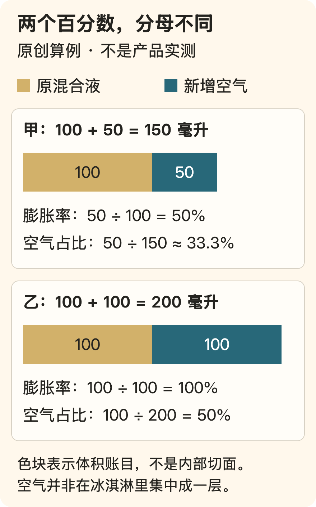

[← 回总目录](../README.md) · [身体与感官](02-senses.md) · [钱与喜欢](06-spending.md)

# 14 · 好吃，不必先换算成别的好处

面包外壳碎开的那一下，汤里还想多闻一会儿的香气，一碗普通面条恰好合意的软硬——这些就是我们想认真谈的东西。

设想你很喜欢一口冰淇淋，却先解释它的蛋白含量；想去吃一碗面，又先解释那家店多么划算。营养和价格都值得问，但为什么“我想吃它”总得借另一个理由才能说出口？

**好吃本身就有价值。知识的任务，是帮你认出喜欢的差别，而不是替你决定什么才配被喜欢。**

这个主张会碰到真正的难题：如果喜欢由自己说了算，专业标准还有什么用？一种做法有历史、工艺和成本上的理由，就意味着你必须爱吃吗？本章从具体食物回答，而不是把所有争论都挡回一句“开心就好”。

你可以顺着读，也可以先选一个问题：

- [一勺冰淇淋](#flavor-ice-cream)：空气怎样参与口感，甜度为什么不能单独决定软硬？
- [一杯咖啡](#flavor-coffee)：浓、苦、萃取得多与合口味，分别在说什么？
- [喜欢与标准](#flavor-coffee-standards)：口味由自己决定，是否还能要求店家认真做？

吃饱、身体条件和照料别人的需要依然在场；本章争取的是让喜欢也有位置，不是让它吞掉其余问题。文中情境与取舍是本书的原创分析，不是试吃报告、餐厅榜单或营养处方。感官基础见[F05](../docs/evidence/F05-flavor.md)，冰淇淋结构见供应商手册记录[F25](../docs/evidence/F25-ice-cream-structure.md)，咖啡实验及勘误见[B29](../docs/evidence/B29-coffee-sensory.md)。

## “味道重一点”，究竟是哪一种重？

“不好吃”“没味道”“很香”，都可以是诚实的感受。但当你想重现喜欢的那一口时，这些词有时还不够具体。

味觉与风味不是完全相同的东西。NIDCD 的感官科普将甜、酸、苦、咸、鲜列为至少五种基本味质；食物的香气、温度、质地以及辣椒灼热感等，也参与整体风味。咀嚼时的香气还能经口腔后部通向鼻腔的路径参与嗅觉。把“风味不够”全部回答成“加盐”，可能是在调错地方。[F05](../docs/evidence/F05-flavor.md)

可以先把一句模糊的要求拆开。这不是专业品鉴考试，而是让下一次选择更接近自己的语言。

| 想改变的部分 | 可以怎样描述 | 不必混成什么 |
| --- | --- | --- |
| 基本味质 | 更酸一点，甜味少一点，鲜味更明显 | “所有味道都再浓一点” |
| 香气 | 喜欢烘烤香、果香，或某种香草的气息 | 只用甜不甜评价整杯饮料 |
| 口中质地 | 想要脆、绵、滑，或更有咀嚼感 | 只比较分量和价格 |
| 温度感受 | 喜欢温热入口，不喜欢过冷或烫口 | 把忍受不适当作会吃 |
| 前后变化 | 入口很好，后面太腻；喜欢留下来的某种香气 | 吃第一口就替整份食物下结论 |

这些描述并不互斥，也不要求每顿饭填表。一句“我喜欢这个香气，但不想这么甜”，已经比“做得高级一点”更有用。

辣也不等于风味的总量。喜欢辣，完全可以就是喜欢辣；不吃辣也不代表少懂了一层生活。不要把能承受的强度，混成感官经验的排名。

## 一勺冰淇淋里，不只有冷和甜

如果把冰淇淋只理解成“甜的奶冻起来”，有些体验就很难说清：为什么一份轻，一份厚？为什么有的容易舀起，有的很硬？为什么同样叫香草，入口却不像同一种东西？

一个有用的起点，是先看它的结构。Tetra Pak 的《Dairy Processing Handbook》把冰淇淋描述为含有空气、脂肪、冰晶和未冻结相的复杂体系。空气以气泡存在；冰晶和气泡分散在未冻结的部分中，脂肪在加工中形成的部分聚集也参与结构。[F25](../docs/evidence/F25-ice-cream-structure.md)

这是设备与加工供应商的技术说明，不是独立消费者试验，也没有替所有冰冻甜品规定唯一配方。不过，它足以纠正一个粗略想象：**冰淇淋不是一整块被调了味的冰。**

可以把入口经历拆成几个问题：

- 舀起时，它是坚实、轻软，还是容易碎成小块？
- 放入口中，是很快散开，还是在舌上停留得更厚？
- 你喜欢的是细滑，还是某种明确的颗粒和咀嚼感？
- 甜味、香气和口中结构，有没有一个正在盖过你真正想要的部分？

这四问是本书提供的描述方式，不是专业感官量表。描述口感与解释成因要分开：坚硬可能与温度和配方有关，颗粒可能来自配料或晶体，入口厚也不能直接等于“奶更多”。

“轻一点、迅速融开”与“浓厚、停留久一点”是两种具体愿望。“给我最好的”却把它们压成了同一条排名。下面的结构知识，要做的正是把这个差别重新展开。

## “膨胀率 100%”，不是一杯里面 100% 都是空气

空气容易触发一种直觉：付钱买食物，怎么可以买到空气？但既然气泡参与形成结构，问题就不能只剩“有没有空气”。要先弄清它在量什么，再问这种结构是否合你口味。

生产中常用的 **overrun（膨胀率）**，比较的是成品相对原料混合液增加了多少体积。手册说明，100% 的膨胀率对应成品约一半体积为空气；这个百分数的分母不是成品总体积。[F25](../docs/evidence/F25-ice-cream-structure.md)

下面是**本书虚构的体积算例**，只为说明两个分母，不代表任何品牌或实测产品。假设体积增加全部来自充入空气，并忽略其他体积变化：

- **膨胀率**＝增加的体积 ÷ 原混合液体积。
- **成品中的空气体积分数**＝空气体积 ÷ 成品总体积。

在这个简化算例中，100 毫升变成 150 毫升：前一个比例是 50%，后一个约为 33.3%；100 毫升变成 200 毫升：前一个是 100%，后一个是 50%。同一份东西，因为分母不同，可以得到不同的百分数。

这不是说空气越多越好，更不是替缺斤短两辩护。售价、标示容量或质量、配方、实际口感都需要分别看；仅凭其中一个比例，不能断言它更高级、更差或更划算。同样体积下的轻重也受整体配方影响，不能把两盒食物掂一掂就完成所有判断。

这个数字解释了体积怎样增加；是否喜欢那种轻盈，还要回到入口的感受。它们是接下来的两个问题，不是一道题的两个答案。

## 甜度相近，为什么仍可能一个硬、一个软？

在冰淇淋中，糖类不只提供甜味，还会影响冻结行为。手册把“相对甜度”和“冻结点降低因子”分成不同列：它们回答的是两个问题，不是同一条刻度。[F25](../docs/evidence/F25-ice-cream-structure.md)

因此，“更甜”和“更容易舀”不能直接互换。比较软硬时，还需要知道配方及温度；只有甜度印象，信息并不够。

这也说明为什么在某份已有配方里直接减去很多糖，不只是把甜味旋钮向左拧。你可能同时改变了成品的结构。是否还能得到想要的结果，需要对应配方的可靠说明与实际检验，不能由本章给出万能替换比例。

回到吃的经验，你的要求就可以具体到：

> “我喜欢它的香气，但今天想要更容易舀、入口更轻的版本。”

喜欢较硬、较厚的人可以提出相反要求。制造手册讨论怎样得到某种结构，食客选择此刻想要哪种结构；**做得出来与值得我吃，是相连但不同的判断。**

## 配料表上的名字，不是口感的全部解释

手册分别讨论乳化剂与稳定剂：前者参与油水界面的组织及脂肪在加工中的变化；后者可以参与水分结合、黏度和冰晶生长控制。它们不是把“口感变好”写成两种陌生名字，而是不同功能类别。[F25](../docs/evidence/F25-ice-cream-structure.md)

但从技术功能跳到一个具体产品，中间还缺成分种类、用量、组合与工艺。知道某类成分能够影响结构，不等于看到标签就知道这杯会有怎样的口感；更不能仅凭“有”或“没有”某类名称，完成对食品安全、营养或个人适用性的判断。

可以把常混在一起的四个问题分开：

| 你在问什么 | 可以先看什么 | 这还没有回答什么 |
| --- | --- | --- |
| 我喜不喜欢吃 | 自己对甜味、香气、软硬、融开过程的感受 | 不能据此检验食品安全 |
| 为什么有这种结构 | 配方、加工与温度相关资料 | 单个成分名称不是完整解释 |
| 我愿不愿意付这个价 | 标明的量、具体偏好及这次消费条件 | 价格本身不是品质证明 |
| 是否符合我的饮食条件 | 产品可靠信息及必要的个体专业判断 | “好吃”不能替代这一层 |

这四个问题各有证据要求。“我喜欢”不能担保产品安全；“这种工艺符合要求”也不能强迫你喜欢。**享乐不需要伪装成专业裁决，专业名词也不该冒充你的快乐。**

## 一杯咖啡，不该考倒喝它的人

设想你点了一杯咖啡，说“太浓了”。对方问你是不是嫌苦，你又觉得不完全是：也许你喜欢那点苦，只是不喜欢它在口中那么厚；也许入口很好，喝到后面才觉得太重。另一个人却认定，淡就意味着没冲好，既然参数正确，你就该再学着喝。

这段对话卡住的地方，不是有人懂得太少，而是几种不同的判断被挤进了一个词。**把饮料做得符合某套要求，和让眼前这个人喜欢，是两项任务。它们可以重合，但不能靠命名强行重合。**

下面的数字不是一套家庭冲煮教程，而是用来拆开这个争论。20克粉与后面的情境均为本书原创示例；定义依据[B29](../docs/evidence/B29-coffee-sensory.md)所读论文的引言、方法和公式1。

### “杯子里有多浓”和“粉里取出了多少”，分母不同

这里说的浓度，是冲好的液体中溶解固形物所占的质量比例，常写作 **TDS**；萃取率 **PE** 则把进入所收集饮液的溶解物质量，与原先投入的咖啡粉质量相比。先不必记缩写，只看它们分别在问哪一个“占多少”。

假设用20克咖啡粉，得到300克饮液，测得TDS为1.2%。那么饮液中溶解物为：

**300 × 1.2% = 3.6克；3.6 ÷ 20 = 18%。**

前一个比例是杯中浓度，后一个是按论文公式算出的萃取率。300克指实际得到的饮液，不是往粉上倒过的全部水。

现在咖啡已经与粉分离，再给整杯加60克水。假定混合均匀，没有洒出、蒸发或其他损失，饮液变成360克，其中仍有3.6克溶解物：

**3.6 ÷ 360 = 1.0%；3.6 ÷ 20仍是18%。**

杯子变淡了，但并没有倒退回去，把已经取出的东西塞回咖啡粉。这说明“淡”不能直接翻译成“萃取得少”。反过来，浓度相同也不能单独告诉你从原先的粉里取出了多大比例，还要知道粉量与所得饮液量。

这个例子只做质量账，不预测加水后每一种香味怎样变化，也不保证更好喝。TDS不是咖啡因含量，更不是整杯物质组成的完整清单。**数字帮我们分清问题，不替舌头交答卷。**

### “更浓”也不等于“所有味道一起变大”

Batali等人在2020年的一项滴滤咖啡实验里，分别改变目标TDS、PE和冲煮温度，再让受训品评员描述样品。结果没有排成一条“所有味道从弱到强”的队伍。

在他们测试的范围里，苦味、涩感和黏稠口感随TDS增加而增强；但黑茶风味的拟合结果，在较低TDS、较高PE的位置更明显。苦味与PE的关系，在相应分析中并未达到统计显著。这里的黑茶是品评描述词，不表示样品真的加入了茶。[B29](../docs/evidence/B29-coffee-sensory.md)

因此，至少对这项实验，不能把“苦”简单等同于“从粉里萃取得太多”，也不能把浓度提高想成给每一种风味统一调高音量。不同特征的相对突出程度会变化；而人想要的，也未必是所有特征都更突出。

这不证明你面前那杯咖啡发生了相同的事。研究只用了一种洪都拉斯水洗阿拉比卡混合品种咖啡、同一批次处理方式和一种商用滴滤设备。拿它替所有豆子、浓缩或冷萃下结论，就又在把一个有限坐标冒充整个世界。

### 精确到几度，不等于已经决定了好坏

这项实验还有个容易被标题带偏的结果：在控制浓度与萃取率后，87、90、93℃三种冲煮温度对整体感官描述的影响较小，温度主效应的多变量检验未达到统计显著。[B29](../docs/evidence/B29-coffee-sensory.md)

但“控制”是有代价的。研究者会调整研磨、粉水比例和水流节奏，以达到相应的浓度与萃取目标；他们不是只改水温、其他一概不动。品评时的入口温度也受控制。

所以可以说：**在这些条件下，不能仅凭冲煮温度高低判定最终感官差别。** 不能说：水温从来不重要；随便把原配方降温都一样；甚至冷的、热的、刚冲的、放了很久的咖啡全都一样。没有检出整体主效应，也不是证明完全相同，来源记录还保留了局部差异。

这项研究不是饮用温度或饮食健康建议。本章也不把实验条件当成让你照做的参数。值得带走的是一种判断：当一个数字被说成好坏的裁判，先问它通过什么过程影响结果，又有哪些条件被同时调整了。

### 研究问的是“像什么、强多少”，不是“你爱哪杯”

这项实验有12名受训品评员，制作了270次冲煮。270不是受试者人数。品评员评价31种感官属性的强度，而不是给“喜欢程度”评分。[B29](../docs/evidence/B29-coffee-sensory.md)

这个区别很要紧。即使两个人一致认为A杯比B杯更苦，也不必一致认为A更好。一个人想要那点苦作中心，另一个人希望它退到后面。他们未必在事实判断上有任何冲突，只是把同一特征放在了不同位置。

原论文讨论了一张传统冲煮控制图：浓与淡、苦与未充分发展、“理想”等词同时出现在图中。可测量的比例、风味描述和价值评价混在一起，容易给人一种错觉——只要进了某个格子，喜欢就应该随之发生。论文对图的讨论是2020年的文本，不是本书对现行行业认证的调查。

我们借这个例子提出的主张是：**一张图可以告诉你在哪里，却不能仅凭把那里命名为“理想”，就宣布你已经到家。** 如果要讨论谁更喜欢，还需要相应的人群与偏好证据；即使有平均偏好，它也不自动成为每个人必须履行的义务。

## 不让标准替我喜欢，是不是就不用认真做了？

不。把“我喜欢”当成所有问题的答案，也会让消费者失去表达不满的办法。

设想你点单时说清楚想要较轻的口感，店里也答应了，最后却给出明显不合要求的东西。店家不能只用“口味主观”取消承诺。你也可以认为一次制作不稳定：昨天与今天不同，而自己要的恰恰是能够重现。此时讨论工艺和测量，不是在给快乐加门槛，而是在帮助愿望被可靠地回应。

可以把四个问题各归其位：

- **做出了什么？** 需要描述、测量与具体材料，不能只靠品牌或姿态。
- **是否符合约定？** 看约定的对象与条件，不由“大家都这么喝”替代。
- **我喜欢什么？** 允许相同描述对应不同偏好，也允许偏好随这次情境改变。
- **我愿意为它付出什么？** 还包含等待、价格、交往与方便，不能由一项风味指标包办。

专业知识在前两项上可以非常有用，也能帮助你理解第三项；但“能提供帮助”与“拥有最后决定权”不同。更具体的愿望可以是：“我想保留这种香气，但口中不要这么厚。”这不是要求对方保证奇迹，只是让双方知道是在讨论哪个差别。

认真辨认、比较、制作，本身也可以是乐趣。问题出在把这些能力倒置成进场资格：必须先学会术语，才准说“这一杯我喜欢”。耍起争取的恰恰是另一种关系：**知识可以把喜欢说得更清楚，不该把喜欢越审越少。**

## 从一碗面开始：不是多加东西，而是知道在改什么

设想两个人吃同一碗面。一个说“汤还不错，就是没劲”，另一个说“我喜欢汤，可面条太软”。如果把两句话都理解成“再放点调料”，第二个人的问题根本没被回应。

再设想你自己连续吃了几口：第一口喜欢汤的香气，后来觉得吃起来太单一。你可能想要的是口感上的对照，而不是更浓的汤；也可能只是这份量已经够了，根本不需要继续改进。

这不是让你对日常食物做实验报告，而是提供一个小小的判断顺序：

1. **先保留已经喜欢的部分。** 不要因为整体不够满意，就把所有变量一起改掉。
2. **再说出一个具体的不满意。** 太软、太甜、香气不对，和“不够特别”不是同一个问题。
3. **只在有意愿时改一处。** 下次选不同口感，或把可选配料分开。没必要为了证明自己会吃，给每顿饭增加复杂度。

同样的方法也适合点菜时沟通。与其让同行的人猜“你想吃点好的”，不如说“我想吃有热汤的”“我今天不想一直嚼很硬的东西”“我想要一口清爽、一口浓一些的对照”。沟通不保证厨师能满足，但至少不再让“好的”承担四个人互不相同的愿望。

## 你要的是一道菜，还是一整顿饭？

一份食物可以单独很好吃，却未必适合这顿饭。

假设你很喜欢一道需要趁热吃、上桌后大家同时动筷的菜。若今晚有人晚到、有人要照料孩子、你们主要想长谈，它可能不是最合适的中心。问题不是菜不好，而是它要求的节奏与这次相聚不同。

反过来，有些食物并不需要成为全场焦点。它可以安静地陪着聊天，允许停下来，也不要求每个人都在同一刻说“真好吃”。这样的合适不是风味上的失败。

选择一顿饭时，可以分别承认三件事：

- **食物本身**：我究竟想吃到什么？
- **这一顿的结构**：是想轮流尝不同东西，还是就想吃足一种喜欢的？
- **共同度过的时间**：今天需要热闹、长谈、安静，还是方便各自离开？

不要让第三件事永远吞掉第一件。为了照顾所有人的方便，你可能又吃了自己完全不想吃的东西。但也别让第一件事独占全部：一位朋友不想尝某种食材，不应成为整顿饭必须解决的“见识问题”。

把偏好提前说出来，是为了给它位置，不是为了宣布别人必须配合。

## “正宗”和“我喜欢”，可以都说清楚

一种做法是不是某个地方常见的做法，涉及具体历史、地域和制作传统，需要相应的材料。它不是靠一句“我从小就这么吃”就能替所有人定案的。

而你喜欢不喜欢，是另一类判断。你可以尊重某种传统的来历，同时不喜欢它的口感；也可以知道一份食物做过本地化调整，仍然很爱吃。

困难常在于两边互相借权：

- 用“这才正宗”要求别人必须喜欢；
- 用“我觉得难吃”否认别人认真保存的传统；
- 用“这是改良”回避自己并不了解改了哪里。

更诚实的表达是：“我不确定它是否符合那个地方的传统，但我喜欢这里的酸味。”“我知道这种质地是做法的一部分，只是它不合我口味。”前一句不冒充知识，后一句不把尊重误解成服从。

**品味可以有来历，但嘴不需要接受资历审查。**

如果你真想知道一道食物的背景，可以去读它的制作与地域材料；本章不会用一套通用术语，假装讲完每一种食物的文化。

## 一张菜单不只有价格，也有你愿意买的差别

价格可以对应食材、工序、服务、位置、空间和经营成本。我们没有具体商家的资料时，不能仅凭贵或便宜推断它在收什么钱，更不能断言某份溢价一定值得。

但你可以问自己的部分：**我愿意为哪一种差别付钱？**

比如，两份食物都符合你当下条件。贵的那份可能有你确实很喜欢、别处暂时吃不到的风味，也可能只是名字更响、桌面更适合拍照。两者都有人愿意买，只是别把后一种愿望伪装成前一种。

还有一种差别是省事：不必备料、不必收拾、不必照顾每个人的口味。你为整段轻松付钱，不意味着你不会算食材成本。反之，自己做也可以很好玩；若你喜欢过程，它并不只是降低餐费的劳务。

本书不把“花得少”当审美道德，也不把“花得多”当生活资格。可负担只是开始，接下来要问的是：这份差别究竟有没有到达你的生活，而不是只到达账单。

## 当你想要的就是那家店，不必用替代品说服自己

家里现有的食物，未必能替代期待很久的一顿。味道之外，你可能还想要某个场面、某段相聚或一个专门为吃饭留下的晚上。承认这些，并不等于你被消费主义彻底控制了。

问题在于，把具体愿望和附加购买分开。你想要的是那道菜，未必也想要套餐里所有升级；你想要一次完整的聚餐，未必需要事后用昂贵照片证明它。

如果现在确实安排不了，可以留下一个真实的计划，也可以决定不再等。没有必要一边吃着替代品，一边命令自己“这明明一样好”。**小份愿望值得满足，大份愿望也值得被准确地叫出名字。**

同样，一次不合口味不一定需要立刻寻找下一家补偿。你可以失望，可以记住哪里不合适，而不必把一个晚上扩展成追回快乐的消费赛。

## 认真吃，也可以不拍、不评、不写出风味轮

描述的能力是可用工具，不是入场券。

有人很喜欢分辨细节，有人最享受的就是一口接一口，不愿再说话。前者不一定更投入，后者也不一定在浪费好东西。你不欠这顿饭一篇能够说服别人的测评。

拍照也不是反面角色。记录食物、交换做法、留下与朋友同桌的画面，都可能是这一顿的乐趣。但当菜必须等所有人拍完才能开始，或者别人的饭不断成为你画面里的道具，就需要把共同节奏重新说清楚。

对感官条件不同的人，也别把“认真”统一理解为闻得更多、尝得更细。有的人分辨香气困难，有的人对某类质地十分不适，还有人只能在特定饮食限制下选择。**可选的少，不等于享受能力低。** 本章的词汇不是诊断工具，也不替代个体所需的专业安排。

## 会不会把吃饭又写成了一项技能竞赛？

确实可能。假如点菜时每个人都得先交一份风味分析，术语就在复制本章反对的门槛。分层、尝陌生食物、学习名字都应该是可用的选择，而不是吃这一顿的资格。前面的算例帮人拆开判断，不要求人每顿饭都计算。

你可以只带走一个区别：想要更香，不一定是想要更咸；想要一顿被照顾的饭，不一定是想要更名贵的食材；想吃熟悉的味道，也不等于放弃新鲜。

然后，在真想吃的时候，吃到它。

**好吃不必最终导向成长。这一顿没有改善未来，却让今天有了滋味，也可以成立。**
