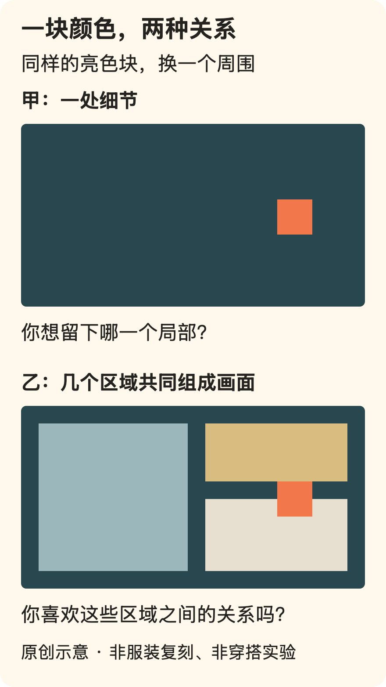
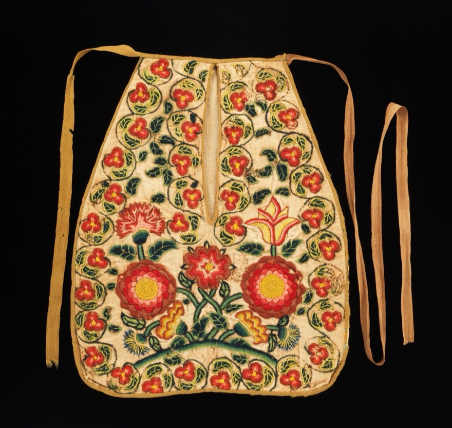

[← 回总目录](../README.md) · [身体与感官](02-senses.md) · [消费与身份](06-spending.md)

# 16 · 衣服是拿来穿的，不是拿来等一个更好的自己

**你可以为了喜欢的颜色、走路时摆动的衣角、今天想呈现的样子而穿衣。不是只有显瘦、得体和经得起别人评价，才算穿对了。**

衣柜里常有两种衣服：经常穿的，以及留给某个未来的自己穿的。后者可能更瘦、更有钱、更会搭配，也可能只是过着一种比现在更值得打扮的生活。

我们想把问题倒过来：如果那件衣服是为你买的，为什么现在的你一直不能使用它？

这不是要求把所有衣服都穿出去。收藏、纪念和欣赏也有价值。问题是，当你确实想穿时，是否总要先修正身体、升级场合，再领取许可。

本章沿四个问题往下走：[好看是否只有修正身体一种](#dress-wishes) → [口袋怎样连接漂亮与行动](#dress-pockets) → [喜欢怎样进入日常](#dress-use) → [别人的眼光能参与到哪一步](#dress-gaze)。可以顺读，也可以从其中一个问题进入。

## 一、想要的好看，只有修正身体这一种吗？

先看愿望怎样被换题，再看色块、斜裁与西装各自提供什么。具体设计的作用，是打开可选择的效果，而不是评选最正确的身体。

### 好看是一个愿望，但不必只有一种好看

你可能想要鲜明，想要松弛，想要利落，也可能想要一点夸张。不同愿望会做出不同选择：醒目的颜色和容易融入人群并非同一个方向；贴合线条和宽松活动也不总是同一件事。

搭配讨论最容易在这里偷换目标：你原本说“我想穿得有意思”，对方回答“这样比较显瘦”；你说“我喜欢宽大的轮廓”，对方说“这不够显身材”。建议可能真诚，却没有回答你的问题。

与其先问别人好不好看，可以先给自己的愿望起一个具体名字：

- 想保留这件衣服本身的形状，不需要通过腰线证明身体比例。
- 想让颜色先出现，而不是让每一件单品都抢着被注意。
- 想在熟悉的穿法里加一个不同细节，而不是彻底换成另一种人。
- 想要穿上之后敢坐、敢走、敢吃饭，不一直维持展示姿势。

这些不是四套正确风格，而是四种不同答案。**别让“更好看”的建议，未经询问就替你改了题目。**

### 不用先懂风格名称，也能看出一套衣服在做什么

下面是本书提供的观察工具，不是普遍审美定律。它们帮助你说清喜欢哪里，而不是给身体打分。

| 看什么 | 具体能看见什么 | 可以改变什么 |
| --- | --- | --- |
| 轮廓 | 整体是直、宽、收拢，还是有明显外扩 | 同样颜色，换一件形状不同的外层 |
| 分段 | 衣摆、袖口、裤脚把整体在哪里截开 | 改一个位置，而不急着换掉整套 |
| 重心 | 目光先落在脸部、上衣、腰间还是鞋上 | 保留一个自己想突出的部分 |
| 色彩关系 | 大面积颜色与小面积颜色如何相邻 | 先换一处颜色，看是否更合意 |
| 质感关系 | 光泽、纹理、柔软或挺括形成什么对照 | 不靠增加单品，也能增加变化 |

比如，一件颜色鲜明的上衣搭配简单下装，可以让它成为重点；同样的上衣配另一件强烈图案，可能变得更热闹。两种都不自动更高级。问题是，你今天想让什么先说话。

又比如，你喜欢宽松的外套，但觉得整套缺少自己想要的清楚感。未必需要把所有衣服都换紧，可以只比较不同长度的内搭，或者让袖口更明确。这里的“清楚”是你想要的效果，不是宽松必须被纠正。

一次只改一处的好处，是比较时较容易知道究竟喜欢了什么。这是试穿方法，不是已经被实验验证的审美训练。你也可以凭直觉一口气换完；穿衣不需要保留实验记录。

### 三件具体衣服：好看，不只有“把身体修正好”这一条路

接下来不是购物推荐，而是看设计怎样形成效果。三个例子分别涉及色块、裁剪和既有着装语言；它们不会告诉你该买哪一种风格，却能让“这件衣服有意思”变得更具体。

作品事实依据博物馆记录；照片只核看指定数字图像，没有接触实物、穿着试验或核验全部细节。[F26](../docs/evidence/F26-clothing-forms.md)

#### 色块可以成为衣服的主角

巴黎 Yves Saint Laurent 博物馆把 1965 年秋冬的一组连衣裙记为向 Piet Mondrian 致意的设计。馆方说明，它使用羊毛针织料的嵌拼，拼接处不显露接缝。这里不是简单把一幅画印在现成衣服上：颜色的安排与衣服怎样被做出来相关。[F26](../docs/evidence/F26-clothing-forms.md)

看馆方标注由 Muriel 穿着、Louis Dalmas 拍摄的那张照片：深色横竖带把衣身分成大小不一的区域，大块红色、浅色区域和下缘的黄色带分别占有位置。裙身没有必须用明显收腰来组织整个正面；矩形关系本身已经提供了可看的东西。

这是对这张图像的描述，不意味着照片显示了背面、内部缝法或真实颜色测量。有关嵌拼的判断来自馆方文字，而不是放大图片后假装看见每一道线。

它提供的启发也不必是“去买一件蒙德里安裙”。可以换成一个更一般的问题：**我想让衣服展示身体轮廓，还是想让衣服自己形成一个画面？** 两种都成立，却会产生不同的选择。

下面的图是本书另画的抽象构图，不是馆藏照片、设计复刻或穿搭效果实验。同样一小块亮色，放进不同的面积关系里，会给你不同的观察问题。

甲图可以问：这个小块是不是我想留下的细节？乙图可以问：我是否喜欢多个区域共同占据画面？它们不是“低调”与“张扬”的人格测验；同一个人今天就可能想要其中一种，明天想要另一种。

把这个思路用于衣柜，可以只是比较外层打开与扣上时露出的颜色面积。不需要再买一个“完成风格”的配件，也不要求原有衣物一定能重现某件历史作品。

#### 柔软的外表，可能来自复杂的构造

V&A 介绍 Madeleine Vionnet 时，强调她对斜裁的运用：裁片方向斜跨织物的经纬组织，以形成贴随身体的垂坠轮廓。页面也提醒，看起来简单的衣服，裁剪与构造可能很复杂。[F26](../docs/evidence/F26-clothing-forms.md)

它与前一个例子形成有意思的对照：你看到的也许不是清楚的平面色块，而是布如何悬挂、折转、覆盖和随身体形成变化。颜色并不是唯一在工作的部分。

具体看馆藏 **T.381-2009，1931 年的一件印花丝雪纺日间连衣裙**。馆方记录它由多块斜裁部分拼成，短披肩与衣身、腰带结合：穿着时将相关部分套过头，再把两端系在腰间，形成覆盖上臂的部分，裙摆并不齐平。不是在一条普通裙子外面随便加一块披肩，就等于它的结构。

核看的正面斜角数字图像，可以看到花纹、覆盖肩臂的布和不齐的下缘；却不足以独立推导完整裁片与内部连接。原样如何活动、重量落在哪里、穿脱是否便利，仍不是一张陈列照能回答的。

这个例子能拆开几个经常混用的词：

- **丝**在说纤维材料；**雪纺**在描述织物类别。
- **印花**在说表面图案；**斜裁**在说裁片与织物方向的关系。
- **披肩、衣身、腰带**在说成衣部件；这些部件还可能在构造上彼此联系。

这些层次可以一起出现，没有哪一个标签能包办整件衣服。不能看见“丝”就知道它会怎样垂，也不能看见“斜裁”就保证它适合所有身体。

更贴近日常的问题是：你喜欢的“飘”“垂”“挺”究竟发生在哪里？是在下摆、袖子还是整件外层？如果只想要一个会动的边缘，未必需要把所有部分都换得很轻；如果喜欢清楚的外轮廓，光换颜色也可能没有回应那个愿望。

理解构造，不是为了把每个人训练成裁缝。它让“这件不适合我”有机会被说成“我想要的动作与它提供的形状不同”，而不总是落回身体哪里需要改正。

#### 西装的语言，可以被重新分配

同一家巴黎博物馆记录，Saint Laurent 在 1966 年秋冬系列中推出其女式 tuxedo。馆方强调，它不是男装的原样复制，而是沿用既有着装符号并调整为女式设计。[F26](../docs/evidence/F26-clothing-forms.md)

指定照片中可辨认出深色外套、长裤、浅色内层和领部系结。我们可以讨论这些元素怎样形成一套与连衣裙不同的晚装表达，却不能把“穿上就获得权力或自信”当成照片证明的效果。

馆方还记述，这套设计最初在高级定制顾客中只卖出一套，而 rive gauche 成衣版本得到不同回应。这个销售叙述没有在本书中独立核查账目，但它至少提醒读者：**一套设计在不同人群和消费条件下的接受，不必同步发生。** 不能把今天被记住的样子倒写成当时所有人立即认同。

这里也不能偷换成“Saint Laurent 发明了女性穿裤子”。一件作品的发表年份，不是整类服装的起点；本章并没有完成女装裤装史。

对今天的读者，值得留下的不是一条关于性别的着装命令，而是发现：自己喜欢的可能是某种线条、搭配关系或正式感，不必先把它归给一种人。领口、裤形和外套可以作为设计选择讨论，而不是拿来检查穿着者够不够像别人期待的身份。

### 欣赏高级定制，不必把它当作生活资格

三个例子来自博物馆，是因为有可核对的记录，不是因为昂贵服装天然值得更多注意。V&A 的资料明确谈到 Vionnet 客户所拥有的财富与社会条件；这些作品不是当年所有人都能享有的日常。

如果省略这一层，只说“她们敢穿，所以你也应该大胆”，就把材料、制作、金钱和社会处境删掉了。我们可以欣赏设计，同时不把历史客户的生活方式当成每个人该追赶的标准。

反过来，也不用因为作品昂贵就拒绝观看。看明白一处嵌拼、一个披肩怎样成为衣身的一部分，或一套搭配怎样借用了另一类服装的语言，不要求你购买它。学习的对象可以很远，得到的观察问题却能回到现有衣服上。

如果你现在就是想买一件认真喜欢的好衣服，这些分析也不负责把愿望降级成“旧衣服凑合一下”。它们应帮助你说出想要的具体差别，避免只为一个故事买单；最后是否购买，仍取决于现实条件和你的偏好。

**审美知识可以增加想象，不该再增加一张入场券。你可以因为懂了构造而更喜欢，也可以懂了以后仍然无感。**

## 二、一只口袋，怎样把漂亮与行动连在一起？

从三个设计转向一件贴身小物：衣服的形状不只供人观看，还参与取物、携带与走动。口袋让我们把实用、装饰和替谁承担东西放在一起讨论。

### 没有口袋，少掉的只是一个装东西的地方吗？

设想一晚：你很喜欢今天这套衣服，走进演出场地时，也喜欢它让自己显得与平时不同。取票要拿手机，递出手机前又得腾一只手；喝的、外套、票据来回换位置。为了保住原先的线条，你没有带包，最后每做一件事都先问同行人：“帮我拿一下？”

这不是说这套衣服不值得穿。有人乐意为喜欢的样子接受这些麻烦，也有人恰好喜欢手里那只包。问题是，评价“这套好不好”时，如果只剩下进门的照片，后面的动作就从账上消失了。

**衣服不只改变你看起来怎样，也改变你能怎样度过这一晚。** 取东西时是否必须停下来，坐下时东西是否需要搬家，离开座位时能否自己带走，都不是衣服以外的杂事。它们会决定你是在继续听歌、聊天、走动，还是不断中断自己的参与。

这仍是本书的虚构场景，不是服装测试或某种穿法的效果数据。它要补的不是一条“出门必须带包”的规定，而是被照片省略的一半：穿着者并不会在快门按下后停止生活。

反过来，方便也不是审美的反面。一只手不用总攥着东西，衣角在行走时能保留你喜欢的摆动，坐下后不用立刻恢复展示姿势，都可以是穿衣本身带来的好感。它们不是先牺牲漂亮、再补偿一点效率。

### 一只约1784年的口袋，把花纹和开口放在一起

大都会艺术博物馆记录了一只约1784年的美国口袋，藏品编号 **2009.300.2241**，材料为棉、羊毛。下面使用馆方开放API所提供的数字图像，不是重新制作的复古商品，也不是本书亲手触摸过的实物。[F66](../docs/evidence/F66-pockets-and-dress.md)

先看三个互相关联、又不相同的部分。

**系带解决“挂在哪里”。** 图片上，两条带子从袋身上缘的两侧伸出。V&A的历史说明介绍，同类系带口袋独立系在腰部，可通过裙子与衬裙的开口取物，不必缝死在一件外衣上。这里用该说明理解一种结构，不凭这张正面照片确认本藏品曾与哪件裙子一起使用。

**竖口解决“怎样进去”。** 图中的开口从上缘向下延伸，却没有把袋身一直切到底。它和袋子的外轮廓不是同一条线：手进入的位置，与东西最后落在的位置，可以分开安排。至于内部有几层、开口在身体动作中怎样张合、装多少东西合适，这张图不能完整回答。

**图案解决的不是容量。** 下半部的大花、四周密集的小花与枝叶形成不同的尺度；竖向开口两侧也保留装饰。我们可以看见储物结构和花纹被安排在同一个物件上，却不能因此推断制作人想表达什么，或者使用者每次摸到它都很快乐。

这件东西有意思，不在于它替“古人更会生活”作证。它让一个过于省事的二分法失效：实用的物件不必只剩下实用，装饰也不必靠取消使用来获得位置。

也别用“口袋很大”直接宣布它能装下一整天。袋口宽度、物件形状、取放路径、承重与身体活动，都不能从正面轮廓算出。历史记录里某些口袋的尺寸，不是眼前这一件的容积，更不是现代手机是否合适的保证。

### 不是“口袋消失了，女人才开始拿包”

V&A的文章把系带口袋放在具体的欧洲服装史中讨论：约1650年至19世纪末广泛使用，有的延续更久。文章同时强调，衣物留存有限，精确起点并不好确定。这个范围不是全世界所有女性服装的共同年表。[F66](../docs/evidence/F66-pockets-and-dress.md)

与今天把口袋理解成衣服内部的一部分不同，这类口袋可以单只、成对或更多地独立系上；换外面的衣服，不一定要连储物部分一起换。馆方还区分穿法：某些正式情境中藏在衬裙下，工作时可能放在围裙内侧、更容易取到的位置。隐蔽与便利在这里要通过不同层次的衣物配合，不是“藏得越深越好”。

最能阻止简单替代故事的，是馆方举出的 **Lady Clapham玩偶，约1690—1700年**。它的成套衣物里既有系带口袋，也有带整合口袋的绗缝衬裙，还有装游戏钱的抽绳袋。这里引用的是馆方记录，本书没有检查玩偶实物或完整衣橱。

这不足以证明当时每个人都有同样丰富的选择，却足以提醒我们：一个人的物品系统可以同时包含几种容器。拿包不自动等于没有口袋，口袋也不必被包彻底取代。它们可以分别承担不同的取用、携带和展示用途。

因此，别把一部复杂的设计史缩成“因为某个行业想多卖包，所以所有女装都取消口袋”。眼前资料没有建立这条统一因果链。对今天某件衣服缺少可用口袋的不满，可以直接讨论那件衣服；它不需要借一个未经核验的历史总解释才成立。

历史给人的不只是“原来以前也有”，还有另一种想象：**储物功能可以被拆出来，使用者未必要在一整套造型之间做非此即彼的选择。** 这是本书据结构作出的启发，不是要求大家复原衬裙和系带。

### 藏起来的花纹，不一定要等别人夸才算数

一件可能藏在外层衣物下的东西，为什么还要装饰得这么认真？

这张照片不能给出历史使用者的答案。它可能被制作、赠送、保管或在特定时刻展示；对具体动机，不能凭花纹编出一段“她只为自己而美”的传记。但这个问题可以回到今天，成为我们自己愿意承担的判断。

如果你喜欢外套内里的颜色，喜欢戴上以后不显眼的小细节，喜欢只有拿取时才露出来的袋子内部，它们的价值不需要等到别人看见才生效。花纹可以是与自己相处的一部分，而不只是一条发向外界的信息。

**漂亮可以是第一人称的感受，不必总是第三人称的评价。** 这不等于“真正自由的人从不在意别人”。你也可以喜欢向朋友展示内里的惊喜，喜欢被认出某个细节。区别在于，回应是否添了一层快乐，还是变成快乐存在的唯一凭证。

同样，不必把不显眼的装饰道德化。它不会因为藏得深就比鲜明的印花更真诚；拍照分享的人也不因此更浅薄。这里是增加一类审美去处，不是用“隐秘高级感”建立新等级，更不是替昂贵内衬编一个购买理由。

在这只口袋里，花纹和使用之间还有一种更有趣的关系：你不一定需要停下所有动作、专门站成一个样子，才与它相遇。打开、取物、收好，都可能成为看见细节的时刻。至于这些时刻是否让你喜欢，仍由实际使用回答，不由博物馆的年代替你决定。

### 有口袋，也不等于这一晚更自由

如果从这个故事得出“口袋越多越好”，我们只不过把显瘦标准换成了容量标准。

口袋的便利要看它与人、物、衣服怎样配合。某处装满以后会不会改变你喜欢的线条？坐下时物品是否顶住身体？东西是自己想带的，还是因为“反正你装得下”就都交给你了？拥有空间和愿意替人承担携带，不是同意过一次就永远绑定的事。

V&A文章提到，历史口袋也存放别人的物品，例如丈夫的手表或工资。这说明“里面有什么”可以包含关系与责任；它没有证明某位携带者因此感到受压迫，也不能被反过来讲成所有携带都是自由的象征。[F66](../docs/evidence/F66-pockets-and-dress.md)

对现代生活，可以把几种方案拆开，而不是直接评优。下面只是本书构造的比较，不是产品性能测试：

| 安排 | 你可能愿意得到什么 | 不能自动忽略的代价 |
| --- | --- | --- |
| 把常用小物放进衣服 | 不必一直手持一个容器 | 轮廓、重量与坐下后的接触；衣服未必为这些物品设计 |
| 单独带一只自己喜欢的包 | 把物品与造型放在同一选择里，换外套时不必逐个搬东西 | 手、肩或其他部位承担携带；取物方式是否方便仍看具体设计 |
| 减少随身物件 | 留下自己想要的轻便 | 必须确认少带的真是可省项，不能把必需品和别人的帮助当作无限后备 |
| 和同行人协商临时分担 | 在明确同意的范围里互相帮忙 | 对方可以拒绝，也不应一直为了你的造型腾不出手 |

这里没有一个方案比另一个更会享乐。关键是，整晚的负担是否真实地进入选择，而不是在拍照时被省略、在使用时由别人补齐。

若你就是喜欢手拿包，可以拿；若你不想拿，也可以要求衣服提供别的可能。**自由不是每件衣服都必须什么都能做，而是不必为了一张好看的照片，偷偷删掉自己想过的晚上。**

### 最强的反对意见：连漂亮都要交实用性作业吗？

不需要。如果你有意选择一种隆重、夸张或需要照顾的造型，也愿意为它多花准备时间，这份不便可能就是你接受的体验条件。不能拿“方便”否决所有盛装，仿佛人只有把行动成本降到最低才算合理。

本章真正反对的是另一个过程：你提出想坐得舒服、想自己取物，得到的回答却是“漂亮本来就要忍”；或者你明明愿意接受某种麻烦，又被要求承认那不是代价、那件东西理应适合任何场合。前者替你决定牺牲，后者不许你说出牺牲。

可以同时保留两句话：“我愿意为这一晚的样子费点事。”以及“换成明天的活动，我不愿意再付这份代价。”不需要为了证明喜欢是真实的，就把一次选择升级成永久身份。

所以，衣服是为了容纳生活，不是只为通勤效率服务；生活里既有走动、取物和坐下，也有想隆重一次、想吸引目光、想穿一件没什么用途却喜欢的东西。**漂亮不需要永远实用，但不便必须有资格被说出来。** 这比“美就值得一切”或“没用就不值得”都多留了一点选择。

## 三、试衣间里的喜欢，能否进入日常生活？

前面说的是这一晚怎样穿，接下来还要看一件衣服怎样与日常相处：动作、材料、洗护与配套需求，都是喜欢进入生活时会遇到的条件。

### 镜子里的合适，与身体里的合适

站着拍一张照片，只回答了一种状态的问题。真正穿一整段时间，还会遇到坐下、抬手、弯腰、走动、取东西、穿脱外套和去洗手间。

试穿时，可以在条件允许的范围里做几个你当天实际需要的动作。别只问尺码标签是否和以往一致，更要看这件具体衣服是否允许你过这一天。

你想参加一场要久坐的活动，就看看坐下后是否一直要调整；你想边走边聊，就留意走动时是否总被鞋或衣摆牵制；你需要自己穿脱，就把扣子、拉链、系带也当作选择的一部分。

不合适未必是身体的问题。剪裁、尺寸、穿法和使用情境，都可能改变感受。**衣服让你一直配合它，不代表你配不上衣服。**

这也不意味着只能选择完全无感的衣物。有时候，你愿意为自己很喜欢的造型接受一点准备或不便。可以做这样的取舍，但要知道牺牲了什么，而不是等不舒服时再用“漂亮就得忍”堵住自己。

### 纤维名字、表面样子与穿着感，不是同一层信息

“羊毛”“丝”“棉”是在说材料；某种织造方式在说材料怎样组织；成衣还包含形状、连接与细节。只记住一个材料名称，不能替你判断整件衣服。

V&A 的织物教学提供了一个直观提醒：其挂毯资料介绍羊毛经纬线，也介绍丝线等材料；手工针织资料则展示针织丝夹克。同一种材料可以进入不同结构，类似外观也不一定来自同一种制作方式。[F07](../docs/evidence/F07-textiles.md)

这里不据此宣布某一种材料必然更透气、更耐用或适合所有季节。要判断一件具体衣服，还需要看它本身，而不是让纤维名称承担整件产品的评价。

可以先描述实际感受：碰到皮肤是什么感觉，走动时怎样垂落，坐下后你是否还愿意继续穿。若想了解技术性能，再查相应产品的可靠资料。不要把“天然”直接翻译成舒服，也不要把“化纤”直接翻译成不好。

标签能帮助理解，不该取代你的身体。

### 维护成本也是穿着体验，不是买完以后才发生的意外

你可能喜欢一件需要认真照料的衣服，也可能很讨厌围绕它安排洗护。二者都合理。重要的是，不只为试衣间里的十分钟购买它。

购物前若能看到完整洗护信息，可以把洗、干、熨以及需要专业处理的条件一并考虑。GINETEX 的说明区分这些过程，并明确强调熨烫条件应依据护理标签，而不是仅凭纤维成分判断。[F08](../docs/evidence/F08-textile-care.md)

本书不提供一张适用于所有衣物的温度速查表，也不把某套符号解释成全球所有标签的统一法律要求。具体衣物的明确说明优先；信息缺失时，向提供方确认，比凭“看起来像某种料子”推断更稳妥。

这里真正影响选择的是：你愿不愿意承担它要求的生活方式？

若你很享受打理，维护可以是喜欢的一部分。若你只想洗完就穿，那种需要反复安排的精致也许不是你的便利。不是你不够会生活，而是购买的条件与日常不相容。

当然，可以为偶尔才穿的衣服保留位置。高频并非唯一价值，一件只在特定时刻让你特别喜欢的衣服，也不必因为“平均每次成本高”而被判不值得。问题仍然是你自己的愿望，而不是一条统一的衣柜效率公式。

### 一件喜欢的衣服，怎样进入现有生活？

设想你已经有一件很喜欢的绿色外套，却总觉得缺一整套配件才能穿。为了它，你又准备换鞋、包、裤子，最后这件外套变成了更大购物计划的入口。

可以先分清：你真的想买一整套，还是只是不习惯看见这件外套与原来的自己同时出现？

拿现有衣服试两种区别明显的搭法，就可能暴露问题。一种让外套成为重点，另一种让它只承担一层颜色。你未必喜欢其中任何一种，但至少能具体知道缺的是什么，而不只是听见“好像还差一点”。

也可能发现，自己喜欢的是这件衣服的图片，而不是穿在身上的经历。承认这一点，不必立刻自责为冲动消费，也不必继续购买更多东西来证明原来的决定没错。

反过来，如果你确实想认真建立一组新搭配，也可以投入。我们反对的不是置装，而是一个从不说明终点、不断要求补齐的“还差一件”。

**喜欢一件衣服，不等于签下了它带来的所有配套订单。**

## 四、别人的眼光，能参与到哪一步？

自己的选择不意味着没有观众。建议、称赞、场合要求和商业承诺都可能参与穿衣；问题是，它们什么时候帮助表达，什么时候替你决定想要什么。

### 给意见之前，先确认对方问的是什么

“你看这样怎么样？”可能是在问颜色，也可能是在担心活动是否方便；有时只是想分享终于敢穿的高兴，并没有邀请一场外形评审。

可以先确认：“你想听搭配意见，还是想知道今晚是否合适？”如果对方要建议，就谈衣服和效果：某处颜色更突出、某个长度更接近他想要的轮廓。不要未经邀请，把回答转成体型、年龄、性别气质或“你应该是什么样的人”。

接受建议的人也可以保留最后选择。别人的眼光能帮你看见一些东西，不自动拥有决定权。你可以说：“这个效果我看见了，但我今天就是想要宽一点。”

穿衣中的现实规范不能假装不存在。工作、仪式、活动可能有具体要求，需要先确认。但满足必要条件，与把所有不成文的审美期待都当成命令，不是同一回事。

我们不承诺“做自己就不会被评价”。更实际的问题是：这次你愿意为哪种表达承担多少被看见的感觉，哪些限制必须处理，哪些评价不值得继续迁就。

### 想被人看见，也不丢人

为了拍照打扮、期待朋友夸一句、喜欢走进人群时被注意，都可以是穿衣的乐趣。非功利不等于毫无观众，也不等于只能独自感受。

值得分清的是，回应在为乐趣加上一层，还是已经成了乐趣获准存在的条件。别人没有注意到，可能会失望，却不必因此把整次穿着判作失败。

同时，不需要把“自我表达”变成每天都要鲜明的义务。你今天想穿熟悉、方便、没有特别故事的衣服，也是在决定自己的生活。显眼不是自由的统一制服。

真正值得留下的，不是一种永远正确的穿法，而是选择的空间：想漂亮时可以漂亮，想夸张时可以试，想普通时也不需要解释为什么没用心。

### 最强的反对意见：这会不会只是让消费更好听？

会。如果所有表达最终都被回答成购买，穿衣自由就很容易变成“你还缺哪件”。

所以本章把观察、试穿、使用和维护放在同一条线上，而不是把购买当唯一动作。你可以重新组合已有衣物，可以修改一处，也可以停止购买不适合自己日常的东西。涉及改衣时，先确认实际可改的范围与代价；不是每件衣服都值得改，也不是所有问题都能靠改解决。

但反消费也不能成为另一种审美规训。你愿意为一件具体喜欢的衣服花钱，不需要先证明它能穿十年，或已经穷尽所有替代品。

**我们不替购买开脱，也不要求喜欢道歉。要留下的是：衣服终于进入你的生活，而不是你一直在等变成适合它的人。**
