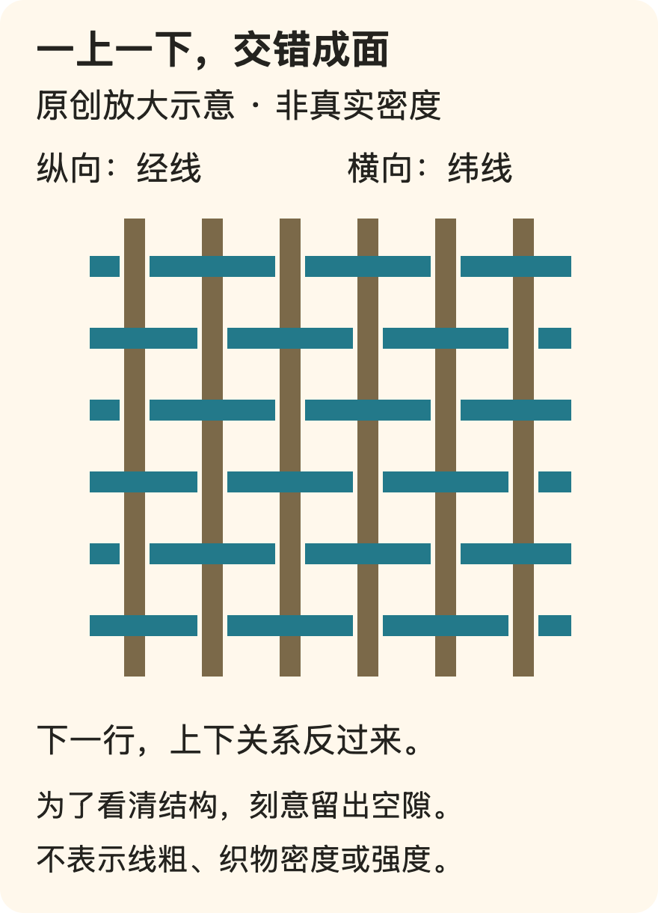
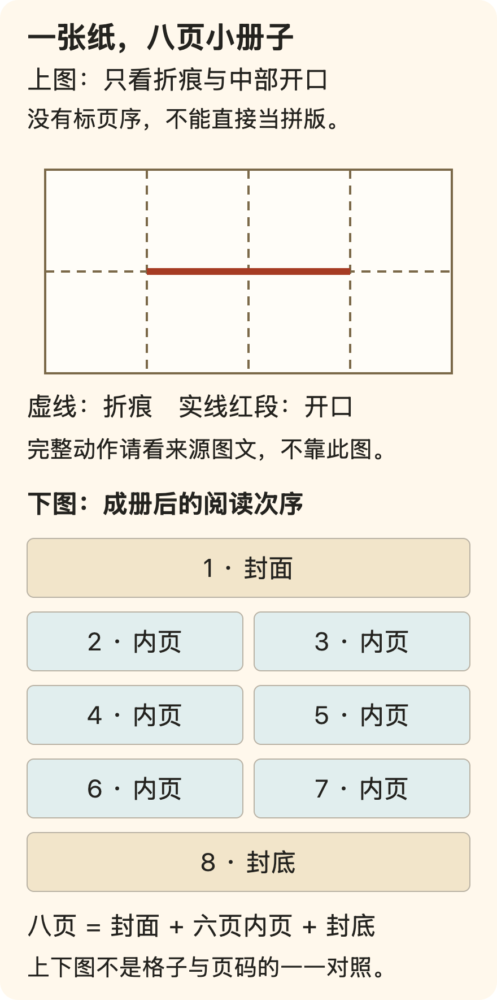
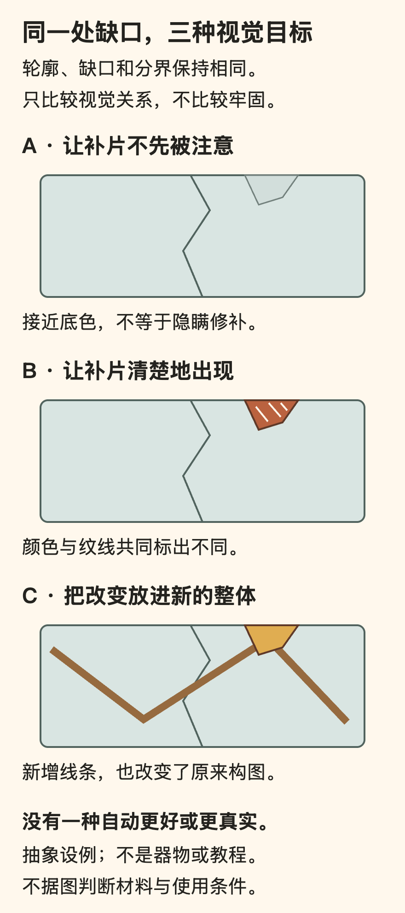

[← 回总目录](../README.md) · [玩得认真](04-play.md) · [爱好不必变成绩](../essays/05-play-is-not-performance.md)

# 17 · 亲手做点东西，不是给自己再找一份工作

**你可以只是想看见：一个东西，因为自己的选择而慢慢变成了另一个样子。**

折出一道线，把几块颜色排在一起，让一段旋律接上下一段，把一块材料变成能拿在手里的东西。制作的乐趣有时就在这种变化里，不必等成品足够精致才开始计算。

可是，一旦认真做起来，另一些问题也会跟进来：这东西有什么用？有没有天赋？以后卖不卖？为什么还没做好？一个本来用来离开工作的晚上，又长出了交付期限、装备预算和同行比较。

本章不反对技能、作品或收入。它想把它们从默认终点改成可选择的方向，让“我就是想做”不必绕路解释成“这对未来有用”。

先看具体内容：[一根线怎样变成一个面](#making-weave) · [不做复杂花样，也能研究一块布](#making-sample) · [一张纸怎样变成一本书](#making-zine) · [手工是不是天然更好](#making-handmade)。

制作也不一定从一件新东西开始：[修好，究竟要恢复什么](#making-repair-goals) · [金色接缝不是一种万能胶](#making-kintsugi) · [为什么修复有时不想让你先看见修补](#making-conservation) · [喜欢旧物，不等于必须把它救回来](#making-repair-choice)。

## 你想得到一件东西，还是想经历它被做出来？

这两个愿望都值得认真对待，但可能需要不同方案。

如果你急需一张能用的桌子，却并不喜欢设计、采购、加工和收拾，那么自己制作未必是你想要的过程。若你正是想亲手做桌子，直接买一张成品也不能完全替代。

还有第三种愿望：想学会某个具体能力。此时重复练习可能比快速完成一件成品更重要；但也不要以学习之名，永远不让自己享受一次完整的制作。

| 这次最在意什么 | 可以怎样判断选择 | 容易答错的地方 |
| --- | --- | --- |
| 得到一个合用的成品 | 成本、时间、可靠性和实际用途 | 把不得不做的劳动美化成爱好 |
| 喜欢制作的过程 | 想亲手参与哪些变化和决定 | 只看成品价格，抹掉过程价值 |
| 学会一种能力 | 今天想弄懂哪一步，怎样获得反馈 | 把每次练习都要求成可展示作品 |
| 与别人一起做 | 每个人想参与什么，怎样分配空间 | 一个人接管，其他人只负责配合 |

这些目标可以重合，也可以换顺序。重要的是，当你不喜欢时，先看看究竟哪一种愿望没得到回应，不要立刻得出“我不适合动手”的总判决。

## 制作的入口，是一个动作，不是整套装备

很多项目可以先从它最吸引你的动作理解：安排、连接、折叠、塑形、重复，还是拆开重来。

喜欢安排的人，可能更想尝试构图与组合；喜欢连接的人，可能享受材料逐渐成为结构；喜欢重复的人，可能喜欢同一种动作逐渐变得熟悉。这里不是给人分类，也不是保证某种活动适合某类人格，只是避免按成品名气替自己选过程。

例如，“我想做一本小册子”还不够具体。你想写内容，排列页面，还是亲手把纸页装成一本？如果只想排版，就不必同时强迫自己学会装订；如果喜欢的是材料接触，完全自动化的模板未必满足你。

先找到想亲手参与的一步，才能判断哪些帮助是便利，哪些帮助反而拿走了你想要的体验。

当然，必要工具并不会凭空消失。这里不把“先开始”解释成用不适合的器材硬做。涉及刀具、热源、粉尘、化学材料或承重结构时，需要可靠的专门说明与适合的条件；本章不替它们提供通用安全认证。

## 一根线怎样变成一个面：颜色不只是画在表面

拿起一块有图案的布，至少可以问两个不同问题：上面画了什么？这些线怎样连在一起？

以 V&A 的挂毯教学为例，经线先张在织机上，纬线在经线之间穿行。最简单的平纹交织，是纬线在相邻经线的上、下交替经过，下一行把交错关系反过来。许多单独的线因此形成一个连在一起的面，而不是先有完整的布，再把颜色涂上去。[F28](../docs/evidence/F28-weaving-and-material.md)

图里故意留出空隙，是为了看清交叉关系。挂毯制作会把纬线压紧，让表面主要显出纬线；不能把这张放大的骨架图当成实物应该有的疏密。线的粗细、间距与压紧程度不是一回事，知道其中一个，也不等于已经知道整块布的手感。

更有意思的是颜色边界。挂毯中的多数纬线不必贯穿整幅宽度，而是在局部经线间往返。左边一块颜色可以先在左边生长，右边另一块颜色在右边生长。V&A 把它称为非连续纬线。[F07](../docs/evidence/F07-textiles.md)

这时，“画一条垂直边界”不再只是选两种颜料的问题：两边的线各自在哪里折回？它们之间怎样连接？V&A 的分步材料展示了两种颜色交接处形成开缝、之后可以缝合的情况。**不是所有换色都必然开缝，而是特定的回转与连接方式会留下这个结果。**

同一材料还把一种过渡方法标为 *hachures*，图里用逐渐收窄的异色色区说明。这里的“混色”并不是把两根不同颜色的线熔成一种新材料；变化来自颜色在结构中的分配。这个简图不足以交代全部细节，但能提供一个起点：图案的表达和制作方法，不能完全分开。[F28](../docs/evidence/F28-weaving-and-material.md)

这也是制作区别于“把成品弄到手”的一个地方。你不只在决定最后看到哪种颜色，还在决定颜色如何通过一连串动作成为表面。那些决定本身，就可能是你想经历的部分。

## 一小块没有用途的试样，可以比一个完整成品更有内容

复杂花样不是唯一能让一块布值得看的东西。

纺织艺术家 Sue Lawty 在 V&A 的 2006 年《Plain Weave》文章里，谈到一块拉菲草试样：她关注均衡交织与纬面组织之间的关系，也关注线材本身怎样影响织物。她描述自己反复被简单平纹吸引，而不是因为身处历史织物之中，就必须不断增加装饰难度。这是她对自己工作的说明，不是关于所有人的学习规律。[F28](../docs/evidence/F28-weaving-and-material.md)

本次核看的那张试样照片，在同一块材料里呈现出不同区域：有的地方间隙清楚、粗细不一的条带比较容易辨认；另一些地方横向线密集叠排。它没有靠换一幅复杂图案才产生变化。照片足以让我们观察这些表面差异，却不能让我们摸到软硬，也不能据此反推出全部织造参数。

你可以带着一个比“它好不好看”更具体的问题去看：**如果没有新的花样，只改线与线的相处方式，表面还会怎样变化？**

这个问题也能改变我们对“半成品”的看法。若原来就想比较两种结构，做出一块能清楚显示差别的小样，可能已经完成了想做的事。强行把它扩成一条围巾，反而可能把最有兴趣的探索变成长时间重复。

下面三个问题可以分别研究，不必塞进同一个成品：

| 想弄清什么 | 观察什么 | 先不要宣布什么 |
| --- | --- | --- |
| 线怎样交叉 | 哪根在上，下一行是否换位 | 只凭表面照片就还原全部构造 |
| 两个色区怎样相接 | 回转位置、连接与是否留缝 | 有缝一定是做坏了，没缝一定更高级 |
| 表面为何变密或变疏 | 线宽、间距与排列的变化 | 看起来厚，就必然更耐用或更保暖 |

这张表是本书整理的观察工具，不是材料测试规程。如果你没有条件或不想织，看图、看一件已有织物，同样可以形成问题；不必买设备来证明自己认真。

反过来，试样也不是必须保存和归档的业绩。你可能只想弄懂那一下，之后拆掉；也可能想留着，因为它记录了一个以前不知道的变化。值得保留的是自己的目的，不是“认真爱好者都有一本样本册”的身份要求。

## 一张纸怎样变成一本书：折痕也在写内容

再看一种完全不同的制作。把同样的八幅小画平铺在桌上，和让它们出现在一本能翻页的小册子里，读者得到的不只是两种包装。

平铺时，所有东西同时可见；成册之后，先看到哪一幅、哪两幅并排、什么时候必须翻页，都会影响阅读次序。内容不只来自你画了什么，也来自你让人怎样看见。

剑桥大学博物馆的地质小志活动，提供艺术家 Kaitlin Ferguson 与 Sedgwick Museum 署名的折叠说明。南澳大利亚博物馆的另一份说明也展示：一张纸折成两行四列的八格，中部留一段开口，再通过折叠形成八页小册子。这里核读的是图文 PDF，没有实际折制，也没有观看活动页的视频。[F29](../docs/evidence/F29-zine-structure.md)

下面是本书重新绘制的结构说明，不是馆方图解的复制，也不是可直接打印填画的页码模板。

最容易弄错的是“八页”的含义。这里的八页包括封面和封底，**不是八页内容之外再加两面封皮**。若第 1 页作为封面，第 8 页作为封底，中间可安排第 2—7 页，共六页；展开阅读时可以把 2—3、4—5、6—7 看作三组跨页。

另一个容易忽略的问题是，摊平时的格子排列，并不等于成册后的阅读次序。不能直接把 1 到 8 从左到右填进去，就假定折好后也会顺着读。有些格子的文字方向也会随折叠改变。

所以，若想自己设计，先照完整说明做一个空白模型、按实际翻阅顺序标页与朝向，再展开检查，比先画满一整张更容易发现排版误解。这是本书的制作建议，不是已经通过用户测试的最优流程；也不把图中的开口线当作独立裁切教程，具体动作需要看原说明。

### 同样六页内容，可以讲两种不同的事

假设你想做一本《楼下那棵树》。这是本书虚构的编辑例子，不是已经发行的小志。

一种安排是**观察册**：2—3 页放树皮和叶子，4—5 页放树影和周边物体，6—7 页放同一位置的两个观察时刻。每组跨页适合并列比较，读者不必等待一个最终谜底。

另一种安排是**小故事**：2—3 页先给一个局部，4—5 页让读者看到它和人的关系，6—7 页再展开全景。此时翻页可以承担信息揭示，不必把每一页都挤满同样多的材料。

这不是故事天然比记录高级，而是它们要读者做不同的事。前者邀请比较，后者邀请等待。改变排列，即使不多画一幅，也可能改变整本小册子的表达。

再想一个更小的选择：一段话是放在画面旁边，还是留到下一页？前者立即给出解释，后者给读者一点先猜的空间。你不需要成为出版人，才能享受这种编排。

### 不想写一本“有用的书”，也能让它有自己的声音

一本小册子可以只收集六个奇怪的门把手、几句没来由的想法，或一个不打算公开的玩笑。它不必成为课程笔记、城市指南或个人品牌。

但“不必有用”不等于“无论怎样安排都完全一样”。标题、留白、次序、是否重复一个形状，仍然会改变作品。你可以认真处理这些选择，只是因为想把它做成自己喜欢的样子。

这里的“认真”不是逼迫每个人升级印刷、纸张和装订。若你喜欢的是在有限空间里安排内容，一张普通纸的限制可能正好提供问题；若你想表现连续的长画面，其他展开方式可能更合适。不要让一种便利格式变成所有表达的标准答案。

这也解释了为什么不是每个制作问题都能靠买材料解决：**纸变贵不会替你决定第二页要让人看到什么。**

## 手工的价值，不需要靠宣布机器没有灵魂来成立

讲到这里，很容易把“材料与过程有意思”推成“只有手工才有价值”。这一步并不成立。

Anni Albers 在基金会收录的一份织造讲稿里，一方面讨论工具、技术与形式的联系，另一方面明确不把实用功能、材料贵重程度或手工／工业生产方式当作艺术的资格线。基金会将此稿标为 1963 年 New Haven 的讲座材料；这里核读的是该网页，不是她的《On Weaving》整本著作。[F28](../docs/evidence/F28-weaving-and-material.md)

这一点与本章很接近：一件东西可以实用，也可以无用；可以手工完成，也可以借助机器。问它有什么意思，需要看具体做了什么，不能只看生产方式的标签。

同一讲稿也赞赏手织相对于当时特定工厂设备的变化空间。这不应被改写成关于今天全部技术的定律。把一个时期、某种设备配置下的比较扩大成“机器永远不能创造”，反而抹掉了她正在认真讨论的具体技术条件。

对我们而言，可以把三个问题拆开：

- **作品怎样形成？** 材料、步骤、工具和参与者分别做了什么。
- **我想参与哪里？** 想亲手作决定，还是更想获得一件成品，或与人一起完成。
- **结果是否回应目的？** 结构、表现或使用是否符合这次想要的东西。

用机器省下不喜欢的重复，可以让人更接近想做的部分；亲手重复同一步，也可能正是某个人喜欢的过程。两者都不必用贬低另一方取得资格。

更重要的是，“手作”并不能替作品免检。想用来承重的东西，需要可靠的结构；想送人的物件，需要考虑对方；想表达一个具体意思的小册子，需要让次序和文字真的承担这个意思。**过程值得享受，与结果可以被批评，并不冲突。**

## “修好了”，究竟恢复了什么？

做东西容易让人想到从无到有。修补却提出另一种问题：它已经有形状、用途和来路，我愿意让什么继续，又准备让什么改变？

设想一本用旧的小册子，封面破了一个角。以下是原创情境，不是古籍修复教程。你可以想让它仍能翻阅，想让封面图案看起来连续，想保留那处缺口而加上新的设计，也可以只把它收好。四种愿望并不相同，不能用一句“修得像新的一样”同时验收。

如果补片遮住了原来最喜欢的一行字，即使外形更完整，也未必回应了你的目的。如果破处仍然清楚可见，但让你重新愿意拿起这本小册子，那处可见的改变也不自动意味着失败。反过来，只把破口描得漂亮，却仍不适合原来的翻阅用途，不能悄悄说成所有问题都解决了。

因此，“修好”至少需要回答：继续用来做什么？希望保留什么？愿意看到什么变化？**功能、外观和来路，是三个有关联但不能互相代答的问题。**

图里三种结果只是视觉关系。接近底色的不因此更牢，显眼的不因此更诚实，改动大也不因此更有创造力。相同的缺口被放进不同表达里，读者看见的整体会变；但修补能否承担实际用途，不能从这张图判断。

还有一个重要区分：让痕迹在日常观看时不抢眼，与隐瞒曾经修补过，不是同一个行为。前者可以是审美目标，后者涉及向别人说明了什么。如果需要交代物件状况，淡化视觉差异不能替代如实说明。

## 金色接缝，不是一种万能胶

金缮很适合被拍成一张漂亮照片，也容易被简化成一句“裂了以后更珍贵”。但若只留下这句话，就会漏掉它真正有意思的制作关系。

Japan House London的工艺介绍把金缮放在使用漆修补陶瓷的语境中：漆参与连接和表面处理，金粉用于表面呈现；它还区分银粉、仅用漆，以及采用其他陶片或木片补缺等不同做法。[F68来源与读取边界](../docs/evidence/F68-repair-and-conservation.md)

这至少说明两件事：看到金色，不等于已经知道内部怎样连接；“修补”也不只有让原来的碎片回到原位一种想法。连接、补缺和表面表达可以互相关联，却不宜压成一个动作。

LACMA的一份修复师访谈给出了更具体的区别。2021年，馆员Abigail Duckor介绍与实习生Supna Kapoor一起做的练习：对象是实习生的私人碗，不是馆藏；连接和填补使用了现代修复材料，漆用于接缝表面，最后用的是黄铜粉而不是金粉。访谈明确说，这是为了练习技能并模拟相近外观的调整流程，不能冒称完整沿用传统工艺。

这不是在揭穿“假的手作”，而是在问：**这次到底练习了什么，又没有复现什么？** 练习笔触、填补形状或表面处理，可以有独立价值；只有把调整后的流程暗中说成另一种材料与历史，才混淆了事实承诺。

本书不把两份机构介绍拼成操作步骤，也不据外观认定修好的器物可以盛食物、受热或承担原用途。页面介绍、课堂练习和具体物件的使用条件，不是一张可以互相代替的通行证。

工艺的来历也值得留出空白。Japan House London明确说准确起源未知，把足利义政因不满金属锔钉而促成新修补法的故事列为后来传说。它可以作为流传的故事来谈，不能因为讲起来完整，就升级为已经核实的发明记录。

## 为什么有的修复，反而不想让你先看见修补？

如果显出接缝可以漂亮，是否所有修补都应当显眼？

LACMA的同一访谈给出一个反方向的目标。Duckor解释，他们并不把练习中的金缮作为馆藏陶瓷的常规处理；许多情况下，希望观众先注意原物的材料和设计，而不是新加的填补。她同时强调处理的可逆性目标，以及在进一步分析时能够辨认干预的必要。这里说的是该访谈描述的修复取向，不是全世界所有修复的统一规则。

这让“看不出来”变得更具体：普通观看时不抢走原作的注意力，不等于连材料分析和记录都要抹掉。外观整合与干预可辨认，可能是不同观看层次上的要求；不是只能在“明显炫耀”与“彻底伪装”之间二选一。

把这个区别带回制作，可以改变我们对成就感的想象。你可能喜欢做出一处让人立刻看见的新设计，也可能喜欢把某个连接、衔接或细节处理得恰到好处，使整体重新顺畅。后一种成果不显眼，不代表没有判断和手艺。

例如，给自己做的小册子调整一张补页，让翻阅的节奏与前后接上；与把补页做成故意打断节奏的插曲，是两种不同的编辑选择。这里仍是原创设例，不是在建议怎样处理珍贵旧书。前者的乐趣可以是“它终于接上了”，后者的乐趣可以是“这里突然出现了另一种声音”。没有必要先宣布哪一种更勇敢，才允许自己喜欢。

**享受制作，不必把自己的每一次介入都做成签名。** 看得出手工，不自动优于看不出手工；显出历史，也不要求让任何一处变化都占据画面中心。

## 一个东西的历史，不能靠一条漂亮裂纹代写

旧物的吸引力，可能来自使用过的痕迹，也可能来自你知道它曾经在哪里。可见的痕迹与可证实的来路，仍然需要分开。

一条修补线可以说明这个表面有过干预，却不会自动告诉你是谁弄坏的、为什么留下它、修补者怀着什么感情。即使你被它打动，也不必替它编造一个主人几代人珍爱的故事。欣赏不会因为承认不知道而失去资格。

对自己的东西，情况也未必简单。某处磨损可能让你想起喜欢的日子，另一些损坏只是麻烦。你可以保留前者、处理后者，不必把一件物品的所有变化都统一解释成岁月的礼物。

还可以承认新做的东西有新的好看。一块特意设计的对比色补片，不需要假装年深日久；一件新作品用了断续的线，也不必宣称曾经历损坏。造型可以借用断裂的关系，历史则不能靠视觉效果伪造。

这与[摄影中的安排与事实承诺](20-photography.md#photo-arranged-presence)相通，但物件还多了一层问题：改造后究竟哪些仍是旧材料，哪些已经被替换？对于私人练习，你可以自由改目标；需要向别人说明时，就应把替换和保留说具体，而不是只剩“重获新生”四个字。

## 喜欢旧物，不等于必须把每件旧物救回来

最强的反对意见是：如果修补有这么多意义，会不会又把享乐变成一份维护工作？原来只想继续用一个杯子，现在却被要求理解工艺、花时间、保留历史，最后还要觉得感动。

这个反对意见成立。修补可能是爱好，也可能是迫不得已的劳动。对没有时间、空间或合适条件的人说“坏了就自己修”，并没有把选择还给他，只是换了一种方式分配任务。

本章因此保留几种不一样的答案：请别人处理、改变用途、妥善收存、停止使用或不再保留。这里不是具体废弃物处理建议，更不据一张照片替器物判定安全；只是拒绝把“亲手救回来”设成喜欢旧物的唯一证明。

设想你在乎的是一只旧纸盒上的手写名字，而不是盒子的盛放功能。保存那块有字的部分，与恢复整个盒子，可能回应不同愿望。你也可能反过来想保住整体，不愿拆分。这个原创例子没有唯一正确答案，它把“究竟舍不得什么”从“一切都要留下”里分开。

如果你想享受修补，就让那段时间属于实际的兴趣：理解怎样连接、选择怎样补缺、决定怎样看见变化。如果只是想得到一个能用的东西，就不必购买一整套关于成长和坚持的故事。**旧东西不必恢复成从未坏过，才配继续被喜欢；人也不必把所有损坏都变成有意义的经历。**

这不是说损坏本身有益，更不把器物工艺转成心理疗效。一次修补可以保住你要的部分，也可以没有成功。承认失去和失败，不会取消此前的喜欢；决定不再投入，也不等于前面的时间全被否定。

## 从教程得到帮助，而不是接受能力审判

一个教程对你不合适，可能因为它省略了步骤、假定你已有工具、没有展示关键角度，或成品和过程之间的差距没有被说清。不能因为别人做得很快，就把自己的卡顿全部归结为笨。

可以先检查三个不同的问题：

1. **信息够不够？** 能不能看见关键动作、材料方向和连接位置，而不是只看见漂亮成品。
2. **前提对不对？** 你的材料、工具和已有技能是否与示范相近；不同前提可能需要不同做法。
3. **目标是否一致？** 你想要一次尝试，对方提供的却可能是专业完成度训练；反过来也一样。

如果找不到合适说明，可以换来源、请教或缩小这次范围。缩小不是把愿望贬低，而是避免在还不知道问题在哪里时，一次投入所有材料。

需要别人帮助时，也可以说明要哪种帮助：“指出我哪一步看反了”，与“替我把它完成”，并不是同一项请求。好的帮助应当尽量保留你想亲手做的那部分。

## 一件歪歪扭扭的成品，为什么可能特别喜欢？

Norton、Mochon 与 Ariely 的研究用组装盒子、折纸和小型积木讨论人们对自制物品的估值。研究中，自己完成制作的人往往愿意为作品付更多钱；完成与未完成等条件也影响结果。[研究 B07](../docs/research.md#b07)

但这篇论文没有证明制作过程总是快乐，也没有证明自己做的一定质量更高。愿付价格和生活满意度不是同一个指标。

对我们更有用的提醒是：**你喜欢它，可以因为你知道它怎么来到这里；别人不知道这段经历，也可以不和你给出同样评价。**

设想你做了一个边缘不齐的纸盒。它让你高兴，因为某个原先想不明白的结构终于接上了。这份喜欢不需要先把边缘说成艺术设计。但如果你要把它送给别人，就还要问对方是否需要，以及是否愿意收下。

不要把投入的时间变成别人必须珍惜的账单。自制礼物的心意可以真实，接收者的使用条件与偏好也同样真实。

## 完成能带来满足，但未完成不是道德失败

B07 里“完成”影响的是特定实验中的估值，不能被拿来要求每个爱好必须结项。实验让参与者中途停止，也不等于现实中有人主动决定“我已经试够了”。

你可以区分三种情况：

- 仍然想做，只是不知道下一步：可能需要清楚的说明或帮助。
- 已经不想做，却因为材料买了很多不敢停：继续未必能让原来的花费变得值得。
- 只想练某一步，原本就不需要成品：没有交出作品，不等于没有经历。

还有一些项目，本来就在反复拆装、修改和探索中得到乐趣。不能从“拆掉后估值较低”推断拆掉就没有价值。你可能想要的是过程，而不是永久保存的物件。

**做完是一种可能的快乐，不是给所有制作盖章的唯一资格。**

## 套件、半成品与从零开始，没有统一鄙视链

套件替你决定了一些材料和步骤，可能减少准备，也可能限制最想发挥的部分。从零开始能多做一些决定，却也意味着更多采购、试错与管理。

选哪一种，可以看你今天想把时间放在哪里。想试一试颜色组合，就未必需要自己制作所有底材；想理解结构，过度预制的材料又可能让关键步骤消失。

这和做饭类似：用现成配料，不会自动取消这顿饭属于你的部分；但若你最想经历的就是那道工序，跳过它也不会因为更高效而更好。

别把“纯手工”当作不需要解释的优越标签。它可以描述过程，也可能只是营销用语。购买课程或材料时，仍需要明确自己会实际参与什么、能带走什么、后续还要承担哪些条件。本书没有核验具体商家的承诺。

## 一起做，别把朋友变成流水线

一个人剪，一个人贴，一个人收拾，可以是自愿分工，也可以是只有组织者真正获得了制作体验。

如果大家原本想一起探索，每个人就需要某些自己的决定。不能为了成品整齐，把新手全部安排到不会出错、也没有选择的边缘步骤。

反过来，有人就是更喜欢辅助，不想独立完成整件作品，也不必强迫他“每一步都亲自体验”。共同制作不是公平地分配每一种动作，而是让每个人清楚并愿意承担自己的部分。

可以先区分这次是在共同完成一件作品，还是各自制作、彼此陪伴。前者需要讨论同一成品的方向，后者允许不同速度和不同完成度。把两者混在一起，最容易出现“你怎么还没做完”和“你为什么擅自改了我的部分”。

收拾也应算进共同安排。若制作的快乐属于所有人，整理工具、处理材料和恢复空间就不应总落到最后那个不忍心离开的人身上。

## 爱好变成副业，是另一个选择，不是自动升级

你做得越来越好，别人开始问能不能买。开心、好奇和犹豫都可能出现。

可以先看到变化：给自己做，可以随时改方向；接受订单，通常就会多出规格、时间和对他人的承诺。你可能喜欢这些新要求，也可能发现它们正好拿走了原来的乐趣。

这不是劝退赚钱，更不是赞美不计成本。只是别让一次夸奖自动变成商业计划，也别因为一个爱好始终没有收入，就觉得它没有发展。

如果你愿意试着出售，应把这当作另一项需要了解规则与责任的活动。本章不提供经营、税务或产品合规建议。**喜欢做一件东西，与喜欢经营围绕它的事务，需要分别确认。**

## 最强的反对意见：只是玩，会不会永远没有真正作品？

有可能。并不是所有轻松尝试都会自然长成成熟能力。本书不许诺只靠随性就能达到任何水平。

但这不构成要求每个人追求成熟作品的理由。愿意练习的人可以认真练，愿意反复挑战的人可以投入；暂时只想体验的人，也不必用未来成就为今天付款。

真正需要诚实的是：你现在到底想要什么？如果想做出一件自己满意的作品，就接受可能需要练习与返工；如果只是想经历材料在手中变化，就别因为它没有市场价值而抹掉这段时间。

**亲手做的东西未必更便宜、更好用、更能卖。你仍然可以选择制作，因为那段经历不是多余的生产成本，而是你要过的生活。**
