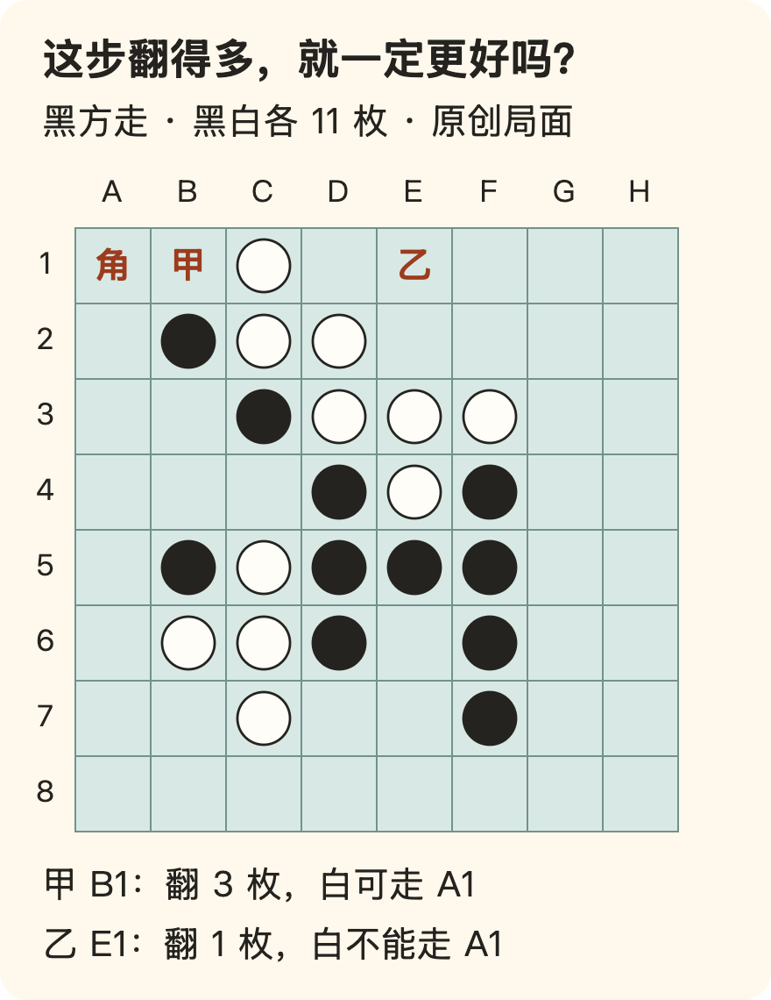

[← 回总目录](../README.md) · [玩得认真](04-play.md) · [消费与身份](06-spending.md)

# 19 · 我花钱，不只是为了赢，也是为了遇到喜欢的麻烦

**一款游戏值得玩，可以因为你想待在里面，不必因为它训练了大脑、拓展了人脉，或者终于被你“清掉”了。**

有时你喜欢的是一次刚好躲开的攻击，有时是一座慢慢建起来的城市，有时是与朋友配合成功之后的笑。它们不是同一种快乐，也不需要换算成同一种成果。

但游戏也可能把这些愿望和另外一些东西绑在一起：每日任务、收集进度、限时奖励、不能暂停的对局、已经买下却迟迟没打开的库存。你本来想玩，后来却只记得还有什么没完成。

如果只想拿到一个“胜利”字样，最省事的办法是直接把它写在屏幕上。但那不会自动替代一局棋、一次合作或一场自己想参与的挑战。**游戏里的障碍，有时不是快乐的反面，而是快乐的材料。**

本章不教你做“最合格的玩家”。我们要分清：哪些规则让这段时间有意思，哪些要求只是占住了它。先从[黑白棋的一步选择](#games-othello)与[《花火》的一条提示](#games-hanabi)看具体差别，再讨论[随机发生在选择之前还是之后](#games-uncertainty)、[限制与共同规则](#games-chosen-rules)及[为什么不把赢交给别人](#games-delegation)。

## 先问想经历什么，不急着问哪款评分最高

“想找个好游戏”还少了半句话：你想在其中做什么？

同样叫探索，有人喜欢发现景色，有人喜欢自己推断地图，有人喜欢到处收集；同样叫策略，有人喜欢慢慢规划，有人喜欢在信息不全时冒险。一个口碑很好的作品，也可能把你最喜欢的部分放得很少。

下面是选游戏时的观察角度，不是人格分类，也不是推荐榜单。

| 想要的经历 | 可以观察什么 | 可能不合意的代价 |
| --- | --- | --- |
| 掌握一个动作 | 输入与反馈是否清楚，失败后能否再试 | 大量等待、重复赶路或操作负担 |
| 做有分量的选择 | 不同选择是否改变后续局面 | 你只想轻松时，却需持续计算 |
| 进入一个世界 | 场景、声音、人物和探索节奏 | 只想走走，却不断被强制战斗打断 |
| 创造一个东西 | 能否按自己的方向建造、组合或表达 | 前期积累远多于真正创作 |
| 经历一个故事 | 对话、情节、节奏是否吸引你 | 想知道后续，却不喜欢推进所需的操作 |
| 与人共同参与 | 怎样分工，失误后怎样回应 | 只想一起玩，却被要求随时在线 |

宣传片适合看气质，不一定能回答“多数时间在做什么”。如果有可用的实际游玩片段、试玩或说明，可以留意平常的一段，而不只看最精彩的十秒。具体版本、设备要求、语言与辅助选项仍需核实；本章不列实时游戏推荐。

**别人说它神作，回答的是别人的经历；你要找的是自己愿意参与的过程。**

## 看懂一点机制，能把“爽”和“不好玩”说具体

这里说的机制，是你能做什么、会得到什么反馈，以及这次选择如何改变下一次选择。它不是只供评测者使用的术语。

例如，一个虚构的探索游戏让你在岔路口选择：亮着灯的道路容易走，黑暗道路可能有陌生景色。若两条路只是外观不同，乐趣可能在观看；若选一条就暂时失去另一条，取舍本身也进入了体验；若走错就要重复很长一段，失败成本又成为另一层。

同样的“探索”，由此可能变成三种游戏。你不喜欢重复赶路，不等于不喜欢未知；你喜欢风景，也不一定喜欢在资源紧缺时做判断。

还可以留意反馈来自哪里：是你终于掌握了一个动作，是发现一条此前看不见的关系，还是界面不断发放新的数字和徽章？它们都可能令人愉快，但不必混称为同一种满足。

理解这些区别之后，评价可以从“这个游戏太无聊”变成“我喜欢它的选择，但不想把大部分时间用在等待结果”。这样的描述更能帮助下一次选择，也更容易和偏好不同的朋友讨论。

## 黑白棋：翻得更多，为什么还不能宣布这步更好？

用一个具体棋局看“眼前奖励”和“后续局面”的差别。这里采用 World Othello Federation（WOF）公布的 Othello 规则：落下一枚自己的棋子，沿直线夹住对方连续的棋子，把本次落子直接夹住的全部棋子翻面。不能隔着空格或自己的棋子接着翻，也不会因刚翻好的棋子再触发连锁翻面。终局比较的是盘上双方棋子数量，不是过程中某一次翻了多少。[规则与原创算例见 F42](../docs/evidence/F42-othello-choice.md)。

以下局面不是名局、高手推荐或实战记录。它由本书构造，并从标准开局逐步检查了合法性；黑方接着走。图中只挑两步比较，不表示黑方只有两种合法选择。

| 从同一个局面出发 | 黑方落子后立即得到什么 | 白方下一手的 A1 |
| --- | --- | --- |
| 甲：黑下 B1 | 翻 C2、D3、E4，共 3 枚；盘上黑 15、白 8 | 可以下，沿 A1—B1—C1 夹住并翻回 B1 |
| 乙：黑下 E1 | 翻 D2，共 1 枚；盘上黑 13、白 10 | 不能下：没有从 A1 出发、满足夹住条件的直线 |

看甲时，可以先沿 B1 向右下看：C2、D3、E4 是连续白棋，F5 是黑棋，所以这三枚会翻黑。接着看顶行：B1 变黑，C1 仍白，白方便能从空着的 A1 下子，把 B1 夹在中间。**这步的收获，同时改变了对方下一步能做什么。**

为什么特地注意角？按这里的规则，角格不会夹在同一直线上的两枚对方棋子之间，因此角上的棋子一旦落定就不能被翻走。这是从棋盘边界与翻子规则推得的性质，不是说“得到一个角就必胜”。盘面还有其他角、边、空格和可行步骤。

同样，表格没有证明乙是最优解。它只验证了即时翻子数和下一手 A1 的合法性；没有穷举到终局，没有评估全部候选，也没有证明黑下甲一定输。你可以喜欢甲带来的局面，但不能只拿“翻了三枚而不是一枚”当完整理由。

这个例子让“策略”不再只是一个品类标签。乐趣可能出现在你突然发现：原来一枚棋子既是分数，也是别人的落脚条件；我拿到的东西，会改变下一次争夺的形状。

这不是要求玩家每步都算清。也不意味着所有快乐都必须推迟到胜利之后：**眼下看懂一条关系、选定一个想法、等对方回应，本身就发生在当下。** 愿意为后续局面暂时少翻几枚，与“把今天全部牺牲给未来”不是同一个命题。你是在享受一个跨过几步的过程，不必把每步的即时数字最大化。

若你就是喜欢翻一大片的爽感，也可以承认那是你的偏好。只是朋友约的是按终局胜负对弈时，偏好不能改写计分规则；想另开一局“比谁这步翻得多”的变体，则应先说明那已经是不同的游戏。

## 《花火》：为什么知道同伴的牌，却不能替他打出去？

另一种麻烦，不来自对手，而来自信息没有集中在同一个人手里。

Antoine Bauza 设计的 Hanabi，本文称《花火》，在 R&R Games 的英文基本规则中，让玩家共同按颜色、数字顺序完成烟花。特别之处是：**你看得到别人的手牌，却看不到自己的。** 轮到你时，要在给提示、弃牌、出牌中选一个动作；提示也不能随便说，必须花一个可用提示标记，指出同伴手里某一种颜色或某一个数字的全部对应牌。[采用版本与核读范围见 F43](../docs/evidence/F43-hanabi-information.md)。

下面不是照抄规则书的图例，而是本书自设的三人局瞬间。假设轮到甲，乙的五张手牌按甲看到的顺序是：

**红 1｜蓝 1｜红 3｜绿 2｜白 5**

再假设各色尚未开始，桌上还有可用提示标记，乙此前没有收到有关这些牌的信息，也未从其他公开信息排除牌的可能性。现在甲可以给怎样的提示？

- 如果说“这些是红色”，要同时指出第 1、3 张，不能为了诱导乙先打第 1 张而只指其中一张。
- 如果说“这些是 1”，要同时指出第 1、2 张。乙由此知道它们可以作为相应颜色序列的起点，但仍不一定知道各自颜色。
- 不能把“第 1 张是红 1”算成同一次基本提示，因为这同时给了颜色和数字。
- 也不能凭空提示一个乙手里没有的类别。此版规则要求指出实际对应的牌。

同一手牌，“红色”与“1”都是真信息，却留下不同的问题。前者告诉乙两张牌的颜色，但红 1 与红 3 此时不是同样可出的；后者直接缩小了“能不能开始一列”的疑问，却未说明颜色。**信息的价值，不只看它是否正确，还要看它让接收者能分清什么。**

完整提示还包含“没指到”的信息。甲说红色并指第 1、3 张时，乙也能排除第 2、4、5 张是红色；如果可以随便漏指，这层推断就不成立。这是规则改变思考的一个小例子：一句话没有变长，它的边界却让沉默的部分也有了意义。

“可以出”说的是提示当时的空序列。若之后有人已经打出某色的 1，下一次出牌就要重新判断，不能把一句提示永久理解为“这两张随时都能出”。提示、本人知道什么、当前局面，仍是三个不同的东西。

这里没有算出最优提示。为了突出区别，我们只设定了一个局部；完整选择还与甲、丙的手牌、已有提示、剩余牌、回合位置和共同约定有关。别把这个教学例子冒充完整局势中的必胜策略。

而且，“给一句话”在游戏里是一个动作，不是免费附赠。甲选择提示，便没有在同一回合出牌；提示标记用完时，不能继续做这个动作。弃牌能补回一个标记，但又要从有限的牌里放弃一张。源规则还规定：所有提示标记都在桌上时不能弃牌。因而“继续给提示就好了”并不是无限可用的答案。

这就把合作从一句“大家互相帮助”变成具体关系：我愿意把自己的回合交给一条你需要的信息，却仍要让你根据自己的所知行动。配合的快乐，可能不是某位高手总能下命令，而是你发现对方终于接住了你想传递的区别。

当然，限制信息也可能让人烦躁。有人不喜欢记忆负担，不喜欢同伴的犹豫，不喜欢明明看见正确牌却不能直说。那不代表他不善合作，只表示这套合作方式未必合意。

## 去掉限制，可以更轻松，也可能换了一种乐趣

如果把《花火》的牌全部摊给本人看，再让一个人决定全桌怎么走，完成目标也许更容易讨论；但“别人知道、我不知道，而我们得有限地沟通”这件事就变了。不能一面删掉它，一面要求原有的推断关系仍原封不动。

这不是“规则神圣不可改”。采用的 R&R 规则书在严格通信限制之外，也明确允许玩家约定适合自己的通信方式，举了提醒之类的例子。**原规则、共同商定的变体、没说出口的暗号，必须分开。** 前两者可以清楚选择；第三者若只有老玩家知道，新手便未必是在同样条件下参与。

例如，某桌长期约定“只提示一张时通常希望你马上出”，这是玩家约定的额外解释，不是卡面上已经写了“可出”。如果新人只学了颜色和数字，却被要求自动理解这个意思，失误就不能全算他的。

相反，一群人确实喜欢反复配合、形成共同习惯，也可以把它当这桌的乐趣。问题不是“有默契”是否正宗，而是每个人是否知道自己进入了怎样的沟通方式。要参加赛事或采用特定组织规则时，还需另行核对，不能把私人变体称为赛事许可。

这也解释了为什么“为新手解释规则”和“替新手完成选择”不同：解释让他知道自己的行动怎样生效，接管则拿走了行动。你可以问他要规则说明、提示还是完整建议，而不是把一切帮助都写成“为了团队得分所以你照做”。

**耍起不要求世界没有阻力；它要求我们仍能认领自己想面对哪一种阻力。** 喜欢推断不等于喜欢被吼，喜欢竞争不等于喜欢被羞辱，喜欢困难也不等于喜欢不明不白地受罚。这些不是同一笔代价。

## 先抽到问题，和先作决定再抽结果，不是一种悬念

黑白棋的这个局面没有掷骰子，仍然不容易看透，因为对方会选择，你也算不完所有后续。《花火》有洗牌带来的变化，却又把一部分实际牌面给别人看、不给本人看。两者都不确定，但不确定来自不同地方。

还可以用两个不对应商业作品的原创小例子，分开随机发生的时点：

1. **先揭示，再选择。** 系统先给出本轮三块可用拼片，你看到形状后决定把哪块放在哪里。下一轮会来什么未知，但本轮选择面对的是已知材料。
2. **先选择，再揭示。** 你先决定把一块拼片放到哪片区域，再揭开那里的隐藏要求，结果可能符合，也可能不符合。

第一种主要让你适应已经给出的条件；第二种让你在决定之后等待一个尚未揭晓的条件。它们都可能容纳判断，不能把前者简单叫“纯技术”、后者简单叫“纯运气”。如果隐藏要求能由先前线索推测，第二种又不同于毫无线索的抽签。

设计也可能把两者放在同一局里。这里的分法不是完整游戏分类，只帮助我们把一句“随机性太大”说准确：你是不想每局材料重复，还是不想一个想好的选择被最后一次抽取推翻？你想要惊喜，还是想要可追究的反馈？

也别把随机当成对所有人都公平的保证。规则机会是否相同、玩家知道多少、失败代价落在谁身上，是不同的问题。玩出紧张感不需要把真实金钱输赢加进去，本章也不讨论下注、抽取付费或赌博策略。

## 输赢与选择质量，可以分开看

在包含随机结果的游戏里，好决定未必每次都赢。反过来，赢了也未必说明当时考虑得周全。

设想一个只用于说明的选择：你知道某条路线更符合当前目标，却因为这一次偶然失败，就认定下次必须完全反过来。这可能把运气当成了全部反馈。若你想提高，可以回到作决定时知道的信息；若你只是想享受起伏，也可以不把每次输赢当成能力评估。

对于公平的要求也应说清：是希望双方遵守同一规则，还是希望每次结果都接近？规则相同的游戏，未必让经验差异很大的两个人都玩得有意思。可以选择合作、轮换、约定让步，或换一种双方愿意参与的模式，而不是只剩“输不起”和“你必须让我”。

但若大家同意参加正式竞赛，就需要尊重事先约定的条件，不能输了之后临时改变规则。**玩得开心不是取消约定，而是知道自己答应参加的究竟是什么。**

## 规则不是快乐的敌人，但每条规则都值得认领

棋类的轮流行动、竞速的赛道、解谜的信息限制，都可能让选择变得有意思。没有阻力不一定更好玩；不能马上得到，也可能正是期待的一部分。

可以区分三种要求：

1. **构成体验的规则**：去掉以后，你想玩的东西本身就变了。
2. **支撑共同参与的约定**：例如约好的开局时间、比赛规则、队友分工。
3. **围绕体验增加的任务**：例如某项可选收集、一个你不喜欢的每日流程。

分类没有统一答案。有人认真享受完整收集，那就不是多余；有人喜欢每天回来维护一个虚拟地方，也不必被嘲笑。但“系统写了目标”和“我想要这个目标”仍然是两件事。

设想一个虚构场景：你喜欢游戏中的建造，今晚却全部花在完成不喜欢的任务，好领取一件装饰。可以具体问：这件装饰值得这段过程吗？不用回答整个游戏好不好，只需要回答这次交换愿不愿意。

## 难度不是一条从“不配”到“厉害”的刻度

“简单、普通、困难”常常把多种负担装进一个词：反应速度、精细操作、线索多少、资源稀缺、失败损失、记忆与计算。你可能喜欢复杂推理，同时不喜欢反复快速按键。

微软 Xbox 无障碍指南 108 正是把这些问题分开：它讨论整体难度，也建议让不同机制分别调整，并指出故事、美术可以是玩家进入游戏的主要理由。[F09](../docs/evidence/F09-game-difficulty.md)

这是面向开发者的设计指导，不代表每款游戏都提供这些设置，更不保证调整后人人满意。它给玩家的启发是：遇到困难时，先说清究竟是哪一种困难，而不是先给自己判一句“太菜”。

如果作品支持，你可以保留解谜难度，只调整操作辅助；或者保留失败惩罚，降低反复重来的成本。若作品不支持，也可以决定这是否还是自己想付出的代价。放下一个不合适的作品，不等于否认它对其他人的价值。

同时，创作模式不总是原模式的“简单版”。当资源、目标和规则一起改变，体验也改变了。想要原有生存挑战的人，未必能由自由建造替代；想创造的人，也不必先通过生存考试。

## 失败有时很有趣，有时只是拖长了不喜欢的部分

值得再试的失败，往往能让你说出下一次想改变什么：晚一点行动、先观察另一条路线、换一种资源分配。即使仍然没赢，你也在参与问题。

另一种失败则只留下漫长等待，或者你已经知道答案，却必须反复经过不喜欢的步骤。它是否值得，不能只由“通关的人都这么过来的”决定。

这不是经过实验验证的通用判断法，而是一个阅读自己体验的方式：**下一次尝试让我好奇，还是只让我想把前面的付出追回来？**

有人享受高强度练习，愿意为一个动作反复磨；有人只想知道故事结局。两者需要不同安排。别一边追求熟练，一边期待完全没有挫折；也别一边只想看故事，一边强迫自己证明具备另一种能力。

## 攻略应该解决你想解决的问题，而不是替你玩完

同一句“卡住了”，可能意味着没看懂规则、不知道操作、漏了线索，或只是暂时没想到解法。

需要帮助时，可以先决定想知道多少：规则解释、一句提示、下一步，还是完整解答。这样既不必把查攻略当作弊，也不会因为一个过量答案失去原本想经历的发现。

反过来，如果你完全不享受某类谜题，直接看解答也可以是清楚的选择。作品并没有因此被你“白玩”。但在共同解谜时，知道答案的人最好先问其他人要不要听；自己不在意剧透，不能替同伴决定。

攻略与辅助也有边界：单人体验中的自选调整，与违反多人规则获得不公平优势不是同一回事。本书支持调整个人体验，不支持以自己的快乐为由破坏别人同意参加的游戏。

## 一次游玩的成本，比屏幕上的时长更完整

有些游戏十分钟能推进一点，有些需要先进入状态，再维持一段不可中断的过程。还可能涉及下载、更新、排队、教程、找队友、准备设备和收尾。

因此，“我有一个小时”不自动等于“能参加一个预计一小时的局”。如果接下来有必须回应的事情，需要先了解能不能暂停、保存、退出，以及退出是否会让具体的人承担代价。

这不是把所有游戏都缩短成碎片。恰恰相反：你很想认真进入一个世界，可以为它留下一整段时间，而不是永远只在等别人的间隙打开。更完整地看成本，是为了让投入成为选择，不是为了证明长时间玩一定有错。

**游戏可以得到一个完整晚上，不必只领取日程表里没人要的边角。**

## 如果只是想赢，为什么不让别人替我走？

这是“及时享乐”必须认真回答的问题。既然更快得到想要的结果通常省事，为什么游戏里有时宁愿绕远路、自己思考、自己失误？

因为想要的可能不是孤立的结果，而是**自己参与结果形成的过程**。看别人下出漂亮一步，与自己在局面里认出那步，都可能有乐趣，但并不互相替代。队友替你作了全部决定，再把胜利记在你名下，未必给到了你原本想要的东西。

因此，本书不会把“即时满足”理解为每一分钟都必须拿到最大数字。选择、尝试、等待、猜错之后理解一点东西，可以共同构成一个当下正在经历的过程。像一首歌不必每秒都是副歌，一局游戏也不必每步都发奖励。

这个辩护也有边界：不能只要把枯燥段落叫作“铺垫”，它就自动值得。若你已经不想参与，只为了拿到最后一个徽章继续忍受，仍可重新问自己：想要的是过程、结局、收藏，还是不愿承认之前没那么喜欢？

也不强迫人人亲手参与。看直播、观赛、旁观朋友游玩，可能正好给你想要的声音、故事、技艺或陪伴。这里没有“亲自操作才是真玩家”的资格线；只有一个区别：**别把一种体验替你换成另一种，再说结果一样，所以你应该满意。**

## 游戏库不是欠债单，价格也不是必须耗掉的小时

你买了十款游戏，不代表此后欠十次通关。购买时的期待、实际体验与现在的兴趣可能不同；继续玩一个不喜欢的作品，不会自动让过去的支出变聪明。

“每小时成本”能回答一种价格问题，却回答不了全部价值。一个短作品可能留下很具体的体验，一个长作品也可能只是你不愿承认不喜欢。反过来，反复玩同一款也不天然低级：你可能珍惜熟悉、技艺或共同历史，而不是一直追新。

购买虚拟物品时，可以分别问：它改变外观、实际玩法，还是通向下一次随机机会？你想要的是明确获得的内容，还是正在等待一个不能保证的结果？这里不提供抽取策略、收益预测或消费保证。

如果付费只是为了跳过一段你一直讨厌的过程，还可以多问一句：跳过以后，剩下的确实是我想要的吗？有时答案是肯定的；有时那笔钱只是让你更难离开。

## 大样本研究没有替“越多越好”背书

Vuorre 等人的研究结合七款游戏的厂商游玩记录与三轮问卷，分析了 38,935 名成年活跃玩家。其模型里，增加游玩时长与随后情绪、生活满意度的平均关系很小，区间包含零。[B09](../docs/research.md#b09)

但这不是随机分配人去玩，也不是对所有游戏和人群的安全认证。参与者自愿报名，缺失与退出可能影响结果；研究主要看两周尺度的关系，既不能充分回答几分钟内的快乐，也不能排除更长期或特定人群的代价。[阅读记录](../docs/evidence/B09-games.md)

动机方面的结果也不能缩成“自愿玩必然幸福”：部分区间仍包含零，改变动机并未被随机实验验证。

对本章而言，重要的不是拿研究为游戏开无条件通行证，而是拒绝只按小时做道德结算。喜欢什么、失去了什么、能否自主决定，仍需回到具体生活。

## 最强的反对意见：这会不会只是给停不下来找理由？

如果“不需要证明有用”被偷换成“不需要面对任何代价”，这个担心成立。

没有产出，与持续破坏自己珍视的生活不是一回事。你不必因一个晚上没工作而自责；但如果明明想停却反复做不到，或者总在隐瞒支出、失约后让别人补位，就不能只用“别人不懂我的爱好”结束讨论。这里不据时长诊断疾病；困扰持续且难以调整时，可以寻求合适的专业支持。

本章也不要求每次游玩都写复盘。大多数时候，喜欢就可以继续，不喜欢就可以换。只有当体验开始与自己的愿望冲突时，才需要认真拆开看。

**我们要捍卫的是玩游戏的自由，不是必须继续玩下去的义务。**

如果喜欢的是找线索与想通的过程，另见[答案越快，未必越好玩](32-puzzles.md)：具体讨论提示、唯一解、错误的“啊哈”和合作时谁来决定揭晓。

如果想参与一个共同展开的故事，另见[角色可以倒霉，玩家不必受气](34-shared-stories.md)：骰子决定什么，角色为什么会主动惹麻烦，主持权与真人停止权又为什么不同。

黑白棋的局面、图解与有限计算为本书原创，不是已求解的最优策略；《花火》的规则与版本见 F43，手牌与对话例子为原创假想。规则描述不证明玩家效果，开发者指导与 B09 的研究结果也不互相替代。未提供当前游戏价格、设备适配、购买推荐或真实游玩记录。
