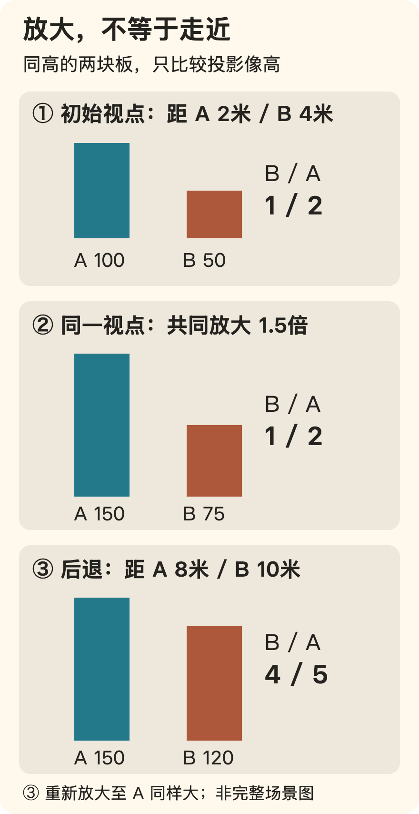
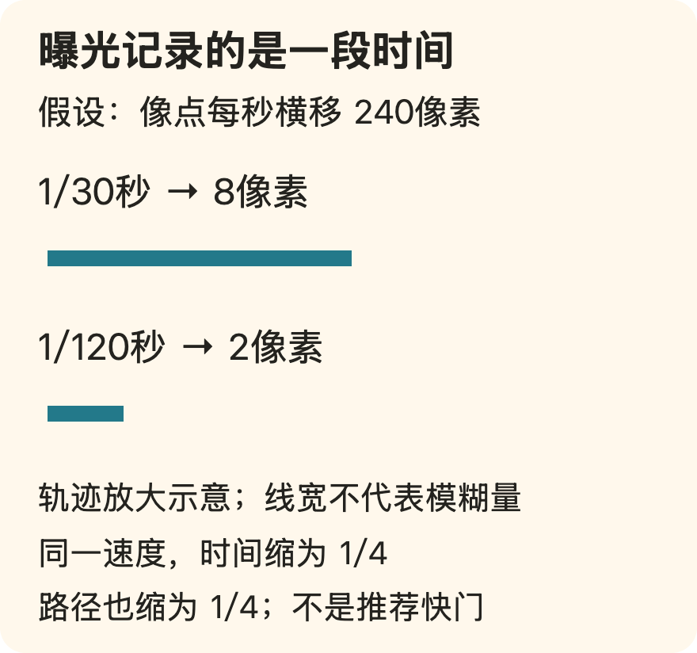
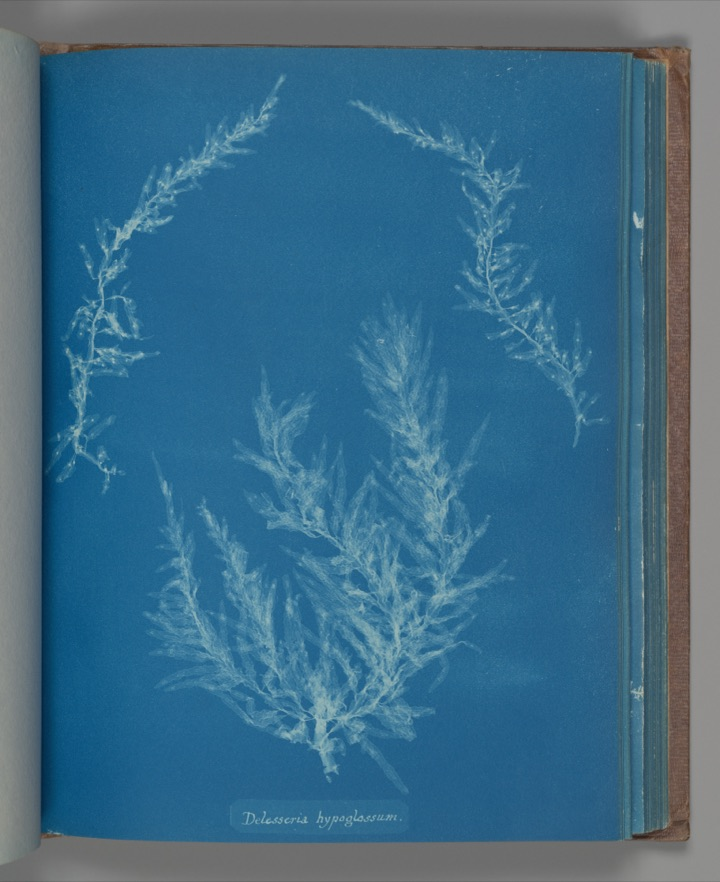

[← 回总目录](../README.md) · [街道与附近](15-neighborhood.md) · [生活不必有观众](../essays/08-life-without-an-audience.md)

# 20 · 照片可以留下今天，不必替今天交作业

**举起相机，不一定是离开当下；有时，你正因为想拍，才看见了当下。**

一块窗边的光、朋友说话时的手势、桌上没收完的碗，都可能值得留下。不是因为它们将来一定珍贵，也不是因为足够适合发布，而是这一刻你确实想看得更仔细。

可拍照也容易变成另一份工作：等人少、换角度、重复动作、检查表情、修图、选封面。最后大家不记得当时说过什么，只记得终于拍够了。

“别拍了，好好享受”和“来了就一定要出片”都替人决定得太快。本章关心的是：拍摄怎样成为经历的一部分，而不是让经历变成拍摄的耗材。

沿四条主线读：[怎样看见与取舍](#photo-language) · [图像保留了什么](#photo-truth) · [拍摄、分享与共同经历](#photo-experience) · [选片与观众](#photo-editing)。也可以先看一个分歧：[变焦不等于走近](#photo-viewpoint) · [清晰不等于有意思](#photo-duration) · [为了分享而拍，会不会改变这一次经历](#photo-sharing-goal) · [选片不是选冠军](#photo-sequence) · [喜欢被看见，也没有错](#photo-audience)。

也可以先看一张[没有用相机取景的蓝晒图](#photo-cyanotype-object)：它没有保留海藻的本来颜色，却让形状获得了另一种位置。[少记录一些，能不能多看见一些？](#photo-selective-truth)

## 一、技术让你多一种选择，不替你选好愿望

从想留下什么开始，再看画框、光、视点和曝光怎样改变图像。几个简化算例用于分清问题，不是设备推荐或统一的拍摄参数。

### 记录、观看、表达与分享，是四个不同愿望

你可能只是想记住一起吃饭的人；也可能喜欢找画面里的线条；还可能想让别人理解一种气氛。愿望不同，所谓“拍得好”就不必相同。

| 这次在意什么 | 一张照片需要做到什么 | 不必自动承担什么 |
| --- | --- | --- |
| 留下记忆线索 | 让自己认出人、地方或片刻 | 符合陌生人的审美期待 |
| 练习观看 | 看清一个关系，比较不同处理 | 每次都得到可展示作品 |
| 做视觉表达 | 用取舍呈现自己想说的东西 | 把一切都忠实、完整地装进去 |
| 与人分享 | 让对方知道为何想给他看 | 争取尽可能多的反应 |

这张表是本书的编辑工具，不是摄影流派分类。几种目标可以同时存在；只是当你不满意时，先知道自己在用哪一种标准。

一张略微模糊的聚会照，可能很适合留下当时的关系，却不适合交付需要清晰细节的任务。承认后一种限制，不需要否定前一种价值。私人喜欢和技术评价可以并存。

### 画框先决定“不放进什么”

面对一个场景，你不是被动装下全部，而是在决定边界：谁出现，谁缺席，背景保留多少，哪个动作刚好进入画面。

可以先看三个问题：

- **我最想让人注意哪里？** 如果自己说不清，也许可以先拍下来再判断，不必现场立刻获得主题。
- **周围的东西在帮它说话，还是只是在抢位置？** 一张椅子可能说明距离，也可能刚好挡住你想看的手势。
- **边缘发生了什么？** 被截断的物件、突然进入的一块亮色，都可能改变整体感觉。

同一个桌面，完整拍下餐具与空位，可能更像相处的场景；只留下盘子的局部，可能更像对颜色与纹理的兴趣。前者不必因为信息多而高级，后者也不必因为简洁而更有品位。

所谓构图，至少包括画面元素怎样安排。尼康的摄影术语表提供了构图、透视等基础定义；本章用它们建立描述语言，不把某种构图规则当作好照片的通行证。[F10](../docs/evidence/F10-photography-language.md)

### 先看看光在做什么，再决定要不要追求“更亮”

同样的人和物，在不同光线下可能显出不同关系。可以观察光从哪里来，明暗在哪里交接，纹理是被看见还是被压平；不要只问整张照片够不够亮。

术语表将侧光解释为从侧面照向对象的光，并提到它对细节与纹理的呈现。[F10](../docs/evidence/F10-photography-language.md) 实际能拍到什么，还取决于现场、设备与操作，不能据此许诺一套万能参数。

设想你想拍一只放在窗边的杯子。杯身上的明暗变化也许比杯子品牌更吸引你。这时可以比较保留周围环境和只看局部的差别，而不是马上寻找滤镜去制造另一种气氛。

暗部不是必须清除的错误，亮部也不总是越完整越好。若你有清楚的记录用途，细节丢失可能是问题；若你喜欢的是一种轮廓或氛围，选择可以不同。先确认用途，再评价结果。

### 一个普通场景，可以有不止一种照片

设想你在朋友家吃完饭，大家还没离开。以下是虚构的观察示例，不是规定每次聚会都要完成的拍摄清单。

拍完整桌面，留下椅子、餐具和人之间的位置，可能是在记录“我们怎样聚在这里”。拍一只正把碗推给另一人的手，可能更关心关系中的一个动作。拍灯下杯沿的反光，则可能暂时不讲聚会，只看形状和光。

三张照片使用同一个地方，却没有回答同一个问题。不是越近越高级，也不是必须拍到所有人才算完整；你在每次决定里改变了注意力的方向。

把它们放在一起，又会出现次序：先看整个空间，再看具体动作，和先从一个细节猜测场景，是不同的阅读过程。选片因此不只是从一堆图片里挑“最好的一张”，也可以是决定怎样让某个人慢慢看见你想说的事情。

如果当天你只想吃饭，完全不需要把这些可能性一一实现。懂得一些表达方式，是为了想拍时多一点选择，不是让所有普通日子都背上创作任务。

### 几个技术词，分别在回答不同问题

技术能扩大选择，但把词背熟不等于已经知道自己想拍什么。

| 概念 | 它在说什么 | 常见的混淆 |
| --- | --- | --- |
| 光圈 | 镜头开口的大小；常用光圈值表达 | 数值更小，不是开口更小 |
| 快门速度 | 拍摄时曝光持续的时间 | “快”不是照片质量的总分 |
| 景深 | 对焦位置前后可接受清晰的范围 | 不只由光圈一个条件决定 |
| 构图 | 元素在画面中的安排 | 不等于必须套用某条分割线 |
| 透视 | 三维对象在平面上呈现的相对大小、距离与深度关系 | 不等于所有空间效果都只由一个参数决定 |

这些基础定义来自 [F10](../docs/evidence/F10-photography-language.md)。具体设备是否允许独立调整、自动处理会做什么，需要看自己的设备说明。本章不把某款相机的菜单推广到所有手机，也不把软件模拟效果直接当成相同的光学过程。

想学技术时，可以围绕一个真实问题：我希望背景更容易辨认，还是更突出某个人？想留住一个动作的形状，还是更在意移动的感觉？有了问题，参数才是在服务选择，而不是要求你一次掌握全部。

### 变焦不等于走近：你改变的是画框，还是与世界的距离？

朋友站在一棵树前。你想让朋友在画面里更大，可以原地放大，也可以走近再拍。两种做法都能减少周围的东西，却不一定留下相同的空间关系。

先使用一个简化模型：相机从一个视点向场景投射直线，形成平面图像；暂时不讨论镜头畸变、虚化和软件处理。斯坦福摄影课程用针孔和简化透镜说明这一投影关系，并区分焦距与视野。[F34](../docs/evidence/F34-photographic-space-and-time.md)

**视点和方向不变时，原地裁剪再放大不会改变保留下来的两个对象之间的像高比例。** 同一感光面下，改变焦距主要改变取进来的视野；在上述理想投影条件下，画面中共同保留部分的比例关系也不会因此被重新安排。这不代表裁剪与换镜头画质相同，只是在回答一个更窄的问题：远处的东西，相对近处的东西，有没有变大？

下面是本书的原创算例。两块同高、正对相机的竖板 A、B，沿前后方向相隔 2 米，横向错开以免遮挡。相机一开始距 A 2 米、距 B 4 米；后来沿直线后退 6 米，变成 8 米和 10 米。这里的距离是模型沿光轴的深度，板高和位置都不改变。

不想计算，记住图中的区别就够了：**放大让两块板一起变大；后退改变了近板和远板相对相机的距离关系。** 把 A 的最终显示大小保持一致后，远处 B 相对更大，因此两者在大小上更接近。

想知道数字从哪来：理想中心投影中，像高 = 投影距离 × 物高 ÷ 对象深度。两块板等高，且在同一张图里，前两项相同，所以 B 与 A 的像高之比为 A 深度 ÷ B 深度。第一处是 2/4 = 1/2，第二处是 8/10 = 4/5。裁剪放大只是给两个像高同乘一个数，不能把 1/2 变成 4/5。这是几何推导，不是实拍测量。

因此，“长焦压缩空间”若被理解成镜头单独把前后距离压扁，就漏掉了关键条件。为了让主体在画面里差不多大，拍摄者常会在换长焦时后退；**视点移动与重新取景组合起来**，才产生这里讨论的大小关系变化。若人站着不动，仅更换焦距，就不能套用上面的 2/4 到 8/10。

这会改变一个实际判断：你不喜欢朋友身后的树太小，未必需要一个“让背景变大”的滤镜；可能需要改变拍摄距离，再重新安排主体大小。反过来，你想让贴近镜头的物件显得突出，近距离的相对大小差异也可能正是表达，而不是必须修正的缺点。

但不要从两块板跳到“某个焦段让所有人最好看”。脸不是平板，真实镜头不是完美针孔，姿态、照明、观看尺寸和个人偏好也不在这个算例里。设备上的放大按钮究竟在切换镜头、裁剪还是进行其他处理，应看对应说明；这里没有测试任何手机。

### 清晰不等于有意思：照片也能保留一段时间

杯子被递过桌面。短曝光可以把杯沿和手指留在比较明确的位置；较长曝光可能让移动留下痕迹。两者不是同一张照片的高分版和低分版，而是在选择：你要看动作中的一个形状，还是看动作穿过空间的过程？

在简化的单次曝光模型里，画面记录的是一段时间内到达的光，不是没有长度的数学瞬间。斯坦福课程讨论曝光持续时间与运动模糊，尼康的快门教学也分别举出冻结与保留运动的用途。[F34](../docs/evidence/F34-photographic-space-and-time.md) 来源中的样片参数只属于那些拍摄条件，不是所有水流、人物或运动场面的规定值。

把问题再收窄：假设一个点的像在画面上以每秒 240 像素匀速横移，期间速度方向不变，不讨论镜头散焦和相机移动。轨迹长度约为像面速度乘曝光时间：

同样的运动，1/30 秒留下约 8 像素的路径，1/120 秒留下约 2 像素；后者是前者的四分之一。这个算例说明为什么时间有影响，却没有规定多少像素才算“糊”。图片最终缩多小、看什么细节、运动是否变速，都影响判断。更不能因为某个人物“走得不快”，就忽略他在画面上实际移动得多快。

还要把两种移动分开：

- **对象动，相机不动**：桌子可能清楚，正在递杯子的手留下轨迹。支稳相机不会自动让这只手停下来。
- **相机也动**：原本静止的桌沿也可能拖出痕迹。若你的表达依赖清楚的桌沿，这就是需要解决的问题，而不是用“艺术感”替失控找借口。

实际运动可以叠加、转向，也可能与拍摄者的跟随部分抵消；照片上的痕迹不是对象现实路线的简单复印。这里没有给跟拍成功率，也没有把某个防抖功能当作冻结对象动作的保证。

曝光时间变长，在其他光学条件和场景亮度不变、感光元件尚未饱和的模型中，也意味着接收更多光。所以“我要更多运动痕迹”与“我希望明暗差不多”是两个要同时处理的问题，不能只背一个快门值。自动模式是否调整其他参数，以及多帧合成如何介入，是具体设备问题，不在这幅单次曝光示意里。

**你可以为了表达而接受模糊，也可以因为表达需要而追求清晰。** 耍起不是替所有技术失误辩护，而是不让某一个技术指标替你决定全部趣味。

### 三种“不满意”，不该开同一张处方

| 你真正不满意的是什么 | 先分清什么 | 为什么“买更好的设备”未必对题 |
| --- | --- | --- |
| 朋友显得太小，身后东西的关系也不对 | 是只要主体占画面更大，还是要改变前后大小关系 | 原地放大和移动视点解决的问题不同 |
| 人物的手糊了，但桌面清楚 | 是希望冻结手，还是原本就在表达动作 | 更稳的支撑不会停止被摄对象；模糊也不是天然错误 |
| 每张都漂亮，放在一起却像重复交卷 | 是否每张都在讲同一种信息 | 更多细节和更大文件不会自动带来新的叙述 |

表格是诊断思路，不是设备评测。先把不满意说具体，有时会找到技术问题，有时会发现需要改变的是选择，而不是器材。

## 二、照片不必保留全部，但要说清保留了什么

一页蓝晒让我们离开相机取景，讨论材料、安排和事实声称。信息少了，不一定看得少了；但表达的自由，也不能替记录任务免责。

### 不从镜头看过去，也能形成一张摄影图像

前面的算例都从相机出发，但相机不是摄影唯一的起点。V&A介绍的 **photogram（物影照片）**，让物体与感光表面接触，通过遮挡和透光形成图像；并不先由镜头把眼前场景投影到纸上。Anna Atkins使用的蓝晒，是其中一种有具体材料与工艺条件的做法。[F67](../docs/evidence/F67-cyanotype-and-selection.md)

这不是把普通照片染蓝的旧式滤镜。普通照片先用相机取得一个视点下的图像，再改变颜色；这里的植物先参与了光怎样到达感光表面的过程。两种结果可能看起来相似，生成图像的关系却不同。**蓝色是外观线索，不是鉴定证明；照片看起来像蓝晒，不等于它就是蓝晒。**

也不要反过来把蓝晒都认成植物直接接触纸面的结果。蓝晒说的是一种工艺，物影照片说的是对象怎样参与成像；图纸或底片也可以用于蓝晒。两个名称有交集，却不是彼此的全部。[F67](../docs/evidence/F67-cyanotype-and-selection.md)

馆方的工艺概述涉及铁盐感光纸、光照及水洗形成蓝色影像。本章用这个过程理解“明暗从哪里来”，不提供药剂配方、处理废液的方法或适用于任何材料的曝光时间，也没有动手试制。历史介绍不是足够安全、完整的制作说明，更不是购买一套新工具的理由。

这里变化的不是只有器材。用相机取景时，你安排视点与画框；制作这类接触图像时，你还安排物体在感光表面上的位置、方向与重叠。对象不只是被观看，也参与图像的形成。那个决定“怎样放”的过程，本身就可以是一种观看。

### 一页蓝晒：它没有留下海里的颜色

大都会艺术博物馆将下面的作品记为 Anna Atkins 的 *Delesseria hypoglassum*，约1853年，工艺为 Cyanotype，藏品编号 **2005.100.557 (78)**。这里沿用馆藏题名，不把它当作已经核定的现行物种名称。使用的是馆方数字图像，没有检查原作、翻阅完整册页或接触植物标本。[F67](../docs/evidence/F67-cyanotype-and-selection.md)

先别急着知道它“代表什么”。从数字图可见的关系开始：

- **留白不是没拍到的失败。** 上方两侧的形状向中间靠拢，却没有把蓝色区域填满；中间的空处让它们彼此分开，也让下方的密集区域显得不同。这是对画面关系的观察，不是发现了作者唯一的构图意图。
- **相同浅色里仍有差别。** 有些轮廓相对明确，有些分枝细弱、层叠，不像一张只有两个纯色的剪纸。图像形成可涉及物体透光、接触和曝光等条件；仅凭这一张数字副本，不能把每一处浅淡都精确归因于某一种条件。
- **名字也在画面里。** 底部的小标签既给出识别线索，也占据一块位置。你可以先看植物关系，再读名字；也可以被名字引向植物知识。两条路不需要互相取消。

还要留意我们看的究竟是哪一层：这是对一页蓝晒作品的数字再现。书页的翻卷、边缘、照明及屏幕显示，也参与了现在的观看。博物馆记录给出的图像尺寸是25.3 × 20厘米，不等于网页中每一根分枝都可以按显示宽度反推出原物大小；画面含册页边缘，本书版本也已等比例缩小。

这页图没有展示海藻在水里怎样摆动、它在自然光下是什么颜色、周围还有什么生物。它对这些问题不完整，却不因此对任何问题都无用。我们仍可以看排列、分枝、疏密，或者单纯被浅色形状与蓝色空处吸引。

署名：Anna Atkins，*Delesseria hypoglassum*，约1853年，The Metropolitan Museum of Art，2005.100.557 (78)。Gilman Collection, Purchase, The Horace W. Goldsmith Foundation Gift, through Joyce and Robert Menschel, 2005。图像处理与开放依据见[F67](../docs/evidence/F67-cyanotype-and-selection.md)。

### 少记录一些，能不能多看见一些？

“更真实”常被说成一个总分：颜色更像、细节更多、画面更宽，似乎自然就更接近真相。但一张照片可能保留某些关系，同时不回答另一些问题。讨论之前，先问：**你希望它忠实于什么？**

蓝晒不靠还原植物的所有颜色来成立。这不意味着颜色不重要，而是它使用不同的明暗与色彩条件，让形态进入另一种观看。反过来，如果任务是辨认一件商品的实际色差，或者记录某个对象当时的颜色，蓝晒或蓝色处理就未必适合。不能把欣赏时成立的理由，拿去豁免记录任务。

下面是本书的用途比较，不是三类摄影的高低排名：

| 你要回答什么 | 可能需要保留的东西 | 单凭这页蓝晒不能回答什么 |
| --- | --- | --- |
| 这些形状怎样在平面上相处 | 方向、轮廓、重叠、空处 | 它们在自然环境里原本是否这样排列 |
| 这种植物是什么样 | 某些形态与题名线索 | 全部鉴别特征、原色、现行分类是否与题名一致 |
| 当时海边发生了什么 | 现场关系、时间与环境信息 | 采集过程、原生位置及周围事件 |

这也能改变我们看自己照片的方式。把一张普通桌面照片处理成黑白，可能让相近颜色之间的亮暗关系成为重点；但你确实放弃了颜色这条信息。效果喜不喜欢，要看具体照片，不能从“黑白更纯粹”直接推出更好。

**有所舍弃，不等于可以胡说；保留了痕迹，也不等于保留了全部事实。** 看见一个形状，不自动知道它为什么在那里；看见两件东西相邻，不自动知道它们本来就在一起。图像的真实关联需要具体说明，不是一句“这是摄影”就能担保。

所以，照片不必承担把生活完整搬走的任务。它可以把某一种关系留下来，让你愿意多看一会儿。更多信息是某些任务的优点，不是每一次观看的唯一目标。

### 摆出来的，不一定是假；摆出来却说碰巧，才改了问题

V&A对Atkins作品的讨论并不把科学记录与构图趣味视为只能二选一。其介绍以接触形成的轮廓、非原色的蓝白影像及植物题名说明两者怎样相遇；对特定赠予动机的推测则仍是推测，不能拿来给眼前这页Met作品编传记。[F67](../docs/evidence/F67-cyanotype-and-selection.md)

把对象放在纸上，已经是一种安排。没有相机，并不等于没有作者选择；对象留下的痕迹是真实形成的，也不等于它们在自然界本来这样相邻。**材料的参与、构图的安排和故事的断言，是三件事。**

换成一个本书构造的当代场景：吃完饭，你把几张票根、钥匙和杯子放到桌上拍一张“这一周”。你可以诚实地说，这是你为回看而安排的静物。物件的确属于这段生活，排列由你决定；“不是偶然看见”不妨碍它成为表达。

但若你把同一张图称作“当时餐桌原封不动的样子”，就增加了一个关于现场的承诺。若钥匙只是为了好看临时借来的，却暗示它证明自己经历过某件事，也不是构图自由能够解决的问题。摆拍与否不是唯一的真假开关，**你向观看者许诺了什么，才决定还需要交代什么。**

这不要求每一张私人照片都附上一份证明书。给自己看的纪念、明确标作创作的静物，与向他人证明一次真实事件，本来就不承担相同任务。需要澄清的时候，把安排、时间跨度或合成说清楚，比装作图像没有经过选择更诚实。

### 最强的反对意见：这会不会让所有缺点都能叫艺术？

不能。知道可以舍弃什么，不等于没有拍清楚就一定是有意的；工艺有历史，也不等于它自动替今天的作品加分。若你本来想让人读清一行字，最后谁也认不出，把它改名叫“朦胧美”没有完成原来的任务。

不过，发现结果与计划不同以后，你也可以真的改变目标。原本想记录物件，后来更喜欢一个意外出现的影子，这可以成为下一张照片的起点。区别不是作品是否一开始就被想好，而是你能否具体说出：现在吸引你的是什么，以及它是否仍然满足你需要承担的记录责任。

这里也没有“传统工艺比手机摄影更认真”的结论。等待、准备、接触材料可以是某个人喜欢的部分，也可能只是另一个人并不想付的时间。选择蓝晒、数码相机、手机，或者只看别人的图，都不需要靠贬低其他方式来证明价值。

“耍起”不是让技术要求全部退场，而是让要求回答你的愿望。你可以追求更精确的色彩、更清楚的细节；也可以明白地放弃这些，换取另一种图像关系。**照片不必记录得更多，才值得你看得更久。** 它需要的不是替生活交出满分复印件，而是有一个你愿意认真看的理由。

## 三、拍摄可以属于经历，也可能改变经历

拍不拍、为谁拍，是不同问题。研究各有比较条件；拍摄占用谁的时间、谁愿意出现在照片里，还需要另行讨论。

### 拍照未必妨碍享受，但研究也不是“尽管一直拍”

Diehl、Zauberman 与 Barasch 的九项研究比较拍照与不拍照等条件，包含真实巴士观光、吃饭、博物馆参观，以及实验室中的视频和手作体验。作者报告，在若干正向体验中，拍照组享受评分更高。[B10](../docs/research.md#b10)

这足以提醒我们，不能把拿起相机自动解释成“不在场”。但同一论文也保留了限制：操作更干扰体验时，未发现同样清楚的增益；自己动手制作的人，并没有因同时拍照获得显著的额外享受。

更细的结果还要谨慎：负向体验里，拍照组享受更低的单独比较为 p = .058，未达到常用的 .05 门槛。不能因为论文的总体故事好记，就删掉这个差别。详见[阅读记录](../docs/evidence/B10-photography.md)。

本次取得的是作者页面链接的提前在线发表稿，不冒称已逐字核对最终页码版。研究没有证明拍得越多越快乐，也没有直接验证朋友圈点赞、长期记忆或本章的拍摄建议。

### 为了分享而拍，会不会改变这一次经历？

“拍照可能增加享受”，还没有回答你准备把照片给谁看。Barasch、Zauberman与Diehl另一篇论文的作者摘要报告：在两项现场与三项实验室研究中，相比为自己拍照，为了分享而拍照时，体验享受较低。**这里比较的是两种拍摄目的，不是“发帖”与“完全不用手机”。** 本书只读到作者公开摘要，未取得主文，不能逐项复核样本、效应量或机制。[B44读取范围](../docs/evidence/B44-sharing-intention.md)

因此，不能把两篇研究拼成“先拍就赚、发了就亏”的处方。它们没有一起核算现场、编辑、沟通和日后回看的全部得失，也不能替一个人判断这次表达值不值得。真正需要留下的反方是：为了让别人看懂，可能确实少了一些随便逛、随便聊的时间，不能因为最后照片好看就说损失没有发生。

**想分享不是没在生活；但想分享，也不保证现场的每一刻都更好。** 即使承认代价，表达仍可成为主动选择的愿望；这需要价值论证，不能冒充实验附赠的结论。[E08](../essays/08-life-without-an-audience.md#audience-chosen-tradeoff)进一步回应“只要说自己想要，是不是任何折腾都能被美化”，也保留作品失败、观众没有回应和伙伴拒绝追加劳动的可能。这里不要求把观众赶走，而是不给观众的存在开一张总收益证明。

### 想拍的人和陪你的人，可以在同一地点过不同的时间

对一个人来说，等待光线、换构图本身就是活动；对另一个人来说，那只是一次次被暂停的散步。双方都不一定错，只是以为参加的是同一件事。

如果这次主要是拍摄，就把它说清楚。同行者可以决定是否愿意一起等、自己走一段，或者约好稍后会合。若这次主要是相聚，也可以留一小段共同愿意的拍照时间，其余时候不让所有人一直待命。

请别人帮忙拍时，具体说想要什么，比连续说“再自然一点”更有用。也给对方说够了的余地。**朋友可以参与照片，不必为了你的照片暂时失去自己的下午。**

反过来，喜欢拍照的人不必被要求永远把兴趣缩到最短。你可以专门安排一次摄影出行，而不是每次都在别人的行程里争取片刻。关键是共同安排，而不是哪种兴趣天然更正宗。

### 拍下、保存、发给某个人、公开发布，不是一件事

一个人愿意出现在合照里，不自动说明他愿意被公开标注地点、身份或私人处境。这是本书的相处原则，不是各地摄影法律的完整解释。

可以在分享前确认谁会看到、是否能标注、有没有需要删去的信息。遇到不愿被拍的人，换一个画面不等于错过唯一机会。场地的拍摄要求也需要实际核实；研究结果不能替你取消现场规则。

若照片涉及不熟悉的人，别把“真实生活”当作不用考虑对方处境的理由。一个人正在劳动、休息或处理难堪的事情，不是天然为你的表达准备的素材。

同样，自己不想发，也不必为照片安排公开去处。发给一个真正想分享的人、打印出来、只放在相册里，都是完整的使用方式。

## 四、照片怎样成组，回应怎样不吞掉经历

选片不只是挑最抢眼的一张，公开也不只剩争取赞许。认真对待作品与观众，不必让每一天自动变成一次交付。

### 选片不是选冠军：一组照片可以让普通的一张有位置

继续用朋友家吃饭的虚构场景。假设只有四张照片：全桌、递碗的手、某个人大笑、散场后的空椅子。单张评分很容易让大笑的那张胜出；但如果只留下它，“这一晚怎样发生”就缩成了一个表情。

全桌可以交代空间，递碗的手把注意力拉进一个关系，大笑让场面展开，空椅子让这一晚有结束。换成先看空椅子，再回到全桌，就可能让读者先感到“人已经走了”，随后才认识曾经在场的人。这是本书对虚构材料的编排分析，不是观众实验，也不是唯一正确顺序。

这里有两个不同的取舍。**重复不一定无用**：两次递碗若呈现关系的变化，可能值得并置；但十张几乎相同的笑脸若只是因为都舍不得删，也可能把同一信息重复十次。**不够抢眼不一定该删**：空椅子在单张比赛里不突出，在这组照片中却可能决定读者怎样离开。

可以分别问：“单看这一张，我喜欢什么？”以及“它在这一组里增加了什么？”前一个问题保护个人偏好，后一个问题帮助编辑。两者不必得出同一份名单；私人相册可以比公开组照保留更多近似照片。

编辑也能制造误解。把递碗接到大笑之前，读者可能猜测递碗引起了笑；如果你声称在准确记录事件，而两件事实际上毫无因果关系，就不能靠排列让暗示替你说话。必要时交代拍摄次序、时间跨度或“按主题编排”，而不是让观看者把编辑关系自动当成现场关系。

裁剪、调整明暗与颜色同样有用途边界。私人创作可以改变很多东西；若照片用来说明某件真实事件、证明某种状态，就要避免处理制造没有发生过的事实。合成或生成内容不应假装成未经改变的现场记录。这里不是新闻、司法或商业交付标准，具体用途需遵守相应规则。

至于已经拍下的大量照片，不需要立刻变成待完成项目。若想整理，先处理一段你确实愿意回看的经历；别因为无法整理全部，就再也不打开任何一张。

### 喜欢被看见，也没有错

反对“来了必须出片”，不该变成“真正享受的人从不发照片”。想把好看的自己给朋友看、想让一组照片获得回应、想办一次小展览，都可以是拍摄本身的乐趣。公开表达不是私人生活的堕落版本。

真正值得争论的不是“要不要观众”，而是**观众有没有变成唯一的裁判**。你原本喜欢的画面，如果反应冷淡，会不会立刻被你判为毫无意义？朋友原本不想再拍，你会不会因为还没得到能发布的版本，就认为他应该继续配合？这两个问题分别涉及自己的价值判断与他人的时间，不能用一句“我热爱摄影”一起带过。

也别反过来规定创作者必须对回应毫不在意。作品没有被理解，失望可以是真实的；商业拍摄和公开投稿也确实有交付要求。更有用的区分是：这次你主动接受了什么任务？哪些时刻仍然不必交付？认真做一组面向观众的作品，与允许一次聚会没有作品，可以同时成立。

“耍起”在这里的主张不是降低作品要求，而是拒绝让每一天自动成为作品考核。**摄影可以是你选择投入的正事，却不必把所有相聚征用为生产现场。**

### 最强的反对意见：这不还是把生活变成素材？

有可能。只要一个人的注意力始终在“别人会怎样看”，拍摄就可能挤走原本的经历。但这不是所有摄影唯一的方向。

也有人因为拍照开始注意熟悉街道的变化，有人认真享受构图与处理，有人只是想留下朋友还在身边的样子。我们不把这些愿望统一判成虚荣，也不要求它们证明长期收益。

真正需要警惕的，不是照片存在，而是照片是否获得了替生活裁判的权力：没拍好，就说整天白过；没人回应，就说那一刻不值得。

**照片可以是今天的一部分，不是今天必须提交的证据。**
