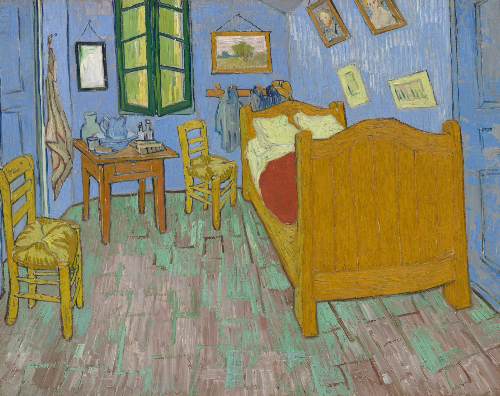
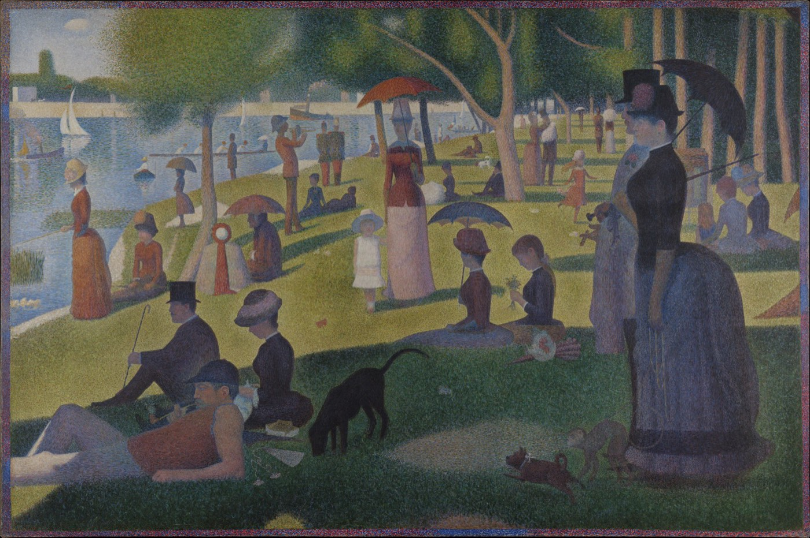
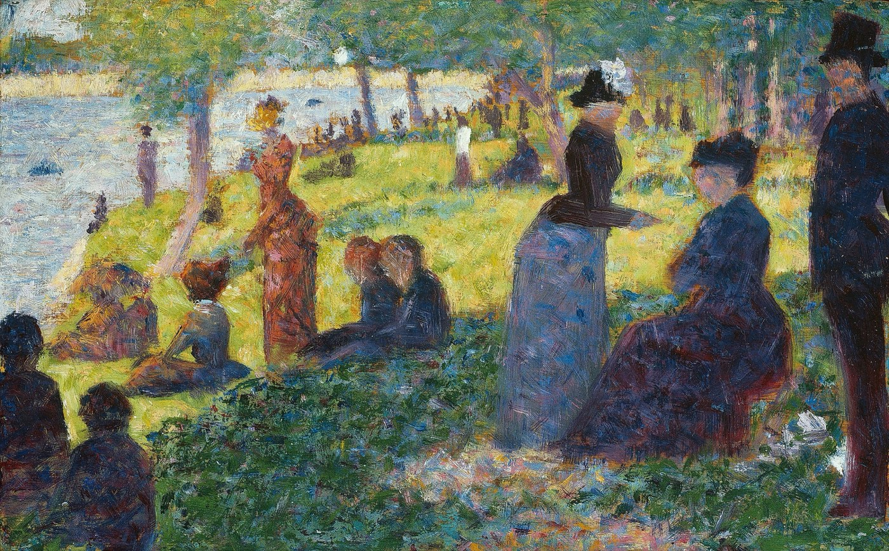
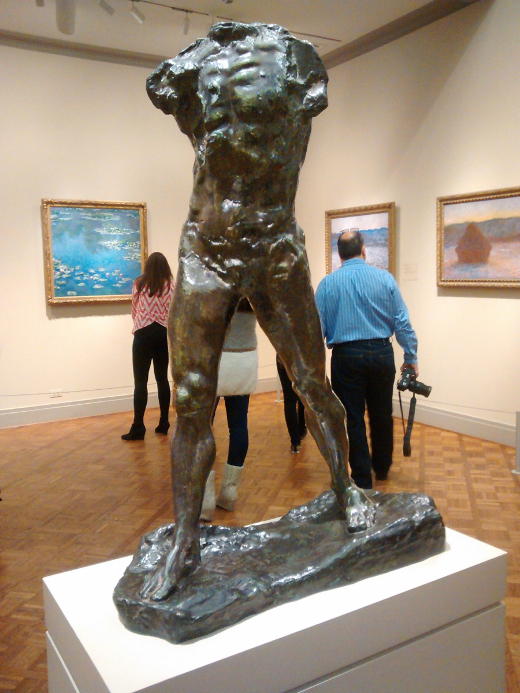
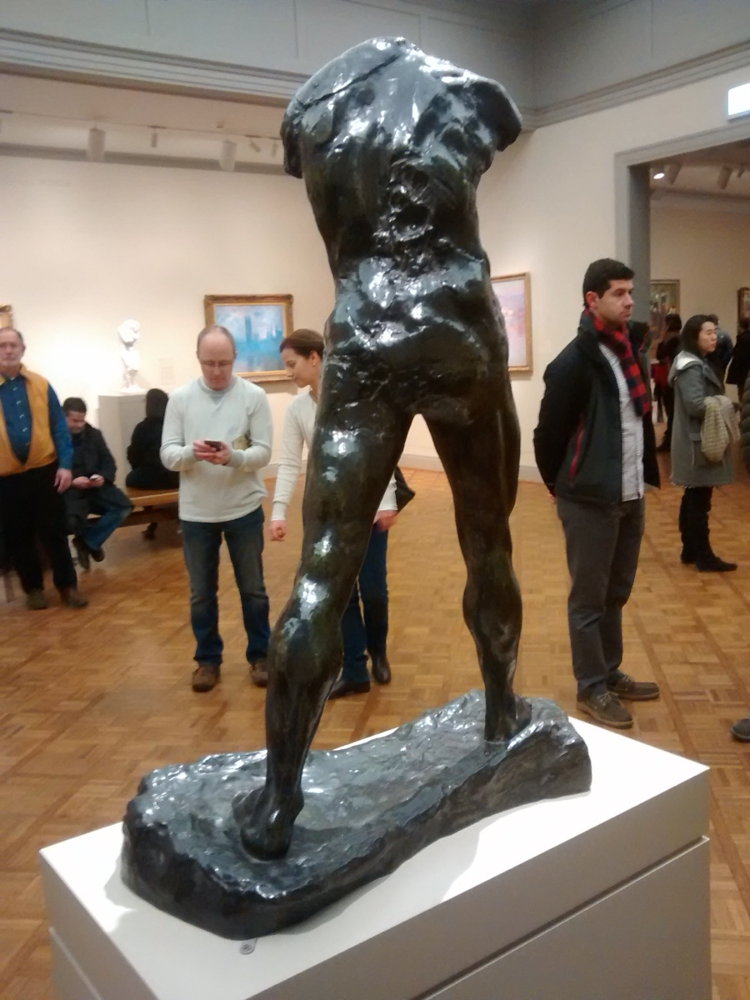

[← 回总目录](../README.md) · [摄影](20-photography.md) · [收藏](26-collecting.md)

# 25 · 看展不是品位考试：让一幅画占用你一会儿

**一幅画最值得占据的地方，不一定是你的履历，也可以是你当时的注意。**

展厅里有一种很忙的观看：拍到作品，拍到展签，搜索它为什么重要，确认自己没有错过镇馆之宝。走出去时相册很满，却说不出刚才有哪块颜色让自己停了一下。

问题不在拍照，也不在做功课。问题是：如果所有注意都用来证明“我已经看过”，真正的观看放在哪里？

这一章不从艺术史考试开始。我们看三张有明确馆藏记录的画，把《卧室》放回信件、不同版本与修复记录之间，再从罗丹《行走的人》的正背两张照片，讨论雕塑怎样让观看位置参与作品。随后再谈展览怎样把作品组织起来，以及“我没感觉”究竟可以具体到什么程度。它不是名作排名，也没有要求你认可下面的解释。

四条主线是：[作者的意思与自己的观看](#art-intention) → [创作不只是补齐细节](#art-choices) → [认出雕塑以后还看什么](#art-viewpoints) → [展览怎样安排注意](#art-exhibition)。它们不是参观任务，也不要求按顺序取得欣赏资格。

## 一、作者的意思，能替你决定看见什么吗？

从《卧室》开始，把画面、作者书信与材料经历放在一起。它们能使观看更具体，却不提供一张必须照填的感受表。

### 先把三个问题拆开：画了什么，怎样画，我有什么感觉

看一张卧室画，你可以回答“床、椅子、窗户”；也可以发现床占了很大面积，地板线条把视线引向里面；还可能觉得房间既亲近又有点歪。

第一层是辨认对象，第二层是描述关系，第三层才是自己的反应。三者互相帮助，但不能直接画等号：“蓝色”不自动等于“忧郁”，“空房间”也不自动证明画家孤独。

如果只停在第一层，画很快就被看完了；如果跳过前两层直接解释人生，画又容易沦为任何鸡汤都能套进去的背景。

一个更有内容的说法是：“右边的床很大，左边留着能走进去的地面，所以我觉得自己像站在门口。”它把感受连接到可指出的位置。另一个人可以找到同一个位置，却感到拥挤。分歧从这里才变得可谈。

以下图像来自公开数字复制品；不是作者现场观展记录。数字图像不能替代原作的尺寸、表面和现场光线，尤其不能据此精确判断原作颜色。版本、图像来源和观察边界见 [F13](../docs/evidence/F13-artworks.md)。

### 《卧室》：同一个房间，颜色与线条可以说不同的话

文森特·梵高，《卧室》，1889，布面油画，73.6 × 92.3 厘米。芝加哥艺术博物馆，馆藏号 1926.417，Helen Birch Bartlett Memorial Collection。此为第二个版本，不是 1888 年的第一版。数字图像的来源与公有领域标记见 [F13](../docs/evidence/F13-artworks.md)。

先不管它有多出名，看床。它不是一件端正摆在画面中央的家具：床尾靠近我们，体积很大，床头退向里面，黄色和褐色的边缘把床从蓝色墙面中推了出来。床单与枕头较浅，红色床罩露在其中。你会先看见哪一块，不必服从一个答案；重要的是找到让视线停住的关系。

再看地面。画面没有把它处理成平滑、没有痕迹的色面，而是保留了成束的条状笔触。它们一方面在说明地面的方向，一方面不断提醒你：眼前不是一间可以走进去的真实卧室，而是一块被颜料处理过的平面。只凭这些条纹，不宜断定现实房间铺的是什么材料。

这两种感受并不互相取消。你既可以进入房间，也可以欣赏它怎样被画出来。正如听歌时既能跟着旋律走，也能忽然被某个音色吸引。

最后看墙上的小画、窗户与椅子。许多边线带着不同程度的倾斜，远近并不呈现为整齐的工程示意图。可以先用手指隔空沿着这些方向比画，而不是急着评判“透视画对了吗”。线条怎样挤在一起，本身就是画面的性格。

博物馆说明把鲜明颜色、厚重而断续的笔触、急剧后退的线条与一种可能的紧张感并置，却同时指出画家想表达休息与安宁。这里至少存在三件不同的事：作者意图、形式特征、观看反应。它们可以相互解释，也可以不完全一致。

因此，“我觉得它不安稳”不必立刻被作者意图纠正为错误；但“画家就是想让人不安”又是另一个需要证据的说法。认真看画，恰好可以同时保留这两条界线。

### 一封信能说明画家的打算，却不能替观众填写感受

关于“他想表达安宁”，我们还可以往前走一步，不只接受展签给的结论。

在《梵高书信》学术网络版的第705封信中，他向弟弟Theo说明：这次画的是自己的卧室，希望通过简化和颜色，使画面让人想到休息或睡眠。他接着逐项说到墙、地面、床、椅子、床单、窗户等的颜色，又说去掉阴影，以平面的色块接近日本版画的处理。这不是本书根据画面猜测出来的心理，而是所读英译信件中的自述。[F54](../docs/evidence/F54-bedroom-letters.md)

不过，信并不是画的出厂合格证。它告诉我们一个愿望和若干做法，没有附上一张真实观众的反应表。你觉得倾斜的线条让人不安，与他想表达安宁，可以同时成立。

更有意思的是，第706封致Gauguin的信，把平面色调与粗厚的笔触放在同一段描述里。这两个词并不互相推翻：**“平”可以说颜色怎样组织形体，“厚”则可以说颜料怎样留在画布上。** 一张画可以少用明暗渐变塑造体积，同时保留明显的涂抹。若把“平涂”理解为表面必须像机器印刷一样光滑，就会错过它们能够并存的方式。

回到上方的数字图，看右边床尾的大块黄褐色，再看地面的条状痕迹。前者让家具作为一个大形状突出，后者使地面不断分成短小方向。这个观察不需要先决定画面究竟宁静还是紧张；同一幅画可以让某些地方稳住，让另一些地方活跃起来。这里讨论的是图中关系，不是用屏幕测量原作颜料的厚度。

两封信还有一个容易被忽略的条件：它们谈的是**1888年的《卧室》**，不是上方芝加哥所藏的1889年第二版。不能因为题名相同，就把每句话不加区别地贴到眼前这张图上。

| 这里涉及的对象 | 怎样定位 | 它在本章里回答什么 |
| --- | --- | --- |
| 第705、706封信及所谈的画 | 编者分别定为1888年10月16、17日；注释对应F482 / JH1608 | 梵高当时怎样向不同收信人描述卧室画 |
| 阿姆斯特丹所藏《卧室》 | 1888年10月；梵高博物馆s0047V1962，F0482 / JH1608 | 后面的变色与修复说明针对哪件实物 |
| 上方的《卧室》数字图 | 芝加哥艺术博物馆1926.417；1889年第二版 | 本章实际展示并分析的图像是什么 |

编者还指出，705附图与所对应油画在床上方挂画、帽子位置及小桌下的盆等处不同，并据此提出画面可能在附图之后又有改动。这是一项有依据的编辑判断，不是我们已经看完创作全过程；本章也没有核看两封信的手稿附图，不把注释冒充自己的目测。

这里没有哪一件可以简单替代另一件。信中的描述、用于说明的草图、油画实物与数字复制图，分别保留了一些东西，又省去了一些东西。**认真看，不是越早找到一句“作者本意”越好，而是知道那句话究竟能解释眼前的哪一部分。**

### 今天看到的蓝，不一定就是当年画下的蓝

梵高博物馆对1888年那件《卧室》的说明指出，墙和门原先偏紫，如今偏蓝；地面的颜色也发生了变化。[F55](../docs/evidence/F55-bedroom-conservation.md) 这条资料首先改变的不是“蓝色象征什么”，而是我们正在解释的对象：眼前的颜色还带着作品经历时间的痕迹。

但有一封信写“紫”，还不足以让我们随手把屏幕调紫，宣布原作已经复原。书面颜色词不是每个位置的精确色值；复制过程、光照和显示设备又会改变我们看到的东西。更重要的是，一张画并不保证各部分以同样程度变化。

馆方的《Covered by tape》说明给出一个更具体的问题：修复时，地面上的旧补色为什么反而显得与周围不合？

一种直觉是，前人补错了。但馆方叙述还涉及另一条线索：画面底部有一条曾被胶带遮住的颜色，受光较少，变化也较少。旧补色的桃色与这一处较接近。把两条信息合起来，馆方据此解释，旧补色原本与地面相配，后来周围的颜色变了，现在才看起来不相配。

这不是一句“修复过，所以颜色不可靠”能够概括的故事。**今天不相配，有时是原先相配的东西以不同速度变化；但也不能倒过来，把每一处不相配都解释成褪色。** 后一种判断仍需要针对那件实物的证据。

同一说明还介绍了颜料研究，指出相关红色染料为eosin，并提到研究者制作含该染料的红色颜料、进行人工老化。本章读取的是馆方说明，不是实验完整报告：没有取得光照条件、样品配方与完整测量数据，不能给出“在你家挂几年会变成什么颜色”的预测。

把来源放在一起，可以看出它们各自补上什么：

| 材料 | 能带来的线索 | 单靠它仍不能知道什么 |
| --- | --- | --- |
| 梵高在信中描述颜色与目标 | 他当时如何表述画面的安排 | 每一处的精确原始色值、所有观众的反应 |
| 遮光边缘与旧补色的比较 | 不同区域经历变化可能不同 | 整幅画全部位置的原色 |
| 馆方介绍的染料与人工老化研究 | 颜色变化可能涉及的材料原因 | 本章未读到的实验条件、任意保存环境下的速度 |
| 数字颜色重建 | 在某组依据和处理下，展示一种重建结果 | 让实物回到过去，或证明所有人必然觉得安宁 |

这些材料不是互不相干的装饰性引文，也不都是独立实验。它们围绕同一问题提供不同种类的证据。馆方重建页面进一步把重建后的配色解释为安宁；我们保留这是馆方的解读，不把它升级成已经测过观众的心理结论。

本章没有制作颜色复原图，也不将1888年画作的检测结论逐点套用到上方1889年第二版。原作、另一版本、数字图和重建图的区别，会影响我们能够说出什么，不只是档案管理员才需要在意的细节。

### 一处痕迹，未必只通向一个人的内心

同一馆方的《Spoiled by damp》还谈到脱落与受潮：梵高曾说把报纸贴在剥落的画上，修复人员在显微观察中发现了印刷文字的痕迹。这里仍按馆方说明转述；本章未读它引用的整封信，也没有核看显微图片。[F55](../docs/evidence/F55-bedroom-conservation.md)

这个例子提供了与“从笔触看性格”不同的观看方向。一处痕迹也可能通向搬运、包裹、潮湿、修复或材料变化，不只通向作者的情绪。图面既由创作形成，也可能留下后来的经历。把所有不规则都解释为画家“当时很痛苦”，会让一种戏剧性的生平故事盖掉其他证据。

反过来，知道材料经历也不等于已经解释完作品。分析出某处发生变化，不能自动回答一段线条为何让你愿意停留；辨认出附着文字，也不能替代整幅画的空间和颜色关系。科学说明、历史解释与当下观看可以互相帮助，却不必争夺“只有我才是真的理解”。

这正是看画值得花时间的另一种方式：开始时你只看到一个房间，后来发现一封信、一处遮光边缘、一次修复，都能让同一个房间变得更具体。不是因为新知识使你更有资格欣赏，而是你愿意追问的对象变多了。

### 做过功课，还能坦率地说“不喜欢”吗？

当然可以。但“知道作者想让人平静”“理解某些处理怎样形成”“自己被平静下来”，是三个不同进展。前两个发生，第三个也不欠谁一个必然发生。

一个同样认真的反对意见是：如果每次看画都需要分版本、读信、看材料说明，享受岂不是又变成了劳动？这确实可能发生。查资料若已经把你从想看的东西旁边拖走，知识也可能只是另一种任务。

我们的回答不是要求每次都查完，而是保留两种正当的乐趣：你可以直接被一块颜色吸引，也可以享受追索它为何如此。后一种不比前一种自动高级，前一种也不比后一种更“纯粹”。**耍起不是反对费心，而是反对把费心变成享受的入场费。**

资料的作用应当是使判断更有内容，而不是替你赞美。例如，“我明白他试图用平面色块表达休息，但倾斜和密集笔触仍让我紧张”，就比“作者说安宁，所以我必须安宁”保留了更多真实关系。你不必撤回感受，也不用捏造作者的打算，才能让两者待在一起。

## 二、从习作到成画，只是把细节补齐吗？

梵高的例子区分了意图、作品与后来变化；修拉的两张画则把问题转向创作中的选择。比较的不是完成度分数，而是人物和画面关系怎样被重新安排。

### 《大碗岛》：远处是一个下午，近处是许多决定

乔治·修拉，《大碗岛的星期天下午》（馆方英文题名含“1884”），1884–1886，边缘于 1888–1889 年补绘，布面油画，207.5 × 308.1 厘米。芝加哥艺术博物馆，馆藏号 1926.224，Helen Birch Bartlett Memorial Collection。[F13](../docs/evidence/F13-artworks.md)

先把屏幕上的画缩小一点。人、树、伞和河流组成的不是一张随机快照：前景的人比较大，后面的人小；一条条树干和站立的身影反复竖起来，躺着的人、草地和河岸又把目光横向展开。右侧很大的两个人与左下方的躺卧人物，让画面两端各有重量。

“重量”在这里不是物理称重，而是本书对面积、明暗和位置共同效果的描述。拿手遮住右边一部分，再放开，可以察觉画面关系如何改变；这不意味着你测出了作者精确的设计公式。

再把视线放到人群之间的空隙。中间穿浅色衣服的小人物、前景的动物、撑伞者之间的距离，都让眼睛有路可走。画面人物很多，却没有人人都朝你挥手。这也许让你觉得安静，也可能觉得他们像分别排练自己的姿势。后者是观看解释，不是关于画中人物真实心理的历史事实。

馆方说明强调，这幅画的色彩由相邻的点、短划和色块组织起来。近看时，人物的连续轮廓可以让位给许多分开的痕迹。这里不必把“点彩”背成名词考试，更不必许诺每个人都会看到同样的光学效果：只要比较整体与局部，你就已经在接触绘画的一个问题——**许多分开的笔触，怎样被看成一个连贯的世界？**

屏幕缩放并不等于人在原作前移动，像素和压缩也会改变细节。尤其这幅原作宽度超过三米，而《卧室》不到一米；两张图在网页里差不多宽，不表示它们会给身体相同的空间感。

### 草图不是“还没画好”：它保留了另一种可能

乔治·修拉，《〈大碗岛的星期天下午〉油画习作》，1884，木板油画，15.5 × 24.3 厘米。芝加哥艺术博物馆，馆藏号 1981.15，Gift of Mary and Leigh Block。页面显示宽度不代表实物比例。[F13](../docs/evidence/F13-artworks.md)

这张习作的长边只有 24.3 厘米，完成画的长边则为 308.1 厘米。它们在本页近似等宽显示，很容易让人忽略实物尺度的悬殊。两者共享河岸、树木和人群，却不是把最终版缩小后画得潦草一点。

比较右边：习作里站着、坐着的三个人，与完成画近景中戴高帽的男性、撑伞女性及牵着的猴子，并不是同一安排。馆方记录明确指出这组人物后来被重新考虑。把两张图并排想象，能看见创作不仅是“把细节补齐”，也包括替换、挪动和放弃。

习作里的颜色像仍在互相试探，完成画则形成另一种更稳定的秩序。这是本书对复制图的比较性阅读，不是宣称“速写一定自由，完成品一定僵硬”。你甚至可能更喜欢习作的松动，这无需降低完成画的价值。

这组比较也改变了“看不懂”的对象。你不再需要回答“这位大师为什么伟大”这样过大的问题，可以只问：“为什么右边换了人以后，我对整个下午的感觉变了？”

## 三、认出一个人，为什么还没有看完？

绘画把许多方向留在一个平面上；雕塑又让观看位置加入其中。接下来从同一馆藏的两张照片看起，同时保留照片与亲临实物之间的距离。

### 认出它是什么，为什么还没有看完？

一幅画里的床有一组被画下来的边线；雕塑的轮廓却还取决于你站在哪里。同一条腿可能从另一条腿后面显出来，躯干与腿之间的转向也可能变得更明显。此时发生变化的不只是你知道多少，而是哪些关系能够被看见。

罗丹的《行走的人》提供了一个具体例子：没有头，也没有手臂，只留下躯干和迈开的双腿。如果标题已经告诉我们“行走”，还有什么值得花时间？

Auguste Rodin，*The Walking Man*，芝加哥艺术博物馆，馆藏号1987.217，青铜，高84.1厘米；馆方记录为1877—1900年塑造、1917年以前铸造，Bequest of A. James Speyer。照片：Mx. Granger，Wikimedia Commons，CC0；不是本书现场拍摄。版本、照片及日期限制见[F77](../docs/evidence/F77-sculpture-and-viewpoint.md)。

先看双腿之间那块没有青铜的地方。它不是一条画在表面的线，而是两条腿围出来、能透见后方的空间。再沿一侧腿的外缘往上看，线条没有直接通到一个端正朝前的头；肩部方向、躯干起伏与两腿的张开，在同一张图里彼此牵动。

这已经比“像不像一个人”多了几个问题：形体之间怎样接续，哪里收窄、哪里展开，哪些方向一致、哪些不一致。这里的描述依照片而来，不是量过雕塑的重心，也不是用静态照片验证真实人体怎样走路。

表面同样参与观看。图中躯干凹凸密集，某些腿部区域相对平顺；亮处沿不同部位断续出现。不能把每一点闪亮都当作一块独立纹理：反光也与拍摄时的照明和角度有关。更不能从照片替观众许诺“青铜摸起来是什么感觉”。**看见表面如何接住光，与获得触摸许可，是两回事。**

#### 没有头和手臂，是损坏，还是作品的选择？

只看缺少哪些部位，无法回答这个问题。芝加哥馆方介绍说，罗丹把《施洗者圣约翰》研究中的双腿，与另一构图的躯干组合，1900年曾展出半真人大小的石膏版本；馆方将这件青铜像的片段性和未完成感理解为被保留的创作特征。罗丹博物馆法文页面同样说明它由腿部研究与躯干组合而成，但认为躯干很可能也为圣约翰而作。**关于组合来源，两馆的说法并不完全相同；本书不替它们消除分歧。**

这些资料仍能帮我们排除一个太快的断言：不能因为没有头和手臂，就直接认定眼前是一个原本全身完整、后来意外损坏的铸件。它也不是一张等待后人替它补齐的清单。

把“全身部位是否齐全”和“作品是否完成”分开，才会出现新的观看问题。没有脸，观众少了一条从表情理解人物的路；没有手臂，视线不能一直跟着手势寻找动作目的。注意于是可以转向躯干、腿和底板之间的关系。这是本书对形式的解释，不是每位观众都必须发生的反应，也不等于有脸有手臂的雕塑比较肤浅。

这里尤其不需要把作品变成“有缺憾的人生更美”的励志象征。雕塑的部件选择，不能替真实的人定义身体价值；艺术中的省略，也不能美化现实中的受伤。**它值得看，不必先承担劝人接受人生的任务。**

#### 转到背后，并不是把同一张答案再看一次

同一馆藏的背面照片，Mx. Granger，Wikimedia Commons，CC0。本书将两张1944 × 2592像素照片各缩至900 × 1200，不裁切、不调色、不补绘。文件页的拍摄日期分别标作2014-01-17和2015-01-17；不能把它们说成一次连续绕行的记录。

两张照片可以比较的，是各自显出的形体关系。正面有胸腹的起伏，背面则让肩背、腰部与髋部的接续成为主角。双腿间的空隙依然存在，边界和后面透出的背景却不相同。一个物体没有变成另一件作品，观看内容仍然增加了。

但它们不是一个控制实验。两次拍摄的位置、取景和灯光都没有被本书固定，不能把颜色、亮度或看起来的大小变化全归因于雕塑的形状。用两张图，也不能重建完整三维模型，更不能冒充亲自围着原作走了一圈。

这正好说明“认出来”为什么不是观看的终点。标题能把对象归到一个名字下，却没有替我们经历这些表面、方向和遮挡关系。**知识可以一次告诉你它叫什么，观看却不必被压缩成确认这个名字。** 愿意在这样的区别上停留，本身可以是来展厅的理由，不需要再兑换成品位、社交谈资或记住多少件作品。

#### 同一个题名，也不保证同一个体量

照片占满手机屏幕，很容易让人忘记实物大小。这里采用的芝加哥馆藏记录高84.1厘米；罗丹博物馆另一个《行走的人》馆藏S.998则记录高213.5厘米，构思栏为1907年、Alexis Rudier铸造厂于1913年铸造。二者不能因为题名一样，就合并成一件作品的一套尺寸与日期。

“比人高”和“放在台座上接近视线”，是不同的观看条件；究竟哪种关系发生，还要知道陈列高度与观者位置。本书没有测量这两件的现场布置，也不依据照片里远近不一的人物倒算尺寸。只凭屏幕上同样高的图片，不足以宣布两种体量提供同一种经历。

版本资料因此不只是背诵负担。它会改变我们能作什么比较。可以喜欢照片里的形状，同时承认还没有经历它在现场占据空间的方式；这种承认不是取消数字观看，而是不给自己没见过的部分签收。

#### 最强的反对意见：这不就是替大师没做完找理由吗？

名气当然不能自动把任何省略都变成好作品。知道它是有意组合，最多帮助说明“为什么不是简单按事故损坏来读”；不能由此推出它一定有表现力，更不能要求你喜欢。

一个有内容的辩护，应能回到眼前关系：省略哪些部位之后，什么变得明显，什么同时失去了？换到另一面，原来的解释还能不能成立？若解释只剩“因为他是罗丹”，质疑完全合理。你也可以理解这种处理，仍然更喜欢完整人物或别的形式。

反过来，“几秒就知道是一个人，所以没什么可看”也提前选定了一把尺子：把艺术的全部价值当成辨认对象的速度。这把尺子可以解释你为什么很快离开，却不能替所有观看结束。人与人分歧的，可能不是谁更懂，而是谁愿意把时间花在怎样的关系上。

这里不增加一项“必须绕行”的参观任务。玻璃、围栏、光线、体力、轮椅通路或拥挤，都可能限制观看位置；多角度照片和具体文字也能提供另一种入口。**角度更多，不自动等于享受更多；认出对象之后仍有东西可看，也不等于欠作品一份看完的义务。**

## 四、走进一场展览，谁在安排你的注意？

单件作品之外，还有展签、排列、名气与观看条件。它们怎样帮助或妨碍接近作品，也值得成为欣赏和批评的内容。

### 展签不是标准答案，但也不只是可有可无的废话

展签至少可能给你两类信息：一类是作者、年代、材料、尺寸、版本、来源；另一类是策展人对作品的解释。

前一类经常会改变观看。例如刚才的习作不是缩小复制品，《卧室》也不只有一张。没有这些事实，你可能在非常认真地比较错误的对象。

后一类则可以成为与你的观察相互检验的意见。展签说一幅画宁静，你可以寻找支持这种判断的部分，再想想有没有相反的线条、姿态或明暗。不是为了故意唱反调，而是防止一段文字代替整张画。

可以先看后读，也可以先读后看。对某些作品，了解材料或历史事件就是入口；对另一些作品，先被颜色抓住更自然。两种顺序都可能有收获，不需要从“慢看”再制造一条优越感规则。

尤其别把“无需全部看懂”滑成“无需尊重事实”。作品是谁做的、某种图案有什么已知来源、一次展览省略了谁，都不是随心情就能改写的问题。个人感受越自由，事实与解释越值得分开。

### 一场展览，常常在用相邻关系说话

假设把一张完成画单独挂在墙上，它像一个结果；旁边放上习作，它就可能变成一次选择的结果。再加入后来的改写、不同人的回应，问题又会改变。

这是本书构造的策展例子，不是在报道某场真实展览。它提醒我们，作品顺序不是空气：谁先出现，谁占据整面墙，哪些被放在一起，都会影响读者收到的叙述。

遇到有兴趣的展览，可以留意一种具体关系：

- 同一作者前后怎样改变，而不是年龄越大是否越“成熟”；
- 同一个主题有哪些互相不兼容的处理，而不是谁最像实物；
- 相似画面是否由不同材料做成，复制图是否抹平了区别；
- 展览给出的解释有没有能在作品里指出的依据，还是主要依赖标题。

不必四项都做。这里的重点不是给逛展加表格，而是把“走过很多房间”变成“跟着一个问题走了一段”。

### 名作可以是入口，不应吞掉旁边所有东西

冲着某件名作去，没有什么需要羞耻。名字有时就是一扇门。可如果离开那件作品以后，其他东西都只剩通往出口的路，名气便替你决定了全部注意。

反过来，故意避开所有热门作品，也可能仍然在围着名气转：选择标准只是从“大家喜欢”变成“我不能和大家一样”。两者都没有回答自己被什么吸引。

可以把最期待的一件当锚点，再允许旁边一件陌生作品把你留下。那件作品不需要成为“冷门宝藏”才有资格被喜欢。你能说出一个具体吸引你的地方，就已经比一句“很高级”更接近自己的观看。

同伴的兴趣也不必完全同步。有人看材料，有人看故事，有人更在意展厅建筑。若一起讨论，可以从“你在哪儿停了”开始，少问“你怎么连这个都不知道”。知识的作用是让对话长出来，不是让一个人闭嘴。

### “不好看”可以更具体，批评也能成为享受的一部分

下面四句话，听起来都是否定，指向却不同：

| 说法 | 还可以追问什么 |
| --- | --- |
| 我不喜欢这个题材 | 是否有形式、材料或细节仍让我在意？没有也可以 |
| 我看不出这件作品与说明的关系 | 是缺少背景，还是说明确实没有解释清楚？ |
| 我喜欢作品，但受不了这次观看条件 | 拥挤、反光、文字大小或动线，哪一个妨碍了接近？ |
| 我认可它的重要性，却没有被打动 | 历史判断与个人喜爱，是否真的需要一致？ |

把话说具体，不是为了最后强迫自己喜欢，而是免得一个坏展陈替作品背全部责任，也免得一件名作让你觉得“没被感动就是我有问题”。

更进一步，你可以喜欢某处同时反对另一处：迷恋用色，却不接受它呈现人物的方式；欣赏技巧，却觉得整场展览把复杂历史包装得太漂亮。这不是不纯粹的欣赏。作品值得被认真对待，也包括值得被认真质疑。

### 真正反对的，不是学习，而是把感受交给资格证

“不考试”并不意味着知识无用。知道版本、材料和背景，确实可能让原先看不到的东西出现。为了一个喜欢的领域持续学习，本身也可以很好耍。

我们反对的是另一种交换：先积累足够知识，才被允许发表感受；先能说出流派，才算真的来过；必须看完、理解、赞同，门票才没有浪费。

**知识可以扩展你的观看，不应该没收你当时的反应。**

一次看展可以只留下一个以前没注意过的关系：黄色怎样靠着蓝色，三个站立的人怎样让画面稳住，一张小小习作怎样通向另一种安排。它不必立即变成知识笔记或社交证明。

你曾经真的看了一会儿，而不是只完成了一次“看过”。这两件事，值得分开。
