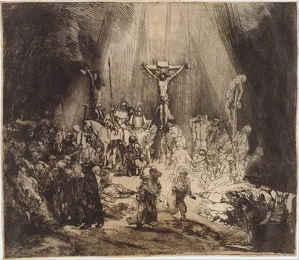
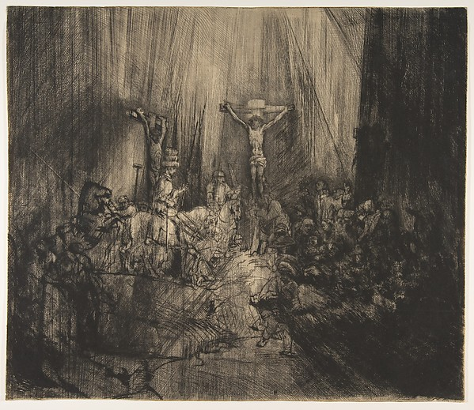

[← 回总目录](../README.md) · [消费](06-spending.md) · [看画与逛展](25-looking-at-art.md) · [私人物件小博物馆](../guides/08-object-museum.md)

# 26 · 收藏不必集齐：别让喜欢永远差最后一件

**收藏最有意思的，不一定是下一件到手，而是手里的几件终于开始互相说话。**

三本同一小说的不同版本，几张采用相似配色的旧明信片，一排并不成套的小玩具。它们单独看是物品，放在一起以后却会提出新问题：同一个故事为什么换了封面？同一种蓝为什么在不同纸上不一样？这一件的小缺口，为什么反而让整排变得有意思？

但收藏也可能换一种声音：“还差一件。”“这个配色没有。”“等买齐就好好欣赏。”喜欢逐渐被改写成缺口，拥有的东西越多，尚未拥有的东西也越多。

这一章要保留寻找、辨认、拥有与比较的乐趣，同时追问：一组物品的边界，由谁来定？

可以从[两张同题版画](#collecting-crosses)看起，再读[图面、实物与文件的区别](#collecting-layers)；如果你收的是数字照片和图片，可以直接看[什么值得留下](#collecting-digital)与[怎样重新遇见它们](#collecting-return)。关于[数量为什么也能有意思](#collecting-abundance)，本章并不只给减法答案。

## 收藏、囤货、资料库，不必争夺同一个称号

本章用“收藏”指你持续选择并关心一组物品及其关系，不要求昂贵、稀有或足够古老。这是讨论用的定义，不是市场鉴定标准。

为日常使用储备东西，主要在意够不够用；建立资料库，主要在意找不找得到；收藏则可能特别在意某个版本、触感、出处或排列后的差别。同一批东西可以同时承担几种用途。

例如你买了几包常用纸，可能只是备货；把不同纹理的纸放在一起反复摸、比较它们承接颜色的方式，便出现了另一种关系。不需要谁给你颁发藏家证书。

区别不是为了让收藏听起来比囤货高贵，而是为了认清自己的要求。如果你明明只需要够用，却被“系列完整”说服不断买入，那是在替一个自己没有选择的目标工作。如果你确实享受比较，别人说“这不都差不多”也没有抹掉那些差别。

## 第一件决定喜欢什么，第二件开始决定收藏什么

假设你很喜欢一张蓝色封面的书。下一本也选蓝色，可能是色彩收藏；下一本选同一小说的旧版，可能是版本收藏；下一本选同一设计师的作品，关注的又变成设计语言。

它们都从同一件物品开始，却会长成完全不同的集合。

所以，“我喜欢这个”不自动推出“我要买这个品牌的一切”。品牌目录只是可能的分类法之一，不是你的自然命运。

可以用一句有排除力的话描述眼前的收藏：“我想看同一个故事怎样被画成不同封面。”这样，一件新物品的价值就在于它带来什么差异，而不是是否终于填满空格。

这句话也可以改。当你发现真正着迷的是某种字体，而不是故事，就承认主题变了。收藏没有必要为了忠于第一次下单，继续维持一个已经不喜欢的方向。

## 一组普通物品，可以比一件名贵物品提供更多观看

下面是虚构例子，不是藏品估值。

你手里有四张日常收到的纸质卡片：一张只印两种颜色，一张用很密的文字，一张把图案排到纸边，一张四周留着很宽的空白。如果按收到日期排，它们讲一段个人时间；按画面密度排，则讲设计如何争取注意。

这时新增一张的意义可以是“它把文字藏得几乎看不见”，而不是“它比另外四张贵”。一件东西通过比较，获得了原先单独看时没有的意思。

也能反过来做：四件里拿走一件，看看关系是否更清楚。有时减去一个重复例子，反而让另外三件更好看。收藏不是只能加法的编辑工作。

这一点与临时布置小展不同。[私人物件小博物馆](../guides/08-object-museum.md)关心怎样把眼前几件摆出来；这里关心的是，这一组东西长期怎样变化，哪一种差异值得继续追，哪一种只是又一张订单。

## “原作”不总是唯一一件：先分清作品与复制方式

面对版画，一个常见误会是“只要能印多张，就没有原作”。V&A 的版画教学明确区分印版与印出的作品：在所讨论的版画语境里，版画本身就是作品，不是只有木板或金属版才算原作。[F14](../docs/evidence/F14-editions.md)

这不表示商店里所有带画面的纸都属于同一种东西。为版画创作的图像、多次印制的版画、把一张现成油画拍摄后印在海报上，是不同的制作与出版关系。仅凭肉眼好看、纸厚或卖家写“艺术微喷”，不能把这些关系全部推断出来。

也不要把区别变成羞辱廉价复制品的工具。如果你喜欢的是某幅画的构图，一张标注清楚的复制海报可能正好满足需要；如果你关注具体印制过程，那么作者、印制者、材料和版本信息就会改变你的判断。

**买的是什么，应该说清楚；喜欢哪一种，不必假装。**

这种区分同样适用于收藏书、唱片或玩具：作品内容、出版版本和眼前这一件实物，不是同一个层次。一本书的正文相同，不表示排版、装帧和插图相同；同版的两本书，也不表示保存状态和个人来历相同。

## “7/50”回答了一个问题，没有回答所有问题

Tate 对版数的说明介绍了现代限量版画的常见编号方式：例如一版二十五张，可能标成 1/25、2/25。旁边还可能存在艺术家留样 AP、印制者留样 PP 或工作样张等类别。[F14](../docs/evidence/F14-editions.md)

据此看到“7/50”，可以先理解为某个声明为五十的编号版中的第七号。不要自行补成“五十件就是全世界所有相关实物的总数”；其他留样、不同版次或其他媒介，仍须另看说明。

编号也没有自动回答这些问题：谁印的，什么时候印的，有没有其他颜色或尺寸版本，作者如何参与，这件实物的状态怎样，所附说明有没有可靠来源。

我们也不把小号码当作印刷质量排名。序号是什么，要靠发行方与作品记录解释，不能靠一个分数样式猜出全部生产过程。

AP 并不是本书给出的“更值得买”标记，限量也不是升值承诺。Tate 的教学页面说明概念，不替任何待售物品验真。本章不提供价格预测、鉴定结论或投资建议。

## 把“知道的事”与“卖家说的事”分开保存

收藏的记录可以很轻，但来历不要混成一团。即使只留几行，也值得分开：

| 字段 | 可以怎样记 |
| --- | --- |
| 眼前可观察的细节 | 尺寸、标记、配色、缺损；用自己的描述或照片 |
| 取得经过 | 自己何时从哪里得到；不记得就留空或写大约 |
| 外部主张 | “卖家称为早期版本”，保留出处，不改写成已证实事实 |
| 可核对的记录 | 出版者目录、作者或博物馆记录，注明对应的是不是同一版本 |
| 自己的喜爱 | 为什么留下它，与其他哪件放在一起有意思 |

例如“这是外婆用过的杯子”与“据家人回忆，这可能是外婆用过的杯子”，证据强度不同，但两者都可能值得珍惜。保留不确定，不会把感情变淡。

这份表是本书的记录建议，不是专业藏品管理规范。小收藏不必补出一条不存在的完整流转史，也不必为了写得漂亮而给物品编一个年代。

分享时只公开需要的部分。购买记录、私人信件、赠送人的姓名和地址，不因为进入收藏就自动成为可公开资料。

## 两张同题版画：不是“又一张差不多的”，而是哪里变了？

先看两件真实馆藏，而不假设要购买它们。纽约大都会艺术博物馆收藏了伦勃朗的两件《三个十字架》同题版画，完整英文题名为 *Christ Crucified between the Two Thieves: The Three Crosses*。以下用 A、B 区分眼前两件，不用它们冒充已核定的版次编号。[F38：记录、图像与读取边界](../docs/evidence/F38-print-comparison.md)

**A · 馆藏号 41.1.31；馆方日期 1653。**

**B · 馆藏号 41.1.33；馆方日期约 1660。**

两图来自对应官方 API 的低分辨率主图，均保留全图，没有裁切、调色或补绘。作品由 Felix M. Warburg 及其家人于 1941 年赠予馆方；图像与元数据的公开使用状态见 [F38](../docs/evidence/F38-print-comparison.md)。这里看的不是原作表面，也不是两件作品在展厅里的实际照明。

先不用问“哪一张更贵”，甚至不用立即问“哪一张更好”。可以比较三个具体关系：

- **亮处怎样让人物显出来。**A 的中央下方留出较明亮的空间，前景两名行走人物较容易从背景中分出来；B 中更多线条穿过人物与空地，局部轮廓和周围暗部交织。观看的任务从辨认分开的形体，变成在交错线条里追踪形体。
- **边缘怎样影响中心。**两图都有中央十字架，但 B 右侧的大片深色与贯穿画面的长线，让中央亮部显得被更密的东西包围。并不是把同一张图简单调暗：一些人物轮廓与位置关系也不相同。
- **眼睛可以在哪里停。**A 下方相对清楚的空地和人物，提供了从前景向内看的路径；B 的线条把多个区域牵连起来，目光可能较难在同一个边界收住。这是本书描述的一种看法，不是所有人眼动路线的测量结果。

这也不意味着“早的平静、晚的激烈”是一条已经证明的艺术史结论。屏幕、复制和观看习惯都会影响判断；我们没有据图像诊断作者心境，也不把较晚自动排成更成熟。

对收藏而言，重要的是：第二件不是仅仅增加了一件。它把第一件中原先不容易说清的东西提了出来。你可以喜欢 A 的可辨认，也可以喜欢 B 的交错，甚至只喜欢两者放在一起时提出的问题。

如果你已经有五个完全相同的复制文件，第六个相同文件未必增加这种比较；但如果新材料改变了你理解旧材料的方式，即使物品总数没有明显增加，收藏也在变厚。

## 图面变了、实物不同、文件变了，不是同一种差异

两张图看起来不同，并不自动告诉我们全部差异来自哪里。可以暂时分成四层：

| 在比较哪一层 | 它回答什么问题 |
| --- | --- |
| 作品与图面 | 人物、线条或构图是否被改动？ |
| 印制与材料 | 用什么方式、在什么承载物上形成这一张？ |
| 眼前这件实物 | 它的尺寸、缺损、标记与来历是什么？ |
| 数字复制文件 | 拍摄、扫描、裁切、压缩与显示怎样呈现它？ |

这是一张本书组织比较的表，不是鉴定流程。四层会互相影响，但不能互相代答。只看一个被裁过边的文件，不能确定实物本来没有边；知道作者是谁，也不能因此知道这件物品何时印成。

上面两件的官方记录正好给出一个小而重要的区别：A 的材料写为干刻版画、印在皮纸（vellum）上；B 只写干刻版画。A 还分别列出印版尺寸和承载物尺寸，B 列的是承载物尺寸。**同样是一串厘米数，量的部位可以不同。**

因此，若要比较两件大小，应先对齐字段：A 的承载物约 38.4 × 44.3 厘米，B 约 38.2 × 44.4 厘米；不能把 A 的印版 38.1 × 43.8 厘米与 B 的承载物尺寸混作同一口径。这里采用馆方展示的厘米数，不据小数位判断测量精度。[F38](../docs/evidence/F38-print-comparison.md)

工艺也能让观看多一层。V&A 对干刻的说明指出，线条直接刻入金属版，边缘形成的毛刺能够带墨，使印出的线带有柔软、模糊的效果。它与蚀刻的成线方式不同；但这一概念不能让我们隔着两张网页图，反推出每一处暗部究竟有多少来自毛刺、擦墨、材料或数字复制。[F14](../docs/evidence/F14-editions.md) · [工艺与图像边界：F38](../docs/evidence/F38-print-comparison.md)

知道这些，不是为了把一次欣赏改成考试。它可以帮你把“这张更有味道”继续展开为更具体的问题：是线的边缘、人物的位置，还是深浅分布？哪一部分已经有记录，哪一部分还只是猜测？

这里能核对的是两件具体藏品的记录和官方图像。它们在完整改版史里怎样编号、印版经过哪些修改，要另查作品目录，不能按日期先后或画面深浅自行分配。A、B 只区分眼前对象，不是历史版次。没有查清的地方可以暂时留白，比较不因此失去乐趣。

这种分层也能带回普通收藏。一张书封面图相同，可能是同一本书的另一张照片；一个出版记录相同，手里的两册仍可能有不同题赠；两份音频文件名相同，也不说明内容或版本相同。**“相同”要先说相同在哪一层，才知道应该合并还是保留。**

## 稀少可以让寻找有趣，也可以让喜欢偏离对象

假设有两个几乎相同的小摆件，你原本更喜欢普通配色，后来听说另一款更难找，于是想换。这里可能发生两种不同的快乐：你开始注意到稀有款真正吸引你的细节；或者你主要喜欢“我得到了别人难得到的东西”。

后者不必先被道德审判，竞争与寻获本来就可能令人兴奋。但两种理由应当诚实地区分，否则等稀有身份改变，物品本身可能忽然失去支撑。

一个可以思考的问题是：“如果明天公开再版，我还愿意留着它吗？”答案是否定也不等于你虚荣，只说明稀缺性在这次选择里占了很大位置。知道这一点，比把价格、稀少和个人喜欢混成一个“值”更有用。

反方向也一样：不要因为普通版随处可见，就把原本喜欢的造型说成俗气。稀缺是一种条件，不是感受的总裁判。

## 成套的快乐很真实，完成线却不一定稳定

拼出一套东西可以有明确的满足：图案连起来，故事人物站齐，某个空位终于被填上。本书没有要取消这种快乐。

问题在于有些完成线会移动。刚集齐一个系列，特别配色、周年包装、不同地区版又被纳入“完整”的定义。你以为自己在收尾，实际进入了下一个目录。

因此，完成至少有三种口径：

- **发行口径**：某个明确版本或系列的公开目录；
- **研究口径**：为回答一个问题，需要哪些有代表性的样本；
- **个人口径**：你愿意让哪些东西组成这一组。

“我只收常规款”不是完成失败；“我想把特别版也收齐”也不是必然失控。关键是别把后来出现的分类偷偷追认为自己早已承担的义务。

随机购买尤其要拆开“开盒的刺激”与“得到指定那件”两个目标。你可以喜欢前者，却不能把它描述成后者的确定路线。概率、发行条件与具体消费风险需要另核，本章不替任何产品估算抽取次数。

## 一件重复品，可能有意义；一件新品，也可能什么都没增加

重复不只指外观。一件用于日常把玩，另一件用于对照不同细节，表面相似却承担不同角色。相反，连续买入很多新款，如果每件只经历拆包拍照，便未必让收藏关系更丰富。

这不是要求每件藏品都证明用途，而是给“新增”换一个问题：它增加的是观看、触摸、故事、比较、寻找过程，还是主要增加数量？

数量本身也可能是你喜欢的视觉效果，例如一整片相近颜色形成的阵列。把这个愿望说清楚，你就能判断边界在何处，而不是假装每一件都独一无二到不可替代。

所谓边界，可以是一个主题、一段时期、一个抽屉，也可以暂时没有清楚答案。空间边界并不是“超过就不理性”的诊断线；它只是把下一件会占用什么，摆到台面上。

## 保存不是永远封存：拥有之后，想怎样相处？

有的人喜欢拿出来翻看，有的人在意状态完整，还有的人就喜欢包装本身。这里存在真实冲突：为了维持未使用状态，你可能放弃使用；为了触摸与翻阅，你可能接受痕迹。不能一边要求物品永不变化，一边又假定它随时都能参与生活。

一张纸、一段织物、一件电子玩具，也不能使用同一套护理方法。这里不提供去污、除霉、修复、封装材料或恒温恒湿参数；重要或脆弱物品应另查适合其材质和状态的专业说明，而不是照“收藏通用妙招”处理。

但在护理技术之外，有一项决定可以先由你做：我究竟想保持什么？是物理状态、完整包装、可以使用的功能，还是这组东西之间的关系？不同答案会导向不同投入。

如果你主要想保留内容，也许记录就够；如果想保留触感，照片不能替代；如果珍惜的是别人送来的这件实物，“再买一件一样的”也不完全相同。承认差别，比劝所有人一律断舍离或一律永久保存更贴近实际。

## 数字收藏：留下一个文件，不等于留下了它的来处

数字图片也值得认真收藏，但“已保存”可以指几件很不一样的事：收藏了一个网页链接，下载了一张缩略图，保存了一份较大文件，或者留下带有来源与个人说明的一组材料。

先设想一个原创例子：你存了上面两张版画图，却都命名为“伦勃朗.jpg”，其中一张覆盖另一张。画家的名字没有错，收藏最有意思的差别却被这个名字压平了。若只保留图片而没有对应馆藏号，过一阵也可能无法判断哪份记录属于哪张。

因此，数字收藏至少可以保留两种东西：**对象本身，以及你为什么把它留下。**前者可能是有权保存的图像文件；后者可能只是一句“我想比较两幅图的中央亮部”，再加来源页、对象编号与读取日期。它不必膨胀成一个必须填满的数据库。

美国国会图书馆的个人数字照片指南提出四步：先识别照片散落在哪里，选择重要的照片，组织它们，再做分开存放的副本。它还建议给文件描述性名称、写简短的目录说明。这些是保存指导，不是证明归档可以提高快乐的实验。[F39](../docs/evidence/F39-digital-collections.md)

该指南建议重要照片的多个版本中保存质量最高者，并没有把“质量”定义成文件最大或像素最多。本书另加一个收藏层面的判断：**技术质量与版本意义不是同一条轴。**即使你已选定技术上较好的文件，也还可以问另一版本是否留下不同内容。

例如原始照片与朋友认真标注过的副本，可能各自保留不同信息；前者适合继续处理，后者留下当时的解释。若只把后者当成低质量重复件删除，分辨率更高的一份也不能自动替回那些标注。反过来，同一文件在三个聊天记录里出现，并不会因此成为三个不同版本。是否合并，要回到你关心的内容，而不是机械地按数量或文件大小决定。

可以用一个虚构的照片组看清这种差别：

| 版本 | 它保留什么，又没有替代什么 |
| --- | --- |
| 拍摄时保存的原始文件 | 留下当时的画幅和内容，但不包含后来朋友写下的解释 |
| 为突出一朵云而裁切的副本 | 留下你的取景选择，却删去了原图边缘的内容 |
| 朋友写着“这像一条鱼”的批注件 | 留下共同观看的一次回应，文字也可能遮住局部图像 |
| 完全相同的一份备用副本 | 没有增加新版本的内容，但可以承担另一个保存位置的作用 |

前面三项适合记录“从哪份改来、改了什么”，最后一项关心的是副本放在哪里。版本管理与分散保存不是竞争关系：前者让你知道留下的是什么，后者帮助你在需要时还有机会找到它。这里不是要求四份都留，也不允许只凭这张表替别人删掉其中任何一份。

收藏来源页，也不等于取得了其中所有内容的下载、再发布或改编许可。这里不替任何服务、作品或人物影像作统一授权判断；不确定时，先保留公开链接和自己的说明，而不是把“喜欢”解释成有权搬走一切。

## 副本是为了回来，不是让整理永久占用今天

国会图书馆指南建议重要照片至少做两份副本，并将副本放在不同存储介质与地点，还要检查能否读取。[F39](../docs/evidence/F39-digital-collections.md)

这几件事不能被“我看见有两个文件夹”替代。设想两份文件都在同一台设备的同一块存储介质上：它们可以防住某些局部误操作，却没有为整块介质不可用的情形提供第二个位置。这是依共同故障条件作的说明，不是对你所用设备的故障概率预测。

同样，“目录里显示文件名”与“文件确实可以打开”也不同。如果你想知道保存是否达到了自己的目的，可以挑一份真正重要的文件，从另一个保存位置打开，看看内容和版本是否对得上。这是本书提出的检查例子，不是做过一次便永久安全，也不是完整数字取证或恢复流程。

指南还包含按年检查和若干年后更新介质的建议。本书保留它们在来源笔记中，但不把旧页面的介质举例和固定年数当成今天所有设备、账户与家庭情况的统一保养周期，更不以此推荐购买某种产品。

保存的问题解释清楚后，可以回到更有趣的一边：怎样重新遇见自己的收藏？

不一定要整理完全部文件才开始看。你可以先形成一组有问题意识的小集合，比如“同一条街的不同招牌”，并保留其中暂时不合群的一张。它可能说明主题还要改，也可能恰好是让整组不那么平滑的东西。分类是为了让关系可见，不是把每件物品审判到唯一正确的格子里。

如果一份目录只是让你随时知道“还差哪些”，它像采购表；如果它能让你返回已有对象、重新发现差别，它又像一张通往旧喜欢的地图。两者可以共存，但后一种不需要每次都以新订单结束。

也允许文件暂时没有故事。不是每张照片都值得长篇注释，不是每个旧物都要代表一段人生。给重要的关系留下一点线索，同时接受其余部分只是喜欢，比把所有收藏变成档案工作更适合本书的立场。

## 为什么不把一切都精简到一件最好看的？

这是对“不必集齐”的另一种有力反对：如果每件都要证明独立用途，收藏会不会又变成一份效率清单？

会，所以本章并不主张只留所谓最有代表性、最有信息量的一件。数量本身可以构成经验：相近颜色铺成的一大片，几十个版本里微小的字形变化，沿着同一题材不断寻找的过程。这些乐趣不必靠单件功能解释。

一件物品的边际差别很小，也不意味着整个系列的价值很小。两个近似物并置时不起眼的变化，在许多件里可能呈现节奏。反过来，一个庞大集合也可能只让你疲于维护。**多和少都不是立场，能否形成你愿意参与的关系才是。**

因此，“今天已经成立”不等于“到此停止”，也不等于“以后不许花钱”。你可以继续找，甚至认真追一套完整系列；只是不必宣布旧的喜欢在最后一件到来之前都不算数。

这一点也留下了真正的约束：空间、记录与维护会占用时间，公开展示可能涉及别人，脆弱物品需要合适照护。本书不把这些成本变成取消收藏的证据，也不因为收藏令人兴奋就假装它们不存在。

**耍起不是永远只挑最省事的快乐。也可以是明知道这件事需要心思，仍然愿意把心思花在它本身。**

## 兴趣变了，不需要用贬低旧爱来准许自己离开

你可以不再继续收，而仍然喜欢已有的几件。暂停购买不是宣布整个爱好失败，也不需要把过去花的钱和心思一并说成被骗。

若想减少，先分清“现在不想看”“已经不想拥有”“只是暂时没有空间”。它们可能需要不同安排。可以重新组合、留下代表性的部分，或在合适情况下转交；不要未经同意把自己的保存义务转交给朋友。

与其他收藏者交流，也可以围绕差异而不是估价排名：这一版哪里变了，为什么偏爱不完整的一件，哪些版本传闻尚未核实。专业知识可以帮助彼此看见更多，不必总是证明谁入坑更早、花得更多。

收藏最尖锐的反对意见是：“这不就是给消费找一个好听的名字？”

有时确实是。给购买加上档案表和展签，并不能自动让它更有意义。判断要回到实际关系：如果最让你在意的永远是付款前那一刻，之后的物品只负责证明曾经买过，那么“收藏”这个名字没有替你解决问题。

但另一种关系也真实存在：你不买新的，手里的几件仍然值得翻看、重排、讨论。它们没有继续增长，却在你的注意里继续变化。

**这样的收藏，今天已经成立，不必等待最后一件来批准。**
