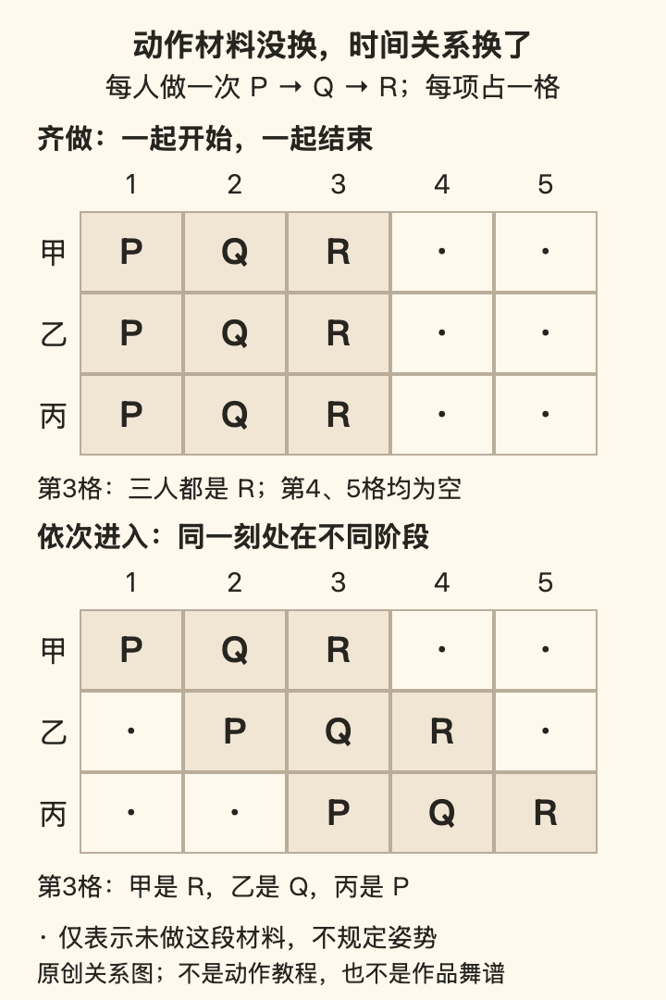

[← 回总目录](../README.md) · [身体与感官](02-senses.md) · [听音乐](11-music.md) · [去现场](13-live-events.md)

# 27 · 跳舞，不必先把身体交给观众

**如果没有人拍、没有人夸，这一段动作还值得发生吗？我们认为值得。**

你听到一个节奏，肩膀已经动了一下，脑子却先把镜头架起来：这样好不好看，会不会显得笨，别人会不会觉得用力过猛？身体还没开始享受，就已经进入了评审席。

跳舞当然可以为观众发生。排练、呈现、让别人看见一个准确的动作，都可以很有意思。但那只是其中一种关系。还有一种价值发生在做动作的人这里：重心从一边到另一边，手臂跟上某个声音，一次停住恰好接住了下一拍。

这一章讨论怎样把动作、时间和彼此回应组织成表达。你可以更在意内部感受，也可以更在意动作学习、共同跳舞或舞台呈现。下面只用简单手势说明编排，不涉及跳跃、托举、下腰等技巧，也不是身体训练处方。

本章先分清[个人感受与共同约定](#dance-standards)，再问[动作如何成为回应](#dance-response)。随后看[同一材料怎样被组织](#dance-composition)，最后讨论[观看、版本与学习](#dance-viewing)。不只问“跳出了什么”，也问这一段有哪些决定真的留给了正在跳的人。

## 一、先说清楚，这次在乎哪一种好

### 好看、准确、舒服、有意思，是四个问题

同一段动作，别人看起来流畅，你做起来却别扭；动作不够整齐，你却很喜欢其中一次突然停下。它们不一定互相推翻，因为问的不是同一个问题。

| 你正在关心什么 | 判断主要落在哪里 | 容易偷换成什么 |
| --- | --- | --- |
| 准确 | 是否完成了这次约定或学习的动作、节奏与方向 | 只要没复制成功，整段经历就无价值 |
| 好看 | 某个观看角度下的形态、关系与呈现 | 相机没有记录好，就等于身体没有经历 |
| 舒服 | 个人此刻愿意怎样动、有没有不适 | 外表轻松的人，内部也一定轻松 |
| 有意思 | 哪个变化、回应、停顿让你愿意继续 | 必须更难、更快、更大才算进步 |

这四项可能相互帮助，也可能冲突。为了整齐，大家需要协商一个共同版本；为了探索自己喜欢的动作，可以暂时不以整齐为目标。真正需要明确的是这次在做什么，而不是给所有舞蹈排一个共同的名次。

身体不适不是为了表达必须交的门票。一个动作在视频里看起来容易，并不能说明适合自己；涉及专业技巧或身体状况的问题，应找合适的教师或专业人员，不用本章的描述自行判断风险。

### 最强的反对意见：不要求跳得好，会不会只剩自我安慰？

若一个人想参加约定的演出、比赛或共同排练，却拒绝完成基本约定，不能只用“我开心就好”要求别人承担后果。共享的作品与承诺，会产生需要认真对待的标准。

但从这里推不出另一件事：所有身体表达都必须预先服从表演标准。自己在房间里跟一首歌动一下，与加入一支有明确目标的队伍，承担的承诺不同；不应该拿后一种关系统一审判前一种。

跳得好值得追求，跳的经历也可以先于“好”存在。**身体可以既是创造作品的媒介，也是自己当下生活的地方。** 本章支持的不是取消技术，而是不把技术的门槛复制到每一份快乐前面。

## 二、动作怎样成为表达与回应

### 一段动作，不只由姿势组成

照片截到的是某一个形状，动作还包括怎样到达、怎样离开、在何处停住。一个伸手动作，可以缓慢铺开，也可以突然出现；可以指向一个人，也可以像在空中划出边界。最后停在同样位置，发生的过程仍然不同。

AQA 的舞蹈课程规格把编舞内容区分为动作、动态、空间和关系，并列出重复、对比、齐做与依次进入等组织方式。这里借用这组描述工具，不继承它的考试要求；它也不是所有舞蹈传统的唯一分类。[F17](../docs/evidence/F17-dance-language.md)

可以把四类问题说得更直接：

- **动作：发生了什么？** 移动、转向、手势、停住，不只是哪一瞬间摆成了什么形状。
- **动态：怎样发生？** 轻或重，突然或持续，渐快或渐慢。这里描述动作质感，不是在测量肌肉负荷。
- **空间：在哪里、朝哪里发生？** 原地还是移动，面向谁，走直线还是曲线，动作占多大范围。
- **关系：和谁、和什么发生？** 与另一人的回应、两人的距离、音乐的进入，或一组人何时同时行动。

于是，“我跳得不够大”不一定是需要解决的问题。你也许想要的是动作更清楚、停顿更果断，或者与同伴的关系更明确。幅度只是一个变量，不是表现力的总开关。

### 只用一个手势，也能写出不止一句话

下面用本书自拟的一小段动作来比较：把手从身前移向一侧，再收回。可以只读，也可以用自己本来就能舒适完成的很小幅度去理解它；不需要站立或把手抬高。

假设暂时把一段时间划成四格。这不是说所有音乐都该数四拍，而是给比较一个共同长度。

| 版本 | 四格时间怎样安排 | 改变的是哪一层 |
| --- | --- | --- |
| 连续 | 用两格移出去，再用两格收回 | 形成连续往返 |
| 留白 | 一格移出去，停两格，最后一格收回 | 同一个终点，多了一段停留 |
| 不对称 | 用三格慢慢移出去，最后一格收回 | 往与返的时间不再平均 |
| 对话 | 甲在第 1 格移出、第 2 格收回；乙在第 3 格移出、第 4 格收回 | 材料相近，但由接续形成关系 |

四版都没有增加技巧数量。它们改变了时间分配和相互关系。你可以把第二版理解为“在等”，把第三版理解为“舍不得出去却突然回来”，也可以不作这种拟人解释，只喜欢它的节奏。这些词是解释，不是动作的唯一翻译。

再往前一步：如果每次返回都停在同一个位置，它会建立一个可识别的起点；若最后一次不返回，那个缺席就可能变得显眼。所谓变化，并不总是另找一个新动作，也可以是已经熟悉的东西突然没有照常发生。

但这不保证某种编排必然动人。它只让“动作少，所以没有内容”不再是唯一判断。**认真跳，不等于不断加难；也可以是把一个简单关系做得更有意思。**

### 跟上音乐，不等于每个重拍都摆一个姿势

数拍有用：它可以帮助共同进入、记住顺序、重新找到位置。但数拍是协调工具，不是音乐的全部，也不要求身体对每个声音逐一报到。

同一段时间里，你可以关注稳定的脉冲，也可以关注人声的一句延长，或某个乐器退出后的空白。假设一个手势从一句歌的开头开始，到句末才结束，它与音乐的关系，就不同于每拍换一次形状。

所以“没有踩在每一下上面”并不足以判断失误：如果这次约定是精确齐做，偏离可能需要调整；如果本来在试验跨过几拍的长动作，它可能就是选择。要先知道约定，才知道在评价什么。

舞蹈也不只发生在歌曲伴奏里。上述 AQA 规格把语言、自然声、身体打击声乃至静默列为可用的声音环境。静默不等于动作失去时间：停留多久、何时开始、别人何时回应，仍然可以被组织。[F17](../docs/evidence/F17-dance-language.md)

这里不把“随心”与“技术”对立起来。能稳定找到拍子，会给一些选择提供条件；能说清自己故意偏在哪里，也可以是学习。技术的价值在于扩大可做的事，不必顺便成为禁止普通人参与的资格证。

### 两个人跳，是关系，不是一个人遥控另一个人

一起跳可以有不同结构。像镜子一样回应对方，与做完全相同的方向，不是同一个约定；一个人先开始、另一个人随后接入，也不必被理解为后者慢了。

本书用以下原创例子说明区别，不把它们冒充某种社交舞的通用规则：

- **齐做**：两个人同时完成约定的动作，乐趣可能在共同进入的清楚感。
- **依次进入**：第二个人在第一人开始后才进入，同一材料在时间上错开。
- **回应**：乙不复制甲的形状，而接住其方向、速度或停顿，给出另一句话。
- **对比**：一人移动时另一人停住，彼此的区别本身成为材料。

这些关系都不要求身体接触。若涉及牵手、扶持或其他接触，动作方案与同意需要另外说清；报名、站到一起或之前同意过一次，都不是任意接触的授权。

“带领”也不等于替对方决定幅度与难度。想换一个更大的动作，先给对方知道和拒绝的机会；不要用突然拉拽测试默契。专业舞种的接触、步法与技术细节应跟合适的指导学习，这一章不提供替代教程。

相互回应的快感，可以来自对方真的有选择。若必须无条件服从才算配合，那更像控制，不是共同享乐。

### 我要的，不只是有人把下一步做出来

两次都是甲先做P，乙再做Q，录像里的顺序甚至完全相同。能不能据此说，乙两次都在回应甲的选择？

先用一个本书原创的有限模型把问题缩小。P、Q、R、S只代表四个约定好的动作材料，不规定幅度或技巧；两人依次行动一次，不讨论同时调整的复杂情况。甲可以在P与R中选一个。乙事先知道采用哪一种规则，甲也知道。

| 事先约定的规则 | 甲这次选P | 如果甲改选R |
| --- | --- | --- |
| 固定后续：乙无论看见什么，都做Q | P→Q | R→Q |
| 条件回应：乙看见P做Q，看见R做S | P→Q | R→S |

当甲选P时，两种规则留下同一个P→Q。只看这一遍的动作顺序，无法判断采用了哪一种规则；差别要问到**“如果甲另选了一个，乙的下一步会不会因此改变？”** 这里比较的是已写明的规则，不是鼓励突然变招去测试真人。真正的同伴没有答应当实验对象，也未必能从一个动作立刻理解你的意思。

第二种规则也不是“想怎么跳就怎么跳”。它预先限定了P接Q、R接S，把甲的选择留在当场，把乙的选择限制为按所见执行。乙仍需辨认发生了什么，才能知道下一步。**回应可以有规则；有规则，也不等于对方做什么都无关紧要。** 至于乙想不想要更多决定空间，是另一个需要说清的问题。

由此可以分出两种具体愿望。我可能想要“我们准确完成刚才约好的P→Q”，也可能想要“这一段还没写死，我的选择会进入你接下来做什么”。前者可以带来愿意追求的清楚与整齐，后者可以让尚未决定的部分成为期待。它们不是高低等级：有人此刻就想可靠地复现，不想每一次都临场猜；把后续留空，也不会自动产生有意思的回应。

这个模型并没有把编好的舞蹈说成没有互动。即使动作名称和先后固定，两人仍可能共同调整何时开始、停多久、怎样接近；那时，留在现场决定的不是“下一步叫什么”，而是动作的具体发生。反过来，写着“即兴”的活动也可能只容许一人决定、其他人照做。需要看的是哪些选择开放、交给谁、别人的行动怎样影响后续，不能只按“编舞”或“即兴”的名称分类。

这与前面的“关系不是遥控”多了一层：不只是承认对方有拒绝权，还要分清自己期待的关系究竟是否发生。被允许自由行动，和自己的行动真的进入了共同过程，不是一回事。我们可以愿意为后一种经历投入当下，而不要求它提升协作能力或替未来积累什么。

**我想和你跳这一段，也可能是在说：我想让接下来发生的事，真的有一部分取决于我们。** 它不保证比预排更快乐；这里没有记录真实舞者、测量感受或复原某个舞种。这个两步模型只说明：相同的一次结果，不足以证明相同的回应关系。

## 三、材料没换，组织方式也能改变经历

想先看动作怎样产生区别，可以跳到[同一材料的两种时间图](#dance-time-grid)、[重复与《Rosas danst Rosas》](#dance-rosas)，或[随机编排为什么不是随便跳](#dance-chance)。

### 大家做得一模一样，整体也可以完全不同

“同一套动作”说的可能只是每个人依次做了什么，还没说谁在什么时候做。为了把这个区别画清楚，下面暂时不用真实舞步，只用P、Q、R表示三个已经约定的动作材料，每个占一格时间。

**上图是齐做。** 三人都在第1格开始，顺序均为P→Q→R，并在第3格后结束。整体的清楚感可以来自共同开始、共同换材料、共同收住。

**下图是依次进入。** 甲不变，乙晚一格，丙再晚一格，每个人仍完整做一次P→Q→R。第3格同时出现甲的R、乙的Q和丙的P。这种错开不是三个人分别失误，而是图中事先写明的关系。

两图每个人做的材料及持续格数都相同，把三个人的执行格数加起来，都是九格；但全组从首次进入到最后结束，上图为三格，下图为五格。这里的计数只是图形规则，不是热量、体力或工作量计算。圆点也不等于要求身体定住：它只说这个人此时不在执行P、Q、R这段材料。

这解释了群舞里一种值得看的东西：你不只在看三个人各自完成同一个动作，还在看同一个材料如何处在不同阶段。注意力可以从横向读一个人的顺序，转成纵向读同一时刻三个人的关系。谁最难、谁最大、谁最抢眼，不是唯一的问题。

现在再改一个条件：要求下图三人都在第5格同时结束。仅仅说“照旧，只是一起收尾”已经不够。甲和乙要延长某一部分、加入等待、重复材料，或者改变开始时间；如果仍要求每人不插入等待、连续占三格，三人就不能保持原来的不同起点。**一个共同终点，会迫使前面的安排也作出选择。**

它可以形成新的乐趣，也可能破坏原来喜欢的接续。没有哪个版本自动更高级。所谓编排，并不总是增加更难的材料；有时是保留材料，改变它们相遇的方式。

这张图是本书原创的有限模型，借助F17中的齐做与依次进入概念说明关系，不是专业舞谱，也不是下一节作品的动作复原。不识谱、不想动手的读者，仍可以只读图中的区别。

### 重复不是倒带：一段动作怎样变成一件作品

Rosas舞团的官方介绍把Anne Teresa De Keersmaeker编舞的《Rosas danst Rosas》首演记为**1983年5月6日**。它描述抽象动作、日常小动作与重复结构之间的关系，并列出Thierry De Mey和Peter Vermeersch的音乐署名。这里采用的是创作机构的作品说明，不是本书观看完整演出后的评价。[F51](../docs/evidence/F51-rosas-repetition.md)

为什么把这样一份记录放在“耍起”里？因为“素材没换”不必等于“什么都没发生”。同样的手势再次出现，前面已经发生过什么、旁边谁在做、下一次何时到来，都可能不同。这是本书从结构问题作的延伸，不是证明每位观众一定会感动。

设想一个完全不同于该作的原创小场景：三个人各自做完P→Q→R。第一次你可能在辨认顺序；第二次你知道R快来了，开始注意有没有共同收住；第三次一个人暂时退出，原来被整齐盖住的空位显出来。这里未增加一个新动作，却改变了你能等待和比较的关系。

但不能反过来宣布，觉得重复无聊的人只是没看懂。你可以准确读出结构，仍然不喜欢它的持续时间、质感或强度。分析能让“哪里有区别”更清楚，不能替“我愿不愿意继续”作答。

官方介绍还把坚持与疲惫写入这件作品的表达。那是机构对具体作品的阐释，不是要求普通参与者靠撑到疲惫证明投入。观看一种强度，与亲自承担同样强度，是两件事。对本书而言，**喜欢激烈不必被纠正成温和；作品使用了疲惫，也不等于疲惫成了所有快乐的入场券。**

### 随机决定顺序，不等于没有创作

看到“偶然”二字，很容易把它理解成“当场随便来”。Merce Cunningham Trust对《Suite by Chance》的记录却展示了另一种做法：先用详细图表整理动作、时长和空间方向等可能性，再用偶然程序决定舞者的序列、人数与进退场。记录把首演列为**1953年3月24日**；演出先于当年舞团的正式成立，不把“1953年有这场演出”改写成舞团成立之后的作品。[F52](../docs/evidence/F52-cunningham-chance.md)

这里至少有三个不同的决定：准备哪些材料、怎样选出组合、怎样完成所选组合。把第二步交给随机程序，不等于前后两步消失；也不自动表示舞者在演出中临时决定每一步。

以下仍是本书的P、Q、R模型，不是Cunningham的方法复原。规定每种材料恰好出现一次，只改变先后顺序，可得到六种：PQR、PRQ、QPR、QRP、RPQ、RQP。如果再规定P必须在Q之前，就只剩PQR、PRQ、RPQ三种。允许哪些结果，已经是创作选择。

同样叫“随机”，规则也会改变分布。若三种允许的顺序等概率抽选，以P开头的有两种，机会是三分之二。若先在P和R中等概率决定开头，再在该开头的允许顺序中等概率选，PQR、PRQ各占四分之一，RPQ占二分之一。**它们都含有随机步骤，却不产生相同的选择机会。**

这不是为舞蹈评好坏的公式。它只是把一个容易被“随便”掩盖的事实说清楚：选择材料、设定限制、采用哪一种抽选办法，都仍然有人作主。随机可以帮创作者遇到惯常顺序之外的组合，也可能给出不想采用的结果；在允许修改的自拟规则里，改掉它不算作弊，在共同约定不可更改的作品中则是另一回事。

如果是即兴，也同样需要问清现场留了哪些决定：材料固定而次序开放，顺序固定而动态开放，还是要即时回应别人？这些是本书帮助描述的不同情境，不是某一舞种的统一定义。预先写好和现场选择，都可能要求认真投入，不能简单排成“死板”与“自由”。

### 身体不必逐个替音乐画插图

Cunningham Trust的生平介绍将音乐与舞蹈的分离、偶然程序列为其与John Cage合作的重要探索。这里记录的是创作机构对方法的概述，不是已经分析过每部作品的声画对应。[F52](../docs/evidence/F52-cunningham-chance.md)

它至少允许我们问另一个问题：动作一定要把声音的每次重音翻译出来吗？贴着音乐走，可以让共同进入显得鲜明；不逐点对应，也可能让观众同时追踪两条时间线。这不是二选一的审美宣判。

以本书时间图为例，甲在第1格开始；假设一个突出的声音出现在第2格。若要求该声音出现时恰好做P，就要改动作起点或次序；若不设这个要求，第2格声音可能与甲的Q相遇。巧合发生了，不等于编排原本就要解释那个声音；暂时没有对齐，也不足以证明舞者失误。

观察时可以先分开“我期待怎样对应”和“这一次实际怎样对应”。你也许正喜欢严密贴合，也许偏爱两条线偶尔相遇的不确定；都不需要借名家权威把自己的偏好宣布成唯一答案。

**不把身体当音乐的附属品，也不把享乐当有用生活的附属品。** 两者并不是同一条理论，却共同提醒本书：一种表达可以与另一件事发生关系，而不必仅靠服务它取得价值。

## 四、观看和学习，不只剩一张分数表

### 看一群人跳，先别急着找谁最厉害

看群舞时，最醒目的人不一定承担了全部内容。队形如何打开、谁保持不动、动作怎样从一个人传到另一个人，都可以改变整幅画面。

设想四个人依次开始同一个手势。只看第一个人，材料似乎很少；把注意力放到进入顺序，就出现了一条沿人群移动的线。若他们突然改为同时结束，前面的错开会让这个共同终点更鲜明。这仍是本书虚构的编排，不是对某场演出的现场记录。

观看也有空间条件。固定正面视频把某些关系呈现在同一个平面上，现场座位又给出具体角度；不能由一个镜头中没看到，就认定舞台上没有发生。反过来，也不要为了维护作品，替看不见的部分编造精彩。

如果一个片段让你困惑，可以先区分：“我没看清动作”“不知道它与前段的关系”“知道它怎样组织但不喜欢”。前两者可以继续找信息，第三者不需要被纠正成赞美。

### 学到一段，不等于搬走整部作品

Rosas与fABULEUS的Re:Rosas!项目提供第二部分椅子段落的简化版本。项目背景页把原作分为四部分：地面、椅子、站成一列、在空间中移动。原作、1997年的电影版本与后来参与项目，不是一个可以互换的标签。[F51](../docs/evidence/F51-rosas-repetition.md)

本书没有核看这些教学视频，因此不在这里复述步序或声称“照着做就会”。值得保留的是版本关系：**简化不是原作全貌，改编也不必假装没有来处。**

用一个原创比方说明：你把一段三人错开的编排改成独自表演，身体材料可能还在，人与人同时处于不同阶段的关系却已经消失。若借助剪辑让自己同时出现三次，又加入了拍摄与后期的选择。三个版本都可以有价值，但不能只凭动作名称相同，就说体验完全一样。

这也是为什么署名不只是礼貌附录。谁编舞、谁参与创作、谁示范、谁改编、谁拍摄，回答的是不同问题。作品页的编舞、共同创作和演出阵容也分栏列出；把镜头里出现的人一律叫作原创作者，会把这些贡献混掉。

参与项目邀请人们提交视频，不意味着读者欠它一次发布。你可以只是了解作品、观看已有内容，或者在自己选择的范围内学习；是否拍摄、上传与授予使用许可，应与“我想跳这一段”分开。本书没有复制其视频、音乐、图片或编舞，也不把项目邀请解释为覆盖任何用途的授权。

### 快乐有自己的文化来路，不只是可搬走的动作

Alvin Ailey 的《Revelations》是一个值得保留来路的例子。舞团官方作品页将其首演列为 1960 年，并把所用音乐及创作关联放在非裔美国人的宗教歌曲、文化经验与 Ailey 童年记忆之中；音乐署名按三个部分列出。[F17](../docs/evidence/F17-dance-language.md)

这里使用的是作品记录，而非对完整演出的观看分析。它提示一个容易被短片段抹去的问题：你眼前的形式，可能与具体历史、群体经验和作者选择相连。

知道来路不意味着先背完历史才能观看。它让“我喜欢这一段”之后多出一个方向：这段叫什么，谁创作，音乐是谁的，眼前是谁在演？欣赏与署名可以同时发生。

如果学了一段动作，分享时区分原作、教师示范、自己的改编与临时发挥；别把来源不明的短视频动作自动叫作某个地区或群体的完整传统。学习可以从模仿开始，模仿不等于原创署名。

自己享受表达的自由，不该以创造表达的人在分享时消失为代价。

### 想上课时，先分清自己想学哪件事

同样叫“学跳舞”，可能指学一段固定组合、熟悉某个风格、练习与同伴回应，或探索自己怎样编动作。它们的课堂安排不必一样。

看课程说明时，可以问它如何处理基础差异、是否需要搭档、有没有固定展示或录像、动作调整怎样沟通。这里不是对某家机构的背书，也不假定“零基础”意味着任何身体条件都适用。

镜子和录像可以是学习工具：帮助核对方向、位置或共同节奏。但如果这次只想动一动，并没有同意拍摄，就不能用“大家都在记录”替本人决定。公开发布还需要单独的同意，课堂参与不自动包含它。

如果你确实想练得更准确、更有舞台表现力，那也是享受的一种，不必为了证明非功利而拒绝练习。反过来，暂时不报课、不购买服装，也不等于只能永远在门外观看。

---

概念来源与作品记录见 [F17](../docs/evidence/F17-dance-language.md)、[F51](../docs/evidence/F51-rosas-repetition.md)及[F52](../docs/evidence/F52-cunningham-chance.md)。时间图、排列算例、假想编排与价值判断均为本书原创；没有测试它们的情绪效果，也不声称完成了舞种教学、完整观演或个体身体适用性评估。

继续阅读：[夜生活不是把白天过坏了](37-nightlife.md)把空间、音乐接续与舞池里的共同经历放在一起讨论，不将热烈简化为声音更大或动作更多。
