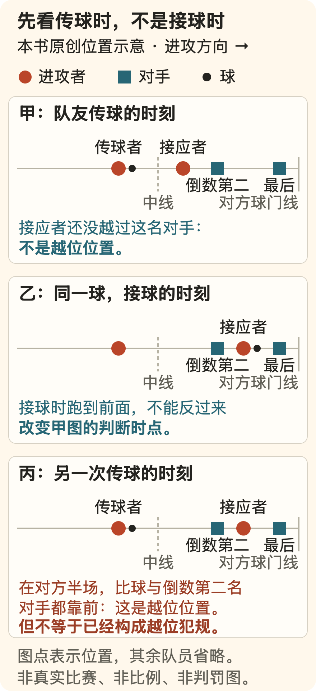

[← 回总目录](../README.md) · [玩游戏](19-games.md) · [去现场](13-live-events.md) · [朋友与关系](05-connection.md)

# 28 · 比分没有变化，比赛也可能正在变

**如果只想知道谁赢，一行比分已经够了。愿意看一场比赛，是还想亲自经历它没决定的时候。**

但“不知道结果”也不是唯一内容。一次没得到球的跑动，一次逼迫对手回传的防守，一次没有投进的合理选择，都可能改变后面的局面。只把得分留下来，比赛就像被剪成了只有结论的争论。

这一章以足球、五人制篮球和网球的若干场上问题为例，讨论怎样看见过程。它不是赛事推荐、球队排名、专业裁判培训或投注分析；也不要求你先成为熟知所有规则的球迷。

[总得分更少，为什么还能赢](#sport-tennis) · [“重新开始”没有清空什么](#sport-reset) · [既然图快乐，为什么接受失望](#sport-uncertainty)

## 先分清自己在看哪一种“比赛”

直播、录像、集锦和比分提醒，提供的不是同一种时间。

直播保留了正在发生的未知；完整录像允许暂停和重看；集锦把被选中的片段并置；比分提醒只保留少量事件。你今天需要哪一种，取决于想经历什么，不必一律把直播排在最上面。

如果只想看精彩进球，集锦完全可以满足。但集锦没有选中的部分，不能自动称为无事发生。一个机会前的几次调动、一次防守变化，可能正好在剪切之外。

同时，完整比赛也不保证每分钟都好看。沉闷可以是真实评价，不需要用“真球迷都懂”堵住。更有用的区别是：你觉得没有变化，还是没有看到自己想看的变化？

先回答这个问题，才能决定要不要多看一个回合，而不是为了证明忠诚继续忍受。

## 足球：球不在脚下的人，也在改变传球的可能

本书用三个虚构角色说明：甲持球，乙站在边路，丙在更靠中间的位置。防守者挡住甲通向丙的线路。若乙向外移动，防守者要选择跟出去还是保留中间；甲的下一步于是可能变化。

乙最后没拿到球，并不证明跑动毫无作用。问题在于防守是否随之调整，原来被封住的空间是否出现，又是否来得及被利用。反过来，乙跑得很远，也不自动证明这次移动有效。

“把注意力放到没有球的人身上”不是要求整场都追踪全部队员。可以只挑一个短片段，看持球队员身边出现了哪几条路：

- 有人靠近，提供一个短传选择；
- 有人远离，把可利用的空间拉开；
- 有人从身后或侧面移动，改变接球位置；
- 防守者不追球，而先保护某条线路。

这些是本书的观察入口，不是任何一支球队的实战数据，也不保证某种移动一定制造机会。对手同样会判断、提前移动或故意让出某一处。比赛的内容就在于双方都不只是被动背景。

所以回传也不一定意味着没有胆量。它可能是在直接路线被封住后重新组织；也可能确实只是无效周转。要看回传之后有没有改变空间和压力，而不是给方向本身贴上勇敢或保守的标签。

## 防守不是等着别人失误

只盯着球，容易把没抢到球的防守理解为“什么也没做”。但让对手只能往一个方向走、不能舒服转身、暂时找不到中路接应，也可以是可见的作用。

设想进攻者面前有两条传球路。防守者先封住其中一条，另一名队友守在剩下一条附近。此时一次看似普通的横传，可能已经是被迫缩小选择后的结果。这个例子展示的是关系，不是万能战术：站位、时机和对方能力改变，结果就会改变。

“压迫”“阵型”“反击”等词有助于讨论，但词不应盖过画面。与其只说“压迫很强”，不如指出谁靠近了谁、哪条线路消失、球因此去了哪里。术语如果不能让你看见更多，就还只是声音更响的评价。

你也可以欣赏防守者使一次危险没有发生，而不必等它变成扑救或抢断集锦。**被取消的可能，也属于比赛正在发生的部分。**

## 越位：不是看接到球时谁跑在最前面

这里依据核读时 IFAB 标示为 2026/27 的第 11 章规则。具体赛事采用哪个版本、是否有获准变通，仍须另核对。[F18](../docs/evidence/F18-football-rules.md)

先分开两件事：**处在越位位置，本身不是犯规；是否因参与进攻而被判罚，是下一步。**

对常见的队友脚下传球，可以先在队友触球传出的时刻问三个问题：接应者是否在对方半场？计入判断的身体部位是否比球和倒数第二名对手都更靠近对方球门线？随后是否以规则所列方式参与了这一阶段的比赛？

手和臂不计入位置判断；“倒数第二名对手”也不等于固定的一名后卫，因为门将不必永远是最后一个人。与倒数第二名对手平齐，或没有比球更靠近球门线，都不能仅因“看起来冲到很前面”就判成越位位置。

示意图把位置抽象为点，其他队员省略，不按场地比例，也不代替真实画面中的身体部位与触球时刻判断。甲、乙是同一次传球的两个时点，丙是另一个情形；不能把三张图连成一段真实比赛。

| 简化场景 | 这个条件能说明什么 | 还不能直接断言什么 |
| --- | --- | --- |
| 队友传球时，接应者与倒数第二名对手平齐 | 不是仅凭这一位置就越位 | 不代表之后不会发生其他犯规 |
| 接球时已冲到防线身后，但传球时没有处在越位位置 | 不能只截接球画面判断越位 | 仍要找准队友触球时刻与实际位置 |
| 传球时处在越位位置，但没碰球 | 只确定了位置这一层 | 仍可能通过干扰对手而犯规；没碰球不是万能免责 |
| 直接从界外球、球门球或角球接球 | 第 11 章列有直接接球不构成越位犯规的例外 | 不能把“直接”删掉，推广到之后每一次传球 |

这张表刻意没有覆盖反弹、对手有意处理球、扑救等全部细节。规则里还有更细的条件，别把入门说明当作可以裁决任何争议的模板。

知道这一点之后，跑动的好看就不只是速度：何时启动、何时传出、怎样与防线位置配合，都可能成为你愿意等的那一下。规则没有消灭自由，它也构成了动作为什么惊险的条件。

## 一条线、一次补时，为什么值得弄清楚？

球看起来已经“在线外”，与整个球越过边线或球门线，不是同一件事。IFAB 第 9 章对球出界使用整个球越线的条件；第 10 章的进球还要求从门柱之间、横梁之下整体越过球门线，并且得分方没有违规。[F18](../docs/evidence/F18-football-rules.md)

这意味着贴着线的画面值得仔细看，但也意味着一个电视角度未必足够。距离、遮挡和透视可能让观众不能确定关系；“我没看清”是比假装拥有所有机位更准确的结论。

补时也不等于已经公布的终场倒计时。第 7 章中，第四官员展示的是裁判决定的**最低补时时间**，可以增加，不可以减少。把显示的数字一到就没吹哨直接解释成偏袒，跳过了规则本身。

这一节只帮助看懂几个边界，不提供某一争议事件的判罚结论。要讨论具体比赛，还需要完整情境、适用规则与当场信息，而不是拿一张截图补齐所有缺口。

## 篮球：同一个回合里，至少有两只钟

以下篮球示例按 FIBA 规则写，不把 NBA、WNBA、NCAA 或三人篮球混用。核读了 2024 版，以及标明自 **2026 年 10 月 1 日**生效的 2026 版相关条款；版本与范围见 [F19](../docs/evidence/F19-basketball-rules.md)。

一只是这一节还剩多久的比赛计时钟，另一只是当前进攻还剩多久的投篮计时钟。看懂两个数字的关系，就能理解为什么同样落后两分、同样有球，选择却未必相同。

投篮计时的常见起点是 24 秒。满足限时投篮，不是只要鸣响前随便把球抛出去：球须在信号前离手，并在离手后触及篮圈或进入球篮。球飞行中时间归零，不能单凭归零判定无效。

设想两张虚构画面：比分一样，比赛计时钟都剩 2 分 10 秒，甲都在外围持球。但一张的投篮计时钟剩 20 秒，另一张只剩 6 秒。同样一次横传，在前者可以是继续组织的一步，在后者却可能让接球队员必须很快做决定。少看的那只钟，恰好改变了你对“怎么这么急着投”的理解。

这不表示剩 20 秒就应该拖延，或剩 6 秒就只能仓促出手。防守位置与已经出现的机会仍然重要。两只钟提供的是选择的条件，不是自动生成最佳答案的按钮。

触及对方篮圈之后，若原进攻队重新控制球，规则规定重置为 14 秒；若由对手取得控制，则重置为 24 秒。注意条件是触圈及控制关系，不是“碰到篮板就获得新时间”。其他中断和重置还有各自条件，不能都套成 14 秒。

这些差别让一次篮板不只是“多拿到球”。它改变了下一段能有多长，也改变了防守是否需要重新面对一轮进攻。观众期待的不只有球进没进，还包括谁把下一次机会留在了自己手里。

## 掩护：有的人没有碰球，却让另一个人多了一条路

FIBA 第 33.7 条把掩护描述为延缓或阻止无球队员到达场上想去位置的尝试，并规定了合法与非法接触的条件；不是身体挡在路上就天然合法。[F19](../docs/evidence/F19-basketball-rules.md)

用一个原创战术示意看它的观看价值：甲持球，乙为甲提供掩护。甲的防守者现在需要处理这道障碍，乙的防守者也要决定是否帮助。乙随后可以向篮下移动，也可以移到其他位置。

这不是只有一个正确答案的机关。防守可能交换各自盯的人，也可能让原防守者绕过，或由另一人暂时靠近持球者。每一种处理会保留某些东西，也会暂时让出某些东西；不能只背“挡拆很有效”就解释所有回合。

观看时可以顺着三步走：**谁让谁改变了路线，谁因此多承担了一个人，球最后去向哪里。** 哪怕最终投篮没进，前面的选择仍然可讨论；即使一个高难度球进了，也不自动说明全部选择最合理。

本书不是教人模仿接触动作。合法掩护涉及接触时是否静止、双脚是否在地面、对手视野以及时间和距离等条件。它们需要按完整条文和具体场景理解，不用一句“站住就行”代替。

## 球没进，可以是好选择吗？

可以讨论，但不能只凭结果反着说。一个进球证明这次得分发生了，不直接证明它在出手前就是最佳选择；一个未进球也不直接证明出手愚蠢。

下面是本书的虚构算例，不是球员统计或球队预测。暂且忽略罚球、篮板、失误以及时间成本，只比较一次投篮得分：

| 假设选择 | 假设命中率 | 单次投篮期望得分 |
| --- | --- | --- |
| 两分球 | 55% | 2 × 0.55 = 1.10 |
| 三分球 | 36% | 3 × 0.36 = 1.08 |

它说明的不是“两分更好”，而是“单次得分更高”与“平均预期更高”不是同一句话。假设条件稍微变动，比较就可能变；真实比赛还存在这张表故意省掉的因素。

最后一攻落后三分时，平均预期的微小差别又未必是首要问题：你需要的结果、剩余时间、是否还有下一次球权，都会改变选择。数学没有替比赛提供唯一审美，也不能从两个假设数字推导真实输赢。

同样，控球时间、投篮数、得分、失误等统计各自回答有限的问题。要理解一个数，先问它数了什么、没数什么、在什么比赛状态下发生。数字可以纠正直觉，也可能把没有被计到的工作藏起来。

## 网球：总得分更少、赢的局更少，为什么还能赢比赛？

假设一场比赛结束，甲赢了 48 分，乙赢了 80 分；甲赢了 12 局，乙赢了 14 局。有人告诉你，获胜的是甲。

不一定是看错了，也不必先猜裁判出了问题。**在下面这个按标准局、三盘两胜构造的例子里，这个结果完全符合计分规则。** 理解它，能看见另一种变化：不仅运动员在改变局面，计分方式也在决定哪些变化可以带到下一段。

先拆开三个容易混在一起的词。网球的一次得分是“分”；若干分决定一“局”；若干局决定一“盘”；再由盘数决定整场。它不是把每次得分直接存进同一个总账户，最后比较余额。[规则来源 F64](../docs/evidence/F64-tennis-scoring.md)

### 先看一局，别被 15、30、40 吓住

标准局里，零分报作 love；赢下第一、第二、第三分，分别报作 15、30、40。这是计分名称，不是说第三次得分只值十分。报分时发球方在前。

如果双方还没有都赢到三分，一方赢下第四分便赢这一局。但双方各赢三分，就成为 deuce，通常称“平分”。接着一方得分，取得 advantage；同一方再得一分，才结束这一局。如果下一分归对方，就又回到平分。这里要的是**平分之后连续赢两分**，不能拿其他局积累的领先来结束眼前这一局。

这段说明限定为标准局。有些比赛使用 no-ad：平分后再打一分决胜，不经历反复的占先和平分。看到不同计分，不要急着说转播错了；先看赛事采用哪种办法。附录还列有短盘等变式，它们不是所有比赛都默认使用的规则。

### 再看一盘，先赢到六局为什么不一定结束？

在这里采用的普通抢七盘中，先赢六局且至少领先两局者赢盘。因此 6∶4 已结束，6∶5 尚未结束；若到 6∶6，则以抢七决定这一盘。通常的七分抢七用 0、1、2……计分，先到至少七分且领先两分者胜，7∶6 本身还不够。

要再分清两种“抢十”。一种是在决胜盘已经打到 6∶6 后，使用十分抢七决胜；另一种是**用一个十分决胜抢七替代整盘**。它们都要求至少十分且领先两分，但发生的位置、此前是否已经打过决胜盘的十二局，不一样。不能把听见的“抢十”一律解释为同一种进程。

本章算例没有进入任何抢七，也不采用无占先或短盘。它只用普通的 6∶0、6∶4 盘分，避免拿一种赛事的变式去替所有网球作答。具体比赛的赛制需要另查赛事说明。[F64](../docs/evidence/F64-tennis-scoring.md)

### 把那场“48 分赢过 80 分”的比赛完整算出来

这是本书原创的**计分构造，不是真实比赛、球员能力估计或打法建议**。甲赢的每一局，实际得分为甲 4、乙 2；乙赢的每一局，实际得分为甲 0、乙 4。没有退赛、处罚或额外积分。

| 阶段 | 局分：甲∶乙 | 实际得分：甲∶乙 |
| --- | --- | --- |
| 第一盘 | 0∶6 | 0∶24 |
| 第二盘 | 6∶4 | 24∶28 |
| 第三盘 | 6∶4 | 24∶28 |
| 整场合计 | 12∶14 | 48∶80 |

乙赢第一盘，甲赢第二、第三盘，因此甲以 **2∶1 的盘数**获胜。

第二盘的 28 从哪里来？乙在自己赢的四局里各得四分，在甲赢的六局里各得两分，所以是 4 × 4 + 6 × 2 = 28。甲只在自己赢的六局中得分，共 6 × 4 = 24。第三盘采用相同构造。

光列一组盘末数字还不够：不能让比赛已经结束后继续打分，再补出想要的合计。这里也给出合法顺序。第一盘六局全归乙；后两盘各自的局胜者依次是：**甲、乙、甲、乙、甲、乙、甲、乙、甲、甲**。它先走到 4∶4，再到 5∶4，最后 6∶4；此前没有任何一方已赢盘。

每个甲赢的局，用“甲、甲、乙、乙、甲、甲”的逐分次序到达 4∶2；每个乙赢的局是乙连赢四分。甲先发球、之后双方轮流发局，也不与这些结果冲突：得分可以由发球方或接球方赢得。完整的逐分展开和结束条件可用 [计分检查脚本](../tools/tennis_examples.py)复核；脚本不生成发球、落点或运动员身体动作。

所以，这不是“乙的数据造假”，也不是“甲运气好”的证据。它只证明：**总得分、总局数和胜负回答的是不同问题；按盘取胜的比赛，不等于按全场总分取胜的比赛。** 48∶80 不会告诉我们两人的真实水平，也不能用来算下一场谁更值得押注。

这一区别把观看从“谁累计得更多”移到“这一分正在决定哪一个门槛”。局点意味着下一分可能结束局，盘点意味着可能结束盘，赛点意味着可能结束整场；这些条件可以重合，但不总重合。同样的一分，在 0∶0 和赛点时会关闭不同的可能。这里说的是规则后果，不是声称每个观众都必然更紧张，也没有给出获胜概率的变化量。

## 比分重新开始，刚才发生的事没有被删除

一盘 0∶6 结束后，下一盘局分从 0∶0 开始；那六局不会变成新盘开局时欠着的六局。可是盘数已经是 0∶1，距离输掉三盘两胜的比赛更近了。**局部重新开始，和整场回到原点，是两件事。**

类似地，标准局里从平分走到甲占先，再被乙追成平分，显示的名称回来了，过程却已经多了两分。规则层面仍需从平分后连续赢两分才结束；运动员的体力、记住的球路和观众刚才经历的期待，则不能由“平分”两个字宣布全部归零。这里不推断某个球员实际疲劳或心理受损，更不假装比分足以测量它们。

这让等待有了具体内容。你不是只能盯着一个永远增长的数字：有的优势会被封存在已经赢下的盘里，有的优势在下一分后消失，有的影响根本没写进计分牌。看见它们怎样衔接，和只等最后宣布姓名，是不同的经历。

但别急着把这套规则升格为人生鸡汤。网球有事先约定的局、盘和胜负条件，生活中的欠款、受伤、照护责任，不会因为你宣布“新的一盘”便被消掉。即使在比赛里，算例也只说明大比分落后一盘后**仍可能**取胜，不说明更可能逆转，更不命令观众或运动员坚持到底。

“重新开始”之所以在这里可讨论，恰恰因为可以指出：**哪一种量重置了，哪一种结果留下了，哪一种影响计分牌从来没负责记录。** 不说明这些条件的重启口号，只是把账藏起来。

## 享受当下，不是把一场比赛拆成互不相干的“爽点”

若把“及时享乐”理解成每一刻都必须比上一刻更开心，那么平分、落后、错失机会都成了应该删掉的瑕疵。可你也可能正想经历一段有起伏、有尽头的时间：不知道这局会在哪里结束，所以愿意看下一分。

这里不是说所有空等都值得，也不是说反复吊胃口天然高明。区别在于：这段等待是否还属于你想看的内容；规则给出的门槛是否让你看懂变化；你能不能在不想继续时退出，而不用先证明自己“配得上球迷”这个称号。

本章的计分例子也不主张“总分较少更高级”。你可以偏爱一边倒的碾压，可以喜欢胶着，可以只想看到支持的人赢。争论应落到具体愿望，而不是把某一种观众封成唯一懂球的人。相同赛制对你可能是悬念，对另一个人可能只是冗长；规则核对能纠正“怎么算赢”，不能替人裁决“该喜欢什么”。

**耍起可以是认真经历一次起伏，而不是不断追购更强的一下刺激。** 这个“认真”不是为未来积攒好处，也不是拿观赛成绩换身份；是承认眼前的来回本身可以值得一段完整的时间。于是“当下”不必缩成一次按钮、一个进球、一阵欢呼，它也可以是一局尚未结束、而你仍愿意留在其中的比赛。

这与[亲自玩游戏时暂时投入一个目标](04-play.md#play-wanting-to-win)相关，但不是同一处境：观众不能替运动员选下一步，不能要求对手配合制造悬念，也不能把自己的期待当成球员欠下的结局。愿意观看，是选择参与期待，不是买到对别人的控制权。

## 喜欢一支队，不必把一场失利变成自己输掉一天

支持某支队伍，会让一些原本中性的事件对你有分量。熟悉的球员做出选择，和随机一张比分表跳动，不是同一种期待。偏爱本身无需装成客观排名。

但偏爱不要求取消判断。可以承认对手的一次配合漂亮，也可以批评支持球队的表现；不需要把每个判罚都改写成阴谋，来证明自己站得够坚定。

和朋友一起看时，可以先确认谁在意剧透、是否边看边聊、对方愿不愿意接受规则讲解。一个人刚发现这项运动，不欠别人资格问答；一个人想安静看，也不必负责调动全桌气氛。

对场上表现的批评不授权辱骂球员的家人、性别、地域或其他身份。球员是比赛参与者，不是观众可以无限倾倒失望的人。你的投入可以是真的，别人的边界也是真的。

输赢不可由观众保证，投入多也不兑换结果。是否继续看下一场，应当仍是一个愿望，而不是必须把上一场的失落赢回来的债。

## 最强的反对意见：既然图快乐，为什么要看可能令人失望的东西？

这个问题确实挑战“只要即时满足”的最简单版本。比赛可能迟迟没有得分，也可能最后让支持者失望。不能一边承认结果未知，一边保证只收快乐不收失落。

我们的回答不是把难受硬说成有益，而是区分两种愿望：只想得到一个满意结局，和愿意经历一个自己在乎但不能控制的过程。后一种选择可以包含紧张、迟疑、突然欢呼和结尾失望；它的价值由本人判断，不靠“锻炼心态”追加证明。

这也保留了不看的权利。若最近只想要熟悉、稳定的娱乐，完全可以选一场已知结果的录像、只看喜欢的片段，或者换别的事情。刺激的强度与未知的份量，不是越多越好。

**享受当下，不是要求当下每一秒都满意；是让你有权选择，哪些不确定值得亲自经历。** 比分会决定比赛的胜负，但不该独自决定这一段生活有没有内容。

规则来源见 [F18](../docs/evidence/F18-football-rules.md)、[F19](../docs/evidence/F19-basketball-rules.md)、[F64](../docs/evidence/F64-tennis-scoring.md)。角色、战术过程、投篮概率与网球计分算例均为原创虚构，没有对应真实比赛，也没有测量这些看法是否提高观赛快乐。
