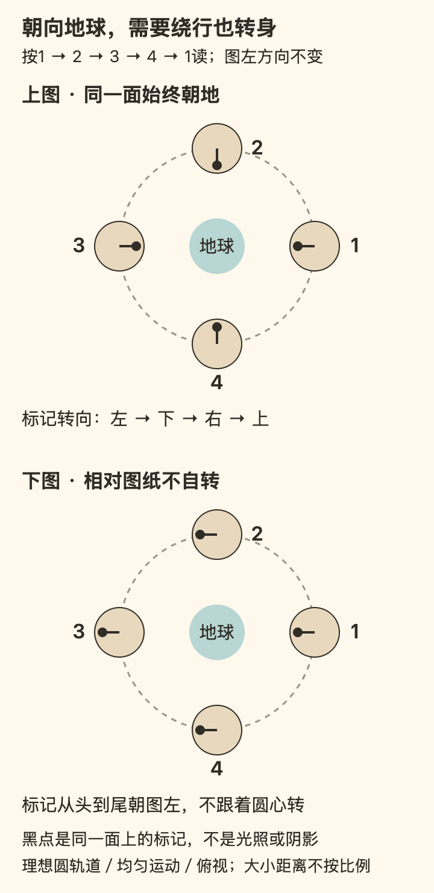

[← 回总目录](../README.md) · [在附近发现](15-neighborhood.md) · [拍照与观看](20-photography.md) · [不稀有的鸟](30-birdwatching.md)

# 29 · 星空不负责出片

**你可以很想拍到一轮漂亮的月亮。但照片没有成功，不等于那个晚上没有发生。**

如果夜空只剩下超级月亮、流星雨和别人镜头里的银河，普通晚上就像永远没有赶上正式演出。我们想换一个问题：除了等待罕见事件，头顶已经出现的东西，究竟有什么可以看？

这一章从月亮开始。不是因为它“高级”，而是因为它的形状、明暗和出现时段本来就在变化。看出这些关系，得到的不只是几个天文学名词，而是一种区别：眼前的天空，不再只是某张宣传照片的低配版本。

可以顺着读，也可以先挑一个问题：[总朝向我们，为什么仍在自转](#moon-rotation) · [月球背面是不是永夜](#moon-day-and-night) · [同一张脸为何还会摇晃](#moon-changing-view) · [看月亮也要先做功课吗](#moon-knowledge-and-wonder)。

## 先分清：你要看天空，还是要拍出一种天空

两种愿望都成立，但不能让后一种偷偷成为前一种的合格证。

如果目标是照片，就需要在意画面里的亮暗、构图、设备能记录什么，以及处理后的结果是否符合自己的意思。若目标是观看，还可以在意另一组事情：刚才遮住月亮的云移到哪了，月面边缘有没有露出来，附近屋顶与天体的位置关系如何变化。

这里没有“肉眼更真实、摄影更虚假”的高下。照片、视频、星图和现场观看回答的是不同问题。别人发布的作品可以是经过选择和处理的表达；它没有义务等同于你站在街边一眼看见的样子。但若作品被拿来承诺一次旅行“必然亲眼看到这样”，就该核对具体拍摄条件，而不是拿自己的眼睛承担失望。

也别把亲自观看变成另一场考试。看了一会儿觉得普通，可以就是普通。重要的是，你在评价自己刚才经历的东西，而不是有没有完成一张预先存在的标准答案。

## 月相不是地球每晚挡住一点月亮

月亮不靠自身发光让我们看见，月光主要是反射的太阳光。通常，太阳照亮月球约一半表面；月球绕地球运行，我们从地球看见的受光部分比例随之改变。新月、弦月、满月说的就是这种视角变化。[F21](../docs/evidence/F21-night-sky.md)

**普通月相变化不是地球的影子每天盖上去一点。** 地球的影子遮到月球，是月食涉及的另一种几何关系。把两者混在一起，会让“月亮为什么缺一块”从第一步就解释错。

可以用一个思想实验理解：一盏灯照着球，球总有亮的一面和暗的一面。你站在不同位置，能看见的亮面份额不同。不是球被切掉了，也不是灯每天少照一点。这只是简化模型，不要拿灯球距离去推算真实天空。

于是，“半个月亮”和“上弦”并不矛盾。“半”描述眼前月面圆盘大约一半明亮；“上弦”位于新月之后、满月之前，是月相周期中的一个阶段。下弦也看起来约半明半暗，却在满月之后。只说“今晚半个月亮”，还不足以说明自己看见的是哪一种。

月相的一轮重复约为 **29.5 天**；月球相对恒星绕地球一周约 **27.3 天**。这不是两个来源互相打架，而是参照不同：在月球绕行期间，地月系统也沿绕太阳的轨道前进，要回到相同的日地月相对关系，还需继续运行一段。[F21](../docs/evidence/F21-night-sky.md)

数字有用的地方是解释变化，不是要求你记到小数点。连续几个晚上再看，问“明亮部分在增加还是减少”，通常比先背完八个名称更能把概念和实际连起来。若天气遮挡或没有看到，就保留空白，不替天空补作业。

## 总朝向我们，恰恰需要它转身

“我们总看到月亮的同一面，所以月球不自转。”这句话听起来很顺，错在悄悄换了参照。

月球大致保持同一面朝向地球；相对远方的固定方向，它仍在自转。自转一周与绕地球公转一周的周期相同，称为**同步自转**。NASA 的潮汐锁定说明用相对而舞来比喻这种关系：绕着伙伴走一圈，同时不断转身面向伙伴。[F56](../docs/evidence/F56-moon-rotation-and-view.md)

可以不靠想象一个人在转，直接看图。小圆代表月球，圆内的黑线和黑点固定在同一面上。数字按右、上、左、下的顺序排列；“图左”始终是同一个方向，不跟着轨道转。

**上图：同一面始终朝地。** 在位置1，黑点朝图左；到了位置2，必须改朝图下；位置3朝图右，位置4朝图上，再回到位置1时又朝图左。绕了一周，这一面相对图纸也转了一周。不是“公转替代了自转”，而是两种转动配合，才让中央观察者总对着这一面。

**下图：相对图纸完全不自转。** 黑点从头到尾都朝图左。在位置1，它朝向地球；到位置3，它却背向地球。月球虽然没有相对固定方向转身，地球观察者反而会看到不同面。记住一句就够：**同一张脸一直对着圆心，不等于这张脸一直对着同一个方向。**

这张图只回答“需不需要自转”。它使用理想圆轨道、均匀绕行和俯视视角，天体大小及距离不按比例；不画太阳，不表示月相，也不能据此预测今晚月亮的位置。现实月球与理想模型之间的小差别，正是后面天平动的问题。[F56](../docs/evidence/F56-moon-rotation-and-view.md)

还要分开“这是什么关系”与“为什么形成这种关系”。图展示前者，不解释形成过程。NASA 的科普把后者放在潮汐形变和能量耗散中讨论：地球引力使早期月球形变，形变对作用存在滞后，相关过程逐渐改变月球自转，最终形成同步状态。不能把这个漫长过程说成月球主动选择面向我们，也不能从“潮汐锁定”四个字推出双方都不转。**今天的地球并没有总以同一面朝向月球。** [F56](../docs/evidence/F56-moon-rotation-and-view.md)

## 月球背面不是一个永夜的地方

“面朝哪里”与“有没有被照亮”是两个问题：前一个要问相对于谁，后一个要问光从哪里来。

- **近侧、远侧**按与地球的关系区分，通常也叫正面、背面。
- **白昼侧、黑夜侧**按太阳照到哪里区分，随日月相对关系变化。

同步自转锁住的是月球与地球之间的朝向关系，不是把月球的一面永远固定朝太阳。因此，**大致同一面朝向地球，并不妨碍月球上经历昼夜。** 除了极区局部地形等特殊情形，不能把一整半球叫作永久黑暗区。这里也不需要借“神秘的背面”制造悬念：真正有趣的是，两个日常都叫“这一面”的词，其实在切分不同关系。[F56](../docs/evidence/F56-moon-rotation-and-view.md)

以前面说的月相反过来检验：满月附近，我们面对的半球大部分受太阳照亮；新月附近，面向我们的部分大多处在夜晚，远侧反而大多受到日照。月球没有为了变成新月，把原本的背面翻给我们看。**换的是受光关系，不是换了一张脸。**

“转一圈约27.3天”和“月相重复约29.5天”也就可以接起来：前者以远方固定方向为参照；后者还要追上地月系统绕太阳前进后改变了的日照方向。因此在月面一个通常有昼夜交替的地点，两次相近的太阳照明状态之间也约隔一个月相周期，而不是地球上的24小时。这里只讲平均关系，不推算某个环形山几点日出，也不把月面各处都当成平地。[F21](../docs/evidence/F21-night-sky.md) [F56](../docs/evidence/F56-moon-rotation-and-view.md)

## 大致是同一张脸，为什么还会摇晃

同步自转常被缩写成“永远只能看同一半”。这句话足够开始解释，却不够解释全部细节。

NASA 的月相与天平动资料明确说，并不是每次都恰好同一张脸。轨道形状、倾斜等几何关系使观看角度在一个月中有所变化；把这些视图连续播放，会像月球略微左右、上下摇晃，称为**天平动**。有时能多看到某一侧边缘以外的一小部分，换个时候又轮到另一侧。这不等于月球突然失去同步，更不等于能从地球随时看到完整背面。[F56](../docs/evidence/F56-moon-rotation-and-view.md)

用另一种小物件关系区分两种变化：你把一个画着点的球拿在眼前，视线绕球偏一点，点在可见圆盘中的位置与可见边缘会变；如果只换灯的位置，点并没有因此搬到别处，但照明会变。这个类比只帮助分清视角和光照，不模拟真实月球运动。

专业资料还有一个方便的参照：**月面上地球位于头顶的点**。在以地球中心为观察位置的示意里，它对应月面圆盘的表观中心。跟踪这个点在月面经纬度上的变化，可以表达天平动；不要把它误认为永远刻在同一座环形山上的定位钉。[F56](../docs/evidence/F56-moon-rotation-and-view.md)

于是，一幅月亮画面至少可以从四个方向提问：

| 看起来什么变了 | 先分清的关系 | 不能直接推出 |
| --- | --- | --- |
| 明亮部分增减 | 太阳照亮的部分，有多少朝向我们 | 地球影子正在制造普通月相 |
| 边缘多露出一点，月面特征相对圆盘位置略变 | 从哪个角度看月球；天平动 | 月球突然把完整背面转来 |
| 整张月面像稍微转了个角度 | 月球自转轴投影，相对画面的哪一个方向 | 只凭“歪了”就判定是哪种天平动 |
| 圆盘看起来大小不同 | 地月距离，以及照片的缩放、裁切是否一致 | 月球本体在一月内忽大忽小 |

NASA 的2026年可视化把月相、天平动、自转轴位置角和视直径分开列出，正因为它们不是同一个变量。其位置角相对的是天球北方，不是你手持手机时画面的上边；其示意以地球中心为观察位置，也不是某个城市阳台的实时视野。[F56](../docs/evidence/F56-moon-rotation-and-view.md)

这些差别不是街边肉眼都能轻易认出的细节。比较记录时，得先问时间、视角、图像方向与比例有没有交代；两张任意裁切的照片，不足以判断月球真的显得大了多少。没看出细微摇晃并不构成观察失败——这部分知识首先解释的是图像里可能发生什么，不是承诺你今晚一定看到什么。

## 满月最圆，不等于每种观看都最好

“月亮越圆越值得看”把不同目标混成了一个排名。

想欣赏一个明亮的完整圆盘，满月当然有吸引力；想理解月面起伏，日夜交界附近的光照却提供了另一种内容。NASA 的观月说明指出，月面昼夜交界线附近的长阴影有助于凸显环形山与山地；这些细节通常需要适当放大才能辨认。不能把望远镜视野中的细节承诺给街边肉眼观看。[F21](../docs/evidence/F21-night-sky.md)

这条交界线叫**明暗界线**，也常见英文名称 *terminator*。它分开月面正在白天和正在夜晚的区域，不是月球的实际边缘，也不是地球投影的边界。

注意这三个“边缘”：

| 你说的边缘 | 在区分什么 | 不该混成什么 |
| --- | --- | --- |
| 月面圆盘的外轮廓 | 从这里看去，月球与背景天空的分界 | 被月相切出来的一块缺口 |
| 月面明暗界线 | 月面的白天与夜晚 | 地球每天投上去的影子 |
| 山地、环形山的局部阴影 | 地形遮挡太阳光造成的明暗 | 月球表面真的涂了黑色轮廓 |

即使不看细节，肉眼也可以留意月面较暗的大片区域。许多叫作“海”的区域，实际是古老熔岩形成的暗色平原，不是今天正有海水波动的海洋。名字会保留历史想象，但观看时可以把名字与物质分开。[F21](../docs/evidence/F21-night-sky.md)

这样再看月亮，问题就变了：不只是“拍圆没有”，还可以是“同一个地方的光照为什么不同”“暗色大块与细长阴影是不是一回事”。知道一点知识，不必把惊讶换成考试；它可以只是让同一个对象多几个值得看的地方。

## 傍晚找不到月亮，不一定是被楼挡住了

月亮并不是每天晚上都在同一个时间升起。月相与大致出现时段有关，地点、季节和地平线条件也会影响实际观看。[F21](../docs/evidence/F21-night-sky.md)

下面只是**多数纬度下的粗略关系**，不能作为你所在地某一天的升落时刻表：

| 月相附近 | 大致的出现节奏 | 对晚上观看的意义 |
| --- | --- | --- |
| 上弦 | 中午前后升起，午夜前后落下 | 傍晚通常已有机会看到，不必一律等深夜 |
| 满月 | 日落前后升起，日出前后落下 | 可能贯穿夜晚，但仍要看天气与遮挡 |
| 下弦 | 午夜前后升起，中午前后落下 | 晚饭后找不到，并不能说明今天没月亮 |
| 新月 | 与太阳大致同升同落，朝向我们的部分通常不明亮 | 不是把搜索范围移向太阳、拿望远镜四处扫 |

这些关系的价值，是在出门前先判断自己期待的东西是否可能出现。想知道某天几点、哪个方向，必须按**日期、地点和当地时区**查询，不把一张外地截图当作自己的天空。手机指南针与星图的指向也不应被当成绝对无误的测量。

看到白天的月亮，不需要立刻把它当异象。月亮不是夜晚专属的演员。反过来，晚上没有看到，也不自动证明软件错了：它可能尚未升起、已经落下，或者被云和建筑遮住。

**本章只提供夜间观月入口，不指导寻找靠近太阳的天体。** 不用肉眼直视太阳，也绝不把普通相机、双筒镜或望远镜对准太阳观察。日食眼镜不能使透过普通望远镜看太阳变得安全；光学观日需要适配的专业太阳滤镜与专业指导，不能用本章的月亮知识替代。[F21](../docs/evidence/F21-night-sky.md)

## 为什么细月牙旁边，有时还能隐约看见剩下的圆

有时明亮月牙之外的暗面也能被微弱地照出来。这种现象叫**地照**：太阳光先照到地球，一部分再被反射到月球，最后进入我们眼睛。这里的地球在送来一点光，不是在制造那块暗面。[F21](../docs/evidence/F21-night-sky.md)

它值得看，不只是因为“又认出一个现象”。同一个月面上，明亮月牙主要呈现直接反射的太阳光，暗面微光则让地球也加入了这条光路。你没有换地方，却在同一幅景象里看见两种来路。

不必保证某次一定见到，也不要为了追求细月牙而靠近太阳方向搜索。把它当作在安全夜间观看中可能遇到的内容就够了。看不到时，可以说“没看清”，不必用过度放大的模糊照片证明自己必须看见。

## 星座是天空的地图，不是一群真的排成图案的邻居

从地球看，一些星星仿佛组成勺子、猎人或动物。但看起来挨得近，不代表它们在空间中彼此接近；连线也不是宇宙中真的存在的绳子。NASA 的星座教学用不同距离的星星解释这种投影视角，并说明不同文化对星群有不同命名传统。[F21](../docs/evidence/F21-night-sky.md)

这不必让故事扫兴。你可以同时知道两件事：图案是人在观察位置上建立的联系；借这个联系，确实更容易交流“我说的是哪一片”。地图的好处不是成为风景本身，而是帮助人找到东西。

同样，某个星座的名称出现在星图里，不代表它现在就在你的屋顶上方。地点、季节和时间改变可见天空。把软件的时间拨到别的日期，或者沿用另一个半球的图，可能得到一张很清楚、却不属于此刻的地图。

刚开始不必一次认出整片天空。可以只确认一组彼此关系明确的亮点，再回到肉眼核对。没有核对成功就保留疑问；“我猜这是某颗星”与“我已经确认”是两种不同记录。

## 城市夜空不是失败的郊外夜空

人工照明散射到天空会让暗弱星体更难辨认；天空亮度、天气和遮挡确实限制能看到什么。不能靠一句“只要用心就有银河”把物理条件说没了。NASA 的观星问答也明确解释了光污染对较暗星星和银河的影响。[F21](../docs/evidence/F21-night-sky.md)

但由此推出“城市没有任何值得看”，又把目标缩窄了。月亮的月相、云层露出的亮点、同一地点不同夜晚的变化，与追寻暗夜银河不是同一任务。

这不是要求没有条件的人把小体验说成足以替代一切。如果你想看更暗的天空，这个愿望可以保留；只是今天的一小段观看，不必因此被判为零分。相反，如果你此刻只想看看月亮，也不需要被升级成一次远郊旅行和器材采购。

选位置时，先解决能否稳定站立、能否正常返回、是否有车辆和临边风险。不在车道、铁路、无防护屋顶或水边追求“无遮挡”；不擅自进入关闭场地。共享空间里少用强光照向别人，也不把别人的窗户纳入不必要的拍摄。看天不值得以看不见脚下为代价。

## “我就是为了那场流星雨去的，没看到当然失望”

当然。**承认普通天空有内容，不等于禁止为具体目标落空而失望。**

如果你为了某个现象安排了交通、住宿和时间，天气让它不可见，损失是真实的。不能用“过程最重要”把成本一笔勾销，也不能在事后说你不够懂享受。

更准确的区分是：目标没有实现；这次过程里有没有另外一些自己愿意保留的部分。两者可以同时为真，不需要相互吞掉。可以觉得月亮好看，同时判断这趟专程不值得。也可以觉得一无所获，决定以后不再为同样的宣传付出这么多。

自然观察与按下播放键不同，我们不能命令天气、月相和天体按预约出现。愿意接受这种不确定，是选择的一部分；不愿接受，也是一项有效偏好，而不是审美不足。

## “看个月亮也要先上课，还算享受当下吗？”

这是比“多懂一点总没坏处”更强的反对意见。如果每次出门都要查资料、核概念、纠正同伴，夜晚确实可能变成另一份工作。一本讲快乐的书，不能把门槛藏在“提升审美”后面。

但把知识一律当作功课，也会漏掉另一种快乐：**有些惊奇不是来自第一次见，而是来自第一次看懂自己见过的东西。** 月亮并没有换一颗，“始终朝地却仍在转”“背面也有白天”改变的是熟悉景象里的问题。这里不必许诺理解以后一定更感动；能多分清一个关系，本身也可以是读者想要的趣味。

区别在于，知识此刻是被拿来享用，还是被拿来审查。有人指着月亮说“今晚真圆”，同伴可以一起看，也可以在对方好奇时聊起月相；不必立即纠正它离严格满月还有几个小时。某个陈述在观测报告里需要精确，不表示所有聊天都应改造成观测报告。科学解释不欠诗意，诗意也不自动享有冒充事实的权利。

因此，我们不在“无知地浪漫”和“懂行地扫兴”之间二选一。查资料可以成为当晚的一部分，也可以等兴趣出现时再查。真正应当反对的是把两者排成身份等级：懂术语的人未必更会享受，什么都不查的人也未必更真实。

本章不承诺普通月亮能够替代银河、流星雨或一次期待已久的远行。它提出的只是另一条获得新鲜感的路：除了更稀有的对象，还可以是同一个对象里以前没有注意过的关系。**新鲜不只发生在目的地，也发生在问题里。** 这是一种值得尝试的价值选择，不是给所有人的快乐配方。

## 不把夜空记成成绩单，也可以留下细节

如果想记，写三件自己确实看见的事就有内容：明亮部分大致多少，出现在屋顶哪一侧，有没有云经过。再把解释放到另一行：“可能是上弦，尚未按日期确认。”

下面是**虚构的记录格式示例**，不是某个日期地点的观测报告：

> 看见：月面约半明半暗，在我面对的楼顶上方；薄云经过时轮廓变软。
> 还不知道：这是上弦还是下弦；位置变化中有多少来自我移动了站位。
> 下次想比较：从同一个安全位置看，明亮部分有没有增加。

这种记录保留了当时的注意力，而没有把猜测升级为发现。你也可以不写、不拍、不查名字。知识是让观看多几种可能，不是给每一次抬头增加结业手续。

**耍起，有时不是等一场天大的奇观，而是不把已经发生的那个晚上，全交给照片来裁决。**

---

月相、地照、月面与星座概念及观日边界见 [F21 · 夜空知识与观看条件](../docs/evidence/F21-night-sky.md)；同步自转、观看角度与原创模型见 [F56 · 月球自转、昼夜与观看角度](../docs/evidence/F56-moon-rotation-and-view.md)。本章的价值判断、思想实验和记录格式是本书原创表达；NASA 科普不验证它们的快乐效果。本章未进行特定日期的本地天象预报、器材实测或现场观测。
