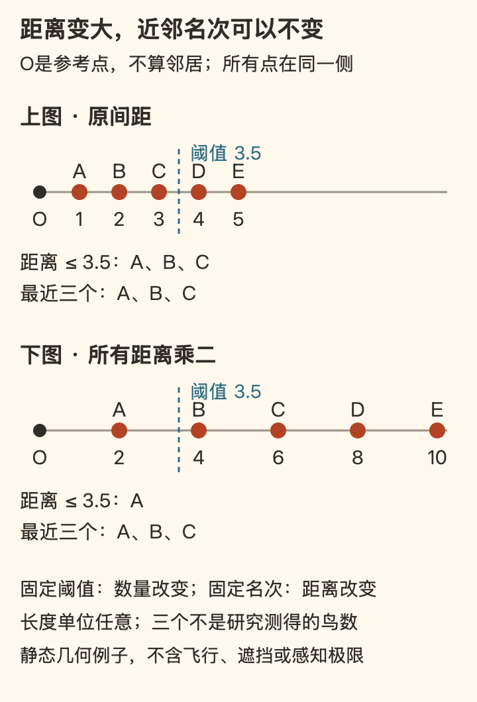

[← 回总目录](../README.md) · [附近不是过渡地带](15-neighborhood.md) · [摄影](20-photography.md) · [夜空](29-night-sky.md)

# 30 · 不稀有的鸟，就不值得看吗？

**一只鸟不需要先成为稀有记录，才配占用你的十分钟。**

你可以喜欢认出新物种，也可以喜欢清单增长。但如果“早就见过”就意味着不必再看，观鸟很快会只剩下更新库存：没有新名字的下午，仿佛什么也没发生。

这一章想保留另一种乐趣：看同一只鸟怎样移动、停顿、换位置；学一点辨认方法，却不把每次相遇都变成考试；承认它是有自己活动的动物，不是随时可以叫出来的拍摄对象。

沿四条主线读：[名字与具体所见](#birds-identification) · [鸟群怎样排列，又怎样转向](#birds-relations) · [专程、等待与不打扰](#birds-encounter) · [工具、清单与稀有](#birds-recording)。也可以先看一个反差：[一群不只是许多只](#birds-flock) · [整齐不等于同时](#birds-turn-sequence) · [没有穿过鸟群，也能从侧面变到前面](#birds-turn-position)。

## 一、知道它叫什么，也别丢掉实际看见的东西

先区分线索、候选与确认，再看一个动作怎样接着另一个动作。认出名字和愿意继续看，不必互相取代。

### 名字很有用，但名字不是你看到的全部

认出物种，可以帮助查资料、讨论分布、比较记录。没有必要把“我只是看看”塑造成比认真鉴别更高尚。知识与喜欢并不冲突。

但“这是一只麻雀”也不是观察的终点。它在哪里落脚？移动前停了多久？和旁边的鸟是在同时行动，还是一只先走、其他随后？这些问题并不都靠再背一个名字解决。

想象两个**虚构的片段**：

- 甲说：“又是麻雀。”收起相机离开。
- 乙还没确认种名，但注意到一只鸟几次从灌丛边落到地面，在相近位置停留，随后回到遮蔽处。

不能据此判定谁更会观鸟。甲可能只是在完成一项特定调查；乙可能连行为解释都还不确定。但若目的就是度过一个有内容的下午，乙已经有东西可看，不必等鉴定完成后才批准自己感兴趣。

### 先描述形状和位置，再猜名字

“小小的、棕色的”通常不足以完成辨认。可以把自己看到的拆成几类线索，再去对照合适地区的图鉴。下面是本书的观察框架，不是一个保证识别成功的算法。

| 线索 | 可以具体到什么 | 容易跳过的限制 |
| --- | --- | --- |
| 轮廓与比例 | 嘴短粗还是细长，尾与身体相比多长，站姿怎样 | 角度、羽毛姿态和距离会改变观感 |
| 颜色落在哪 | 头顶、面颊、喉部、翅上分别有什么斑块 | “整体棕色”会把位置关系丢掉 |
| 动作 | 落地、跳动、走动、转头、啄取、飞回哪处 | 一个动作不是一个物种的专属身份证 |
| 所处环境 | 地面、枝条、水面、楼体或灌丛边 | 地点是线索，不是排除其他可能的判决 |
| 声音与可见个体 | 是看见这只张嘴发声，还是只听到附近有声 | 声音可能来自另一只或被遮住的鸟 |

最有用的顺序，往往不是尽快把名字填上，而是先保住容易忘记的细节。“白色面颊上有一块黑斑”比“挺像图片里的那个”更容易再次核对；“没看清头顶”也比猜一个颜色更有用。

颜色尤其需要问“在哪”。下巴的黑色、眼后的黑色和面颊中的黑斑，不是可随意互换的装饰。把位置说清楚，可以让一个看似普通的小鸟开始有结构。

### 一个具体例子：两种“麻雀”不能只靠屋边还是树边来分

这里比较 *Passer montanus* 与 *Passer domesticus*，分别对应 Eurasian Tree Sparrow 与 House Sparrow。为避免不同口语称呼混淆，这个对照以英文名和学名确定对象，下文“家麻雀”指后者。

RSPB 的两份物种条目提供了一个适合练习的对照：前者有栗褐色头顶、白面颊中的深色斑；后者成年雄鸟有灰色头顶，面颊没有前者那样的独立黑斑。家麻雀的雌鸟和幼鸟又不同于成年雄鸟，不能拿成年雄鸟照片当全体模板。[F22](../docs/evidence/F22-bird-identification.md)

| 对照对象 | 来源中可用的几个特征 | 本章保留的限定 |
| --- | --- | --- |
| Eurasian Tree Sparrow，*P. montanus* | 栗褐色顶冠、白面颊与深色颊斑；成鸟雌雄外观相近 | 幼鸟外观较淡，不要求所有个体像同一张标准照 |
| House Sparrow，*P. domesticus* 成年雄鸟 | 灰色顶冠、黑色喉胸斑；没有上述独立颊斑 | 这行特征不能套给雌鸟和幼鸟 |
| House Sparrow 雌鸟、幼鸟 | 头部花纹较简单，缺少雄鸟那样的黑色喉胸斑，眼后常有较浅的纹路 | “没黑斑”本身不足以在所有小型褐色鸟中定种 |

这个例子不在教你“见到栗色头就是某种鸟”。它在说明：**辨认用的是特征组合，还要知道自己在比较哪一类个体。** 如果只见到一瞬间的背影，就还没有获得表格里需要的信息。

同样不能从英文名字推断“在树上一定是 Tree Sparrow，在房子上一定是 House Sparrow”。名字不是地点规则。RSPB 条目还明确区分了英国与欧洲大陆的一些生活环境描述，这本身就在提醒：某地的常见情境不能直接套到别处。[F22](../docs/evidence/F22-bird-identification.md)

这些来源是英国机构的物种介绍，**不是你所在城市的鸟类名录或当季分布证明**。这里借它们核对形态对照，不搬用英国保护等级、种群趋势和出现概率来描述中国。真正确认本地观察，还需核对本地区资料，并允许名单之外的其他候选。

### 看行为：少一点剧情，多一点前后顺序

看见鸟把头转向你，可以写“它转头朝向我”，但不急着写“它欢迎我”；看见两只靠近，可以描述距离与动作，不自动写成“一对恋人在约会”。

拟人化作为玩笑可以有趣。问题出在玩笑变成了对动物状态的确信，甚至被用来解释为什么可以继续靠近。

更有内容的观看，是把一个动作前后接起来。比如下面这段**虚构示例**：

> 鸟原来在地面啄取，行人经过后停下；行人离开，它又低头；另一只落在附近，两只随后都进入灌丛。

这里已经有顺序、环境变化和个体关系，却还不能确定它们啄到了什么、是不是因同一个原因进入灌丛，更不能判断彼此亲属关系。

你可以把观察与解释分两行：

- **看见的**：停下、转头、重新低头、进入灌丛。
- **可能的解释**：周围动静改变了注意方向；尚未排除其他原因。

第二行不是没有价值，只是需要保留“可能”。把不确定留下来，下一次才有东西可以继续比较。过早讲完一个很像故事的故事，反而可能关闭观察。

## 二、鸟群不是一张会移动的剪纸

数量、空间组织和转向过程是不同问题。下面两项椋鸟研究分别提供结构与轨迹材料，不把它们合成一条适用于所有鸟群的规则，也不以动物行为证明人的理想相处方式。

### 一群鸟的精彩，不只是把单只的精彩乘以数量

假想眼前有一群鸟，起初像一片宽云，后来变成细带，又散成几个团。你没有认出任何新物种，物种清单没有增长，但观看对象已经变了：不再只是某一只有什么花纹，还包括许多个体怎样构成一个会变化的整体。

这不是说鸟越多越壮观，或大群才值得专程看。两三只在同一处取食，也能出现轮流、靠近、让开、同时离开的关系。重要的区别是：**“有多少”描述数量，“怎样在一起”描述组织；知道前者，并没有看完后者。**

尤其要留意照片的平面与鸟群的空间不同。一张图里两个点挨得近，不保证实际相距也近；一条看起来紧密的带，可能包含前后方向上没显出来的厚度。反过来，轮廓突然变窄，也未必意味着整群真的挤得更密，观察角度就可能改变投影。

Ballerini等人的一项研究从不同位置同步拍摄椋鸟群，再匹配不同照片里的同一个体，以重建三维位置。论文图1把同一群的重建结果从几个角度展示：不换鸟群，轮廓也可以明显不同。[B30](../docs/evidence/B30-flock-relations.md)

这里没有要求你在公园重建三维模型。恰恰是知道单一视角少了什么，才可以既尽兴地看，又不急着替每次变化宣布原因。

### “离我多远”与“第几个近邻”，不是同一种关系

那项研究问了一个具体问题：鸟与周围个体的联系，更像跟固定距离内的邻居发生关系，还是跟距离排序靠前的若干邻居发生关系？

暂时离开鸟，先看五个排在起点右边的点。按距离从近到远叫A、B、C、D、E。这里是本书原创几何例子，不是实测鸟群、飞行轨迹或行为仿真。

如果规则是“选距离不超过3.5的点”，上图会选A、B、C，下图只选A。阈值没有变，入选数量却随着间距扩大而变了。

如果规则是“选最近三个点”，两图都选A、B、C。入选数量没有变，但第三近点距O从3变成6。**空间被拉开，并不必然打断一个按名次定义的邻近关系。**

这就是两种问法的差别：前一种先画一条距离线，再看里面有谁；后一种先确定近邻数量，距离可随疏密变化。论文把这种近邻排序称为拓扑距离，与以米等长度单位量出的距离区分。这里不需要把“拓扑”理解成某种神秘联结。

图中三个近邻只是方便看清规则，不是研究测得的数值。它还省略了方向、遮挡、速度和个体交换位置：如果B飞走，或D变得更近，名单会变；名次稳定不等于朋友身份永远固定。放大得无限远也不保证动物仍能感知邻居。

### “六七个邻居”是怎样来的，又没有告诉我们什么？

这项2008年的论文分析了2005年12月至2006年2月在罗马一处夜栖地记录的10个椋鸟群飞事件；重建的鸟群最多约2,600只。研究不是让每只鸟报告“我正在注意谁”，也不是先规定七只，再看它们能不能飞。[B30](../docs/evidence/B30-flock-relations.md)

作者比较的是**个体在周围哪些方向上更常出现**，以及这种不均匀排列能延续到第几个近邻。他们把结构变化用作相互作用范围的间接线索。对这些事件，估计范围平均约6.5个近邻；在不同疏密的鸟群间，按近邻数量算的范围较稳定，按米算的范围则随疏密改变。

这支持了该研究中的近邻排序解释，却不能缩成“每只鸟任何时候只看七只”。它是带不确定性的群体估计，不是逐只逐秒的视线记录；更不是它们全都在数数，或我们已经知道全部神经机制。

样本也有边界。研究者从约500个拍摄事件筛到50个，再选择10个边界清楚、凝聚、数量较大的群体；过密、难以重建的情况被排除。**适合被测清的鸟群，不自动代表所有鸟群。** 单个记录最长约8秒，也不是对同一群鸟整个晚上的连续追踪。[B30](../docs/evidence/B30-flock-relations.md)

因此，不能把椋鸟的结果直接贴给麻雀、鸽子、鱼群或你和朋友的小聚会。它让“共同运动可以怎样组织”多了一种具体可能，而不是给万物找到了一条社交人数定律。

### 看起来一起转，不等于同一刻转

一群鸟忽然改变方向，很容易让人觉得整群被一只无形的手拧了过去。但“转完之后仍然整齐”没有回答中间发生的先后：它们可能分别回应同一个外界变化，也可能从局部开始，变化再传到其他个体。只看结束那一帧，不能分清这两种过程。

Attanasi等人2015年的研究把这个问题放到真实轨迹中。研究者在罗马记录了12次椋鸟群转向事件，用三台同步高速相机，以每秒170帧重建个体的三维运动；记录长1.8至12.9秒，选择的是没有观察到外界明显变化的转向。[B49](../docs/evidence/B49-flock-turns.md)

他们并不是靠看一遍视频给鸟排座次，而是比较经过滤波的个体加速度曲线，估计转向延迟。较早转向的鸟集中在空间中的一小片，靠近拉长鸟群的一端；其他个体并非全在同一瞬间转向。论文图2用颜色表示先后，作者据此解释转向如何从局部传播。

**一起完成，不必意味着同时开始。** 这不是说你在街边能分辨每一只的延迟，而是让“它们好整齐”之后多一个可以追问的过程。也别把排在前面的个体立刻叫作永久首领：这份排序描述某次事件的先后，不是对同一批鸟长期领导身份的认证。

“没有看见外界变化”同样不是“排除了所有外界原因”。这是有限事件的轨迹研究，不是研究者随机指定哪只鸟先转的实验；主文还说明其中两次是同一群鸟的连续转向，不能把12次事件说成12个完全独立的群体。

### 先转的，不一定是偏得最猛的

转向开始之前，有些鸟的飞行方向已经更常偏离鸟群的平均方向。论文把两件事分开：**偏离占了多少时间，以及最强的一次偏离有多大。**

作者报告，较早转向者的持续偏离更突出，但它们一般不是偏离幅度最大的个体；群体中部也可能有很强的瞬时偏离，却没有随后引出同样的整体转向。[B49](../docs/evidence/B49-flock-turns.md#flock-turn-fluctuations) 这使“某一下动作特别大，所以大家都跟着它”不再是唯一能讲的故事。

不过，轨迹不是内心独白。边缘个体为什么更常偏离，论文讨论了周围可移动空间、邻居分布与风险警觉等解释，仍难将它们分开。不能写成已经测到“它害怕了”，更不能把这项观察研究变成人类的劝说术：坚持几次，别人就会跟随。

对观看来说，收获更具体：一个短促的偏转，与反复出现的偏离，可能是不同内容。你可以对它们好奇，不必先替它们编出一个意图。

### 没有穿过鸟群，也能从侧面变到前面

还有一种变化更容易被忽略：**“前面”不只是一个地点，还依赖大家往哪儿去。**

先看一个本书原创的两时刻几何例子。把整体平移扣除，以O为参考点；A始终在O的北侧，B始终在O的东侧。只将用来定义前后的行进方向，从朝东换成朝北：

| 固定的相对位置 | 以朝东为前方 | 改以朝北为前方 |
| --- | --- | --- |
| A在O北侧 | 左侧 | 前方 |
| B在O东侧 | 前方 | 右侧 |

A、B与O之间的相对位置没有改变，“谁在前面”却变了。这个例子没有画出连续转弯轨迹，不模拟鸟的速度、反应或转弯半径；它只说明，**前后关系的改变，并不必然意味着某只从群尾超车到了群头。**

研究中的情况比这张表复杂。作者用轨迹和个体间方向的变化支持一种近似等半径转向：鸟并非像硬板上的点一样，围着同一个中心整齐转动。整个群体的行进方向改变较多，个体间结构相对固定坐标的转动较小；因此，相对新方向，原来的侧边可以成为前后。[B49](../docs/evidence/B49-flock-turns.md#flock-turn-position)

这里的“近似”不能删。论文图5中的结构方向仍在变化，不是绝对锁死；图6中，两次连续事件也没有呈现其余大多数事件那样的整体朝向调整。更不能从位置改变直接读出谁更快乐、存活率提高多少，或鸟群正在公平分配风险。

再看到一群鸟拐弯，你未必知道它符合哪一种机制，却已经可以把问题拆开：轮廓变了吗？行进方向变了吗？相邻个体的关系也同样变了吗？**惊奇不一定要靠更罕见的鸟来维持；有时，是同一幕里终于看见了不止一种变化。**

### 知道一点机制，不等于已经看完了

有人会担心：一旦知道鸟群可以由局部联系形成变化，天空里那一幕就只剩下几个规则，神奇消失了。

我们更愿意区分两种“解释”。一种想用一句话把现象收掉：“无非就是这样。”另一种让你看见原来没注意的差别：轮廓、疏密、朝向、局部与整体，哪一个正在变化？解释可以关闭问题，也可以增加可看的东西。

前面解释近邻关系的两幅点阵，就是一个很小的例子。没有数字时，你可能只说它们散开了；理解两种关系后，还能问：米数变了，近邻次序有没有变？如果个体交换位置，哪些关系会断开、哪些会重新形成？这些问题不要求立刻回答，却让“散开”不再只是一个没有内部细节的词。

B30的2008年论文还做了二维粒子模型，在特定参数下比较受到模拟扰动后的凝聚程度。模型中的“捕食者”不是研究者真的驱赶了野鸟，模拟结果也不是实测存活率。模型可以帮助问“这条机制是否可能做到”，但不能直接回答眼前鸟群“刚才一定为什么这样”。[B30](../docs/evidence/B30-flock-relations.md)

也不要反过来要求别人先听懂解释才配惊叹。你可以只喜欢那一下翻转，可以喜欢学习怎么描述它，也可以两者都要。**知识不该替惊叹宣布结案，惊叹也不需要假装知识毫无用处。**

## 三、快乐可以值得专程，也不能要求动物配合

愿意花一个下午，和能否保证遇见，是两回事。下面讨论人的安排与观察边界，不从鸟群的组织方式推出人应该怎样相处。

### 值得专门出门，不等于自然欠你一场演出

“普通鸟也值得看”容易被误读成另一套劝退：不必去远处，不必认真准备，随便在楼下瞥一眼就该满足。这不是我们的意思。

你可能确实想留一个完整下午，看某处开阔空间里的群体变化；也可能就是很期待一种没见过的鸟。愿意为这种经历安排时间，本身并不比“顺手看一下”更可疑。快乐可以占据行程中心，而不只是效率生活里免费的赠品。

但一个愿望值得兑现，与结果能否保证，是两回事。时间已经留下，天气、能见度、动物活动和自己的兴致仍可能不配合。承认不可保证，不是说不该出发，而是不要把出发当成向自然购买了必须履行的表演。

假设有人想再等，同行者已经累了，第三个人只想找地方坐着。这里需要协商的是人的安排，不是证明谁更热爱自然。可以事先说清何时分开、是否各自返回、什么情况就结束；不把共同出门默认为共同坚持到最后一秒。这些是本书的假想安排，不是鸟群研究推导的人际规则。

即使失望，前面花掉的时间也不能授权你追逐、投食或惊动鸟群来“制造一点动静”。想看到变化和主动制造变化之间，有一道不能拿没拍到照片来抵销的差别。退出不需要把已经看见的都说成不值；继续也应当因为接下来仍想看，而不是之前已经等得太久。

观鸟的乐趣可以包含不由自己编排的东西。那不意味着你必须赞美每一个无聊下午，只意味着：**有些值得追求的快乐，是相遇，不是交付。**

### 等待不是什么都不做，但也不必硬等

在可以停留的地方保持距离，往往比不断追到灌木后面更适合持续观看。这里的“等待”不是保证鸟一定出现的技术，更不是耐心越久就越值得奖励。

可以注意一个小范围里的来去：刚才出现的落脚点有没有再被使用，地面与枝条之间是否有往返，声音出现时哪边有可见动作。不要一边等，一边把全身紧绷成“我必须捕捉到关键瞬间”。

如果很久没有动静，离开并不算失败。你没有和自然签订演出合同，它也不欠你一个压轴。特别是在时间、体力或行动条件有限时，能舒适地看一会儿比“再坚持一下总会有”更值得保护。

如果需要借助光学器材，应先学会在安全位置使用已有设备，不把购买新设备当入门资格。身体条件、站姿与视野限制不同，别人惯用的方式未必适合你。本章不推荐具体产品，也不把器材价格与观察水平画等号。

### 鸟没有离开，不等于你可以继续靠近

“它还在这里，所以不介意”不是可靠的同意表达。动物不能像人一样向镜头明确约定距离，更不必为你的作品改变活动。

ABA 的观鸟伦理准则要求避免让鸟承受压力或危险，对巢区、栖息地、求偶展示和取食地点尤其谨慎，并限制用录音等方式吸引鸟。它也要求减少栖息地扰动、尊重他人以及遵守观察地点的规定。[F23](../docs/evidence/F23-bird-records-and-ethics.md)

在此基础上，本书为休闲观鸟采用更保守的默认方式：

- 不为了照片追逐、围堵，或反复逼它换位置。
- 不拨开巢边遮挡，不触碰鸟、蛋和巢，不守着巢口等待“精彩时刻”。
- 不用投食、活饵或播放鸟声把它叫到镜头前；不把“不使用这些方法”写成全世界统一法律。
- 不为找到它进入关闭区域、私人土地或离开允许通行的路线。
- 不公开足以引来围观的敏感巢位、个体实时位置或私人住宅信息。

这不是说所有观察必须毫无影响，更不是本章能够认证“站在几米外一定安全”。物种、地点和情境不同；一旦活动显然受到你的靠近影响，就拉开距离或结束，不等它飞走才承认打扰。

如果发现疑似受伤的鸟或掉落幼鸟，观察到这里就应转入当地野生动物救助渠道。本章不凭一张照片判断是否需要带走，也不提供喂养、用药和饲养步骤。

**享受不必证明对生产力有用，但仍要承认：快乐发生的现场，不只有我们自己。**

## 四、留下记录，不让记录反过来裁决相遇

工具可以帮助辨认，清单可以服务私人回忆或数据贡献；用途不同，要求也不同。稀有记录值得期待，却不是每一次观看的合格证。

### 认鸟软件可以给候选，不能替你拥有没看到的特征

无论是图片、声音还是文字问答，工具输出都值得与观察重新对照。不要因为屏幕出现一个很确定的名字，就把鸟身上没有看见的花纹补进记忆。

一种更稳妥的用法是：让工具给出候选后，反问自己，这几个候选需要靠哪些特征区分？当时有没有看到那些部位？地区、时间和环境是否匹配？如果没有足够信息，就停在较粗的类别或“未确认”。

这不是对某个产品准确率的评测。本章没有实测识别系统，也不声称人工一定优于机器。这里维护的只是推理顺序：候选帮助你检查证据，不能代替证据。

对于声音，还要分清“现场听见”“录音确实收进去”“软件识别成某种鸟”三件事。只有附近有声音、没有看见发声者时，不把相机里唯一拍到的鸟自动当声源。

### 清单有两种用途：留给自己，或参与数据记录

如果只是私人快乐清单，可以记喜欢的片段，也可以只写“今天看见一只很会停顿的小鸟”。它不必满足科学调查要求。

如果选择把记录提交给公民科学平台，就应使用平台规定，不能把随手感想标成完成了系统记录。以 eBird 的说明为例，“完整清单”要求观鸟是主要目的，并提交尽自己能力辨认出的全部物种；不等于辨认出了当地存在的每一种鸟，也不要求每一只都已定种。[F23](../docs/evidence/F23-bird-records-and-ethics.md)

这两个容易混淆的情况很重要：

1. **不知道一只鸟是什么**，不自动使清单不完整。平台允许在适当情况下使用较粗分类；不要猜一个名字来填满。
2. **认出了常见鸟，却因为“不值得记”而故意漏掉**，与完整清单的要求不符。稀有程度不能替数据决定是否收录。

如果主要在赶路，只偶然看见一只鸟，eBird 的偶遇记录方式与专门观鸟的完整清单不同。不要事后把一段实际未观察周围的时间改写成持续调查。

数字同样需要克制。看见一只鸟飞走，又在相近地点看见一只，不能机械地“每出现一次加一”。eBird 的计数说明强调尽力、保守地估计，避免重复计数和虚假精确。[F23](../docs/evidence/F23-bird-records-and-ethics.md)

下面是**虚构的计数问题**：同时看见三只，之后一只飞到树后，又一只从树后出现。能确认同时出现过三只；没有额外个体特征时，不能只因进出各一次就说至少四只。私人记录可以写清这个过程，平台提交则按其计数方法处理，而不是为了数字好看擅自加总。

选择贡献数据可以很有成就感；不贡献也不削弱私人观看的价值。两种用途都值得尊重，只是不应该互相冒充。

### “可是追稀有鸟真的更刺激”

可以。这一章反对的不是偏好稀有，而是把稀有设成所有观看的统一资格。

等待一个难得记录、与同好讨论鉴别、研究它为什么会出现，这些兴趣不需要被改造成“你应该只看普通鸟”。但稀有程度也不能放宽边界：不因难得就突破距离和场地限制，不因别人发了定位就默认适合继续传播。

还可以问一个具体问题：此刻的刺激来自遇见动物，还是来自比别人先拥有记录？两者可能混合，不必急着给自己判高低。只是当后者使你开始追逐、围堵、争抢位置时，原来的观看已经换了性质。

普通鸟也不是道德替代品。你不需要假装它和自己最想见的物种一样让人兴奋。只需要承认，除了清单的新鲜度，动作、关系和具体环境也可能带来新内容。**物种没变，不等于这一次相遇什么都没变。**

### 可以带走一个问题，而不是一张合格证

下一次再看同一片地方，可以带着上次没回答的问题：那只鸟为什么总回到同一处？当时看到的黑色究竟在面颊还是喉部？几次鸣声有没有对应到可见的发声者？

不需要每个问题都解决。有些线索永远不足以确认；有些对象不会再出现。好奇并不要求交卷，也不保证拥有答案。

若今天只记得一只鸟从光里进入阴影、停了一下、又飞走，这仍然可以是一段具体的观看。没拍到，没有新物种，甚至没确认名字，都不自动把它变成无效下午。

**耍起，不只是去找更罕见的东西，也可以是让已经遇见的东西不再只是背景。**

---

形态对照与地区范围见 [F22](../docs/evidence/F22-bird-identification.md)；观鸟伦理与 eBird 记录条件见 [F23](../docs/evidence/F23-bird-records-and-ethics.md)；鸟群结构与转向分别见[B30](../docs/evidence/B30-flock-relations.md)和[B49](../docs/evidence/B49-flock-turns.md)。行为片段、计数题、前后方位例子和观看框架为原创示例，不是真实调查记录。来源未验证本章的快乐效果，也不认证某个具体观察地点安全。
