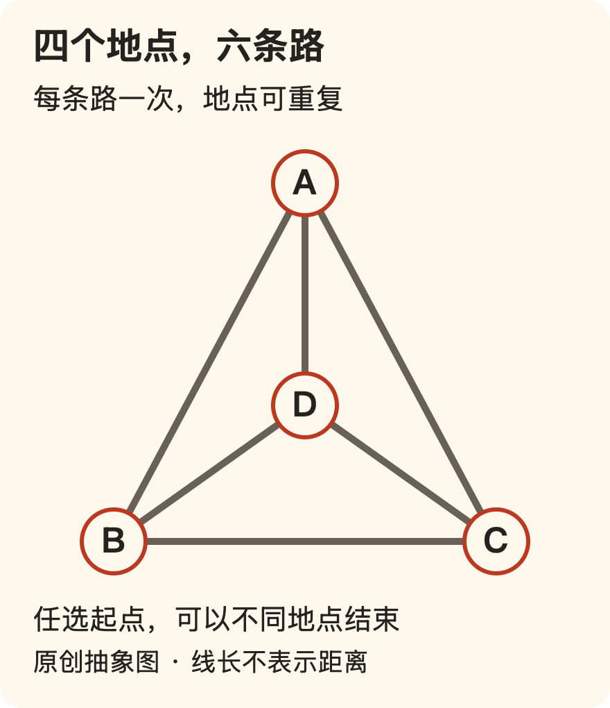

[← 回总目录](../README.md) · [游戏](19-games.md) · [恐怖与悬念](31-recreational-fear.md) · [配套侦探局](../guides/10-desk-detective.md)

# 32 · 答案越快，未必越好玩

**如果你要查明天几点发车，快一点当然好。如果你打开的是一道谜题，最快得到答案，却未必等于得到自己想要的东西。**

不是所有“不知道”都需要马上消除。有时你正想待在几个可能之间，试一个想法，发现不对，再突然看懂原来漏掉的关系。

这与享受当下并不矛盾。眼前的乐趣可能就是探索，而不是把探索赶紧结束。我们反对无限推迟快乐，不反对为正在发生的快乐保留过程。

**有些东西的价值，正是在你不知道答案时发生的。** 不是故意把信息扣住，也不是证明自己比别人聪明，而是愿意亲自经历一次理解的变化。

可以按兴趣进入：[四张卡的排除](#puzzle-cards) · [六条路与一笔画](#puzzle-roads) · [五盏灯与不变的性质](#puzzle-invariants) · [改一条规则，结论为什么变了](#puzzle-rule-change) · [知道答案以后，还剩什么](#puzzle-knowing)。题目是说明例，不是入门考试；直接读解释也成立。

## 解谜不是一种必须不断提速的查资料

先分清自己在问哪个问题：

- **我需要答案来做别的事。** 快、准确、解释够用，是合理目标。
- **我想知道答案如何成立。** 可以直接看解答，再检查每一步。
- **我想自己经历发现。** 过早给出答案可能拿走正在寻找的部分。
- **我只想和别人一起猜。** 过程里的讨论可能比谁先解出更重要。

四种都可以叫“想知道”，却不适合一套默认服务。把完整答案立即贴给第三种人，不一定是帮助；拒绝给第一种人答案，让他“享受思考”，也可能只是添麻烦。

因此，帮助解谜之前一个很好的问题是：**你想要答案、下一步提示，还是只确认目前的推理有没有问题？**

这不是要求每次聊天做问卷，而是承认，信息的份量会改变体验。知道答案的人不必靠克制来证明道德优越，只需要别替别人选择结束的时机。

## 一道小题：先经历，再讨论

下面是本书编写的**虚构纸笔题**，不是心理测验。它只有四个位置，目的是展示“条件怎样收紧可能”，不评判智力，也不要求计时。

桌上从左到右有四个位置，要放四张不同图案的卡：**伞、地图、船、月亮**。每张卡恰好用一次，每个位置恰好一张卡。

只使用三条条件：

1. 月亮紧挨着船的右边。
2. 地图不在最左边，也不在最右边。
3. 伞在月亮左边，但不要求紧挨着。

问题：四张卡从左到右怎样排列？

可以在纸上试，也可以在脑中想。对谜题没有兴趣就直接展开解答，不必先交一份努力证明。

提示和答案在网页中折叠；原始 Markdown、全文导出和打印版仍包含它们。想自己推理，先停在题面即可。

只要一点提示：先把两张卡看成一组

“紧挨着”比一般的“在右边”多一个限制。把船与月亮看成按固定次序连在一起的两张卡，再问它们可以占哪几对相邻位置。

不要先给所有四张卡乱换顺序；先处理限制较强的一组，会更容易看到剩下哪些位置。

再提示一步：依次检查这组卡的三个位置

这一组只能放在第 1–2、第 2–3 或第 3–4 位。

分别问两个问题：剩下有没有非边缘位置留给地图？伞还能不能位于月亮左边？不需要为每一种候选重新编一个故事。

答案、推理与为什么只有这一个

从左到右是：**伞、地图、船、月亮**。

把“船、月亮”连在一起检查：

- 放第 1–2 位时，地图只能在第 3 位，伞在第 4 位；伞位于月亮右边，违反第三条。
- 放第 2–3 位时，剩下第 1、4 位，地图无处可放，违反第二条。
- 放第 3–4 位时，地图只能在第 2 位，伞在第 1 位；三条条件都成立。

三种相邻位置已经穷尽，只有最后一种可行。这比“我摆出来了一种好像可以的”多了一步：不只检查它成立，也解释其他位置为什么不成立。

另一种核对方式是枚举四张不同卡的全部 24 种顺序，逐项检验三条条件。本项目的自动测试也这样核对唯一性；这证明的是题目解，不是题目一定有趣或难度适合所有人。

## “想出来了”与“检查成立了”，是两个时刻

刚才如果出现某个直觉答案，你可能先感到“就是它”，再逐条对照。也可能完全没有突然的瞬间，只是排除完所有情况，自然而然得到结果。

两种都可以是有内容的推理。不必为了配得上“解谜”，强迫自己产生一个戏剧性的顿悟。

一种很常见的错误不是完全没看条件，而是悄悄改了条件：把“在左边”读成“紧挨着左边”，把“至少一个”读成“只有一个”，或在故事里补上题目没有给的规则。

这时更有用的检查不是“这个答案看起来顺不顺”，而是把每条原条件重新放回去。故事越漂亮，也不能抵消某一条明确约束。

## 研究中的“啊哈”也会跟着错误答案出现

Danek 与 Wiley 的研究让 70 名大学生尝试解释魔术视频，再评价自己的“啊哈”体验与愉快、突然、确信等感受。纳入分析的 1,778 次作答里，有 654 次被编码为正确，1,124 次为错误。参与者当时没有收到正确与否的反馈。[B16](../docs/research.md#b16)

平均而言，正确答案伴随更强的“啊哈”评分；但错误答案也可能让人明显恍然大悟。其中 417 次错误作答的“啊哈”评分，高于正确作答的平均水平。[详细核读](../docs/evidence/B16-false-insight.md)

这不是“直觉全都不可靠”。正确与错误作答的平均体验确实有差异。关键是：**感觉到突然、愉快和确信，仍不足以把一个答案自动判对。**

也不能把这项研究改写成“37% 的所有顿悟都是错的”。研究中的约 37%，分母是那 1,124 次错误作答；并不是全世界的顿悟，更不是某个读者的出错率。

魔术解释与普通纸笔题也不相同。研究把实际方法或合理的替代解释都可能编码为正确，并不是要求每个人必须准确识破表演者唯一使用的方法。本章借它讨论主观确信的边界，不宣称四张卡题复现了论文。

## 为什么一条提示有帮助，整份答案却可能扫兴

提示有不同粒度，可以先帮助看见结构，而不是立刻替代每一步。

| 帮助的层次 | 对四张卡题可以做什么 | 仍留给解题者什么 |
| --- | --- | --- |
| 重读条件 | 提醒区分“紧挨着”和一般的“在右边” | 自己找出强约束 |
| 改变表示 | 把两张相邻卡看成一个整体 | 自己安排位置 |
| 缩小分支 | 列出这组卡的三种相邻位置 | 自己排除不满足条件的情形 |
| 给出答案 | 直接展示顺序与核对 | 选择理解证明或改题继续研究 |

这里没有哪一层天然最尊重人。需要完整解释的人，没必要被吊着胃口；希望保留探索的人，也不需要被“我都帮你做完了”打断。

若使用 AI，可以直接指定：“先不要说最后答案，只指出我哪一步额外假设了题目没给的条件。”但工具是否真的遵守，需要检查；本章没有把某个模型实测为不会剧透。

提供帮助的人也应允许对方改主意。刚才想要提示，现在想看答案，是一个新的选择，不是破坏约定。

## 卡住不只有一种原因

先不要把每次停住都解释成自己不够聪明。问题可能在不同位置：

**题意没有理解。** 例如不知道某个词在题中如何定义。此时解释词义比再给一道更简单的题更直接。

**表示方式难以操作。** 关系全记在脑中容易混，换成表格或纸片可能更清楚。换工具不等于绕过思考。

**漏了一个候选。** 一开始选定某种解释，之后只寻找支持它的线索。可以问：“还有哪种情况没有被排除？”

**条件其实不足或矛盾。** 有些题不是你没找到唯一答案，而是题面根本不保证唯一。漂亮故事和笃定的出题语气不能代替检验。

**这个过程确实不好玩。** 你不喜欢这一类题，或者今天不想继续。并不是所有卡住都值得投入更多时间。

这些是本书的排查思路，不是解题困难的完整心理分类。用处在于给不同问题不同回应，而不是最后都落到“再努力一下”。

## 多个答案并不丢人，假装唯一才有问题

如果想继续研究刚才那道题，可以删掉第二条，也就是不再限制地图是否在边缘，保留另外两条。

此时不是请你猜作者“真正想的那个排列”，而是找出所有符合剩余条件的顺序。

删掉地图位置条件后，有哪些答案？

会有三种：

1. 伞、地图、船、月亮；
2. 伞、船、月亮、地图；
3. 地图、伞、船、月亮。

三者都让月亮紧挨着船的右边，也都让伞处于月亮左边。不能因为第一种看起来最整齐，就把另外两种判错。

这三个候选可以通过全排列核对。恢复“地图不在边缘”后，只剩原来的唯一答案。

这个变化展示的不是一个脑筋急转弯，而是**答案要相对于条件成立**。条件少了，允许的答案可以变多；条件相互矛盾，也可能没有答案。

在封闭的娱乐题里，作者可以设计完整条件。现实问题通常不会同样干净：你未必知道所有因素，别人的偏好也不一定固定。不能因为解题体验很好，就把真实的人际冲突当成“只差一个聪明人看穿”的题目。

共同编故事又是另一种情况：参与者可能按约定让新事实成立，而不只从固定题面推答案。那里的问题是“谁能提出、怎样采纳”，不能靠“大家都在玩”把两种约定混同，见[发现答案与共同创作的分界](34-shared-stories.md#story-fixed-or-authored)。

## 六条路：换一张图，不一定要多试几百次

排除候选是一种解法，但不是所有问题都值得从头穷举。下面是本书编写的另一个抽象例子，不是实际景区路线，也不是历史七桥问题的地图。

四个地点叫 A、B、C、D，每两地之间各有一条双向道路，一共六条：**AB、AC、BC、AD、BD、CD**。道路只在字母所在的地点相接，没有其他交叉口。

你可以任选起点，一直沿路走，**每条道路必须恰好走一次**，最后可以停在与起点不同的地方。允许多次经过同一个地点，不允许跳到别处，也不允许走图外的路。

问题是：有没有一条合规则的完整路线？如果找不到，能不能给出“所有路线都不行”的理由，而不是只报告自己试过的几条没走通？

这道题借用图论中“每条边一次”的概念。这里字母地点对应顶点，道路对应边；和“每个地点只到一次”不是同一个问题。MIT 课程教材 *Mathematics for Computer Science* 区分了这两类要求，并讨论道路是否相连、每个点接出几条边怎样影响答案。[知识来源与原创模型：F46](../docs/evidence/F46-puzzle-structures.md)

道路题提示：经过一个中途地点时，用掉了几条路？

先不要为整条路线命名。只看一个既不是这次出发、也不是最后停止的地点：每次到达后，必须再沿另一条没有用过的路离开。一进一出，会把与它相连的道路配成一对。

如果同一地点经过两次，就是两对。想一想，起点和终点为什么可以有例外，以及整条路线最多允许几个这样的例外。

道路题答案与理由；删掉AD后又怎样？

四个地点各接出三条路，都是奇数。中途地点的进出需要成对，而三条路无法两两配完。因此，这四个地点不可能都只扮演成对进出的中途地点。

不回到原处的路线有一个起点、一个终点，允许这两个地点分别多一次出发或多一次到达；其他地点必须配对。若回到原处，连起点也需要配对。

所以，一条用完所有道路而不重复的连续路线，不可能让四个地点都成为奇数例外。**不是“我没有找到”，而是在这些规则下不存在。** 把图画得更漂亮、把路线绕得更远，都不会改变各地点接出三条路的事实。

现在删掉 **AD** 这条路，其他规则不变。A、D各剩两条路，B、C仍各有三条。可以从B出发，到C结束，例如：

**B → A → C → B → D → C**

它依次经过BA、AC、CB、BD、DC，恰好用完剩下的五条路，没有重复。A、B、C、D可以重复出现；若误读成每个地点只能到一次，就会把这个正确路线排除。

这里有两种不同的确认：原题给出不能存在的理由；改题给出一条确实存在的路线。后者不必列出所有路线，只需逐边核对即可。本项目另用程序搜索所有起点和未使用道路来核验这两个有限例子，不把“机器没搜到”代替正文的理由。

更一般地，对有限、无向、所有有边地点连通的图，奇数度顶点为零个时可走闭合的欧拉回路，为两个时可从一个走到另一个。这里“度”就是接出的边数；不能省略连通条件：两幅各自闭合却互不相连的三角形，虽然每点度数都是二，也无法只靠图中道路连续走完两幅图。

正文的一进一出解释了必要条件；一般结论的充分性并没有被一句“看起来可以”证明。教材提供定理，完整证明作为习题展开；本书只对删路后的具体例子给出路线作为充分的核对。

这张图的乐趣不必只来自最后的“能”或“不能”。如果你原来在找一条越来越复杂的路线，后来发现应该看每个地点的进出关系，问题本身就换了形状：许多条路线被一个共同条件联系起来。

这个转变不是现实世界的万能捷径。题目明确规定了道路和行动，现实散步却可以临时返回、换路或停止。正因为我们愿意暂时接受一套有限规则，才会获得这种清楚地说出“为什么”的机会。

**解谜不只是在可能里找出口，也可以是终于明白某个出口为什么不存在。** 这不等于喜欢失败，而是把反复碰壁变成一个可以解释的对象。

## 五盏灯：东西一直在变，有什么没有变？

换一种看起来完全不同的题。五盏灯排成一行，用0表示灭、1表示亮。开始是 **00000**。每一步必须选一对相邻灯，把这两盏同时翻转：亮变灭，灭变亮；其他灯不变。只能选第1—2、2—3、3—4或4—5盏，没有首尾相连，不能只翻一盏。

这是虚构状态题，不要求接电、编电路或购买玩具。你能否经过任意有限步，到达 **10000**，也就是只有最左一盏亮？

若随手试几步，亮灯的数量会变，亮灯的位置会变，某些状态还会重新出现。光说“它不断变化”，还不足以判断目标能不能达到。

数学中有一种思路：寻找每一步都保留的性质，通常叫作**不变量**。这个名字不要求所有东西都不动，而是问“无论怎样按规则变，哪件事始终成立”。教材以状态机及坐标移动说明这种推理；这里的灯题、规则变化和有限检查由本书自行编写，不是复制教材题面。[读取范围：F46](../docs/evidence/F46-puzzle-structures.md)

灯题的性质与解答；再看一个可以达到的目标

被选的两盏灯只有三类情况：

| 翻转前后 | 亮灯总数怎样变 |
| --- | --- |
| 两盏都灭，变成两盏都亮 | 增加2 |
| 两盏都亮，变成两盏都灭 | 减少2 |
| 一亮一灭，交换状态 | 不变 |

所以亮灯数量虽然不固定，**奇偶性**却固定：每次只增加2、减少2或不变。起点有零盏亮，是偶数；往后任意有限步都仍为偶数。目标10000只有一盏亮，是奇数，因此不能到达。

这不是用有限次失败猜永远失败。理由覆盖了每一步允许的全部情况：初始性质成立，每个合法动作都保留它，所以之后也成立。

把目标改为 **10001**，也就是两端亮、中间灭，就不再违反这条性质。但“不违反”尚不是成功路线。这里确实能做到，依次翻转1—2、2—3、3—4、4—5：

**00000 → 11000 → 10100 → 10010 → 10001**

每一步都只翻相邻的两盏。也可以把这串动作理解成：每次相邻翻转之后，中间位置在整段过程中被翻了两次、回到原状；两端各翻一次，留下两盏亮灯。

在这个五灯版本中，程序枚举全部32种二进制状态，完整可达集合恰好是16种亮灯数为偶数的状态。但下一段会看到，仅记住“偶数就行”，遇到规则改变时会出错。

道路题在数一个点能否成对进出，灯题在看一类变化是否跨越奇偶。这不是说所有谜题最后都归结为奇偶，而是展示：有时新的理解不靠获得一条额外线索，而靠重新描述已经给出的规则。

你可以喜欢这样的整齐，也可以觉得这种题没什么意思。我们不把看懂不变量当成更会享乐的资格，只是不希望整章在赞美“发现很快乐”时，始终不让读者看到一次具体的发现。

## 知道一个术语，不等于以后都可以跳过条件

保留五盏灯、00000起点及每次翻转两盏的要求，现在取消第2—3盏之间的操作。可选的只剩 **1—2、3—4、4—5**。

注意：五盏灯并没有任何一盏被彻底冻结，每盏都仍包含在某种操作中。但允许怎样组合已经变了。

这次目标是 **10100**：第1和第3盏亮，其他灭。它共有两盏亮，符合刚才的偶数条件。能不能达到？

规则变化后的解答：检查总数以外的条件

不能。没有2—3操作后，灯被分为两个互不影响的部分：左边第1—2盏，右边第3—5盏。每个动作都只在其中一部分内部翻两盏。

从全灭开始，左边亮灯数一直是偶数，右边亮灯数也一直是偶数。目标10100在左边有一盏亮，在右边也有一盏亮；它的**总数**虽是偶数，却分别违反了两个部分各自的奇偶限制。

这不是某盏不能碰，而是两个部分之间不能再交换这种关系。程序完整枚举得到8个可达状态，而不是原规则的16个；10100在原规则下可以达到，在新规则下不能达到。

因此，“亮灯总数为偶数”在新规则里仍是必要条件，却已不足以保证可达。套用一个熟悉名词，不能替代检查当下允许哪些动作。

改题的乐趣之一，是把已经懂的东西放到一个不再完全相同的地方：哪一步解释还成立，哪一步需要补上条件？这时不是再交一次相同答案，而是检查理解究竟覆盖了什么。

同样，知道图论、不变量或某种常见题型，不必立刻结束别人尚未经历的发现。知识可以帮助把提示分得更细，也可以变成一口气说完的压迫。取决于大家此刻想要哪一种互动。

## 知道答案以后，为什么还有人愿意再看？

如果解谜唯一值得的瞬间就是第一次报出答案，一道题被揭晓以后便只剩包装。但实际可以追问的事情不同：第一次想知道结果，第二次想知道哪条条件真正起作用，第三次想试着把题改得更好。

四张卡题删掉一条限制，道路题删掉一条边，灯题取消一种操作：每次都可以先猜改变是否重要，再检查原来的解释是否仍然够用。这些不是把答案藏得更久，而是在结果之外看清依赖关系。

也有人只喜欢第一次猜中，揭晓后就愿意换题。这完全可以。重读、改题和证明不是“更高端玩家”才值得追求的后半程，也不是每个人都应该完成的升级路线。

如果一种发现必须通过排名、倒计时或证明比别人快才能被承认，就会损失另一种乐趣：我不一定赢了谁，但我刚才真的多看懂了一点。**看懂本身可以是享受，不必拿去兑换智力人设。**

反过来，“有深度”也不能替不好玩的题辩护。条件含糊、关键规则临时补充、解答依赖作者没给出的冷知识，都可能让人感到被耍，而不是参与了一次发现。出题者可以选择不提供唯一解，却应当先说清楚；不能拿读者猜不中来证明作品聪明。

这也是本章希望保留的区别：谜题让参与者自愿进入一种暂时不知道的状态，不是出题者凭信息优势取得随意更改规则的权力。

## 一起玩时，谁先解出，不一定就该接管全场

团队可能想要不同的体验。有人喜欢迅速推进，有人喜欢慢慢讨论，有人只想观察别人怎么想。开始时先确认是否抢答、是否共同求解，往往比事后争论谁破坏气氛更清楚。

若有人已经知道答案，可以让他检查某条推理是否成立，或只按大家要求给下一层提示。不必装作不会，也不必把完整解答立刻倾倒出来。

但别反过来要求最快的人无限等待、禁止表达。可以约定各自思考一会儿，再讨论不同路径；也可以直接选择允许抢答的游戏。共同娱乐要协商的不只是胜负，还有每个人想在过程中占有什么位置。

对于已经公开过的题，玩过的人坦白说“我见过这个”，比表演灵光一闪更容易维持信任。知道答案并不会让人失去参与资格，假装现场推出来才可能改变别人对这场互动的理解。

## 魔术不一定是请你当场拆穿的题

研究 B16 明确要求参与者寻找解释。现实观看魔术时，你却未必以揭示方法为目标。

你可以喜欢“我明知道不是超自然，却仍没看出怎么做到”的状态。也可以对手法很感兴趣，之后寻找表演者愿意公开的教学。欣赏与分析都成立，但不要默认全场都选择后一种。

在别人还想观看时大声公布猜测，不只是展示能力，也会改变他们正在经历的内容。更何况猜测本身可能不对。可以在合适时机讨论，保留“我猜”，不把确信表演成证据。

这与剧情剧透的关系类似：知识本身不是问题，**由谁决定什么时候知道**才是共同体验的一部分。

## “既然追求及时满足，为什么不直接看答案？”

因为“即时满足”不等于“让每一件事尽快结束”。

如果此刻想要的是答案，直接看当然可以。如果此刻想要的是参与、尝试与发现，那么推理过程本身已经在满足愿望。并不是先吃一段无聊的苦，未来才有资格领取快乐。

这一点也解释了为什么不必把解谜包装成脑力训练。它可能使人投入、发笑或惊叹，但本章没有证明这些题能提高智力、预防疾病或提升工作能力。喜欢它，已经是一个正当理由。

同时，不应把“过程也是快乐”强加给正在烦躁的人。你说现在只想知道答案，我们就不再替你安排一个应该享受的过程。

**耍起，可以是马上开始，也可以是暂时不揭晓。关键不是把时钟拨到最快，而是不让别人替你删掉真正想经历的那一段。**

---

“啊哈”体验的研究对象、作答单位与限制见 [B16 核读记录](../docs/evidence/B16-false-insight.md)。四张卡、提示和改题为本书原创例子，唯一性经枚举核对；未经过读者难度测试或快乐效果实验。想要另一种具体推理，见 [P010 · 三封送错的信](../guides/10-desk-detective.md)，不必两题都做。

道路、灯光状态题、图解及改题为本书原创说明例，理论出处、程序核对范围与未读材料见 [F46](../docs/evidence/F46-puzzle-structures.md)。有限状态的程序检查不证明一般定理，也不证明更有趣、提升智力或具有训练效果。

[返回道路题](#puzzle-roads) · [返回灯题](#puzzle-invariants) · [回到目录](../README.md)
