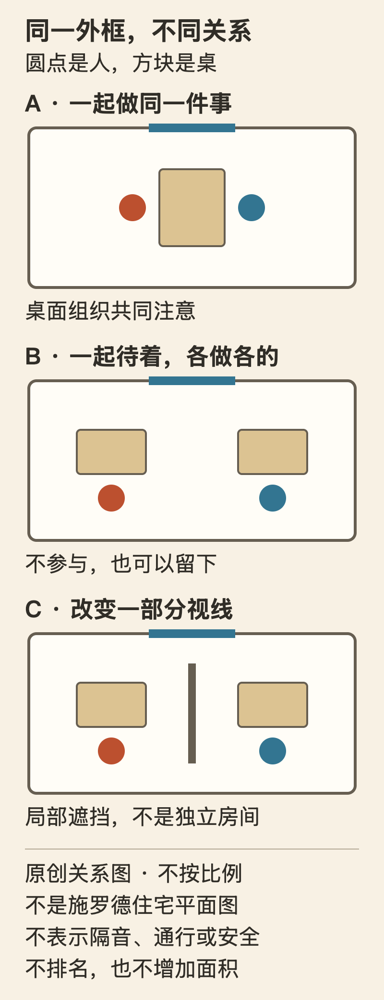

[← 回总目录](../README.md)

# 36 · 家不必先成为资产，也可以先成为生活

**房子可以有价格，里面的日子不必只剩保值。** 租来的、借住的、与人合住的空间，也装着正在发生的生活，不是拿到理想住房之前的暂停画面。

本章不教买房、装修增值或整理出片。我们想认真讨论另一件事：一个地方怎样让你愿意待着，怎样容纳不同的相处距离，又怎样不把“会生活”变成新的消费和劳动标准。

**临时住处不等于临时人生；喜欢一间房，也不必把它改成一张供别人观看的照片。** 但喜欢不能凭空变出面积、隐私或控制权。这里既不说“心态好就能住得好”，也不把改善生活的愿望全部推迟到买下房子的那一天。

从你在意的问题开始：[一座名宅怎样真的住过人](#home-schroder) · [同一空间怎样容纳不同生活](#home-modes) · [光线、视线与被看见](#home-view) · [物品怎样参与生活](#home-objects) · [租住还值不值得用心](#home-temporary) · [同住者不必共享一种理想](#home-sharing) · [最强反对意见](#home-objections)。

## 一张照片之外，房间还在发生什么？

先看一个原创假想，不是真实户型测评。

甲想象的客厅很整齐：桌面没有杂物，靠垫按颜色摆好，书架像一个完整的展示面。乙想要的客厅则是另一幅画面：书可以看到一半放着，朋友来了能坐下，自己的茶杯不用一喝完就收回去。两个人都说“我希望家舒服一点”，却并不是在要求同一件事。

甲不一定虚荣，也可能真心享受清爽的视野；乙不一定懒散，也可能珍惜活动没有被强制结束的感觉。问题不是先评出哪个人更懂生活，而是弄清楚：**房间要持续呈现某种样子，还是允许正在进行的事留下位置？** 两者可以兼顾，也可能争夺同一张桌子。

一张家居照片只能保留一个时刻。它没有自动告诉你：拍摄前收起的东西去了哪里，坐下以后有没有地方放手边的杯子，晚饭之后谁把空间恢复成那种样子，另一个住在这里的人是否愿意这样使用。

因此，看上去空，不等于实际好用；东西多，也不等于住得丰富。我们关注的是物件、人的活动和维护之间的关系，而不是替“极简”或“热闹”选冠军。

这也解释了居住本身为什么值得成为享受的一部分。你不一定在做一件叫作休闲的事：回家后坐到喜欢的位置，听见熟悉的环境声，看见还没翻完的书，知道这一刻不需要招待任何人。这些时刻无需被加工成爱好，才配占据生活。

## 一座名宅，不只是一张风格图片

里特维尔德—施罗德住宅（Rietveld Schröder House）位于荷兰乌得勒支。馆方将其设计时间列为1924年，居住史页面说明Truus Schröder在1925年1月带三个孩子迁入，直到1985年去世前都与这座房子保持居住联系；期间生活安排与居住地点有变化，不能概括成六十年每天都以同一方式住在这里。[F70](../docs/evidence/F70-home-and-schroder.md)

先不看它有名的原色和线条，看一个空间决定：**楼上的空间并不需要整天保持同一种划分。** 馆方介绍，可移动隔墙让白天较开放的上层在晚上分出独立房间。开合不是在一张平面图里多画几根漂亮线，而是在改变谁能一起活动、谁能暂时分开。

这不证明可移动隔墙比固定房间更先进。对于有人早睡、有人晚归，或不愿反复转换空间的家庭，固定边界可能更适合。它让我们看到的是一个不同的问题：如果一天中的生活需求会变，房间是否只能接受一种使用关系？

第二个容易被忽略的事实是作者身份。馆方把Schröder称作委托人和共同设计者，而不是一个等设计师交付答案的客户；传记页面讲述她提出对简洁、自由空间的要求，并与Rietveld合作。[F70](../docs/evidence/F70-home-and-schroder.md) 我们没有独立校勘双方的全部图纸和信件，不能给每个细部硬分个人功劳。但把居住者从设计故事里删掉，同样会让一个关于生活的决定只剩风格大师的作品。

第三个事实更有意思：这座房子并没有因为后来成为经典，就在建成当天冻结。馆方居住史记载了厨房位置、出租使用与家庭成员变化；还讲到她曾把楼上租给蒙台梭利幼儿班，自己与小女儿住楼下，却不喜欢楼下的生活，后来暂时搬到对面，1936年返回。[F70](../docs/evidence/F70-home-and-schroder.md)

**一座按理想建造的房子，也不保证每种实际使用都令人满意。** 这不是用一段史料否定建筑，而是把“能够住”“愿意怎样住”和“被后人怎样观看”分开。设计被赞赏，不能替某位居住者回答当时喜欢不喜欢；迁就之后不喜欢，也不是对理想不够忠诚。

本书没有实地进入住宅、核验当前陈设、操作隔墙或测量采光、隔声、通风、结构。这里采用的是馆方的设计与居住史说明，不是住宅性能实验，也不推荐读者照着改房。

## 同一间房，谁可以不参加？

下面是本书独立构造的三种使用关系，不是施罗德住宅平面图。三个示意使用相同外框与窗位置；圆点代表人，短线代表一段遮挡，位置不按真实比例。它们不表示面积增加或某种状态更高级。

**A · 一起做同一件事。** 两个人围着桌面拼图、吃东西或谈话。桌子在组织共同注意；这时桌面宽一些、物件能让彼此看见，可能符合他们的愿望。这是情境中的需求，不是人人该买大桌子的结论。

**B · 待在一起，但各做各的。** 两个人仍在同一空间，却不持续要求彼此回应。各自的书和物品有位置，相处不必靠不断讲话维持。这里增加的不是隔绝，而是“不参加对方此刻的活动，也可以继续待着”的可能。

**C · 暂时不想被看见。** 一段遮挡改变部分视线关系，却没有把空间变成独立房间。它不自动阻隔声音，也不能证明走动互不打扰。把视觉上看不见，误当成完全获得隐私，会把真实需要说小。

三种状态都可能受欢迎，也都可能烦人。A可能热闹，也可能让不想参与的人无处退出；B可能自在，也可能让盼望交流的人觉得疏远；C可能提供距离，也可能占地方或让另一侧更难使用。

因此，本章不推出“开放空间最好”或“每个人都该有隔间”。值得问的是：**当人的意愿不同，空间有没有不把一方赶走的办法？如果没有，谁一直在迁就？**

这也说明为什么多功能不能只按“能放下几件家具”判断。如果每天吃饭前都要收起某个人的作品，饭后又没有力气摆回去，那么“书桌兼餐桌”可能实际上只保留了餐桌。反过来，如果某项爱好长期占住大家唯一能吃饭的地方，也不能凭“创作值得尊重”自动取得永久优先权。

转换需要付出多少劳动、由谁执行、会不会破坏尚未完成的事情，是使用关系的一部分。它不是纸面布局之后再考虑的小细节。

## 看出去、被看见、能走过去，不是同一种开放

施罗德住宅的馆方介绍提到上层转角窗：相邻的两扇窗打开时，转角在视觉上被打开；楼梯处的滑门则被用来分隔大厅与上层，并为打电话、挡住寒冷提供安排。窗板又承担遮暗的作用。[F70](../docs/evidence/F70-home-and-schroder.md)

这些具体构件比一句“通透的房子使人自由”有用，因为它们没有把所有边界一起取消。一个开口让人看出去，另一处关闭又能让某项活动更合适。我们从中提出的居住判断是：**自由不只表现为打开，也包括能够在自己需要的时候关上。** 这是本书推论，不是对建筑效果的测量结论。

| 看似相同的愿望 | 实际可能在意什么 | 不宜直接当作替代 |
| --- | --- | --- |
| “我想要一个明亮的位置” | 能看清手边的东西、喜欢某一时段的光 | 不是越亮越好，也不等于全天没有遮挡 |
| “我想看见窗外” | 某个坐着的位置能看见喜欢的景象 | 不等于愿意被窗外的人持续看见 |
| “我想和别人待在一起” | 知道有人在附近，不一定需要交谈 | 不等于愿意被一直叫到或观察 |
| “我想有自己的地方” | 物品不用反复撤走、能停止回应、能获得距离 | 一副耳机或一段遮挡不必然满足这些不同要求 |

这些区别不是采光、人体工学或建筑合规标准，也不给窗帘、灯具、家具尺寸开通用处方。它们帮助把含糊的“感觉不舒服”变成更准确的愿望。

例如，同一个靠窗的位置，在上午看书时很喜欢，晚上却让人觉得过于暴露。承认后者不意味着前者虚假，更不表示当初选择这个位置是错误。空间的可用性会随时段、活动和其他人的存在改变，不能只用白天拍的一张照片定案。

住宅还依赖周围环境。馆方记载，Schröder看重窗外的景观，甚至购买对面的地块来参与决定未来的视野；后来道路设施又改变了住宅与外部的关系。[F70](../docs/evidence/F70-home-and-schroder.md) 这提醒我们不要把名宅故事变成便宜的励志话：**能决定窗外是什么，与只被允许在窗台上放什么，是非常不同的资源条件。**

你没有能力控制噪声来源、邻近建设或房屋朝向，不是缺少审美。室内微调可以有价值，但它不能替环境与住房条件承担全部解释。

## 不是东西越少越自由，而是它们怎样占着你的生活

房间里的物件至少有几种不同角色：正在用的、愿意看的、希望留着的、为了某个未来情境备用的。一个物件可以同时属于几类，但把所有东西都当作“杂物”，或者都当作“回忆”，都会让取舍变得粗糙。

一本摊开的书可能正在参与今天；一套多年不用却很喜欢的杯子可能主要承担观看与保留；一张折叠椅可能为偶尔来的朋友预留机会。它们没有统一的价值排序，使用频率也不是唯一答案。

真正值得注意的是**物件的存在方式是否仍与愿望相符**。喜欢收藏的人可能希望一部分轮换展示，另一部分妥善保存；不想展示的人可能更喜欢安静的柜门。公开可见不是物品被珍惜的唯一证明，这与[收藏不必集齐](26-collecting.md)相邻，但在家里，还要多问它占用了谁的空间。

再用一个原创假想：桌上有一幅做到一半的拼图。甲想留到周末，乙每天要在这里吃饭。把拼图说成“有意义的爱好”，并没有回答乙今晚在哪里坐；把它叫“应该收掉的杂物”，也没有回答甲已经投入的过程怎样保留。

有时能找到一种不必每次拆散的暂存办法；有时没有地方，必须承认两项需求相互冲突。这里不推荐某款收纳产品，因为购买本身不能决定谁有优先权，也不能保证每个人愿意反复转换。

**整洁可以是一种真正的快乐，但不能只靠另一个人不停收尾来维持。** 同样，随手放着可以很自在，但不能要求同住者长期替你的自在承担找不到东西、不能用桌面或持续清理的代价。

我们不以物品多少判断一个人是否精神自由。更具体的问题是：这里的东西让什么更容易发生，又让什么不得不一直等着？

## “迟早会搬走”，为什么就不值得好好住？

租住房间里常有一种特别的延期：“等买了自己的房子，再认真布置。”这句话有真实理由：租期不确定，空间不能随意改动，搬运、恢复和支出都可能成为负担。忽略这些条件，只会把居住建议变成购物劝说。

但另一种推论也未必成立：只要不能永久拥有，就不值得为其中的生活付出任何东西。**付出的价值可以来自居住期间的使用，而不只来自退租时还能带走多少。** 这是本书愿意承担的价值偏向，不是保证每一笔改善都划算。

一张画是否值得挂，并不只有“以后是否升值”这个问题；也包括你是否喜欢每天看见它，以及放置方式是否被允许。暂时借住时，可能连这个选择都没有。此时不改动可以是尊重共同生活的决定，不是把日子过得不认真。

与其一概说“租的也要像买的一样住”，不如把几种代价分开：当下支出、日常维护、未来移动或恢复、对别人使用的影响。它们不必统统折算成钱，也不会因为你很喜欢就自动消失。

本章不解释某地租约、改造权限或押金法律，也不建议打孔、改电、改结构、安装重物或堵住通行。涉及权利与安全的具体行动要另行确认，不能从“今天值得过”直接跨到“我有权这样改”。

不过，能做的选择也不全是购买和改造。是否允许常用物件放在顺手的位置，是否给一项未完成的事情留下次序，是否可以在约好的时候不招待人，都可能决定住起来的感受。它们有时需要协商而不是下单；有时协商仍然不能解决，这份限制也应如实保留。

**临时性可以改变投入方式，不必自动取消投入的理由。** 如果这段居住会持续一阵子，那么其中每个晚上并不比“以后正式开始的人生”少一层真实性。

## 同住，不等于共享一种理想的家

有人喜欢有人声的屋子，有人回家后只想安静；有人把招待朋友当乐趣，有人并不想每天面对来客；有人愿意留出空地跳舞，有人需要物品与位置稳定。这些都不是天然比另一种更有生活气息。

共同空间的难处在于，偏好不是平行存在的问卷答案，它们会在同一时刻占用声音、视线、位置和注意力。

“我只是在自己家放松”不是充分理由，因为另一个人也在自己家。与此相对，“保持整齐”“别打扰别人”也不能成为让某个人永远只许保持不存在的规则。**共同生活需要的是具体边界，而不是由一个人垄断‘正常居家’的定义。**

可以把争论从人格评价移回事件：朋友会待到什么时候，谁的工作会被声音打断，物件放在这里会使什么无法使用，恢复空间由谁负责。这不是规定所有家庭都要开会，而是防止一个漂亮价值词替代真实协商。

有些边界不能靠“轮流迁就”解决。只有一间房、作息严重冲突、无处临时存放，可能就意味着几项愿望无法同时实现。我们不把一份表格冒充新增面积，也不要求所有人对无法满足的条件保持乐观。

名宅故事同样需要这层审慎。馆方讲述的是设计者与特定居住者的历史，不等于我们已经听见每个孩子、租客、访客或维护者的完整意见。某个人所称的自由，可能并不是其他人全部生活感受的总和。

## 最强的反对意见：房子都不稳定，还谈什么享受？

**“你还是在把有钱人的选择讲给没有条件的人听。”** 如果把能够定制住宅、购买对面土地的案例写成“你只要有勇气”，这个批评完全成立。本章保留这些资源条件，是为了拒绝这种偷换，而不是为买不起的人安排一套精神替代品。

案例能帮助我们辨认原来没有说清楚的需求，却不能证明解决方案可以廉价复制。理解自己想要不被看见的距离、能保留未完成活动的位置，可能让不满更准确；它不保证你现在就能得到。

**“房子首先是生活保障和重要资产，讲享受是不是太轻？”** 保障、费用、权利和长期安排当然不能忽略。本章反对的是它们成为唯一被承认的价值，导致住在里面的人始终只为下一次出售、下一个阶段或下一位想象中的客人维护房屋。

在真实代价能够承受、他人的条件得到尊重时，我们愿意让一部分空间优先服务正在发生的生活，即使它不是最容易拍照、展示或转交的状态。这个偏向不承诺最终赚得更多；它只是承认使用中的日子也值得被计算。

**“我就喜欢像样板间一样整齐，为什么不行？”** 完全可以。问题不是某种样子错，而是你是否真的喜欢它，以及维持它的劳动是否被自愿承担。有人享受布置和整理，有人不享受；两者都不需要伪装成效率策略才能存在。

**“你讲得太复杂，我只是想回家舒服一点。”** 不必每天分析空间。很多时候，合适的位置就是你自然愿意坐下的地方。本章的区分是供发生冲突或困惑时使用，不是给每一次回家增加评价任务。房间不需要被解释清楚才能喜欢。

## 不必把家布置成一种正确答案

好的居住体验未必有统一画面。可以是许多物品围着人，也可以是几乎没有东西；可以常常有人来，也可以长期不招待客人。照片风格相反的房间，仍可能分别支持真实想过的生活。

我们在意的是更具体的自由：喜欢的东西有机会被使用，尚未完成的事不总被提前结束，想一起的时候能靠近，暂时不参加的时候不用被赶走。如果这些条件尚未具备，不把缺口说成心态问题；如果能够争取，也不必等永久拥有才承认它值得。

**家可以为未来留下位置，也该给已经住在里面的人留下今天。**

继续读：[独处需要什么条件](07-solo.md#solo-room) · [共同空间之外的街道](15-neighborhood.md) · [维护与修补](17-making.md#making-repair-choice) · [收藏与保留](26-collecting.md) · [有责任的人不欠“会生活”的作业](../essays/06-real-life-constraints.md)。这些相邻论点不被重复算作本章的新证据。
