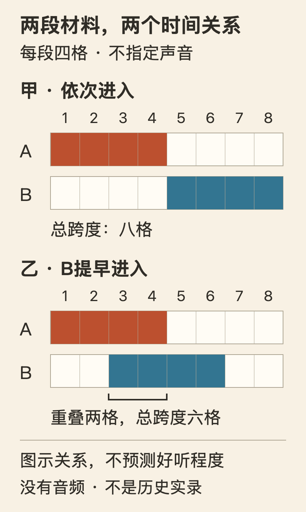

[← 回总目录](../README.md) · [听音乐](11-music.md) · [现场](13-live-events.md) · [跳舞](27-dance.md)

# 37 · 夜生活不是把白天过坏了

**有些夜晚值得专门腾出来，不是因为它能补偿工作，而是因为你就是想这样活一会儿。**

换一身衣服出门，走进一间声音和光都与白天不同的屋子，等一首还不知道名字的歌，把动作交给眼前这段节奏。这样的愿望，为什么总要先解释成减压、社交、拓展见识，才显得不那么浪费？

本章愿意承认一种不必绕弯的理由：**我想要热闹，想要身体跟着动，想让这一晚和平时不一样。** 它可能值得花钱、花时间，甚至值得放弃一点便利。不是每个晚上都必须最省力，才算被合理使用。

这不是夜店推荐，也不是通宵、饮酒或服用任何东西的教程。本章讨论成人的夜生活选择，重点是音乐、舞池与共同空间；不替具体场所保证入场条件、可及性或安全。安静的夜晚同样成立，但我们也不把热烈的愿望先改造成一份温和替代品。

本章从五个问题进入：[为什么走进这一间屋子](#nightlife-place) → [曲目之外的时间组织](#nightlife-time) → [知道下一拍仍想继续](#nightlife-repeat) → [共享舞池的关系](#nightlife-belonging) → [这一晚的代价与选择](#nightlife-choice)。不必把它读成出门流程；即使没有准备去哪里，这些问题也关乎什么样的经历值得占据生活。

## 一、为什么要专门走进这一间屋子？

先比较歌单与现场，再看空间怎样参与一晚的经历。场地不是音乐之外的包装，但也不能因为有设计、有来历，就替来客宣布好玩。

### 在家也能放同一首歌，为什么还要走这一趟？

先看一个原创假想。小禾和朋友去了一个以跳舞为主的音乐夜。她认不出大部分曲目，却一直想动；朋友知道好几首歌，站了半小时就想找地方坐。回去后，两人听同一份歌单，小禾觉得少了什么，朋友反而更喜欢。

不必急着判断谁真正懂音乐。他们可能在乎不同的体验：朋友想听作品，小禾想加入一段正在发生的共同节奏。歌单可以保留曲目，却不自动保留当时的声音变化、人的位置、身边的反应，以及自己什么时候愿意进入舞池。

反过来，现场也没有吞掉作品的全部价值。在家能反复听的细节，在嘈杂或拥挤的地方可能很难辨认。**一间屋子让某些东西出现，也会让另一些东西退到后面。** “现场才是真正的音乐”和“家里音质更好所以不必去”，都是让一个优点代替整段体验。

本章关心三种不同的愿望：

| 愿望 | 想亲自经历的部分 | 不能被什么自动替代 |
| --- | --- | --- |
| 想听这一段音乐怎样走下去 | 接续、停顿、返回和陌生内容 | 单曲名单或热门程度 |
| 想与人共享一个场面 | 同时动作、回应、相互看见但未必交谈 | 认识了多少人、加了多少好友 |
| 想换一种身体状态 | 不必端坐，不必持续解释，动作不为完成工作 | 卡路里、舞技、拍出来好不好看 |

这不是调查得到的三类夜生活人群，而是拆开讨论的办法。一个人可以同时想要三项，也可以只喜欢其中一项。承认不同，才有可能不把自己喜欢的整晚强塞给同行者。

### “气氛好”不是一个没有内容的答案

气氛很容易被说成玄学，好像它只能碰运气，或者只能靠预算堆出来。但一间屋子里的具体安排值得被看见：人能不能靠近自己想参与的部分，是否非得一直站着，谈话与跳舞是否互相挤占，视线把人引向一个明星还是引向彼此。

这些问题不能仅凭装修照片回答。一个角落拍起来漂亮，未必适合停留；一段通向舞池的路线很有戏剧感，未必方便每个人使用；灯光让身体轮廓变得鲜明，也可能让某个人觉得太被注视。设计不是装在体验外面的包装，它参与决定哪些动作容易发生、哪些动作需要费力。

Vitra Design Museum与V&A Dundee的 *Night Fever* 展览材料，把夜店作为建筑、声音、灯光、服装与视觉设计相遇的空间来考察。这里借用的是一种观察尺度，不是“博物馆说有价值，所以你应该喜欢”。两馆展示的是同一巡展的相关材料，不是两项独立的幸福研究；展期也不是现在可购票的活动信息。[F71](../docs/evidence/F71-clubs-design-and-house.md)

“气氛”因而可以讲得更细，而不用假装能算成分数：是音乐暂时拿走了谁说得更有道理的竞争，是一群人同时等到某个声音回来，还是终于有一个地方，让平时显得夸张的衣服和动作不必被解释？

这些都是本书提出的可能性，不是对每一间俱乐部的美化。你觉得它只是一间不好玩的屋子，也不必先取得文化史资格。

### 一间游艇展厅，怎样被改写成舞池？

曼彻斯特的The Haçienda提供了一个具体的设计例子。设计师Ben Kelly的项目记录把它列为1982年的Factory Records委托：原空间是一个很大的游艇展厅，要求包含大小酒吧、餐饮、舞台、舞池、楼座和地下层的鸡尾酒吧。[F71](../docs/evidence/F71-clubs-design-and-house.md)

值得看的不是它后来有多传奇，而是材料怎样被重新使用。Kelly写到，空间以蓝、灰为底，支撑构件使用鲜明的覆面，柱子画上斜条纹；路桩和道路反光标记界定舞池，霓虹标识进入室内。原本与街道、警示和工业环境有关的视觉语言，被放进一间夜生活空间。

这使“高级”不再只能等于把日常材料藏起来。一个构件可以既告诉你这里有边界，也成为场面的性格；一根柱子不用假装不存在，反而可以被强调。**快乐的空间未必需要逃离所有日常材料，也可以把日常材料放进另一套关系。**

但不要顺势发明一条过于漂亮的规律：“普通材料一定更真诚”“工业风能让人自由”。项目页能支持设计者采用了什么、怎样描述它，不能证明每一位来客的感受，也没有测出哪种装修更令人快乐。本书未到现场，没有依据平面图重建动线，更不把那些装饰当成今天可以照搬的安全或无障碍方案。

因此，这个例子的作用不是给装修风格排第一，而是反驳一个较窄的想象：夜生活的刺激只能来自昂贵物件和服务等级。材质、尺度、方向、明暗与人的活动关系，同样可能成为一晚的内容。若你就是喜欢华丽的空间，也不必被另一种“地下审美”重新鄙视。

### 漂亮不是问题，只有一种漂亮才是问题

想打扮得比平时夸张一点，可以是夜晚的重要部分。穿得好看不是对思想的背叛，也不自动意味着在表演给谁看。你可能喜欢衣服动起来的样子，喜欢在不同光线里看见另一种自己。

但“可以尽情装扮”和“必须达到门口某种审美才配进来”不是同一个主张。前者扩展选择，后者在分配资格。一个地方若把某种体型、性别表达、消费能力或所谓高级感当成唯一正确的外观，再好的视觉设计也不能替被排除的人回答它好不好。

另一方面，也不是所有主题和边界都只能解释为排斥。有明确文化主题的聚会，可能希望来客理解共同约定；特定社群的空间，可能需要不被外来围观支配。这些理由应该能够被说明，而不是只靠“懂的人自然懂”结束讨论。

你可以尊重一个场面的来路，同时问：这项要求保护了什么，成本由谁承担，是否存在不羞辱人的说明方式？本书不把这些问题变成替所有活动制定同一套入场规则。它只拒绝把拒人门外本身，当作好玩的充分证据。

## 二、曲目一样，一晚为什么还能不同？

现在把注意从屋子转向时间：两段声音怎样相遇，等待与出现怎样衔接。要讨论的不是哪首歌排名更高，而是同样材料能组成怎样的过程。

### DJ不只是把好听的歌排在一起

单曲有自己的开始和结束，一段DJ演出还要处理单曲之间发生什么。下一首何时进入，上一个节奏留下多少，是否让某个片段多停留一会儿，怎样回应眼前舞池的变化——曲目相同，也可能形成不同的过程。

芝加哥的The Warehouse历史报告记述，Frankie Knuckles曾借助盘带剪接和双唱盘，把既有录音重新组织；它还提到声音系统设计，以及DJ观察舞池、回应现场变化的工作。这是特定音乐史材料，不是对所有DJ技法的定义，也不是声称只要不断接歌，人就必然想跳。[F71](../docs/evidence/F71-clubs-design-and-house.md)

下面构造一个**没有对应真实录音**的小例子。把时间粗分为八格，让A、B代表两段材料，不标速度、调性或音量：

甲让A结束后再进入B；乙让B在第三格进入，第三、四格两者同时存在。两种安排中，A、B各占四格，但甲合计八格，乙合计六格。重叠没有凭空增加一段材料，也没有保证更好听，只改变了它们之间的关系与总时长。

如果B的某个声音先在A里被听见，它可能使人期待接下来的变化；如果两者彼此遮挡，也可能让人只觉得混乱。这些是解释用的可能性，不是听觉实验。图表无法告诉你实际声音怎样、接得是否合适，更不能充当制作教程。

这个小例子想说明的是：**曲目清单记录了“用了什么”，未必记录“怎样让这一晚继续发生”。** 相邻、重叠、等待与突然断开，都可能属于内容，而不是作品之外无关紧要的空白。

### 高潮可以有价值，但整晚不是等一个爆点

设想另一段原创场面：几种声音逐渐减少，只留一个重复的节拍；你知道某个更丰满的段落可能会回来，身边的人也在等。它回来时，动作突然一起变大。你享受的也许不只那一下，而是从等待到出现的完整过程。

如果每几秒都要求最满、最响、最密，前后就很难再形成同样的对照。但这不等于“铺垫越久越高级”。有人喜欢持续推动的节奏，有人想听变化，有人只惦记一首特定的歌；没有一个通用公式能替整间屋子决定正确的兴奋曲线。

舞池还会反过来改变表演者的判断。一个声音回来后，人们继续跳、散开、靠近或转去交谈，都是场面正在变化的部分。不能仅凭跳得更多就断定大家更快乐，也不能把不动的人当作坏观众。有人用很小的动作参与，有人只想听，有人需要休息。

因此，“一起”不是动作必须一致，而是你做什么会进入别人的这一刻，别人的反应也会进入你这里。它比一个人的歌单多出相互影响，却未必比一个人的歌单更适合你。

## 三、知道下一拍，为什么还想继续？

接续与高潮解释了变化怎样吸引人，却没有回答“先别换”的愿望。下面从节拍关系走到研究与反对意见，讨论没有新消息时，参与为什么仍可能是内容。

### 明明知道下一拍会来，为什么还想一直跳？

如果刺激只来自“不知道接下来是什么”，一个鼓点循环几遍，就该把价值交代完了。可舞池里一种很具体的愿望，恰恰是：先别换，让这一段再走一会儿。

这与上一节等某个段落回来还不一样。那里有一个尚未出现的变化；这里则是变化暂时不来，自己仍愿意留在里面。不能仅用“其实你在等更大的惊喜”解释所有停留，否则我们预先规定了：快乐只能靠下一件事兑现，正在发生的这件事永远不够。

“Groove”在这项音乐研究中涉及音乐让人想动、并感到愉悦的体验。先不把它神秘化为天生的节奏感，也不把它理解成某个固定速度。一个更具体的问题是：**你可以知道时间的落点，同时仍被声音怎样经过这些落点吸引。** 节拍提供参照，声音却不必每次都踩在参照最显眼的位置上。[B41](../docs/research.md#b41)

要说清这种关系，先拆开几件常被混叫成“更带劲”的事：速度是相邻拍点隔多久；密度是在一段时间里发生多少下声音；响度涉及声音听起来多响；切分则关心事件的位置与节拍强弱关系。它们可能一起改变，但不是同一根旋钮。研究中常说的微时差，则是声音相对精确节拍网格的小幅提前或延后，也不能与切分互换。

不必先学会术语才能喜欢音乐。拆开它们，是为了让喜欢有更多可说的内容：我想继续的，也许不是更快、更响，而是这几下声音与那条可跟随的时间线之间，一直有点拉扯。

### 都敲四下，为什么不一定是同一种四下？

下面是原创的纸面示意，不是歌曲转录，也没有配套录音。把一小节分成八个等长位置；`&`表示相邻两拍之间的中点。`●`只表示一次声音开始，`·`表示这个位置没有新声音，不标持续时间、音色或音量。

| 行 | 八个等长位置 |
| --- | --- |
| 参照 | `1 & 2 & 3 & 4 &` |
| A | `● · ● · ● · ● ·` |
| B | `● ● · · ● · ● ·` |

参照行的数字是四个拍点。A的四次开始分别落在四个拍点；B的第二次开始移到第1拍后的`&`，第2拍没有新声音。

A和B都只有四次开始，小节长度也相同。B没有增加一次敲击，没有加快整条时间线；改变的是第二下与第2拍的关系。假定听者仍维持四拍参照，较弱位置先有声音、随后较强位置留空，可以帮助理解一种简单的切分关系。

这不是“凡是落在`&`上的声音都叫切分”。周围怎样建立节拍、其他乐器在做什么，都会影响分析；我们也不能只看这行符号，就保证某个人会觉得它更好听。图示说明事件位置，**不是在纸上证明听感**。它没有计算论文的多声部切分指数，更不代表实验中的低、中、高三个等级。

这点区别值得保留，因为“复杂”不一定意味着“塞得更多”。同样四下声音，关系可以不同；同样一段循环，听者可以既有落脚点，又不觉得每一下都只是在重复宣布落脚点。这里的刺激有可能来自参照与偏离并存，而不是把参照全部拆掉。

### “中等切分更让人想动”，为什么还不是快乐配方？

Witek等人2014年的研究，让66名17—63岁的参与者在线听50段合成鼓段，每段16秒，分别给“想动”和“愉悦”打1—5分。每段速度固定为120拍/分钟；两小节材料循环四次，没有加入微时差。这不是在夜店里观察66个人，也没有记录他们实际跳了多少、是否踩准拍点。[B41](../docs/research.md#b41)

论文在这些材料上报告了倒U形趋势：中等切分的片段，两种评分通常高于低、高两组。这个结果使“越复杂就越刺激、越刺激就越快乐”的直线想象受到挑战。但研究里“中等”是这50段材料和这一套指数内的分类，不是适用于任何曲风、任何听者的黄金区间。

更重要的是，14段材料是研究者为了扩展两端而构造的。补充分析去掉这14段，只保留34段由funk曲目转录的材料和2段软件模板后，“想动”的二次模型整体检验不显著，愉悦模型仍显著。作者也承认，构造片段的陌生、人工感可能参与解释原结果。**如果只留下主文里漂亮的弧线，就会把刺激选择的影响，包装成人人通用的规律。**

而且，“想动”与“愉悦”没有完全相同的结果：主分析中，低切分比高切分更让人想动，但这两组愉悦评分没有显著差异；这又不等于两个指标之间的差异已经被检验成立。完整数字、分母和2015年勘误见[N41核读记录](../docs/evidence/B41-groove-syncopation.md)，正文不拿一个最佳值给你的耳朵打分。

研究真正增加的内容，是让我们把节奏关系当作一个可研究、可争论的对象，而不只剩“我觉得很燃”。它没有证明哪首歌一定适合今晚，更没有证明整齐的节奏太低级、复杂的节奏太过头。你完全可以喜欢两端；特定实验里的平均反应，不是私人审美的裁判。

### 不是等它告诉你新消息，而是让自己继续在里面

那么，切分被听熟以后，为什么还可能继续有吸引力？如果每个循环都一样，第一次不知道的地方，后面也应该知道了。

论文讨论了这个难题，并提出与主动身体参与、持续维持节拍有关的解释。但这是解释性推测，不是本实验已经测出的机制：问卷没有记录身体动作，不能替“身体怎样完成节拍”给出直接证据。[N41](../docs/evidence/B41-groove-syncopation.md)

本书愿意从这里再提出一个价值上的区分：**知道下一拍在哪里，不等于已经经历过下一拍。** 在一段虚构舞池场面里，阿岚没有等新歌，也没有希望自己被吓一跳；他知道低音什么时候回来，想要的是让这一步落下去，再在相同的关系里走一次。这个场面是说明，不是实验参与者的自述。

若只把听音乐当作接收新信息，这种愿望容易被理解成“内容已经耗尽，还不肯离开”。但参与一段时间，本身也可以是内容。跳舞不是必须获得新知识才有价值的听歌附属品；一段音乐也不必每次换上陌生面孔，才配继续占据今晚。

最强的反对意见仍然成立：重复也可能真的无聊，熟悉也可能只是懒得换。我们不能因为某段音乐曾让人投入，就要求你把今天的厌倦解释成还没进入状态。知道关系是什么，与愿不愿意继续在里面，是两道不同的问题。

因此，这里不是给低刺激找体面的借口，也不是要求你克制想换歌的冲动。它是在为另一种同样直接的愿望争取位置：**这一刻没有升级，我仍想让它继续。** 耍起不只拥有“再来点不一样的”的自由，也拥有“这一段，先别停”的自由。

## 四、共享一个舞池，意味着怎样的关系？

声音并不独自构成舞池。谁曾需要这样的空间，短暂相遇留下什么，以及谁有权不热烈，都会改变“一起”的含义。

### 一间能待着的屋子，有时比一张热门歌单更重要

The Warehouse的历史不能只缩成几件设备或一个明星DJ。芝加哥官方历史报告把黑人及拉丁裔LGBTQ参与者放进它的发展叙事，并说明早期一些来客不受既有夜生活场所欢迎；特定场地的选择，与他们能够在哪里聚集有关。[F71](../docs/evidence/F71-clubs-design-and-house.md)

这里需要保留归属：这是报告对特定时期和社群的记述，不是说一个舞池代表所有黑人、拉丁裔或LGBTQ人的经历，也不是“只要把人放在一起，歧视就会消失”的实验证据。本书没有独立核验其全部访谈和档案。

它仍能让“为什么一定要出门”多一个具体答案：有的人想去的不是离家更远的音响，而是一间自己的存在不必持续被质疑的屋子。相同音乐如果放在一个处处提醒自己不受欢迎的环境里，人与它的关系就不同。

报告还记述了会员制、供应果汁而非酒精饮料等历史安排。它至少提醒我们，**舞池不能被直接定义为购买酒精的附属空间**。但一个历史个例不能证明当年没有其他问题，更不能推出如今不卖酒就可以无限营业；历史经营方式不是当代各地许可与安全规则。

把这段来路写进享乐指南，不是为了要求每位跳舞的人完成历史考试，而是不把产生于具体人群的实践擦成没有来处的“潮流”。学习这些材料可以改变你怎样理解现场，但不知道全部史实，也不使当下的喜欢失效。

### 与陌生人一起，不一定是为了认识陌生人

白天的交往常被要求有后续：聊得投机就加联系方式，参加活动就建立联系，遇见有趣的人就别浪费机会。舞池里的某些相遇却可以很短：一起等一个段落，交换一个笑容，随后各自回到自己的节奏。

这段关系没有变成人脉，不等于它没有发生。共同经历不必以对彼此的持续访问权为结尾。**我愿意与你共享这一首歌，不自动意味着我愿意把今晚以后也交给你。**

想结识人同样是正当愿望，问题在于对方是否也愿意。相互看见不是允许拍摄，跳得近不是允许触摸，接受一次交谈也不是必须持续陪伴。本章不替具体事件作法律判断；这些是对共同空间的伦理要求，不靠“这里本来就这样”取消。

一个不需要密集说话的场面，也并不自动适合所有人。有人喜欢这种低语言负担，有人恰恰会因难以沟通而不自在。可以问同行者想怎样一起待着，而不用把整晚拴成一个动作：有时一起跳，有时分开坐，约好变化时怎样联系。那是协商，不是对自由的背叛。

### “放开一点”，为什么有时听起来像另一份命令？

“都来了，就别这么拘谨。”“再喝一点就好了。”“大家都在跳，你怎么不动？”

这些话可能自称鼓励，却把一个人的身体变成了大家气氛的欠款。真的放开，应该包含不必在每一分钟向同伴交付热烈；不是从白天的得体考核，换成夜晚的尽兴考核。

热闹可以被追求，不必被证明。一个人想站到更靠近舞池的位置，可以认真争取；另一个人不想继续，也可以不配合。对方的退出不取消你的快乐，你的快乐也不取消对方的退出。

最容易被忽略的是“中间档”：不是进来就一直跳，不是坐下就宣布失败，不是离开主空间就算整晚结束。能不能在参与程度之间转换，值得成为体验的一部分，而非只有忍住和回家两种选择。它需要场所实际提供条件，不能只靠劝人心态放松。

也有人就是想连续投入，不喜欢频繁切换。那同样可以是愿望。本章反对的是把一种参与节奏强制分配给所有人，不是要求热烈必须不断被打断。

## 五、愿意为这一晚付出什么，又不能替谁答应？

最后回到取舍：热烈可以值得麻烦，但花费、共同负担与商业承诺不能互相抵账。讨论代价不是把快乐撤回，而是让这项选择说得完整。

### 值得晚一点回家，不等于越晚越值得

如果只允许那些完全不影响第二天的快乐，我们会把相当一部分生活提前排除；如果只要今晚兴奋就不问代价，又会把别人和未来的自己当成免费的接盘者。本书不接受其中任何一个自动答案。

可以坦率地说：这次体验很想要，愿意为它少一点便利、留出恢复时间、放弃同一晚的另一项安排。承认愿意付代价，比保证“一点也不会影响”更诚实。但不能反过来根据付出的代价，宣布这晚一定值得；赶了很远的路、花了很多钱，也可能就是不喜欢。

有三笔账不该混在一起：

| 代价归谁 | 需要说清楚什么 | 不能用什么抵消 |
| --- | --- | --- |
| 自己愿意承担 | 时间、费用、交通与次日安排的取舍 | 不能用花得多证明一定尽兴 |
| 同伴或共同生活者 | 等候、接送、照护与临时改变的负担 | 自己很开心，不等于别人已同意 |
| 场所工作人员和周围的人 | 工作边界、公共空间与对他人的影响 | 付了钱，不等于买断别人的时间与忍耐 |

这是分辨责任的表，不是要求夜生活先通过一份总成本最小化考试。某次确实值得麻烦一点，另一次不值得，都可以成立。我们只不把麻烦偷偷移到没有参与决定的人身上。

感官负担也不应被当作胆量问题。灯光、声音、拥挤和缺少可停留的位置，可能让不同的人很难继续；“历史上很传奇”与“今晚适合我”没有自动连接。关于聆听的一般信息见[F04](../docs/evidence/F04-safe-listening.md)，它不能为某个场地背书，本章也不给统一分贝、时长或身体耐受处方。

不能去的遗憾可以被承认。并不是每个人都能腾出一晚、负担路程或找到适合自己的空间；也不是在家放歌就必然等于同一件事。提供其他选择是帮助，宣称没有损失则可能是在替现实条件开脱。

### 最强的反对意见：这不就是花钱买一点逃避？

有时就是暂时离开白天的安排。为什么这必然低人一等？人不需要每时每刻都处理生活的全部问题，才有资格过一个想过的晚上。暂时离开问题，与宣称问题已经解决，是两回事。

真正值得追问的是：它有没有变成唯一还能忍受生活的地方，而其他愿望和责任已经无处安放？这个问题不能凭去的次数替人回答，更不能用一句“你只是在逃避”否定当事人的体验。讨论的是生活被什么占据，不是给夜间活动贴统一标签。

另一种反对更尖锐：商家卖的就是一种“只有付费才能自由”的幻觉。这个担心值得认真对待。入场费可以买到具体的音乐、空间与服务，却不自动买到归属、自信或被喜欢。宣传把这些承诺绑在一起时，读者有理由拆开。

但商业交易不因此让所有快乐作废。白天的电影、展览、运动场同样有价格；不能只因夜晚显得更放纵，就要求它必须免费、非商业、具有社会贡献才配成立。相同标准也应当检查白天被称作投资的花费。

我们想保留的是一项不太顺从的偏向：**为自己真正想经历的夜晚花时间和钱，可以是目的，不必最后兑换成更能工作的自己。** 同时，它要接受关于实际承诺、共同负担和排斥的追问。这不是给消费免责，而是不再让享乐永远站在被告席上。

### 另一种反对：为什么又把热闹写得比安静高级？

本章专门写热闹，不代表热闹应当统治所有人的生活。整本书有独处、阅读、家与夜空；这里要补的是另一种常被“省一点、稳一点、明天还要工作”压扁的愿望。

一个热烈的夜晚可以非常普通：你没认识谁，没有拍出可发的照片，也没获得值得讲一辈子的故事，只是在一段声音里待得很痛快。它不需要因为稀有、传奇或被关注才有价值。

相反，如果你想要的正是一场值得大动干戈的演出或聚会，也不必被“小快乐就够了”纠正。规模不是价值的保证，却可以是愿望的内容。想和很多人一起响应，与想在家安静听，未必能互相替代。

**不必每晚都耍，但认真想耍的那一晚，不该永远只得到“以后再说”。** 至于什么时候散场，不由别人给这一夜打满分以后再宣布。
