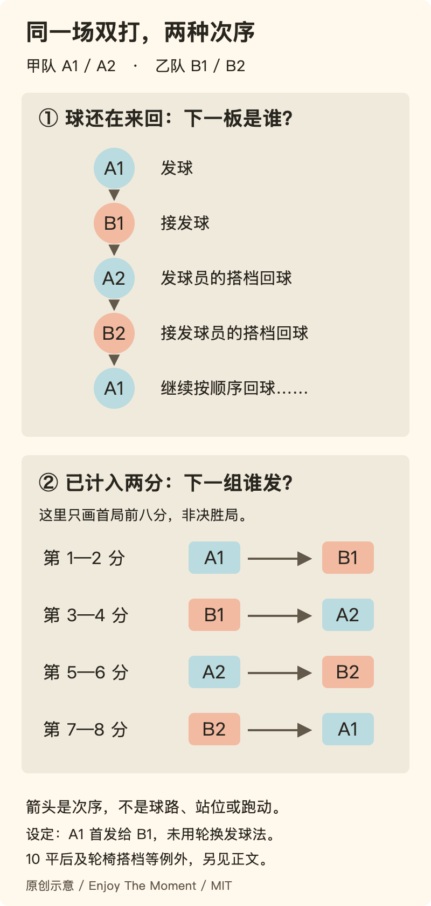

[← 首页](../README.md) · [观赛：局面怎样变化](28-watching-sport.md) · [游戏与认真](04-play.md)

# 38 · 我来打球，不是来交热量作业的

设想这样一个晚上：你没有刷新纪录，也不知道消耗了多少，只记得一板快要落地的球被接了回来，朋友笑着说“这都行”，下一板又轮到你。

回家后，有人问：“那到底锻炼了多少？”

这不是一个坏问题。但如果只有回答了它，这个晚上才算没有白过，打球又成了另一份等待验收的作业。**我们愿意为了那几板来回专门出门，不必先把它们换算成减重、健康或自律成果。**

本章从乒乓球讲起，不写一张“最值得做的运动”排行榜。重点是球怎样在人之间来回、合作与对抗怎样转换、规则怎样分配参与，以及为什么有时比分公平，人却没真正玩到。规则依据为2026年版本的明确条款；它们不是运动效果研究，也不是个人训练处方。

从你在意的问题开始：[合作还是对抗](#sport-two-games) · [双打轮到谁](#sport-doubles) · [比分与换发球](#sport-score) · [谁一直在场外](#sport-court-time) · [认真想赢怎么办](#sport-objections)。

## 身体不只会累，也会回答一个正在变化的问题

想象球从桌子另一边过来。你面对的不是一个抽象的“运动量”，而是这一个来球：它往哪里走，什么时候到，自己接下来要做什么。上一板已经结束，下一板还没确定。挥拍不是把一个标准动作反复交给计数器，也是对眼前局面的回应。

这个区别使“运动”不只有执行计划一种样子。有人喜欢连续几板接得顺，有人喜欢突然变线，有人喜欢在一场接近的比赛里猜对下一球，也有人喜欢和固定搭档慢慢形成默契。这些愿望可能让人选择同一张球台，却不一定希望它发生同一种事情。

具体说，来球的快慢、方向、落点和旋转不是一项合并的难度。把所有球都打得更快，只改变了其中一些条件；“我总接不好”也不能直接翻译成“我反应慢”。本章不会据几句话诊断技术。值得先看清的是：你想处理哪一种变化，想保持哪一种来回，还是正在被迫应付另一人独自选择的节奏？

所以，问“哪种运动最划算”之前，还可以问一个更接近享乐的问题：**你想在场上经历什么？** 这个问题不取代健康与安全安排，但也不必等它们给出额外收益，才配被讨论。

## 同一板球，可能是一次成功，也可能是在拆台

两个人约好尽量让球不断，目标是一起续住回合。一个突然很刁钻、使对方接不到的落点，未必是这次合作的好选择。换成正式计分的对抗，在规则内让对方无法正确回球，却可能恰好赢得这一分。

**动作没有自动附带“好球”的唯一含义；正在一起做什么，会改变它的价值。**

Table Tennis England的社交玩法页同时列出合作延长来回与胜者留台等安排。这说明同一套球台和球拍可以承载不同目标，不证明某一种更让人快乐。[F74](../docs/evidence/F74-social-table-tennis.md)记录采用范围。下面是本书对这些区别的整理，不是官方教学分类：

| 当前约定 | 双方在共同维持什么 | 一个容易发生的误会 |
| --- | --- | --- |
| 一起续回合 | 尽量让下一板仍有得接 | 一个人突然以“你接不到”为成就，另一个人却还在配合 |
| 针对一个问题练习 | 给某种回应反复出现的机会 | 负责供球的人以为在热身，另一人却默认他整晚陪练 |
| 计分对抗 | 同一套规则下，各自争取赢球 | 有人想认真打，另一人每次输球都说“不就是玩玩” |
| 社交轮换 | 让相聚的人都有明确的上场机会 | 只公布输赢规则，没有说谁等多久、什么时候换人 |

它们可以出现在同一个晚上，但转换需要让人知道。前几分钟一起把球打稳，接着打一局，并不矛盾；问题在于一方已经换了目标，另一方还按旧约定投入。

反过来，合作也不一定比对抗温柔。如果大家约的是比赛，硬把球喂到对方最舒服的位置，再强调“我都是为了照顾你”，也可能剥夺对方想认真试一次的机会。**对手想得到的是挑战还是配合，不该只由实力更强的人替他解释。**

## 接得回去，与让它以自己想要的方式回来

初看一来一往，似乎只要球不落地，就没什么可谈。再看一层，两个人其实在共同改变下一球的条件。

把落点放在对方容易到的位置，与逼他处理边角，可能都能完成一次合法回球，却向对方提出了不同问题。保持一个相近的节奏，与突然改变长短，也不是只有快慢的差别。合作时可以把变化放小，让两个人都更有机会辨认；对抗时，变化则可能成为你希望对方答错的题。

这不意味着“续得越久越高级”。一段短而有变化的交锋、一分很快结束但判断清楚的球，也可能是想要的体验。长回合如果只剩一方不断挽救另一方随意打来的球，数字漂亮，却未必是共同投入。

也不要把连续次数偷偷变成一个新的责备工具。一旦大家开始害怕“毁掉纪录”，原本为了延续而合作的回合，可能变成把失误责任集中到最后一个人身上。计数可以帮助看见过程，但最后失误的人不等于前面所有过程的破坏者。

这一点与[游戏中的局内目标](04-play.md)相通，但身体参与多了一层现场约束：球已经过来了，选择不能无限撤回，也不能总由旁边的人接管。乐趣不只是想到一个好主意，而是让自己的判断在这一板里真的发生。

## 双打不是两个人共用一个人的球拍

乒乓球双打有一个很容易被其他球类经验遮住的特点：**通常不是“谁够得到谁来”，而是按顺序轮流击球。**

按ITTF《2026 Statutes》2.8.2，设甲队是A1、A2，乙队是B1、B2；A1先发给B1。一个回合中的击球顺序是：

**A1发球 → B1接发 → A2回球 → B2回球 → A1回球 → ……**

后面沿着这个顺序继续。这不是站位路线，不要求四个人沿着箭头跑。规则2.8.3另有涉及因身体残障使用轮椅的双打搭档例外，不能拿普通顺序覆盖所有参与者；具体范围见[F73](../docs/evidence/F73-table-tennis-laws.md)。

这条规则让“队友”不只是分担左右两个区域。A1这一板之后，下一次本方触球将是A2的事。你当然会关心自己的球过没过网，也需要关心它让下一段交锋变成了什么，以及自己有没有妨碍搭档参与。

于是，“我替你救一下”不能只靠善意获得合法性。普通双打里不按顺序击球可能直接丢分，高手也不能为了多拿一分，把搭档那一板全包了。它把一个很具体的事实写进规则：**这个队里不只有一个人的发挥算数。**

不过，不能反过来把“按顺序轮到”赞成已经实现充分参与。搭档可以每次都轮到，却始终被责备、被指挥、没有机会说想怎样打。规则保证的是某些回球的次序，不保证关系中的尊重，更不证明每个人在这个项目上得到同等乐趣。

## 一球里的次序，与几分后的换发球，不是一张表

双打还有第二个容易混淆的顺序：谁发球、谁接发球。

在通常的两分换发球阶段，如果第一组是A1发给B1，那么依次是：

**A1发给B1 → B1发给A2 → A2发给B2 → B2发给A1 → 回到A1发给B1。**

每一组持续两分，不是由谁赢了上一分决定下一分谁发。它来自2.13.3与2.13.5：轮换时，原接发球员变成发球员，原发球员的搭档变成接发球员。

同样四个人、同样几个箭头，问的却不是同一个问题。这个开局里，四名击球者与四组发球者恰好都按A1、B1、A2、B2排列，但前者每打一板前进一步，后者通常要打完两分才前进一步。前者回答“球还没停，下一板轮到谁”；后者回答“这一组分数打完，谁来开始下一球”。不能因为名字顺序一样，就每打一板换一个发球人。

图只表示本章设定的首局普通情形。10比10后、轮换发球法实施时，换发球的间隔不同；决胜局一方先到5分时，接发顺序和交换方位还有专门条款。这里只说明关系，不把图当完整裁判手册。规则来源、页码与例外见[F73](../docs/evidence/F73-table-tennis-laws.md)。

## 11分不是倒数十一件事，擦网也不是一律重来

按2.11.1，一局通常先到11分的一方获胜；两方都到10分后，要先领先2分。因此11比10还没结束，12比10可以结束，12比11仍不行。计分不是“谁先完成十一板”，每一个得分回合可以长短不同。

发球也不是“总之打过去”。规则2.6要求球从静止、张开的非持拍手掌上开始，近乎垂直向上、不加旋转地抛起，离掌后至少升高16厘米，在下落时击球；从开始发球到击球，球应在台面以上、发球方端线之后，不能向接发方遮挡。双打发球还须先后落在发球方与接发球方的右半区。这里只概述与本章有关的要求，不替代完整条文和现场判定。

需要拆开的还有三件事：

- **合法发球擦网，并满足重发球条件**：按2.9判重发球，不计这一分，也不算作换发球前已经打完的一分。
- **发球失误**：不存在像网球那样默认再给一次发球的机会。不能把所有发不过去都叫重发。
- **回合进行中的回球擦网后合法落到对方台面**：2.7.1允许回球直接、或触及球网装置后到达对方台区；擦网本身不自动让这一球无效。

说一句“刚才擦网，重来吧”看起来很随和，可如果只在某个人没接到时才临时发明这个待遇，它就不是共同放宽规则，而是给某一次结果找出口。

当然，朋友之间可以事先约定简化版。问题不在于必须把业余相聚办成国际比赛，而在于讲清楚：这是我们商量的版本，不是正式规则本来如此。等比分不利再移动标准，就会让别人的认真失去依据。

## 一个具体比分：分数相同，发球资格也不是重新抽签

仍设首局（非决胜局）A1先发给B1，且没有启用轮换发球法。我们只数**已经计入的分**：

- 前两分由A1发给B1。
- 第3、4分由B1发给A2。
- 第5、6分由A2发给B2。
- 第7、8分由B2发给A1，然后循环。

无论前两分是2比0还是1比1，下一组仍换到B1发给A2。若第二次发球合法擦网而被判重发，比分没变，仍由相同的发球人与接发球人重来，不跳到下一组。

假设双方打到10比10，已经计入20分。按这个开局次序，下一分由A2发给B2；此后每分换发球，再轮到B2发给A1。谁刚拿下第20分不改变这个结果。最后可能是12比10，也可能继续拉长。

这段算例不考验谁背得快。它说明分数之外还有一套共同承认的连续关系：**落后一方不会因为上一分输了就失去轮到自己的发球，领先一方也不会因为正在手热就永久保留它。**

例子按条款推演，不是真实比赛记录，不包含后续局与决胜局的接发调整，更不是所有双打情形的自动裁判程序。

## “赢的人一直留”，不只是让比赛更刺激

如果只有两个人，下一局还是你们。六个人共用一张球台时，赛制还在分配一种更稀缺的东西：**谁能继续打，谁只能等。**

Table Tennis England列出的社交玩法包括胜者留台和循环赛；它们是不同组织方式，不是对所有聚会的公平认证。本书用一个原创、故意简单的例子比较它们：六人A—F，打六个小场，每场只有两人上场。先只数上场次数，不假设每场持续时间相同，也不估算快乐。

| 安排 | 六场依次是谁对谁 | A—F上场次数 |
| --- | --- | --- |
| 胜者留台，假设A一直赢 | AB、AC、AD、AE、AF、AB | A6、B2、C1、D1、E1、F1 |
| 事先排好两轮，每人每轮一次 | AB、CD、EF、AC、BE、DF | 每人2次 |

两行都用了六场、十二个人次，也可以每一分都照同一套正式规则打。但前一行有一个人打了六场，后面四个人各只打一场；后一行把出现机会分得更均匀。**比分规则相同，并不意味着参与机会相同。**

第二行不是完整单循环。六人每两人交手一次，需要15场；不能把只安排六场、每人打两次的活动宣传成“所有人都较量过了”。它也不保证每人打的分钟数或球数相等，更没有消除实力差。若两人都打两场，一个每场两分钟结束，另一个多次打到平分，上场次数又会遮住时间差。

所以，先问大家为什么聚到这里。如果就是想挑战一个守台者，愿意等的人可能觉得第一种更有戏剧性。如果共同出钱是为了每人都多打几板，却只有最强者持续在场，那就不能只说“输了当然下去”来结束讨论。

轮换的意义并非惩罚高手。高手也可能想挑战接近自己水平的人，而不是被要求不断陪练；轮候者也未必只想获得形式上均等的两次。把不同目的说清，比把一个赛制冠名为“公平”更诚实。

## 让分、让球、让出场地，是三件不同的事

“照顾一下新手”这句话太容易让所有人各想各的。

**让分**是改变开局或计分条件，使一场对抗的结果不完全由原来的起点决定；**让球**可能指在交锋中主动降低某些挑战；**让出场地**则是把参与时间交给另一人。它们分别改变比赛结果的门槛、过程中的球，以及谁能上场，不能互相冒充。

一个人开局被让了几分，却总接不到任何一个发球，可能离胜利更近，却并没有得到想练的来回。另一个人得到许多容易接的球，却发现对方始终不肯认真打，也可能觉得自己没有被当成对手。还有人并不在乎赢，只是不愿付了同样场地费用却整晚站着。

本章不提供统一的让分数值。它需要实际水平、双方想要的体验和赛制，不可能从“新人”两个字直接算出来。愿意接受让分的人不低级，不愿意的人也不必被劝成“太好胜”；关键是调整应当公开、对双方有意义，而不是一方暗中导演一个让另一方误以为靠自己赢来的结局。

也可以不把所有愿望挤进同一场：先按双方认可的方式合作，再认真打一次；有人想练、有人成心想较量时，另约合适伙伴也比彼此忍耐更好。这不是要求每次聚会都开协调会，只是让“来打球”不再自动包含大家没有答应的工作。

## 你想学一点，还是想被点评整个晚上？

学会一个新回应，本身可以带劲。我们反对把每次上场都变成成绩单，不反对技术，也不把不进步视为更纯粹的享乐。

但“我愿意学”仍然有具体对象。此刻想知道为何这几球总出界，不等于同意别人从握拍、脚步、表情一路评到体型。一次解释也不等于此后每次见面都自动续订指导关系。

可以区分一个球的结果、自己试图做的选择、动作实际怎样发生，以及下一次准备只改什么。这是组织讨论的办法，不是本书提供的专业动作诊断。泛泛地说“你就是不够认真”，既没有指出可改变的部分，又把一次失误扩大成对人的判断。

高手同样有权不教。球打得好不意味着有教学意愿，更不意味着他能处理所有参与者的身体条件。把朋友默认成免费教练，与把新手默认成任人点评的对象，是同一张球台上两种不同的越界。

如果双方认真想练，去了解合适的教学、场地与适配条件，有时比硬说“大家随便玩”更尊重愿望。本章没有核实具体机构、费用、教练资质或你的适宜强度，不用热情替代这些判断。

## 接不到，可以失望；不必立刻升华成成长

享乐不保证每一刻都开心。想打好的球没打好，输给期待能赢的人，明明已经练过却又出现同样失误，都可以令人失望。

不必马上把失望解释成“至少锻炼了身体”，像给这场不开心的比赛补一张价值证明。也不必强行说“输赢不重要”，撤销自己赛前确实在意的东西。可以只承认：今天这部分没得到，我有点不爽。

接着才有余地分清，是结果不合愿望，还是过程没有按约定发生；是某种挑战太难，还是此刻已经不想继续。输得公平仍可能不快乐；觉得不快乐也不自动证明对手有错。这比把每次败局都改名为成长，或把每次失望都归罪于别人，更接近真实的玩。

同样，赢得开心不需要道歉。但开心不附带羞辱别人的权利。局内的胜负可以很清楚，局外的人不必因此被排成值得与不值得相处的等级。

## 最强的反对意见：没有标准，运动还剩什么？

“你一直说别把成绩放在最前面，可没有比分、动作和进步，怎么知道自己真的打过？这不就是把不会玩说得好听？”

这个反对抓住了一点：很多运动的乐趣确实来自标准。落在台内还是台外，顺序对不对，这一局有没有结束，如果都随心改写，未知的结果就不再值得认真投入。技术进步也会打开原本做不到的选择，不是只有功利的人才想要它。

本章要拒绝的不是标准，而是两次未经同意的扩大。第一次，从“这板球没处理好”扩大成“你没资格上场”；第二次，从“这项运动能改善某种指标”扩大成“你只能为了那个指标做它”。**规则可以规定这一分怎样成立，不必规定这段生活只能为什么成立。**

也不是所有场合都要接纳所有参与方式。正式比赛、面向特定水平的训练或明确约好的高强度对抗，可以有真实门槛；别人不欠你改变整个活动的义务。关键是门槛应当在参加前被说清，而不是先用“大家来开心一下”招人，再把不同愿望的人羞辱出去。

另一种反对也值得保留：“每个人都计较上场机会，会不会反而没有人愿意组织？”组织确实有成本，临时人数与设备也未必支持完美安排。我们不要求完美，但可以要求别把安排的局限说成落后者活该。说明剩下的时间、可行的轮换和不能保证的部分，比假装一个口号已经解决公平更有用。

## 不减重、不晋级，仍然可以想再来

运动有实际条件：空间、器材、身体状态、同行者和时间。快乐是目的，不等于这些条件不存在；本章没有证明某种打法安全、某个时长合适，也没有给出减重、康复或延寿承诺。需要个体化判断时，应另外核实相应专业要求。

但确认这些条件之后，我们仍想保留一个很朴素的结尾：你可以想再来，只因想再接几板球，想和那个人打完一局，或者想知道下一次自己能不能作出那一个回应。

不是运动顺便附送了一点快乐，所以快乐才算合法。**这个身体不只是在为未来保养，它也正在过这个晚上。**

*本章开场、人物字母、比分与排场比较为原创设例，不是真实参与记录。规则事实与本书价值论证分开；ITTF条款见[F73](../docs/evidence/F73-table-tennis-laws.md)，社交玩法出处与取舍见[F74](../docs/evidence/F74-social-table-tennis.md)。延伸阅读：[认真玩与成绩](04-play.md)、[共同选择](05-connection.md)、[不把刺激缩成小份](../essays/02-excitement-without-escalation.md)。*
